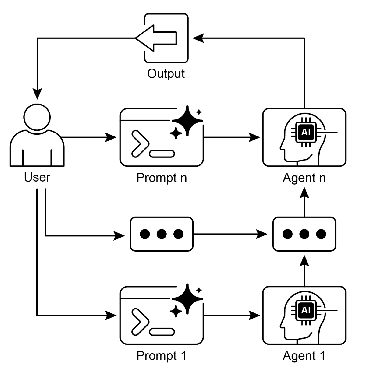

## 智能体实战之提示词链：分而治之的智能处理范式 



### 一.简介
提示词链是一种强大的编程范式，用于引导大型语言模型（LLM）解决复杂、多步骤的任务。它的核心思想源于计算机科学中的“分而治之”策略。我们不再要求 LLM 通过一个庞大而复杂的指令一次性完成所有工作，而是将原始任务拆解成一系列逻辑清晰、目标单一的子任务。 

每个子任务都由一个精心设计的提示词来驱动。LLM 处理第一个子任务后，其输出会作为下一个子任务的输入，像链条一样一环扣一环地传递下去，直到最终完成整个复杂任务。这种模式带来了诸多好处： 

     提高准确性与可控性：每个步骤的目标更明确，LLM 不易迷失方向，输出结果更可靠。
     增强可解释性：我们可以检查链条中每一步的输出，从而理解整个流程是如何工作的，便于调试和优化。
     提升模块化与复用性：单个链条（例如，一个专门用于情感分析的链条）可以被构建出来，并在不同的复杂任务中重复使用。
   
下面我将分别利用langchain和langgraph实现和分析一个案例：

场景安全：客户反馈分析与报告生成

分析客户反馈，并生成一份结构化的摘要报告。

这个任务可以分解为以下三个步骤： 

    提取要点：从原始的客户评论文本中，抽取出核心的观点和意见。 
    情感分类：对提取出的每一个要点，判断其是“正面”、“负面”还是“建议”。 
    生成报告：将分类后的要点组织成一份易于阅读的、包含不同板块的摘要报告。 

### 二.langchain实现
#### 1. 环境设置与模型初始化 
```python
from langchain_openai import ChatOpenAI
import os
from dotenv import load_dotenv

load_dotenv()

deepseek_api = os.environ['DEEPSEEK_API']
deepseek_url = os.environ['DEEPSEEK_URL']
deepseek_model = os.environ['DEEPSEEK_MODEL']

deepseek_client = ChatOpenAI(api_key=deepseek_api,
                             base_url=deepseek_url,
                             model=deepseek_model,
                             temperature=0.1) # 较低的温度以获得更确定性的输出
``` 

#### 2. 提示词设计

这是提示词链的灵魂。每个提示词都像一个专门的工具，只做一件事，并力求做到最好。

(1). prompt_extract：这个提示词的角色是“客户反馈分析师”。指令非常明确：分解、独立、简洁。通过限定输出格式（“每个要点用一句话概括”），我们为下一步的输入提供了标准化的数据。
(2). prompt_classify：它的角色是“情感分析专家”。最关键的部分是严格定义了输出格式——一个 JSON 数组。这比让模型自由发挥要可靠得多。通过提供清晰的示例，我们引导模型生成结构化的数据，这极大地降低了后续解析的难度和出错率。
(3). prompt_summarize：它的角色是“商业报告撰写专家”。它的任务是整合与呈现。它接收结构化的 JSON 数据，并将其转化为人类可读的、格式优美的报告。通过指定报告的结构（“优点与赞扬”、“问题与批评”、“改进建议”），我们确保了最终输出的实用性和专业性。

#### 3. 构建提示词链 

LangChain 的表达式语言（LCEL）通过 | 操作符让构建链条变得异常优雅和直观。 

(1). extraction_chain = prompt_extract | llm | StrOutputParser() 
         
    这是最基础的链条。数据流如下：
    prompt_extract 接收 feedback_text，生成一个完整的提示词。 
    这个提示词被发送给 llm (DeepSeek)。 
    llm 返回一个响应对象（AIMessage）。 
    StrOutputParser() 将这个响应对象解析成纯文本字符串。 

(2). classification_chain = {"key_points": extraction_chain} | prompt_classify | ... 
    
    这是链式组合的核心。{"key_points": extraction_chain} 这部分是关键。它创建了一个字典，告诉 LangChain：
    取 extraction_chain 的完整输出。
    将这个输出赋值给一个名为 key_points 的变量。
    然后将这个字典 {"key_points": "..."} 传递给下一个环节 prompt_classify。
    prompt_classify 模板中的 {key_points} 占位符会被自动填充。

(3). full_chain = {"classified_points": classification_chain} | prompt_summarize | ... 
    
    这是更高一层的链式组合，逻辑与上一步完全相同。
    它获取 classification_chain 的输出（即 JSON 字符串），将其命名为 classified_points，然后传递给 prompt_summarize，最终生成报告。

#### 4. 运行 
```python
customer_feedback = """
这款新出的手机真的很棒！屏幕色彩鲜艳，拿在手里的质感也超乎预期，非常高级。
不过，电池续航能力有点差，我一天下来需要充两次电，希望能改进。
另外，相机在夜间的表现不太理想，噪点比较多。
如果系统能增加一个应用双开功能就完美了，这对我的工作很有帮助。
总的来说，除了电池和相机，其他方面我都非常满意。
"""
final_report = full_chain.invoke({"feedback_text": customer_feedback})
print("\n--- 客户反馈分析报告 ---")
print(final_report)
```
    我们只需要调用最终的 full_chain，并提供最初始的输入 {"feedback_text": ...} 即可。LangChain 会像多米诺骨牌一样，自动处理数据在所有中间链条中的传递和转换。

#### 5. 运行结果 
```
--- 客户反馈分析报告 ---
**客户反馈摘要报告**

---

#### **一、优点与赞扬**  
客户对产品的以下方面表示高度认可与满意：  
- **显示效果出色**：手机屏幕色彩鲜艳，视觉体验良好。  
- **设计与质感卓越**：机身质感高级，实际体验超出用户预期。  
- **综合满意度较高**：除电池与相机外，其他功能均获得正面评价，表明产品整体表现均衡。

---

#### **二、问题与批评**  
用户反馈中提及的主要不足集中在以下两点：  
- **电池续航能力不足**：需每日充电两次，无法满足全天使用需求。  
- **夜间拍摄性能待提升**：相机在暗光环境下噪点明显，成像效果不理想。

---

#### **三、改进建议**  
基于用户反馈，提出以下优化方向：  
- **增强电池性能**：优化系统功耗管理或提升电池容量，延长单次充电使用时间。  
- **升级相机算法**：针对夜间场景优化降噪处理，改善低光拍摄效果。  
- **新增实用功能**：在系统中集成“应用双开”功能，满足用户多账户协同工作的需求。

---

**总结**：产品在视觉设计、质感及综合体验上获得肯定，但需重点解决电池续航与夜间拍摄的短板，并通过功能扩展进一步提升用户满意度。

```

通过这个例子，你可以看到提示词链如何将一个模糊的“分析反馈”任务，转化为一系列清晰、可控、可复用的步骤，最终高效地生成高质量的结构化输出。 

### 三.langgraph实现

#### 1. 环境设置与模型初始化 
同langchain
#### 2. 提示词设计
同langchain

#### 3. 定义状态 
```python
class State(TypedDict):
    feedback_text: str
    key_points: Annotated[List[str], "..."]
    classified_points: Annotated[List[dict], "..."]
    report: Annotated[str, "..."]
```

这是 LangGraph 的基石。我们使用 TypedDict 来定义一个“状态”对象的结构。这个对象将在整个图的执行过程中被传递和更新。每个字段代表了工作流中的一个数据片段。Annotated 用于添加类型提示和描述，使代码更清晰。 
#### 4. 定义节点 
```python
def extract_node(state: State):
    # ... 执行逻辑 ...
    return {"key_points": key_points_list}
```

每个节点是一个 Python 函数： 

     它必须接收一个参数，即当前的 state。
     它从 state 中读取它需要的数据（例如 state["feedback_text"]）。
     它执行自己的任务（调用 LLM）。
     关键：它返回一个字典，这个字典包含了要更新的状态字段。LangGraph 会自动将这个返回的字典合并到全局状态中。例如，extract_node 返回 {"key_points": ...}，LangGraph 就会用这个新值更新全局状态中的 key_points 字段。
     

#### 5. 构建图 
```python
workflow = StateGraph(State)
workflow.add_node("extract", extract_node)
workflow.add_edge(START, "extract")
workflow.add_edge("extract", "classify")
# ...
app = workflow.compile()
```
     workflow = StateGraph(State): 我们创建一个图实例，并告诉它我们的状态结构是 State。
     workflow.add_node(...): 我们将之前定义的函数注册为图中的节点，并给它们命名（如 "extract"）。
     workflow.add_edge(...): 我们定义节点的流向。START 和 END 是特殊的虚拟节点，分别代表图的入口和出口。workflow.add_edge("extract", "classify") 意味着 "extract" 节点执行完毕后，自动流向 "classify" 节点。
     app = workflow.compile(): 最后，我们将定义好的图编译成一个可执行的应用程序 app。

#### 6. 运行图 
```python
# 可选：可视化图的结构
app.get_graph().print_ascii()

print('--------------------')

# 示例客户反馈文本
customer_feedback = """
这款新出的手机真的很棒！屏幕色彩鲜艳，拿在手里的质感也超乎预期，非常高级。
不过，电池续航能力有点差，我一天下来需要充两次电，希望能改进。
另外，相机在夜间的表现不太理想，噪点比较多。
如果系统能增加一个应用双开功能就完美了，这对我的工作很有帮助。
总的来说，除了电池和相机，其他方面我都非常满意。
"""

# 创建初始状态
initial_state = {"feedback_text": customer_feedback}

# 调用图，传入初始状态
final_state = app.invoke(initial_state)

# --- 7. 打印最终结果 ---
print("\n\n--- 最终状态 ---")
print(final_state) # 你可以打印整个最终状态来查看所有信息

print("\n--- 客户反馈分析报告 ---")
print(final_state["report"])
```

#### 7. 运行结果 
```
+-----------+  
| __start__ |  
+-----------+  
      *        
      *        
      *        
 +---------+   
 | extract |   
 +---------+   
      *        
      *        
      *        
+----------+   
| classify |   
+----------+   
      *        
      *        
      *        
+-----------+  
| summarize |  
+-----------+  
      *        
      *        
      *        
 +---------+   
 | __end__ |   
 +---------+   
--- 节点1: 正在提取关键要点... ---
--- 节点2: 正在进行情感分类... ---
--- 节点3: 正在生成摘要报告... ---

--- 客户反馈分析报告 ---
**客户反馈摘要报告**

---

#### **一、 优点与赞扬**  
客户对产品的以下方面表示高度认可：  
- **显示效果出色**：手机屏幕色彩鲜艳，视觉体验良好。  
  - **设计与质感卓越**：机身质感高级，实际体验超出用户预期。  
  - **综合满意度较高**：除电池和相机外，其他功能均获得正面评价，表明产品整体表现均衡。

---

#### **二、 问题与批评**  
部分用户指出以下需改进的痛点：  
- **电池续航不足**：续航能力较差，需每日充电两次，影响日常使用便利性。  
  - **夜间拍摄效果欠佳**：相机在低光环境下表现不佳，噪点明显，影响摄影体验。

---

#### **三、 改进建议**  
基于用户反馈，提出以下优化方向：  
- **提升电池性能**：优化系统功耗或升级电池配置，延长单次充电使用时间。  
  - **强化相机算法**：针对夜间场景优化降噪处理和曝光控制，提升暗光拍摄质量。  
  - **增加实用功能**：考虑引入“应用双开”等功能，满足用户多账号管理的办公需求。

---

**总结**：产品在视觉设计、综合体验上具备优势，但需重点解决电池续航与相机性能的短板，并通过功能扩展进一步提升用户满意度。
```


我们不再调用链，而是调用编译后的 app。我们传入一个符合 State 结构的初始字典。LangGraph 会从 START 节点开始，沿着我们定义的边执行，

直到到达 END 节点。最终，它会返回包含所有字段最终值的完整状态。我们只需从中提取我们需要的部分（report）。

通过这种方式，LangGraph 不仅完成了与 LCEL 链相同的任务，还提供了一个更健壮、可扩展和状态感知的框架，非常适合构建更复杂的 AI 应用程序。 


