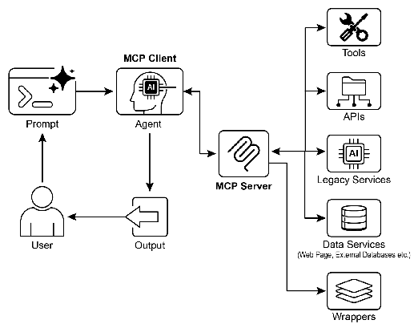

# 智能体实战之模型上下文协议（MCP）：agent的通用“USB”


## 一.简介

---

### 模型上下文协议（MCP）

要让大型语言模型（LLM）从一位“博学的演说家”转变为一位“能干的行动者”，它必须能够感知并影响其周围的环境。这意味着它需要超越生成文本和图像，学会获取实时信息、操作软件工具、并执行具体任务。模型上下文协议（MCP）正是为此而生，它提供了一套标准化的“通用语言”，让任何 LLM 都能与外部世界进行高效、可预测的沟通和协作。

#### 1. MCP：LLM 的“通用中间件”

想象一下，如果没有 USB 标准，我们每买一个新设备（键盘、鼠标、打印机）都需要一个独特的接口和驱动程序，那将是何等混乱。MCP 就扮演了 LLM 领域的“USB 标准”角色。它是一个开放的协议，定义了 LLM（如 GPT、Claude、DeepSeek）如何与外部系统（无论是数据库、SaaS 软件还是物联网设备）进行“握手”和数据交换。

MCP 采用客户端-服务器架构。外部系统的能力被封装在“MCP 服务器”中，这些服务器以标准化的形式对外提供三类核心元素：
*   **资源**：静态的信息，如数据库记录、文档内容。
*   **工具**：可执行的操作函数，如“发送邮件”、“创建工单”。
*   **提示**：交互模板，用于指导 LLM 如何更有效地使用上述资源和工具。

而运行 LLM 的应用程序（即 AI Agent）则作为“MCP 客户端”，通过这套标准协议去发现、连接并调用这些服务器的能力。这种设计极大地简化了集成工作，让开发者无需为每个 LLM 和每个外部工具编写定制化的“胶水代码”。

#### 2. MCP 的成功之道：不止于连接，更在于设计

然而，MCP 并非万能灵药。它只是一个“契约”或“规范”，其最终效果取决于被封装的底层 API 的质量。如果开发者只是简单地将一个老旧、笨拙的 API 用 MCP 包装起来，Agent 的体验依然会很糟糕。

例如，一个票务系统的旧 API 只能一次性返回所有工单的全部详情。当一个 Agent 需要总结所有高优先级工单时，它将不得不下载和处理海量数据，导致响应缓慢且成本高昂。一个优秀的 MCP 实现应该对底层 API 进行“智能化改造”，比如增加筛选、排序、分页等功能，让非确定性的 LLM Agent 能够更高效地工作。这揭示了一个核心原则：**Agent 并不能替代确定性的后端逻辑，而是需要优秀的后端逻辑来赋能。**

同样，数据格式也至关重要。如果一个 MCP 服务器对外提供的是加密的 PDF 文件，而 Agent 无法解析 PDF，那么这个连接就毫无意义。更好的做法是，服务器先将 PDF 内容转换成 Agent 能够理解的纯文本格式（如 Markdown），再通过 MCP 暴露出来。因此，开发者必须站在 Agent 的视角思考，确保数据交换的“语义兼容性”。

#### 3. MCP vs. 传统函数调用：专用工具箱 vs. 通用电力网络

我们常常将 MCP 与传统的“工具/函数调用”相比较，但它们的层面和目标截然不同。

*   **工具/函数调用**：更像是给 LLM 一个**定制的工具箱**。开发者预先定义好几个函数（如 `search_database(query)`），然后告诉 LLM：“当你需要搜索时，就用这个格式调用我。” 这种方式是直接的、一对一的，但通常是专有的，换一个 LLM 平台可能就需要重写。它适用于任务固定、简单的场景。

*   **MCP**：则像是在构建一个**标准化的电力网络和插座系统**。MCP 本身不提供工具，但它定义了插座的标准。任何符合标准的“电器”（MCP 服务器）都可以插入这个网络，被任何兼容的“设备”（MCP 客户端）使用。它的优势在于**互操作性、可组合性和可扩展性**。对于需要动态整合多种新旧系统、构建复杂企业级 Agent 的场景，MCP 这样的通用标准是不可或缺的。

| 特性 | 工具/函数调用 | 模型上下文协议 (MCP) |
| :--- | :--- | :--- |
| **标准化** | 各厂商私有，格式不一 | 开放标准，促进互操作 |
| **范围** | 点对点的直接函数请求 | 框架性协议，定义发现与通信 |
| **架构** | LLM 与应用逻辑的直接耦合 | 客户端-服务器，支持多对多连接 |
| **发现** | 静态配置，预先告知可用工具 | 动态发现，客户端可查询服务器能力 |
| **可重用性** | 工具与特定应用和 LLM 强绑定 | 开发独立的 MCP 服务器，可被多方复用 |

#### 4. MCP 生态系统的关键组件与工作流

一个完整的 MCP 交互涉及四个核心角色：
1.  **LLM 大脑**：理解用户意图，制定计划，决定何时需要外部帮助。
2.  **MCP 客户端**：通常是 LLM 的“外壳”，负责将 LLM 的意图翻译成标准的 MCP 请求，并管理与服务器的连接。
3.  **MCP 服务器**：特定领域的“网关”，将内部系统（如数据库、API）的能力以 MCP 标准暴露出来。
4.  **外部服务**：真正的数据源或应用程序，由 MCP 服务器调用。

一次典型的交互流程如下：
1.  **探索**：客户端向服务器询问：“你有什么能耐？” 服务器返回其提供的工具、资源列表。
2.  **决策**：LLM 根据用户请求，决定使用某个工具（如 `get_weather(city)`）。
3.  **执行**：客户端将这个决策打包成标准请求，发送给对应的服务器。
4.  **响应**：服务器执行操作（如调用真实天气 API），并将结果（如“北京，晴，25°C”）以标准格式返回给客户端。
5.  **闭环**：客户端将结果喂给 LLM，LLM 基于此信息生成最终的自然语言回答，完成整个任务。

## 二.实战案例--企业级销售订单自动化处理系统
设计一个企业级销售订单自动化处理的MCP案例，这个系统将模拟真实企业中的订单处理流程，包括库存检查、采购申请、发货单创建和通知等环节。

## 三.mcp-server实现
```python
import json
import datetime
from typing import Dict, List
from fastmcp import FastMCP

# 初始化MCP服务器
mcp = FastMCP("mcp_utility_server")

# 模拟的企业数据
inventory = {
    "LAPTOP-001": {"name": "商务笔记本", "stock": 15, "price": 5999.00, "supplier": "供应商A"},
    "MOUSE-001": {"name": "无线鼠标", "stock": 50, "price": 99.00, "supplier": "供应商B"},
    "KEYBOARD-001": {"name": "机械键盘", "stock": 5, "price": 299.00, "supplier": "供应商A"},
    "MONITOR-001": {"name": "27寸显示器", "stock": 2, "price": 1299.00, "supplier": "供应商C"}
}

orders = {}
purchase_requests = {}
shipping_orders = {}
notifications = []


# 资源：获取库存信息
@mcp.resource("inventory://all")
def get_all_inventory() -> str:
    """获取所有产品的库存信息"""
    return json.dumps(inventory, ensure_ascii=False, indent=2)


@mcp.resource("inventory://{product_id}")
def get_product_inventory(product_id: str) -> str:
    """获取特定产品的库存信息"""
    if product_id in inventory:
        return json.dumps(inventory[product_id], ensure_ascii=False, indent=2)
    return json.dumps({"error": f"产品ID {product_id} 不存在"}, ensure_ascii=False)


# 工具：创建销售订单
@mcp.tool()
def create_sales_order(order_id: str, customer_id: str, items: List[Dict[str, any]]) -> str:
    """
    创建销售订单

    Args:
        order_id: 订单唯一标识
        customer_id: 客户ID
        items: 订单项目列表，每个项目包含product_id和quantity

    Returns:
        创建结果信息
    """
    # 检查订单是否已存在
    if order_id in orders:
        return json.dumps({"error": f"订单 {order_id} 已存在"}, ensure_ascii=False)

    # 验证产品ID和数量
    for item in items:
        product_id = item.get("product_id")
        quantity = item.get("quantity", 0)

        if product_id not in inventory:
            return json.dumps({"error": f"产品ID {product_id} 不存在"}, ensure_ascii=False)

        if quantity <= 0:
            return json.dumps({"error": f"产品 {product_id} 的数量必须大于0"}, ensure_ascii=False)

    # 创建订单
    order = {
        "order_id": order_id,
        "customer_id": customer_id,
        "items": items,
        "status": "PENDING",
        "created_at": datetime.datetime.now().isoformat(),
        "total_amount": 0
    }

    # 计算总金额
    total = 0
    for item in items:
        product_id = item.get("product_id")
        quantity = item.get("quantity")
        total += inventory[product_id]["price"] * quantity

    order["total_amount"] = total
    orders[order_id] = order

    return json.dumps({"success": True, "order": order}, ensure_ascii=False, indent=2)


# 工具：检查库存并创建采购申请
@mcp.tool()
def check_inventory_and_create_purchase_request(order_id: str) -> str:
    """
    检查订单所需库存，如果库存不足则创建采购申请

    Args:
        order_id: 订单ID

    Returns:
        检查结果和可能的采购申请信息
    """
    if order_id not in orders:
        return json.dumps({"error": f"订单 {order_id} 不存在"}, ensure_ascii=False)

    order = orders[order_id]
    items_to_purchase = []

    # 检查每个项目的库存
    for item in order["items"]:
        product_id = item["product_id"]
        required_quantity = item["quantity"]
        available_stock = inventory[product_id]["stock"]

        if available_stock < required_quantity:
            items_to_purchase.append({
                "product_id": product_id,
                "product_name": inventory[product_id]["name"],
                "required_quantity": required_quantity,
                "available_stock": available_stock,
                "shortfall": required_quantity - available_stock,
                "supplier": inventory[product_id]["supplier"]
            })

    # 如果需要采购
    if items_to_purchase:
        pr_id = f"PR-{datetime.datetime.now().strftime('%Y%m%d%H%M%S')}"
        purchase_request = {
            "pr_id": pr_id,
            "order_id": order_id,
            "items": items_to_purchase,
            "status": "PENDING_APPROVAL",
            "created_at": datetime.datetime.now().isoformat()
        }
        purchase_requests[pr_id] = purchase_request

        return json.dumps({
            "sufficient_stock": False,
            "purchase_request": purchase_request,
            "message": f"库存不足，已创建采购申请 {pr_id}"
        }, ensure_ascii=False, indent=2)

    return json.dumps({
        "sufficient_stock": True,
        "message": "所有产品库存充足，可以继续处理订单"
    }, ensure_ascii=False, indent=2)


# 工具：批准采购申请
@mcp.tool()
def approve_purchase_request(pr_id: str, approved_by: str) -> str:
    """
    批准采购申请

    Args:
        pr_id: 采购申请ID
        approved_by: 批准人

    Returns:
        批准结果
    """
    if pr_id not in purchase_requests:
        return json.dumps({"error": f"采购申请 {pr_id} 不存在"}, ensure_ascii=False)

    purchase_request = purchase_requests[pr_id]
    purchase_request["status"] = "APPROVED"
    purchase_request["approved_by"] = approved_by
    purchase_request["approved_at"] = datetime.datetime.now().isoformat()

    # 模拟采购后库存增加
    for item in purchase_request["items"]:
        product_id = item["product_id"]
        shortfall = item["shortfall"]
        inventory[product_id]["stock"] += shortfall

    return json.dumps({
        "success": True,
        "purchase_request": purchase_request,
        "message": f"采购申请 {pr_id} 已批准，库存已更新"
    }, ensure_ascii=False, indent=2)


# 工具：创建发货单
@mcp.tool()
def create_shipping_order(order_id: str) -> str:
    """
    为订单创建发货单

    Args:
        order_id: 订单ID

    Returns:
        发货单信息
    """
    if order_id not in orders:
        return json.dumps({"error": f"订单 {order_id} 不存在"}, ensure_ascii=False)

    order = orders[order_id]

    # 检查库存是否充足
    for item in order["items"]:
        product_id = item["product_id"]
        required_quantity = item["quantity"]
        available_stock = inventory[product_id]["stock"]

        if available_stock < required_quantity:
            return json.dumps({
                "error": f"产品 {product_id} 库存不足，无法创建发货单",
                "available_stock": available_stock,
                "required_quantity": required_quantity
            }, ensure_ascii=False)

    # 创建发货单
    shipping_id = f"SH-{datetime.datetime.now().strftime('%Y%m%d%H%M%S')}"
    shipping_order = {
        "shipping_id": shipping_id,
        "order_id": order_id,
        "customer_id": order["customer_id"],
        "items": order["items"].copy(),
        "status": "READY_TO_SHIP",
        "created_at": datetime.datetime.now().isoformat()
    }

    shipping_orders[shipping_id] = shipping_order

    # 更新库存
    for item in order["items"]:
        product_id = item["product_id"]
        quantity = item["quantity"]
        inventory[product_id]["stock"] -= quantity

    # 更新订单状态
    order["status"] = "SHIPPED"

    return json.dumps({
        "success": True,
        "shipping_order": shipping_order,
        "message": f"已为订单 {order_id} 创建发货单 {shipping_id}"
    }, ensure_ascii=False, indent=2)


# 工具：发送通知
@mcp.tool()
def send_notification(recipient: str, message: str, notification_type: str = "INFO") -> str:
    """
    发送通知给相关人员

    Args:
        recipient: 接收人
        message: 通知内容
        notification_type: 通知类型 (INFO, WARNING, ERROR)

    Returns:
        通知发送结果
    """
    notification = {
        "id": len(notifications) + 1,
        "recipient": recipient,
        "message": message,
        "type": notification_type,
        "sent_at": datetime.datetime.now().isoformat()
    }

    notifications.append(notification)

    return json.dumps({
        "success": True,
        "notification": notification,
        "message": f"已向 {recipient} 发送 {notification_type} 通知"
    }, ensure_ascii=False, indent=2)


# 工具：获取订单状态
@mcp.tool()
def get_order_status(order_id: str) -> str:
    """
    获取订单的当前状态

    Args:
        order_id: 订单ID

    Returns:
        订单状态信息
    """
    if order_id not in orders:
        return json.dumps({"error": f"订单 {order_id} 不存在"}, ensure_ascii=False)

    order = orders[order_id]

    # 检查是否有相关的采购申请
    related_pr = None
    for pr_id, pr in purchase_requests.items():
        if pr["order_id"] == order_id:
            related_pr = pr
            break

    # 检查是否有发货单
    related_shipping = None
    for shipping_id, shipping in shipping_orders.items():
        if shipping["order_id"] == order_id:
            related_shipping = shipping
            break

    result = {
        "order": order,
        "purchase_request": related_pr,
        "shipping_order": related_shipping
    }

    return json.dumps(result, ensure_ascii=False, indent=2)


# 启动服务器
if __name__ == "__main__":
    mcp.run()
```

## 代码解析

这是一个基于FastMCP框架构建的企业库存管理系统的服务端，提供了完整的库存管理、订单处理、采购申请和发货流程。

### 主要组件

#### 1. 导入和初始化
```python
import json
import datetime
from typing import Dict, List
from fastmcp import FastMCP

# 初始化MCP服务器
mcp = FastMCP("mcp_utility_server")
```
- 导入必要的库：JSON处理、日期时间、类型提示和FastMCP框架
- 创建FastMCP服务器实例，命名为"mcp_utility_server"

#### 2. 数据结构
```python
# 模拟的企业数据
inventory = {
    "LAPTOP-001": {"name": "商务笔记本", "stock": 15, "price": 5999.00, "supplier": "供应商A"},
    "MOUSE-001": {"name": "无线鼠标", "stock": 50, "price": 99.00, "supplier": "供应商B"},
    "KEYBOARD-001": {"name": "机械键盘", "stock": 5, "price": 299.00, "supplier": "供应商A"},
    "MONITOR-001": {"name": "27寸显示器", "stock": 2, "price": 1299.00, "supplier": "供应商C"}
}

orders = {}
purchase_requests = {}
shipping_orders = {}
notifications = []
```
- `inventory`: 存储产品库存信息，包括产品ID、名称、库存数量、价格和供应商
- `orders`: 存储销售订单
- `purchase_requests`: 存储采购申请
- `shipping_orders`: 存储发货单
- `notifications`: 存储通知信息

### 功能模块

#### 1. 资源定义 (Resources)

##### 获取所有库存信息
```python
@mcp.resource("inventory://all")
def get_all_inventory() -> str:
    """获取所有产品的库存信息"""
    return json.dumps(inventory, ensure_ascii=False, indent=2)
```
- 通过`@mcp.resource`装饰器定义资源端点
- 返回所有产品的库存信息，格式化为JSON

##### 获取特定产品库存
```python
@mcp.resource("inventory://{product_id}")
def get_product_inventory(product_id: str) -> str:
    """获取特定产品的库存信息"""
    if product_id in inventory:
        return json.dumps(inventory[product_id], ensure_ascii=False, indent=2)
    return json.dumps({"error": f"产品ID {product_id} 不存在"}, ensure_ascii=False)
```
- 根据产品ID获取特定产品的库存信息
- 如果产品不存在，返回错误信息

#### 2. 工具定义 (Tools)

##### 创建销售订单
```python
@mcp.tool()
def create_sales_order(order_id: str, customer_id: str, items: List[Dict[str, any]]) -> str:
    """
    创建销售订单

    Args:
        order_id: 订单唯一标识
        customer_id: 客户ID
        items: 订单项目列表，每个项目包含product_id和quantity

    Returns:
        创建结果信息
    """
    # 检查订单是否已存在
    if order_id in orders:
        return json.dumps({"error": f"订单 {order_id} 已存在"}, ensure_ascii=False)

    # 验证产品ID和数量
    for item in items:
        product_id = item.get("product_id")
        quantity = item.get("quantity", 0)

        if product_id not in inventory:
            return json.dumps({"error": f"产品ID {product_id} 不存在"}, ensure_ascii=False)

        if quantity <= 0:
            return json.dumps({"error": f"产品 {product_id} 的数量必须大于0"}, ensure_ascii=False)

    # 创建订单
    order = {
        "order_id": order_id,
        "customer_id": customer_id,
        "items": items,
        "status": "PENDING",
        "created_at": datetime.datetime.now().isoformat(),
        "total_amount": 0
    }

    # 计算总金额
    total = 0
    for item in items:
        product_id = item.get("product_id")
        quantity = item.get("quantity")
        total += inventory[product_id]["price"] * quantity

    order["total_amount"] = total
    orders[order_id] = order

    return json.dumps({"success": True, "order": order}, ensure_ascii=False, indent=2)
```
- 验证订单ID是否唯一
- 验证产品ID是否存在和数量是否有效
- 创建订单并计算总金额
- 将订单存储到`orders`字典中

##### 检查库存并创建采购申请
```python
@mcp.tool()
def check_inventory_and_create_purchase_request(order_id: str) -> str:
    """
    检查订单所需库存，如果库存不足则创建采购申请

    Args:
        order_id: 订单ID

    Returns:
        检查结果和可能的采购申请信息
    """
    if order_id not in orders:
        return json.dumps({"error": f"订单 {order_id} 不存在"}, ensure_ascii=False)

    order = orders[order_id]
    items_to_purchase = []

    # 检查每个项目的库存
    for item in order["items"]:
        product_id = item["product_id"]
        required_quantity = item["quantity"]
        available_stock = inventory[product_id]["stock"]

        if available_stock < required_quantity:
            items_to_purchase.append({
                "product_id": product_id,
                "product_name": inventory[product_id]["name"],
                "required_quantity": required_quantity,
                "available_stock": available_stock,
                "shortfall": required_quantity - available_stock,
                "supplier": inventory[product_id]["supplier"]
            })

    # 如果需要采购
    if items_to_purchase:
        pr_id = f"PR-{datetime.datetime.now().strftime('%Y%m%d%H%M%S')}"
        purchase_request = {
            "pr_id": pr_id,
            "order_id": order_id,
            "items": items_to_purchase,
            "status": "PENDING_APPROVAL",
            "created_at": datetime.datetime.now().isoformat()
        }
        purchase_requests[pr_id] = purchase_request

        return json.dumps({
            "sufficient_stock": False,
            "purchase_request": purchase_request,
            "message": f"库存不足，已创建采购申请 {pr_id}"
        }, ensure_ascii=False, indent=2)

    return json.dumps({
        "sufficient_stock": True,
        "message": "所有产品库存充足，可以继续处理订单"
    }, ensure_ascii=False, indent=2)
```
- 检查订单是否存在
- 检查每个订单项目的库存是否充足
- 如果库存不足，创建采购申请并存储到`purchase_requests`字典中
- 返回检查结果和采购申请信息

##### 批准采购申请
```python
@mcp.tool()
def approve_purchase_request(pr_id: str, approved_by: str) -> str:
    """
    批准采购申请

    Args:
        pr_id: 采购申请ID
        approved_by: 批准人

    Returns:
        批准结果
    """
    if pr_id not in purchase_requests:
        return json.dumps({"error": f"采购申请 {pr_id} 不存在"}, ensure_ascii=False)

    purchase_request = purchase_requests[pr_id]
    purchase_request["status"] = "APPROVED"
    purchase_request["approved_by"] = approved_by
    purchase_request["approved_at"] = datetime.datetime.now().isoformat()

    # 模拟采购后库存增加
    for item in purchase_request["items"]:
        product_id = item["product_id"]
        shortfall = item["shortfall"]
        inventory[product_id]["stock"] += shortfall

    return json.dumps({
        "success": True,
        "purchase_request": purchase_request,
        "message": f"采购申请 {pr_id} 已批准，库存已更新"
    }, ensure_ascii=False, indent=2)
```
- 验证采购申请是否存在
- 更新采购申请状态为"APPROVED"，记录批准人和批准时间
- 模拟采购后库存增加，更新`inventory`中的库存数量

##### 创建发货单
```python
@mcp.tool()
def create_shipping_order(order_id: str) -> str:
    """
    为订单创建发货单

    Args:
        order_id: 订单ID

    Returns:
        发货单信息
    """
    if order_id not in orders:
        return json.dumps({"error": f"订单 {order_id} 不存在"}, ensure_ascii=False)

    order = orders[order_id]

    # 检查库存是否充足
    for item in order["items"]:
        product_id = item["product_id"]
        required_quantity = item["quantity"]
        available_stock = inventory[product_id]["stock"]

        if available_stock < required_quantity:
            return json.dumps({
                "error": f"产品 {product_id} 库存不足，无法创建发货单",
                "available_stock": available_stock,
                "required_quantity": required_quantity
            }, ensure_ascii=False)

    # 创建发货单
    shipping_id = f"SH-{datetime.datetime.now().strftime('%Y%m%d%H%M%S')}"
    shipping_order = {
        "shipping_id": shipping_id,
        "order_id": order_id,
        "customer_id": order["customer_id"],
        "items": order["items"].copy(),
        "status": "READY_TO_SHIP",
        "created_at": datetime.datetime.now().isoformat()
    }

    shipping_orders[shipping_id] = shipping_order

    # 更新库存
    for item in order["items"]:
        product_id = item["product_id"]
        quantity = item["quantity"]
        inventory[product_id]["stock"] -= quantity

    # 更新订单状态
    order["status"] = "SHIPPED"

    return json.dumps({
        "success": True,
        "shipping_order": shipping_order,
        "message": f"已为订单 {order_id} 创建发货单 {shipping_id}"
    }, ensure_ascii=False, indent=2)
```
- 验证订单是否存在
- 检查库存是否充足，不足则返回错误
- 创建发货单并存储到`shipping_orders`字典中
- 更新库存数量（减少）
- 更新订单状态为"SHIPPED"

##### 发送通知
```python
@mcp.tool()
def send_notification(recipient: str, message: str, notification_type: str = "INFO") -> str:
    """
    发送通知给相关人员

    Args:
        recipient: 接收人
        message: 通知内容
        notification_type: 通知类型 (INFO, WARNING, ERROR)

    Returns:
        通知发送结果
    """
    notification = {
        "id": len(notifications) + 1,
        "recipient": recipient,
        "message": message,
        "type": notification_type,
        "sent_at": datetime.datetime.now().isoformat()
    }

    notifications.append(notification)

    return json.dumps({
        "success": True,
        "notification": notification,
        "message": f"已向 {recipient} 发送 {notification_type} 通知"
    }, ensure_ascii=False, indent=2)
```
- 创建通知对象，包含接收人、消息、类型和发送时间
- 将通知添加到`notifications`列表中
- 返回通知发送结果

##### 获取订单状态
```python
@mcp.tool()
def get_order_status(order_id: str) -> str:
    """
    获取订单的当前状态

    Args:
        order_id: 订单ID

    Returns:
        订单状态信息
    """
    if order_id not in orders:
        return json.dumps({"error": f"订单 {order_id} 不存在"}, ensure_ascii=False)

    order = orders[order_id]

    # 检查是否有相关的采购申请
    related_pr = None
    for pr_id, pr in purchase_requests.items():
        if pr["order_id"] == order_id:
            related_pr = pr
            break

    # 检查是否有发货单
    related_shipping = None
    for shipping_id, shipping in shipping_orders.items():
        if shipping["order_id"] == order_id:
            related_shipping = shipping
            break

    result = {
        "order": order,
        "purchase_request": related_pr,
        "shipping_order": related_shipping
    }

    return json.dumps(result, ensure_ascii=False, indent=2)
```
- 验证订单是否存在
- 查找与订单相关的采购申请和发货单
- 返回订单状态及相关信息

#### 3. 启动服务器
```python
# 启动服务器
if __name__ == "__main__":
    mcp.run()
```
- 当直接运行此脚本时，启动MCP服务器

### 工作流程

1. **创建订单**：使用`create_sales_order`创建销售订单
2. **检查库存**：使用`check_inventory_and_create_purchase_request`检查库存，不足则创建采购申请
3. **批准采购**：使用`approve_purchase_request`批准采购申请，更新库存
4. **创建发货单**：使用`create_shipping_order`创建发货单，更新库存和订单状态
5. **发送通知**：使用`send_notification`向相关人员发送通知
6. **查询状态**：使用`get_order_status`查询订单状态及相关信息

这个系统模拟了企业中常见的库存管理和订单处理流程，通过FastMCP框架提供了RESTful API风格的接口，可以方便地集成到其他系统中。

## 四.langchain-client实现
```python
import asyncio
import warnings  # 导入 warnings 模块来忽略警告
from langchain_core.messages import HumanMessage
from langchain_core.prompts import ChatPromptTemplate
from langchain_core.tools import tool
from langgraph.warnings import LangGraphDeprecatedSinceV10
from mcp import ClientSession, StdioServerParameters
from mcp.client.stdio import stdio_client
from pydantic import create_model

# --- 使用最稳定的 LangGraph Agent 构建器 ---
from langgraph.prebuilt import create_react_agent

# --- 忽略 LangGraph 的废弃警告 ---
warnings.filterwarnings("ignore", category=LangGraphDeprecatedSinceV10)

from init_client import init_llm

class MCPToolManager:
    """一个用于管理 MCP 连接和工具生命周期的类。"""

    def __init__(self, server_script: str):
        self.server_script = server_script
        self.session: ClientSession | None = None
        self.tools = []
        self._stdio_cm = None
        self._session_cm = None

    async def connect(self):
        server_params = StdioServerParameters(
            command="python", args=[self.server_script]
        )
        self._stdio_cm = stdio_client(server_params)
        read, write = await self._stdio_cm.__aenter__()

        self._session_cm = ClientSession(read, write)
        self.session = await self._session_cm.__aenter__()

        await self.session.initialize()
        print("✅ MCP 服务器连接成功。")

    async def load_tools(self):
        if not self.session:
            raise RuntimeError("未连接到 MCP 服务器。请先调用 connect()。")

        response = await self.session.list_tools()

        self.tools = []
        for mcp_tool in response.tools:
            tool_name = mcp_tool.name
            tool_desc = mcp_tool.description
            input_schema = mcp_tool.inputSchema

            # 动态创建 Pydantic 模型作为 args_schema
            fields = {}
            required_fields = input_schema.get("required", [])
            for prop_name, prop_details in input_schema.get("properties", {}).items():
                prop_type = prop_details.get("type")
                python_type = str
                if prop_type == "number":
                    python_type = float
                elif prop_type == "integer":
                    python_type = int
                elif prop_type == "array":
                    python_type = list

                if prop_name in required_fields:
                    fields[prop_name] = (python_type, ...)
                else:
                    fields[prop_name] = (python_type, None)

            dynamic_args_model = create_model(f'{tool_name}Args', **fields)

            async def make_call_tool(s, tn):
                async def call_tool(**kwargs):
                    result = await s.call_tool(tn, arguments=kwargs)
                    return result.content[0].text

                return call_tool

            actual_call_tool = await make_call_tool(self.session, tool_name)
            actual_call_tool.__name__ = tool_name
            actual_call_tool.__doc__ = tool_desc

            langchain_tool = tool(actual_call_tool)
            langchain_tool.args_schema = dynamic_args_model

            self.tools.append(langchain_tool)

        print(f"✅ 成功从 MCP 服务器加载了 {len(self.tools)} 个工具。")

    async def close(self):
        if self.session and self._session_cm:
            await self._session_cm.__aexit__(None, None, None)
            self.session = None
            self._session_cm = None
        if self._stdio_cm:
            await self._stdio_cm.__aexit__(None, None, None)
            self._stdio_cm = None
        print("🔌 MCP 服务器连接已关闭。")


# --- 主执行逻辑 ---
async def main():
    manager = MCPToolManager("mcp_utility_server.py")

    try:
        await manager.connect()
        await manager.load_tools()

        if not manager.tools:
            print("未能从MCP服务器加载任何工具。")
            return

        llm = init_llm(
            temperature=0
        )

        system_prompt = """
        你是一个企业级销售订单处理专家，负责协调和自动化处理销售订单流程。

        你的工作流程包括：
        1. 接收新的销售订单
        2. 检查库存是否充足
        3. 如果库存不足，创建采购申请并等待批准
        4. 批准采购申请后，更新库存
        5. 创建发货单并更新库存
        6. 发送通知给相关人员

        请始终遵循以下原则：
        - 确保每个步骤都正确完成后再进行下一步
        - 在库存不足时，必须创建采购申请
        - 在创建发货单前，确保库存充足
        - 在关键步骤完成后，发送通知给相关人员
        - 始终保持专业和高效
        请使用中文进行思考和回答。
        """

        # 使用 LangGraph 的 prompt 构建方式
        prompt_template = ChatPromptTemplate.from_messages([
            ("system", system_prompt),
            ("placeholder", "{messages}"),  # LangGraph 会自动填充对话历史
        ])

        # 使用最稳定的 create_react_agent
        agent_executor = create_react_agent(llm, manager.tools, prompt=prompt_template)

        while True:
            user_input = input("你: ")
            if user_input.lower() in ['quit', 'exit', 'q']:
                break

            print("Agent: ", end="", flush=True)
            # LangGraph 的 astream 输入格式
            async for chunk in agent_executor.astream({"messages": [HumanMessage(content=user_input)]}):
                if 'agent' in chunk:
                    print(chunk['agent']['messages'][0].content, end="", flush=True)
                elif 'tools' in chunk:
                    # 为了清晰，我们手动打印工具调用信息
                    tool_msg = chunk['tools']['messages'][0]
                    print(f"\n[调用工具: {tool_msg.name}]")
                    print(f"[工具输入: {tool_msg.content}]")
            print("\n", end="", flush=True)

    finally:
        await manager.close()


if __name__ == "__main__":
    asyncio.run(main())
```

## 代码解析

这段代码实现了一个基于MCP (Model Context Protocol) 的客户端，创建了一个能够处理企业销售订单的智能代理系统。

### 1. 导入与初始化

```python
import asyncio
import warnings  # 导入 warnings 模块来忽略警告
from langchain_core.messages import HumanMessage
from langchain_core.prompts import ChatPromptTemplate
from langchain_core.tools import tool
from langgraph.warnings import LangGraphDeprecatedSinceV10
from mcp import ClientSession, StdioServerParameters
from mcp.client.stdio import stdio_client
from pydantic import create_model

# --- 使用最稳定的 LangGraph Agent 构建器 ---
from langgraph.prebuilt import create_react_agent

# --- 忽略 LangGraph 的废弃警告 ---
warnings.filterwarnings("ignore", category=LangGraphDeprecatedSinceV10)

from init_client import init_llm
```

- 导入必要的异步编程库、LangChain/LangGraph组件、MCP客户端库
- 设置警告过滤器，忽略LangGraph的废弃警告
- 从`init_client`模块导入`init_llm`函数，用于初始化语言模型

### 2. MCPToolManager类

```python
class MCPToolManager:
    """一个用于管理 MCP 连接和工具生命周期的类。"""

    def __init__(self, server_script: str):
        self.server_script = server_script
        self.session: ClientSession | None = None
        self.tools = []
        self._stdio_cm = None
        self._session_cm = None

    async def connect(self):
        server_params = StdioServerParameters(
            command="python", args=[self.server_script]
        )
        self._stdio_cm = stdio_client(server_params)
        read, write = await self._stdio_cm.__aenter__()

        self._session_cm = ClientSession(read, write)
        self.session = await self._session_cm.__aenter__()

        await self.session.initialize()
        print("✅ MCP 服务器连接成功。")
```

- `MCPToolManager`类负责管理与MCP服务器的连接和工具生命周期
- `__init__`方法初始化服务器脚本路径和会话相关变量
- `connect`方法建立与MCP服务器的连接：
  - 创建`StdioServerParameters`配置服务器参数
  - 使用`stdio_client`建立标准输入输出连接
  - 创建并初始化`ClientSession`

```python
    async def load_tools(self):
        if not self.session:
            raise RuntimeError("未连接到 MCP 服务器。请先调用 connect()。")

        response = await self.session.list_tools()

        self.tools = []
        for mcp_tool in response.tools:
            tool_name = mcp_tool.name
            tool_desc = mcp_tool.description
            input_schema = mcp_tool.inputSchema

            # 动态创建 Pydantic 模型作为 args_schema
            fields = {}
            required_fields = input_schema.get("required", [])
            for prop_name, prop_details in input_schema.get("properties", {}).items():
                prop_type = prop_details.get("type")
                python_type = str
                if prop_type == "number":
                    python_type = float
                elif prop_type == "integer":
                    python_type = int
                elif prop_type == "array":
                    python_type = list

                if prop_name in required_fields:
                    fields[prop_name] = (python_type, ...)
                else:
                    fields[prop_name] = (python_type, None)

            dynamic_args_model = create_model(f'{tool_name}Args', **fields)

            async def make_call_tool(s, tn):
                async def call_tool(**kwargs):
                    result = await s.call_tool(tn, arguments=kwargs)
                    return result.content[0].text

                return call_tool

            actual_call_tool = await make_call_tool(self.session, tool_name)
            actual_call_tool.__name__ = tool_name
            actual_call_tool.__doc__ = tool_desc

            langchain_tool = tool(actual_call_tool)
            langchain_tool.args_schema = dynamic_args_model

            self.tools.append(langchain_tool)

        print(f"✅ 成功从 MCP 服务器加载了 {len(self.tools)} 个工具。")
```

- `load_tools`方法从MCP服务器加载工具并转换为LangChain可用的格式：
  - 获取工具列表
  - 为每个工具动态创建Pydantic模型作为参数模式
  - 创建异步函数来调用MCP工具
  - 将这些函数转换为LangChain工具并添加到工具列表中

```python
    async def close(self):
        if self.session and self._session_cm:
            await self._session_cm.__aexit__(None, None, None)
            self.session = None
            self._session_cm = None
        if self._stdio_cm:
            await self._stdio_cm.__aexit__(None, None, None)
            self._stdio_cm = None
        print("🔌 MCP 服务器连接已关闭。")
```

- `close`方法正确关闭与MCP服务器的连接，释放资源

### 3. 主执行逻辑

```python
async def main():
    manager = MCPToolManager("mcp_utility_server.py")

    try:
        await manager.connect()
        await manager.load_tools()

        if not manager.tools:
            print("未能从MCP服务器加载任何工具。")
            return

        llm = init_llm(
            temperature=0
        )

        system_prompt = """
        你是一个企业级销售订单处理专家，负责协调和自动化处理销售订单流程。

        你的工作流程包括：
        1. 接收新的销售订单
        2. 检查库存是否充足
        3. 如果库存不足，创建采购申请并等待批准
        4. 批准采购申请后，更新库存
        5. 创建发货单并更新库存
        6. 发送通知给相关人员

        请始终遵循以下原则：
        - 确保每个步骤都正确完成后再进行下一步
        - 在库存不足时，必须创建采购申请
        - 在创建发货单前，确保库存充足
        - 在关键步骤完成后，发送通知给相关人员
        - 始终保持专业和高效
        请使用中文进行思考和回答。
        """

        # 使用 LangGraph 的 prompt 构建方式
        prompt_template = ChatPromptTemplate.from_messages([
            ("system", system_prompt),
            ("placeholder", "{messages}"),  # LangGraph 会自动填充对话历史
        ])

        # 使用最稳定的 create_react_agent
        agent_executor = create_react_agent(llm, manager.tools, prompt=prompt_template)
```

- `main`函数是程序的主入口点：
  - 创建`MCPToolManager`实例，连接到"mcp_utility_server.py"服务器
  - 加载工具，如果没有工具则退出
  - 初始化语言模型，设置温度为0（更确定性的输出）
  - 定义系统提示，描述了代理的角色和工作流程
  - 使用`ChatPromptTemplate`创建提示模板
  - 使用`create_react_agent`创建代理执行器，结合LLM、工具和提示

```python
        while True:
            user_input = input("你: ")
            if user_input.lower() in ['quit', 'exit', 'q']:
                break

            print("Agent: ", end="", flush=True)
            # LangGraph 的 astream 输入格式
            async for chunk in agent_executor.astream({"messages": [HumanMessage(content=user_input)]}):
                if 'agent' in chunk:
                    print(chunk['agent']['messages'][0].content, end="", flush=True)
                elif 'tools' in chunk:
                    # 为了清晰，我们手动打印工具调用信息
                    tool_msg = chunk['tools']['messages'][0]
                    print(f"\n[调用工具: {tool_msg.name}]")
                    print(f"[工具输入: {tool_msg.content}]")
            print("\n", end="", flush=True)

    finally:
        await manager.close()


if __name__ == "__main__":
    asyncio.run(main())
```

- 进入交互循环：
  - 接收用户输入，如果输入是'quit'、'exit'或'q'则退出
  - 使用`agent_executor.astream`异步处理用户输入
  - 打印代理的响应和工具调用信息
- 无论程序如何退出，都会调用`manager.close()`关闭连接
- 使用`asyncio.run(main())`运行异步主函数

### 4. 工作流程

这个程序的工作流程如下：

1. 初始化MCPToolManager并连接到MCP服务器
2. 从服务器加载工具并转换为LangChain可用格式
3. 初始化LLM并创建带有系统提示的提示模板
4. 使用LangGraph的create_react_agent创建代理执行器
5. 进入交互循环，接收用户输入并使用代理处理
6. 代理根据系统提示和可用工具处理销售订单流程

## 五.langgraph-client实现
```python
import asyncio
import warnings
from typing import TypedDict, Annotated, List
from langchain_openai import ChatOpenAI
from langchain_core.messages import HumanMessage, AIMessage
from langchain_core.prompts import ChatPromptTemplate
from langchain_core.tools import tool
from langgraph.warnings import LangGraphDeprecatedSinceV10
from mcp import ClientSession, StdioServerParameters
from mcp.client.stdio import stdio_client
from pydantic import create_model
from langgraph.graph import StateGraph, END
from langgraph.checkpoint.memory import MemorySaver

from init_client import init_llm

# 忽略 LangGraph 的废弃警告
warnings.filterwarnings("ignore", category=LangGraphDeprecatedSinceV10)


# 定义状态
class AgentState(TypedDict):
    messages: Annotated[List, "消息列表"]
    current_order: dict
    inventory_status: dict
    purchase_request: dict
    shipping_order: dict


class MCPToolManager:
    """一个用于管理 MCP 连接和工具生命周期的类。"""

    def __init__(self, server_script: str):
        self.server_script = server_script
        self.session: ClientSession | None = None
        self.tools = []
        self._stdio_cm = None
        self._session_cm = None

    async def connect(self):
        server_params = StdioServerParameters(
            command="python", args=[self.server_script]
        )
        self._stdio_cm = stdio_client(server_params)
        read, write = await self._stdio_cm.__aenter__()

        self._session_cm = ClientSession(read, write)
        self.session = await self._session_cm.__aenter__()

        await self.session.initialize()
        print("✅ MCP 服务器连接成功。")

    async def load_tools(self):
        if not self.session:
            raise RuntimeError("未连接到 MCP 服务器。请先调用 connect()。")

        response = await self.session.list_tools()

        self.tools = []
        for mcp_tool in response.tools:
            tool_name = mcp_tool.name
            tool_desc = mcp_tool.description
            input_schema = mcp_tool.inputSchema

            # 动态创建 Pydantic 模型作为 args_schema
            fields = {}
            required_fields = input_schema.get("required", [])
            for prop_name, prop_details in input_schema.get("properties", {}).items():
                prop_type = prop_details.get("type")
                python_type = str
                if prop_type == "number":
                    python_type = float
                elif prop_type == "integer":
                    python_type = int
                elif prop_type == "array":
                    python_type = list

                if prop_name in required_fields:
                    fields[prop_name] = (python_type, ...)
                else:
                    fields[prop_name] = (python_type, None)

            dynamic_args_model = create_model(f'{tool_name}Args', **fields)

            async def make_call_tool(s, tn):
                async def call_tool(**kwargs):
                    result = await s.call_tool(tn, arguments=kwargs)
                    return result.content[0].text

                return call_tool

            actual_call_tool = await make_call_tool(self.session, tool_name)
            actual_call_tool.__name__ = tool_name
            actual_call_tool.__doc__ = tool_desc

            langchain_tool = tool(actual_call_tool)
            langchain_tool.args_schema = dynamic_args_model

            self.tools.append(langchain_tool)

        print(f"✅ 成功从 MCP 服务器加载了 {len(self.tools)} 个工具。")

    async def close(self):
        if self.session and self._session_cm:
            await self._session_cm.__aexit__(None, None, None)
            self.session = None
            self._session_cm = None
        if self._stdio_cm:
            await self._stdio_cm.__aexit__(None, None, None)
            self._stdio_cm = None
        print("🔌 MCP 服务器连接已关闭。")


# 主执行逻辑
async def main():
    manager = MCPToolManager("mcp_utility_server.py")

    try:
        await manager.connect()
        await manager.load_tools()

        if not manager.tools:
            print("未能从MCP服务器加载任何工具。")
            return

        # 初始化 DeepSeek 模型
        llm = init_llm(
            temperature=0
        )

        system_prompt = """
        你是一个企业级销售订单处理专家，负责协调和自动化处理销售订单流程。

        你的工作流程包括：
        1. 接收新的销售订单
        2. 检查库存是否充足
        3. 如果库存不足，创建采购申请并等待批准
        4. 批准采购申请后，更新库存
        5. 创建发货单并更新库存
        6. 发送通知给相关人员

        请始终遵循以下原则：
        - 确保每个步骤都正确完成后再进行下一步
        - 在库存不足时，必须创建采购申请
        - 在创建发货单前，确保库存充足
        - 在关键步骤完成后，发送通知给相关人员
        - 始终保持专业和高效
        请使用中文进行思考和回答。
        """

        prompt = ChatPromptTemplate.from_messages([
            ("system", system_prompt),
            ("placeholder", "{messages}"),
        ])

        tools_dict = {tool.name: tool for tool in manager.tools}

        # 节点函数保持不变...
        async def call_model(state: AgentState):
            messages = state["messages"]
            response = await llm.ainvoke(prompt.format_messages(messages=messages))
            return {"messages": [response]}

        async def call_tool(state: AgentState):
            messages = state["messages"]
            last_message = messages[-1]

            if hasattr(last_message, 'tool_calls') and last_message.tool_calls:
                tool_call = last_message.tool_calls[0]
                tool_name = tool_call["name"]
                tool_args = tool_call["args"]

                if tool_name in tools_dict:
                    tool_result = await tools_dict[tool_name].ainvoke(tool_args)
                    # 使用 ToolMessage 来表示工具返回的结果
                    from langchain_core.messages import ToolMessage
                    tool_message = ToolMessage(
                        content=tool_result,
                        tool_call_id=tool_call["id"]
                    )
                    return {"messages": [tool_message]}

            return {"messages": []}

        def should_continue(state: AgentState):
            messages = state["messages"]
            last_message = messages[-1]

            if hasattr(last_message, 'tool_calls') and last_message.tool_calls:
                return "tools"

            return END

        workflow = StateGraph(AgentState)

        workflow.add_node("agent", call_model)
        workflow.add_node("tools", call_tool)

        workflow.set_entry_point("agent")

        workflow.add_conditional_edges(
            "agent",
            should_continue,
        )

        workflow.add_edge("tools", "agent")

        memory = MemorySaver()

        app = workflow.compile(checkpointer=memory)

        # --- 添加 config 参数 ---
        config = {"configurable": {"thread_id": "order-processing-thread-1"}}

        # 交互循环
        while True:
            user_input = input("你: ")
            if user_input.lower() in ['quit', 'exit', 'q']:
                break

            initial_state = {
                "messages": [HumanMessage(content=user_input)],
                "current_order": {},
                "inventory_status": {},
                "purchase_request": {},
                "shipping_order": {}
            }

            print("Agent: ", end="", flush=True)
            # --- 在 astream 中传入 config ---
            async for event in app.astream(initial_state, config):
                for node, output in event.items():
                    if node == "agent" and "messages" in output:
                        for message in output["messages"]:
                            if hasattr(message, 'content') and message.content:
                                print(message.content, end="", flush=True)
                    elif node == "tools" and "messages" in output:
                        for message in output["messages"]:
                            if hasattr(message, 'content') and message.content:
                                print(f"\n[工具执行结果]: {message.content}", end="", flush=True)
            print("\n", end="", flush=True)

    finally:
        await manager.close()


if __name__ == "__main__":
    asyncio.run(main())
```

## 代码解析

这段代码实现了一个更高级的企业销售订单处理系统，使用了LangGraph的状态图功能来构建一个有状态的工作流，并结合MCP(Model Context Protocol)来管理工具。

### 1. 导入与初始化

```python
import asyncio
import warnings
from typing import TypedDict, Annotated, List
from langchain_openai import ChatOpenAI
from langchain_core.messages import HumanMessage, AIMessage
from langchain_core.prompts import ChatPromptTemplate
from langchain_core.tools import tool
from langgraph.warnings import LangGraphDeprecatedSinceV10
from mcp import ClientSession, StdioServerParameters
from mcp.client.stdio import stdio_client
from pydantic import create_model
from langgraph.graph import StateGraph, END
from langgraph.checkpoint.memory import MemorySaver

from init_client import init_llm

# 忽略 LangGraph 的废弃警告
warnings.filterwarnings("ignore", category=LangGraphDeprecatedSinceV10)
```

- 导入了LangGraph的状态图(StateGraph)和内存检查点(MemorySaver)组件
- 使用TypedDict和Annotated来定义状态类型
- 其他导入与之前的代码类似，包括MCP客户端、LangChain核心组件等

### 2. 状态定义

```python
# 定义状态
class AgentState(TypedDict):
    messages: Annotated[List, "消息列表"]
    current_order: dict
    inventory_status: dict
    purchase_request: dict
    shipping_order: dict
```

- 使用TypedDict定义了AgentState类，描述了代理在工作流中需要维护的状态
- 包含消息列表、当前订单、库存状态、采购申请和发货单等信息
- 这种状态定义方式使得LangGraph能够在不同节点之间传递和更新状态

### 3. MCPToolManager类

```python
class MCPToolManager:
    """一个用于管理 MCP 连接和工具生命周期的类。"""

    def __init__(self, server_script: str):
        self.server_script = server_script
        self.session: ClientSession | None = None
        self.tools = []
        self._stdio_cm = None
        self._session_cm = None

    async def connect(self):
        server_params = StdioServerParameters(
            command="python", args=[self.server_script]
        )
        self._stdio_cm = stdio_client(server_params)
        read, write = await self._stdio_cm.__aenter__()

        self._session_cm = ClientSession(read, write)
        self.session = await self._session_cm.__aenter__()

        await self.session.initialize()
        print("✅ MCP 服务器连接成功。")

    async def load_tools(self):
        if not self.session:
            raise RuntimeError("未连接到 MCP 服务器。请先调用 connect()。")

        response = await self.session.list_tools()

        self.tools = []
        for mcp_tool in response.tools:
            tool_name = mcp_tool.name
            tool_desc = mcp_tool.description
            input_schema = mcp_tool.inputSchema

            # 动态创建 Pydantic 模型作为 args_schema
            fields = {}
            required_fields = input_schema.get("required", [])
            for prop_name, prop_details in input_schema.get("properties", {}).items():
                prop_type = prop_details.get("type")
                python_type = str
                if prop_type == "number":
                    python_type = float
                elif prop_type == "integer":
                    python_type = int
                elif prop_type == "array":
                    python_type = list

                if prop_name in required_fields:
                    fields[prop_name] = (python_type, ...)
                else:
                    fields[prop_name] = (python_type, None)

            dynamic_args_model = create_model(f'{tool_name}Args', **fields)

            async def make_call_tool(s, tn):
                async def call_tool(**kwargs):
                    result = await s.call_tool(tn, arguments=kwargs)
                    return result.content[0].text

                return call_tool

            actual_call_tool = await make_call_tool(self.session, tool_name)
            actual_call_tool.__name__ = tool_name
            actual_call_tool.__doc__ = tool_desc

            langchain_tool = tool(actual_call_tool)
            langchain_tool.args_schema = dynamic_args_model

            self.tools.append(langchain_tool)

        print(f"✅ 成功从 MCP 服务器加载了 {len(self.tools)} 个工具。")

    async def close(self):
        if self.session and self._session_cm:
            await self._session_cm.__aexit__(None, None, None)
            self.session = None
            self._session_cm = None
        if self._stdio_cm:
            await self._stdio_cm.__aexit__(None, None, None)
            self._stdio_cm = None
        print("🔌 MCP 服务器连接已关闭。")
```

- MCPToolManager类与之前的代码基本相同，负责管理与MCP服务器的连接和工具生命周期
- 包含连接、加载工具和关闭连接的方法
- 动态创建Pydantic模型作为工具的参数模式
- 将MCP工具转换为LangChain可用的工具

### 4. 主执行逻辑

```python
# 主执行逻辑
async def main():
    manager = MCPToolManager("mcp_utility_server.py")

    try:
        await manager.connect()
        await manager.load_tools()

        if not manager.tools:
            print("未能从MCP服务器加载任何工具。")
            return

        # 初始化 DeepSeek 模型
        llm = init_llm(
            temperature=0
        )

        system_prompt = """
        你是一个企业级销售订单处理专家，负责协调和自动化处理销售订单流程。

        你的工作流程包括：
        1. 接收新的销售订单
        2. 检查库存是否充足
        3. 如果库存不足，创建采购申请并等待批准
        4. 批准采购申请后，更新库存
        5. 创建发货单并更新库存
        6. 发送通知给相关人员

        请始终遵循以下原则：
        - 确保每个步骤都正确完成后再进行下一步
        - 在库存不足时，必须创建采购申请
        - 在创建发货单前，确保库存充足
        - 在关键步骤完成后，发送通知给相关人员
        - 始终保持专业和高效
        请使用中文进行思考和回答。
        """

        prompt = ChatPromptTemplate.from_messages([
            ("system", system_prompt),
            ("placeholder", "{messages}"),
        ])

        tools_dict = {tool.name: tool for tool in manager.tools}
```

- 初始化MCPToolManager并连接到服务器
- 加载工具并创建工具字典
- 初始化LLM并设置系统提示
- 创建ChatPromptTemplate用于格式化提示

### 5. 工作流节点定义

```python
        # 节点函数
        async def call_model(state: AgentState):
            messages = state["messages"]
            response = await llm.ainvoke(prompt.format_messages(messages=messages))
            return {"messages": [response]}

        async def call_tool(state: AgentState):
            messages = state["messages"]
            last_message = messages[-1]

            if hasattr(last_message, 'tool_calls') and last_message.tool_calls:
                tool_call = last_message.tool_calls[0]
                tool_name = tool_call["name"]
                tool_args = tool_call["args"]

                if tool_name in tools_dict:
                    tool_result = await tools_dict[tool_name].ainvoke(tool_args)
                    # 使用 ToolMessage 来表示工具返回的结果
                    from langchain_core.messages import ToolMessage
                    tool_message = ToolMessage(
                        content=tool_result,
                        tool_call_id=tool_call["id"]
                    )
                    return {"messages": [tool_message]}

            return {"messages": []}

        def should_continue(state: AgentState):
            messages = state["messages"]
            last_message = messages[-1]

            if hasattr(last_message, 'tool_calls') and last_message.tool_calls:
                return "tools"

            return END
```

- 定义了三个关键函数：
  1. `call_model`: 调用LLM处理消息并返回响应
  2. `call_tool`: 执行工具调用并返回结果
  3. `should_continue`: 决定工作流是否继续或结束

### 6. 工作流构建

```python
        workflow = StateGraph(AgentState)

        workflow.add_node("agent", call_model)
        workflow.add_node("tools", call_tool)

        workflow.set_entry_point("agent")

        workflow.add_conditional_edges(
            "agent",
            should_continue,
        )

        workflow.add_edge("tools", "agent")

        memory = MemorySaver()

        app = workflow.compile(checkpointer=memory)

        # --- 添加 config 参数 ---
        config = {"configurable": {"thread_id": "order-processing-thread-1"}}
```

- 使用StateGraph创建工作流，基于AgentState
- 添加两个节点：agent(调用模型)和tools(执行工具)
- 设置入口点为agent节点
- 添加条件边，根据should_continue函数决定流向
- 添加从tools到agent的边，形成循环
- 使用MemorySaver作为检查点，保存状态
- 编译工作流并设置配置，包括thread_id用于状态管理

### 7. 交互循环

```python
        # 交互循环
        while True:
            user_input = input("你: ")
            if user_input.lower() in ['quit', 'exit', 'q']:
                break

            initial_state = {
                "messages": [HumanMessage(content=user_input)],
                "current_order": {},
                "inventory_status": {},
                "purchase_request": {},
                "shipping_order": {}
            }

            print("Agent: ", end="", flush=True)
            # --- 在 astream 中传入 config ---
            async for event in app.astream(initial_state, config):
                for node, output in event.items():
                    if node == "agent" and "messages" in output:
                        for message in output["messages"]:
                            if hasattr(message, 'content') and message.content:
                                print(message.content, end="", flush=True)
                    elif node == "tools" and "messages" in output:
                        for message in output["messages"]:
                            if hasattr(message, 'content') and message.content:
                                print(f"\n[工具执行结果]: {message.content}", end="", flush=True)
            print("\n", end="", flush=True)

    finally:
        await manager.close()


if __name__ == "__main__":
    asyncio.run(main())
```

- 进入交互循环，接收用户输入
- 创建初始状态，包含用户消息和空的状态字段
- 使用app.astream异步处理输入，传入配置
- 打印代理响应和工具执行结果
- 循环直到用户输入退出命令

