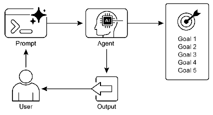

# 智能体实战之目标设定与监控：实现自主智能的关键


## 一.简介

在人工智能领域，一个真正有效的Agent不仅需要处理信息和使用工具的能力，更需要明确的目标导向和自我评估机制。目标设定和监控模式正是赋予AI Agent这种方向感和成功判断能力的核心框架，它将简单的反应系统转变为能够主动朝着定义目标工作的智能实体。

### 目标设定与监控模式的核心概念

目标设定和监控模式本质上是一个让AI Agent具备"意图-行动-评估"循环的框架。想象一下你组织一场大型会议的过程：你需要明确会议目标（如促进行业交流），评估当前状态（场地、预算、人员），规划步骤（邀请嘉宾、安排议程、宣传推广），并在执行过程中不断监控进度，根据实际情况调整计划。

在AI Agent的上下文中，这种模式涉及以下几个关键环节：

1. **目标定义**：将高级目标转化为具体、可衡量的子目标
2. **状态感知**：理解当前环境和自身状态
3. **规划生成**：创建从初始状态到目标状态的行动序列
4. **执行监控**：跟踪进度并评估是否朝目标前进
5. **动态调整**：根据反馈重新规划或调整策略

这种模式使Agent能够处理复杂的多步骤任务，适应环境变化，并在不确定性中保持目标导向。

### 实际应用场景

目标设定和监控模式在多个领域都有广泛应用：

- **智能家居系统**：Agent的目标可能是"优化家庭能源消耗同时保持舒适度"，它持续监控温度、光照、人员活动等数据，动态调整空调、照明等设备。

- **医疗诊断助手**：目标是"提高诊断准确性并减少误诊"，Agent分析患者数据，提出初步诊断，然后根据新信息和专家反馈不断优化诊断方案。

- **内容创作助手**：目标是"生成符合品牌风格且吸引目标受众的内容"，Agent创建初稿，获取反馈，分析受众反应，并迭代改进内容。

- **供应链优化**：目标是"最小化库存成本同时确保产品可用性"，Agent监控需求预测、库存水平和物流状态，动态调整订购和配送计划。

目标设定和监控模式是构建高效AI Agent的核心框架。它赋予Agent明确的方向感和自我评估能力，使Agent能够从简单的反应系统转变为主动的、目标驱动的智能实体。通过设定清晰的目标、持续监控进度、并根据反馈动态调整策略，AI Agent能够在复杂环境中自主完成任务，适应变化，并持续改进性能。

随着AI技术的不断发展，目标设定和监控模式将在更多领域发挥关键作用，推动AI系统从工具性应用向真正的智能助手转变。这种模式不仅提高了AI系统的可靠性，也增强了人类对AI系统的信任，为构建更加智能、负责任的人工智能系统奠定了基础。

## 二.实战案例--
构建一个智能论文分析助手Agent，它能自动解析PDF论文，提取关键信息，并生成符合特定目标的摘要。

## 三.langchain实现
```python
import os
import json
import re
from typing import List, Dict, Any, ClassVar
from pathlib import Path

# PDF处理库
import pdfplumber

# LangChain组件
from langchain_classic.output_parsers import ResponseSchema, StructuredOutputParser
from langchain_core.output_parsers import BaseOutputParser
from langchain_core.prompts import PromptTemplate
from langchain_core.runnables import RunnableLambda, RunnablePassthrough

from init_client import init_llm

class PDFParser:
    """PDF解析器 - 使用RunnableLambda包装"""

    def __init__(self):
        self.parser = RunnableLambda(self._parse_pdf)

    def _parse_pdf(self, inputs: Dict[str, Any]) -> Dict[str, Any]:
        pdf_path = inputs["pdf_path"]

        if not os.path.exists(pdf_path):
            raise FileNotFoundError(f"PDF文件不存在: {pdf_path}")

        print(f"📄 开始解析PDF文件: {pdf_path}")

        try:
            with pdfplumber.open(pdf_path) as pdf:
                text_content = []

                # 提取前10页内容（可根据需要调整）
                max_pages = min(len(pdf.pages), 10)
                for i in range(max_pages):
                    page = pdf.pages[i]
                    text = page.extract_text()
                    if text:
                        text_content.append(text)

                paper_text = "\n\n".join(text_content)

                # 清理文本
                paper_text = re.sub(r'\s+', ' ', paper_text)
                paper_text = re.sub(r'[^\w\s\u4e00-\u9fff.,;:!?()[]{}"\'-]', '', paper_text)

                print(f"✅ PDF解析完成，共提取 {len(paper_text)} 字符")
                return {"paper_text": paper_text}

        except Exception as e:
            print(f"❌ PDF解析失败: {e}")
            return {"paper_text": ""}


class PaperAnalysisOutputParser(BaseOutputParser[Dict[str, Any]]):
    """论文分析输出解析器"""

    # 将 schemas 定义为类变量
    analysis_schemas: ClassVar[List[ResponseSchema]] = [
        ResponseSchema(name="title", description="论文标题"),
        ResponseSchema(name="authors", description="论文作者列表"),
        ResponseSchema(name="abstract", description="论文摘要"),
        ResponseSchema(name="key_findings", description="主要发现，以列表形式呈现"),
        ResponseSchema(name="methodology", description="研究方法简述"),
        ResponseSchema(name="limitations", description="研究局限性"),
        ResponseSchema(name="future_work", description="未来工作建议")
    ]

    # 使用 @property 按需创建解析器实例
    @property
    def _parser(self) -> StructuredOutputParser:
        return StructuredOutputParser.from_response_schemas(self.analysis_schemas)

    def parse(self, text: str) -> Dict[str, Any]:
        try:
            return self._parser.parse(text)
        except Exception as e:
            print(f"⚠️ 分析结果解析失败，使用原始响应: {e}")
            return {"raw_analysis": text}

    def get_format_instructions(self) -> str:
        return self._parser.get_format_instructions()


class SummaryEvaluationOutputParser(BaseOutputParser[Dict[str, Any]]):
    """摘要评估输出解析器"""

    # 将 schemas 定义为类变量
    evaluation_schemas: ClassVar[List[ResponseSchema]] = [
        ResponseSchema(name="meets_goals", description="摘要是否满足所有设定目标，回答'是'或'否'"),
        ResponseSchema(name="accuracy_score", description="摘要准确度评分，1-10"),
        ResponseSchema(name="clarity_score", description="摘要清晰度评分，1-10"),
        ResponseSchema(name="completeness_score", description="摘要完整性评分，1-10"),
        ResponseSchema(name="feedback", description="改进建议，如果不满足目标")
    ]

    # 使用 @property 按需创建解析器实例
    @property
    def _parser(self) -> StructuredOutputParser:
        return StructuredOutputParser.from_response_schemas(self.evaluation_schemas)

    def parse(self, text: str) -> Dict[str, Any]:
        try:
            return self._parser.parse(text)
        except Exception as e:
            print(f"⚠️ 评估结果解析失败: {e}")
            return {"error": str(e)}

    def get_format_instructions(self) -> str:
        return self._parser.get_format_instructions()


class IntelligentPaperAnalyzer:
    """智能论文分析器 - 使用管道操作符构建Agent"""

    def __init__(self, max_iterations: int = 3):
        """初始化智能论文分析器"""
        self.llm = init_llm(
            temperature=0.1
        )
        self.max_iterations = max_iterations
        self.goals = []

        # 初始化组件 - 现在可以正常实例化
        self.pdf_parser = PDFParser()
        self.analysis_parser = PaperAnalysisOutputParser()
        self.evaluation_parser = SummaryEvaluationOutputParser()

        # 构建分析管道
        self._build_analysis_pipeline()
        # 构建评估管道
        self._build_evaluation_pipeline()
        # 构建改进管道
        self._build_improvement_pipeline()

    def _build_analysis_pipeline(self):
        """构建论文分析管道"""
        # 分析提示模板
        self.analysis_prompt = PromptTemplate(
            input_variables=["paper_text", "format_instructions"],
            template="""
            你是一个专业的研究论文分析助手。请仔细阅读以下研究论文，并提取关键信息。
            
            {format_instructions}
            
            论文内容:
            {paper_text}
            
            请确保提取的信息准确完整。
                        """
        )

        # 构建分析管道
        self.analysis_pipeline = (
                RunnablePassthrough.assign(
                    format_instructions=lambda _: self.analysis_parser.get_format_instructions()
                )
                | self.analysis_prompt
                | self.llm
                | RunnableLambda(lambda x: x.content)
                | self.analysis_parser
        )

    def _build_evaluation_pipeline(self):
        """构建摘要评估管道"""
        # 评估提示模板
        self.evaluation_prompt = PromptTemplate(
            input_variables=["goals", "analysis", "summary", "format_instructions"],
            template="""
            评估以下研究论文摘要是否满足设定的目标:
            
            目标: {goals}
            
            论文分析:
            {analysis}
            
            摘要:
            {summary}
            
            {format_instructions}
            
            请客观评估摘要质量，并提供具体的改进建议。
                        """
        )

        # 构建评估管道
        self.evaluation_pipeline = (
                RunnablePassthrough.assign(
                    format_instructions=lambda _: self.evaluation_parser.get_format_instructions()
                )
                | self.evaluation_prompt
                | self.llm
                | RunnableLambda(lambda x: x.content)
                | self.evaluation_parser
        )

    def _build_improvement_pipeline(self):
        """构建摘要改进管道"""
        # 改进提示模板
        self.improvement_prompt = PromptTemplate(
            input_variables=["summary", "feedback", "goals"],
            template="""
            根据以下反馈改进研究论文摘要:
            
            当前摘要:
            {summary}
            
            改进反馈:
            {feedback}
            
            目标要求:
            {goals}
            
            请提供改进后的摘要，要求:
            1. 保持简洁明了，不超过200字
            2. 充分考虑反馈意见
            3. 确保满足所有目标要求
            
            直接返回改进后的摘要，不要包含其他解释。
                        """
        )

        # 构建改进管道
        self.improvement_pipeline = (
                self.improvement_prompt
                | self.llm
                | RunnableLambda(lambda x: x.content.strip())
        )

    def set_goals(self, goals: List[str]) -> None:
        """设定分析目标"""
        self.goals = [g.strip() for g in goals]
        print(f"🎯 分析目标已设定: {', '.join(self.goals)}")

    def analyze_paper(self, pdf_path: str) -> Dict[str, Any]:
        """分析PDF论文的主流程"""
        if not self.goals:
            raise ValueError("请先使用set_goals()方法设定分析目标")

        print(f"\n🚀 开始分析PDF论文: {pdf_path}")
        print("=" * 60)

        # 第一步：解析PDF
        parse_result = self.pdf_parser.parser.invoke({"pdf_path": pdf_path})
        paper_text = parse_result["paper_text"]

        if not paper_text.strip():
            return {"success": False, "error": "无法解析PDF内容"}

        # 第二步：使用管道分析论文
        print("🔍 开始分析论文内容...")
        analysis = self.analysis_pipeline.invoke({
            "paper_text": paper_text[:8000]  # 限制文本长度
        })

        # 第三步：生成初始摘要
        print("📝 生成研究论文摘要...")
        summary_pipeline = (
                PromptTemplate(
                    input_variables=["goals", "analysis"],
                    template="""
                    基于以下研究论文分析，生成一个简洁明了的摘要，满足以下目标:
                    {goals}
                    
                    论文分析:
                    {analysis}
                    
                    摘要应该:
                    1. 简明扼要，不超过200字
                    2. 突出研究的主要贡献
                    3. 使用清晰易懂的语言
                    4. 避免技术术语过多
                    
                    请直接返回摘要内容，不要包含其他解释。
                                    """
                )
                | self.llm
                | RunnableLambda(lambda x: x.content.strip())
        )

        current_summary = summary_pipeline.invoke({
            "goals": ", ".join(self.goals),
            "analysis": json.dumps(analysis, ensure_ascii=False, indent=2)
        })

        # 第四步：迭代评估和改进
        iteration = 0
        final_evaluation = None

        while iteration < self.max_iterations:
            print(f"\n--- 🔁 评估迭代 {iteration + 1}/{self.max_iterations} ---")

            # 使用评估管道
            evaluation = self.evaluation_pipeline.invoke({
                "goals": ", ".join(self.goals),
                "analysis": json.dumps(analysis, ensure_ascii=False, indent=2),
                "summary": current_summary
            })

            meets_goals = evaluation.get("meets_goals", "").lower() == "是"
            final_evaluation = evaluation

            print(f"✅ 评估完成 - 满足目标: {evaluation.get('meets_goals', '未知')}")
            print(f"   准确度: {evaluation.get('accuracy_score', 'N/A')}/10")
            print(f"   清晰度: {evaluation.get('clarity_score', 'N/A')}/10")
            print(f"   完整性: {evaluation.get('completeness_score', 'N/A')}/10")

            if meets_goals:
                print(f"\n✅ 摘要满足所有目标，分析完成 (迭代次数: {iteration + 1})")
                break

            # 如果不满足目标且未达到最大迭代次数，则改进摘要
            if iteration < self.max_iterations - 1:
                print("\n🛠️ 摘要不满足目标，进行改进...")
                current_summary = self.improvement_pipeline.invoke({
                    "summary": current_summary,
                    "feedback": evaluation.get("feedback", "需要改进"),
                    "goals": ", ".join(self.goals)
                })
                iteration += 1
            else:
                print(f"\n⚠️ 已达到最大迭代次数 ({self.max_iterations})，返回当前结果")
                break

        # 保存结果
        self._save_results(pdf_path, analysis, current_summary, final_evaluation)

        return {
            "success": True,
            "analysis": analysis,
            "summary": current_summary,
            "evaluation": final_evaluation,
            "iterations": iteration + 1
        }

    def _save_results(self, pdf_path: str, analysis: Dict, summary: str, evaluation: Dict) -> None:
        """保存分析结果到文件"""
        pdf_name = Path(pdf_path).stem
        output_dir = Path("analysis_results")
        output_dir.mkdir(exist_ok=True)

        # 保存分析报告
        report_path = output_dir / f"{pdf_name}_analysis_report.txt"
        with open(report_path, "w", encoding="utf-8") as f:
            f.write("=== 论文分析报告 ===\n\n")
            f.write(f"论文标题: {analysis.get('title', '未知')}\n")
            f.write(f"作者: {analysis.get('authors', '未知')}\n\n")

            f.write("=== 分析结果 ===\n")
            f.write(json.dumps(analysis, ensure_ascii=False, indent=2))
            f.write("\n\n")

            f.write("=== 摘要 ===\n")
            f.write(summary)
            f.write("\n\n")

            f.write("=== 评估结果 ===\n")
            f.write(json.dumps(evaluation, ensure_ascii=False, indent=2))

        print(f"\n💾 分析报告已保存至: {report_path}")


# 使用示例
if __name__ == "__main__":
    # 创建智能论文分析器
    analyzer = IntelligentPaperAnalyzer(max_iterations=3)

    # 设定分析目标
    analyzer.set_goals([
        "简洁明了",
        "突出研究贡献",
        "适合非专业读者理解",
        "包含关键发现",
        "不超过200字"
    ])

    # 分析PDF论文
    # 请将路径替换为实际的PDF文件路径
    pdf_file_path = "基于关系驱动多模态嵌入塑形的图像描述生成.pdf"  # 替换为你的PDF文件路径

    if os.path.exists(pdf_file_path):
        result = analyzer.analyze_paper(pdf_file_path)

        if result["success"]:
            print("\n" + "=" * 60)
            print("📊 最终分析结果:")
            print("=" * 60)
            print(f"\n📝 最终摘要:\n{result['summary']}")

            if "evaluation" in result and result["evaluation"]:
                eval_data = result["evaluation"]
                print(f"\n📈 评估结果:")
                print(f"   满足目标: {eval_data.get('meets_goals', '未知')}")
                print(f"   准确度: {eval_data.get('accuracy_score', 'N/A')}/10")
                print(f"   清晰度: {eval_data.get('clarity_score', 'N/A')}/10")
                print(f"   完整性: {eval_data.get('completeness_score', 'N/A')}/10")

            print(f"\n🔄 迭代次数: {result['iterations']}")
        else:
            print(f"❌ 分析失败: {result['error']}")
    else:
        print(f"⚠️ PDF文件不存在: {pdf_file_path}")
        print("请将PDF文件放在当前目录下，或修改pdf_file_path变量指向正确的文件路径")
```

## 代码解析

这个项目是“目标设定和监控”模式一个非常出色的实践案例，它巧妙地结合了 PDF 处理、LangChain 的管道（LCEL）和 LLM 的推理能力。

### 整体架构

代码采用**模块化设计**，将不同的功能封装在独立的类中，最后由一个主协调器（`IntelligentPaperAnalyzer`）将它们串联起来。

1.  **`PDFParser`**：数据输入层。负责从物理文件（PDF）中提取原始文本数据。
2.  **`PaperAnalysisOutputParser` & `SummaryEvaluationOutputParser`**：数据结构化层。负责将 LLM 生成的非结构化文本，解析为程序可以理解和使用的结构化数据（字典）。
3.  **`IntelligentPaperAnalyzer`**：核心大脑与流程编排层。它包含了所有的业务逻辑、目标设定、工作流构建（使用管道符）和主循环控制。

---

### 核心组件详解

#### 1. `PDFParser` 类
```python
class PDFParser:
    def __init__(self):
        self.parser = RunnableLambda(self._parse_pdf)
```
*   **目的**：将 PDF 文件转换为纯文本。
*   **技术实现**：
    *   使用 `pdfplumber` 库，这是一个专门用于提取 PDF 文本和表格的强大工具。
    *   **关键点**：它没有直接暴露一个解析函数，而是将 `_parse_pdf` 方法包装在 `RunnableLambda` 中。这是为了与 LangChain 的管道符（`|`）兼容。LangChain 的管道要求每个环节都是一个 `Runnable` 对象，`RunnableLambda` 就是将普通 Python 函数“升级”为 `Runnable` 的便捷方式。

#### 2. `PaperAnalysisOutputParser` & `SummaryEvaluationOutputParser` 类
这两个类结构几乎相同，是 LangChain 处理结构化输出的标准模式。

```python
class PaperAnalysisOutputParser(BaseOutputParser[Dict[str, Any]]):
    analysis_schemas: ClassVar[List[ResponseSchema]] = [...]
    
    @property
    def _parser(self) -> StructuredOutputParser:
        return StructuredOutputParser.from_response_schemas(self.analysis_schemas)
    
    def parse(self, text: str) -> Dict[str, Any]:
        try:
            return self._parser.parse(text)
        except Exception as e:
            return {"raw_analysis": text}
```
*   **目的**：确保 LLM 的输出是可预测的、结构化的 JSON 格式，而不是随意的文本。
*   **技术实现**：
    *   **继承 `BaseOutputParser`**：这是 LangChain 的标准接口。
    *   **`ClassVar[List[ResponseSchema]]`**：定义了期望的 JSON 结构。例如，`PaperAnalysisOutputParser` 期望 LLM 返回包含 `title`、`authors`、`key_findings` 等字段的 JSON。`ClassVar` 表明这个变量属于类，而不是类的实例。
    *   **`@property def _parser`**：使用 `@property` 装饰器来创建 `StructuredOutputParser` 的实例。这是一种延迟加载和封装的好习惯。
    *   **`parse` 方法**：核心方法，它调用底层的 `StructuredOutputParser` 来尝试解析文本。重要的是，它包含了 `try...except` 块，如果解析失败（例如 LLM 没有返回严格的 JSON），它会返回一个包含原始文本的字典，防止程序崩溃，这是一种非常健壮的设计。

#### 3. `IntelligentPaperAnalyzer` 类（核心大脑）

这是整个系统的核心，负责编排所有组件并实现“目标设定和监控”模式。

##### a. 初始化 (`__init__`)
```python
def __init__(self, api_key: str, max_iterations: int = 3):
    # ...
    self.llm = ChatDeepseek(...)
    self.pdf_parser = PDFParser()
    self.analysis_parser = PaperAnalysisOutputParser()
    # ...
    self._build_analysis_pipeline()
    self._build_evaluation_pipeline()
    self._build_improvement_pipeline()
```
*   **目的**：初始化所有必需的组件（LLM、解析器）并预构建工作流管道。
*   **设计亮点**：在初始化时就构建好所有管道。这是一种“准备就绪”的模式，当实际任务开始时，可以直接调用这些预构建好的管道，提高了执行效率。

##### b. 管道构建 (`_build_..._pipeline`)

这是 LangChain 表达式语言（LCEL）和管道符（`|`）的精髓所在。

```python
def _build_analysis_pipeline(self):
    self.analysis_pipeline = (
        RunnablePassthrough.assign(
            format_instructions=lambda _: self.analysis_parser.get_format_instructions()
        )
        | self.analysis_prompt
        | self.llm
        | RunnableLambda(lambda x: x.content)
        | self.analysis_parser
    )
```
*   **数据流解析**：
    1.  **输入**：一个字典，如 `{"paper_text": "..."}`。
    2.  **`RunnablePassthrough.assign(...)`**：这是一个非常强大的工具。它会将原始输入字典原封不动地传递给下一步，但同时会添加或更新一个键。在这里，它动态地添加了 `format_instructions` 键，其值是解析器要求的 JSON 格式说明。**这实现了上下文的动态注入**。
    3.  **`| self.analysis_prompt`**：将上一步的完整字典（`{"paper_text": "...", "format_instructions": "..."}`）传递给 `PromptTemplate`，生成一个完整的、格式化的提示字符串。
    4.  **`| self.llm`**：将提示字符串发送给 DeepSeek LLM，获得一个 `AIMessage` 对象。
    5.  **`| RunnableLambda(lambda x: x.content)`**：`AIMessage` 对象通过一个简单的 Lambda 函数，只提取其 `content` 属性（即 LLM 返回的原始文本）。
    6.  **`| self.analysis_parser`**：将原始文本传递给我们的自定义解析器，最终得到一个结构化的 Python 字典。

*   **评估管道和改进管道**也遵循同样的模式，只是输入的提示和最终的解析器不同。

##### c. 主流程 (`analyze_paper`)

这是整个 Agent 的“行动-监控-反馈”循环的体现。

```python
def analyze_paper(self, pdf_path: str) -> Dict[str, Any]:
    # 1. 目标检查
    if not self.goals:
        raise ValueError(...)
    
    # 2. 数据准备
    parse_result = self.pdf_parser.parser.invoke({"pdf_path": pdf_path})
    paper_text = parse_result["paper_text"]
    
    # 3. 初始分析与生成
    analysis = self.analysis_pipeline.invoke({"paper_text": paper_text[:8000]})
    current_summary = summary_pipeline.invoke(...)
    
    # 4. 核心监控与迭代循环
    iteration = 0
    while iteration < self.max_iterations:
        # --- 监控 ---
        evaluation = self.evaluation_pipeline.invoke({
            "goals": ", ".join(self.goals),
            "analysis": json.dumps(analysis, ...),
            "summary": current_summary
        })
        meets_goals = evaluation.get("meets_goals", "").lower() == "是"
        
        # --- 决策 ---
        if meets_goals:
            print("✅ 摘要满足所有目标，分析完成")
            break
        
        # --- 反馈与行动 ---
        if iteration < self.max_iterations - 1:
            current_summary = self.improvement_pipeline.invoke({
                "summary": current_summary,
                "feedback": evaluation.get("feedback", "需要改进"), # 关键反馈
                "goals": ", ".join(self.goals)
            })
            iteration += 1
        else:
            break
            
    # 5. 结果持久化
    self._save_results(...)
    return {...}
```

*   **流程分解**：
    1.  **目标设定**：在循环开始前，通过 `set_goals` 方法设定，并在循环中反复使用。
    2.  **初始行动**：先进行一次性的分析和摘要生成。
    3.  **`while` 循环（监控核心）**：
        *   **监控**：调用 `evaluation_pipeline`，让 LLM 充当“裁判”，根据目标评估当前的 `summary`。
        *   **决策**：检查评估结果中的 `meets_goals` 字段。这是“判断自身是否真正成功”的关键一步。
        *   **反馈循环**：如果目标未达成，则调用 `improvement_pipeline`。**最关键的是**，它将上一步评估中产生的 `feedback` 作为输入传递给改进管道。这形成了一个**闭环的、基于反馈的自我修正机制**。
    4.  **终止条件**：循环在 `meets_goals` 为 `True` 或达到 `max_iterations` 时终止，防止无限循环。
    5.  **结果保存**：将最终的分析、摘要和评估结果保存到文件，便于用户查看和审计。

---

### 总结

这个代码案例之所以优秀，在于它：

1.  **完美诠释了设计模式**：它不是空洞的理论，而是将“目标设定”和“监控”模式具体化为了可执行的代码逻辑。
2.  **架构清晰、模块化**：每个类都有单一职责，使得代码易于理解、测试和维护。
3.  **充分利用了现代框架**：它展示了 LangChain LCEL 的强大之处，用声明式的管道符构建了复杂的数据流，代码既简洁又富有表现力。
4.  **健壮且实用**：包含了错误处理（如解析失败）、防御性编程（如限制文本长度）、结果持久化等，使其成为一个接近生产级别的应用原型。
5.  **智能化闭环**：通过让 LLM 同时扮演“执行者”和“评判者”的角色，构建了一个智能的、能够自我优化的闭环系统，这正是高级 AI Agent 的核心特征。

## 四.langgraph实现
```python
import os
import json
import re
from typing import List, Dict, Any, Optional, TypedDict, Literal
from pathlib import Path

# PDF处理库
import pdfplumber

# LangChain & LangGraph 组件
from langchain_classic.output_parsers import ResponseSchema, StructuredOutputParser

# LangGraph 核心组件
from langchain_core.messages import SystemMessage, HumanMessage
from langchain_core.prompts import PromptTemplate
from langgraph.graph import StateGraph, END
from langgraph.checkpoint.memory import MemorySaver

from init_client import init_llm

llm = init_llm(0.1)
# --- 1. 定义 Agent 的状态 ---
class AgentState(TypedDict):
    """定义在整个图中流转的状态"""
    pdf_path: str
    paper_text: str
    goals: List[str]
    analysis: Dict[str, Any]
    current_summary: str
    evaluation: Dict[str, Any]
    iterations: int
    max_iterations: int
    final_result: Optional[Dict[str, Any]]
    error_message: Optional[str]


# --- 2. 定义图的节点 (每个节点是一个执行步骤) ---

def parse_pdf_node(state: AgentState) -> AgentState:
    """节点1: 解析PDF文件"""
    print("🔍 节点: 解析PDF文件...")
    pdf_path = state["pdf_path"]
    if not os.path.exists(pdf_path):
        return {"error_message": f"PDF文件不存在: {pdf_path}"}

    try:
        with pdfplumber.open(pdf_path) as pdf:
            text_content = []
            max_pages = min(len(pdf.pages), 10)
            for i in range(max_pages):
                page = pdf.pages[i]
                text = page.extract_text()
                if text:
                    text_content.append(text)
            paper_text = "\n\n".join(text_content)
            paper_text = re.sub(r'\s+', ' ', paper_text)
            print(f"✅ PDF解析完成，共提取 {len(paper_text)} 字符")
            return {"paper_text": paper_text}
    except Exception as e:
        return {"error_message": f"PDF解析失败: {e}"}


def analyze_paper_node(state: AgentState) -> AgentState:
    """节点2: 分析论文内容"""
    print("🔍 节点: 分析论文内容...")
    paper_text = state["paper_text"]

    analysis_schemas = [
        ResponseSchema(name="title", description="论文标题"),
        ResponseSchema(name="authors", description="论文作者列表"),
        ResponseSchema(name="abstract", description="论文摘要"),
        ResponseSchema(name="key_findings", description="主要发现，以列表形式呈现"),
        ResponseSchema(name="methodology", description="研究方法简述"),
    ]
    analysis_parser = StructuredOutputParser.from_response_schemas(analysis_schemas)

    prompt = PromptTemplate(
        input_variables=["paper_text", "format_instructions"],
        template="""
你是一个专业的研究论文分析助手。请仔细阅读以下研究论文，并提取关键信息。
{format_instructions}

论文内容:
{paper_text}

请确保提取的信息准确完整。
        """
    )
    messages = [
        SystemMessage(content="你是一个专业的学术研究分析专家。"),
        HumanMessage(content=prompt.format(
            paper_text=paper_text[:8000],  # 限制长度
            format_instructions=analysis_parser.get_format_instructions()
        ))
    ]
    response = llm.invoke(messages)
    analysis = analysis_parser.parse(response.content)

    print("✅ 论文分析完成")
    return {"analysis": analysis}


def generate_summary_node(state: AgentState) -> AgentState:
    """节点3: 生成初始摘要"""
    print("🔍 节点: 生成初始摘要...")
    analysis = state["analysis"]
    goals = state["goals"]

    prompt = PromptTemplate(
        input_variables=["goals", "analysis"],
        template="""
基于以下研究论文分析，生成一个简洁明了的摘要，满足以下目标:
{goals}

论文分析:
{analysis}

摘要应该:
1. 简明扼要，不超过200字
2. 突出研究的主要贡献
3. 使用清晰易懂的语言
4. 避免技术术语过多

请直接返回摘要内容，不要包含其他解释。
        """
    )

    messages = [
        SystemMessage(content="你是一个专业的学术写作专家，擅长将复杂研究转化为简洁易懂的摘要。"),
        HumanMessage(content=prompt.format(
            goals=", ".join(goals),
            analysis=json.dumps(analysis, ensure_ascii=False, indent=2)
        ))
    ]
    response = llm.invoke(messages)
    summary = response.content.strip()

    print("✅ 初始摘要生成完成")
    return {"current_summary": summary, "iterations": 1}


def evaluate_summary_node(state: AgentState) -> AgentState:
    """节点4: 评估摘要质量"""
    print("🔍 节点: 评估摘要质量...")
    summary = state["current_summary"]
    analysis = state["analysis"]
    goals = state["goals"]

    eval_schemas = [
        ResponseSchema(name="meets_goals", description="摘要是否满足所有设定目标，回答'是'或'否'"),
        ResponseSchema(name="accuracy_score", description="摘要准确度评分，1-10"),
        ResponseSchema(name="clarity_score", description="摘要清晰度评分，1-10"),
        ResponseSchema(name="feedback", description="改进建议，如果不满足目标"),
    ]
    eval_parser = StructuredOutputParser.from_response_schemas(eval_schemas)

    prompt = PromptTemplate(
        input_variables=["goals", "analysis", "summary", "format_instructions"],
        template="""
评估以下研究论文摘要是否满足设定的目标:

目标: {goals}

论文分析:
{analysis}

摘要:
{summary}

{format_instructions}

请客观评估摘要质量，并提供具体的改进建议。
        """
    )

    messages = [
        SystemMessage(content="你是一个严谨的学术评估专家，擅长评估研究摘要的质量。"),
        HumanMessage(content=prompt.format(
            goals=", ".join(goals),
            analysis=json.dumps(analysis, ensure_ascii=False, indent=2),
            summary=summary,
            format_instructions=eval_parser.get_format_instructions()
        ))
    ]
    response = llm.invoke(messages)
    evaluation = eval_parser.parse(response.content)

    print(f"✅ 评估完成 - 满足目标: {evaluation.get('meets_goals', '未知')}")
    return {"evaluation": evaluation}


def improve_summary_node(state: AgentState) -> AgentState:
    """节点5: 改进摘要"""
    print("🔍 节点: 改进摘要...")
    summary = state["current_summary"]
    feedback = state["evaluation"].get("feedback", "需要改进")
    goals = state["goals"]

    prompt = PromptTemplate(
        input_variables=["summary", "feedback", "goals"],
        template="""
根据以下反馈改进研究论文摘要:

当前摘要:
{summary}

改进反馈:
{feedback}

目标要求:
{goals}

请提供改进后的摘要，要求:
1. 保持简洁明了，不超过200字
2. 充分考虑反馈意见
3. 确保满足所有目标要求

直接返回改进后的摘要，不要包含其他解释。
        """
    )

    messages = [
        SystemMessage(content="你是一个专业的学术写作改进专家，擅长根据反馈优化研究摘要。"),
        HumanMessage(content=prompt.format(
            summary=summary,
            feedback=feedback,
            goals=", ".join(goals)
        ))
    ]
    response = llm.invoke(messages)
    improved_summary = response.content.strip()

    print("✅ 摘要改进完成")
    # 增加迭代次数
    return {"current_summary": improved_summary, "iterations": state["iterations"] + 1}


def save_results_node(state: AgentState) -> AgentState:
    """节点6: 保存最终结果"""
    print("🔍 节点: 保存最终结果...")
    pdf_path = state["pdf_path"]
    analysis = state["analysis"]
    summary = state["current_summary"]
    evaluation = state["evaluation"]

    pdf_name = Path(pdf_path).stem
    output_dir = Path("analysis_results_langgraph")
    output_dir.mkdir(exist_ok=True)

    report_path = output_dir / f"{pdf_name}_analysis_report.txt"
    with open(report_path, "w", encoding="utf-8") as f:
        f.write("=== 论文分析报告 (LangGraph版本) ===\n\n")
        f.write(f"论文标题: {analysis.get('title', '未知')}\n")
        f.write(f"作者: {analysis.get('authors', '未知')}\n\n")
        f.write("=== 分析结果 ===\n")
        f.write(json.dumps(analysis, ensure_ascii=False, indent=2))
        f.write("\n\n=== 最终摘要 ===\n")
        f.write(summary)
        f.write("\n\n=== 最终评估 ===\n")
        f.write(json.dumps(evaluation, ensure_ascii=False, indent=2))

    print(f"💾 分析报告已保存至: {report_path}")
    return {"final_result": {"analysis": analysis, "summary": summary, "evaluation": evaluation}}


# --- 3. 定义决策逻辑 (决定下一步走向哪个节点) ---

def should_continue(state: AgentState) -> Literal["improve_summary", "save_results", "end"]:
    """决策函数：根据评估结果和迭代次数决定下一步"""
    evaluation = state["evaluation"]
    iterations = state["iterations"]
    max_iterations = state["max_iterations"]

    if evaluation.get("meets_goals", "").lower() == "是":
        print("✅ 决策: 目标已满足，准备保存结果。")
        return "save_results"
    elif iterations < max_iterations:
        print(f"🔄 决策: 目标未满足，但未达最大迭代次数({iterations}/{max_iterations})，继续改进。")
        return "improve_summary"
    else:
        print(f"⚠️ 决策: 已达到最大迭代次数({max_iterations})，结束流程。")
        return "end"


# --- 4. 构建和编译图 ---

def build_graph():
    """构建LangGraph工作流图"""
    workflow = StateGraph(AgentState)

    # 添加节点
    workflow.add_node("parse_pdf", parse_pdf_node)
    workflow.add_node("analyze_paper", analyze_paper_node)
    workflow.add_node("generate_summary", generate_summary_node)
    workflow.add_node("evaluate_summary", evaluate_summary_node)
    workflow.add_node("improve_summary", improve_summary_node)
    workflow.add_node("save_results", save_results_node)

    # 设置入口点
    workflow.set_entry_point("parse_pdf")

    # 添加线性边
    workflow.add_edge("parse_pdf", "analyze_paper")
    workflow.add_edge("analyze_paper", "generate_summary")
    workflow.add_edge("generate_summary", "evaluate_summary")

    # 添加条件边：从评估节点到决策
    workflow.add_conditional_edges(
        "evaluate_summary",
        should_continue,
        {
            "improve_summary": "improve_summary",
            "save_results": "save_results",
            "end": END
        }
    )

    # 添加循环边：从改进节点回到评估节点
    workflow.add_edge("improve_summary", "evaluate_summary")

    # 添加结束边
    workflow.add_edge("save_results", END)

    # 使用内存检查点来保存状态（可选，但对于持久化和调试很有用）
    memory = MemorySaver()

    # 编译图
    app = workflow.compile(checkpointer=memory)
    return app


# --- 5. 封装成主类 ---

class LangGraphPaperAnalyzer:
    def __init__(self, max_iterations: int = 3):
        self.max_iterations = max_iterations
        self.app = build_graph()
        # 可选：可视化图的结构
        self.app.get_graph().print_ascii()

    def analyze(self, pdf_path: str, goals: List[str]) -> Dict[str, Any]:
        """启动分析流程"""
        print(f"\n🚀 启动 LangGraph 论文分析器...")
        print("=" * 60)

        initial_state = {
            "pdf_path": pdf_path,
            "paper_text": "",
            "goals": goals,
            "analysis": {},
            "current_summary": "",
            "evaluation": {},
            "iterations": 0,
            "max_iterations": self.max_iterations,
            "final_result": None,
            "error_message": None
        }

        # 使用 thread_id 来跟踪特定的对话/运行
        config = {"configurable": {"thread_id": "paper-analysis-1"}}

        # 运行图直到结束
        final_state = self.app.invoke(initial_state, config=config)

        if final_state.get("error_message"):
            print(f"\n❌ 流程出错: {final_state['error_message']}")
            return {"success": False, "error": final_state["error_message"]}

        if final_state.get("final_result"):
            print("\n✅ 分析流程成功完成！")
            return {"success": True, "result": final_state["final_result"]}
        else:
            print("\n⚠️ 流程结束，但未达到目标。")
            return {"success": False, "result": final_state, "message": "未在最大迭代次数内达成目标"}


# --- 6. 使用示例 ---
if __name__ == "__main__":
    # 创建分析器
    analyzer = LangGraphPaperAnalyzer(max_iterations=3)

    # 设定目标
    goals = [
        "简洁明了",
        "突出研究贡献",
        "适合非专业读者理解",
        "包含关键发现",
        "不超过200字"
    ]

    # 分析PDF论文
    pdf_file_path = "基于关系驱动多模态嵌入塑形的图像描述生成.pdf"  # 替换为你的PDF文件路径

    if os.path.exists(pdf_file_path):
        result = analyzer.analyze(pdf_file_path, goals)

        if result["success"]:
            print("\n" + "=" * 60)
            print("📊 最终分析结果:")
            print("=" * 60)
            final_data = result["result"]
            print(f"\n📝 最终摘要:\n{final_data['summary']}")

            eval_data = final_data['evaluation']
            print(f"\n📈 最终评估:")
            print(f"   满足目标: {eval_data.get('meets_goals', '未知')}")
            print(f"   准确度: {eval_data.get('accuracy_score', 'N/A')}/10")
            print(f"   清晰度: {eval_data.get('clarity_score', 'N/A')}/10")
        else:
            print(f"\n❌ 分析失败或未完成: {result.get('error', result.get('message'))}")
    else:
        print(f"⚠️ PDF文件不存在: {pdf_file_path}")
```

## 代码解析

---

#### 1. 状态：`AgentState` - 模式的基石

```python
class AgentState(TypedDict):
    """定义在整个图中流转的状态"""
    pdf_path: str
    paper_text: str
    goals: List[str]  # <-- 目标在这里
    analysis: Dict[str, Any]
    current_summary: str
    evaluation: Dict[str, Any]  # <-- 监控结果在这里
    iterations: int
    max_iterations: int
    # ...
```

`AgentState` 是整个系统的“共享记忆”或“工作板”。它不是简单的数据传递，而是**承载了 Agent 在执行任务过程中的所有上下文**。

*   **目标设定**：`goals: List[str]` 字段被明确定义在状态中，意味着“目标”是 Agent 决策的核心依据，贯穿始终。
*   **监控**：`evaluation: Dict[str, Any]` 字段用于存储监控的结果，这是 Agent 判断自己是否成功的依据。

#### 2. 目标设定：从外部输入到内部驱动

```python
# --- 6. 使用示例 ---
if __name__ == "__main__":
    # 设定目标
    goals = [
        "简洁明了",
        "突出研究贡献",
        "适合非专业读者理解",
        "包含关键发现",
        "不超过200字"
    ]
    # ...
    result = analyzer.analyze(pdf_file_path, goals)
```

*   **明确的起点**：目标在这里被清晰地、可量化地定义。它们不是模糊的指令，而是可以被 LLM 理解和评判的具体标准。
*   **注入状态**：在 `analyze` 方法中，这些 `goals` 被放入 `initial_state`，成为 Agent 状态机启动的初始条件之一。从此刻起，目标不再是外部变量，而是驱动 Agent 内部决策的**内在驱动力**。

#### 3. 监控：`evaluate_summary_node` - 模式的核心

这是整个模式最关键的节点，它扮演了“自我反思”和“进度检查”的角色。

```python
def evaluate_summary_node(state: AgentState) -> AgentState:
    """节点4: 评估摘要质量"""
    # ...
    summary = state["current_summary"]  # 当前的产出
    analysis = state["analysis"]
    goals = state["goals"]              # 最初的目标
    
    # ...
    # 让 LLM 充当“裁判”，根据“目标”评估“产出”
    response = llm.invoke(messages)
    evaluation = eval_parser.parse(response.content) # 解析为结构化结果
    
    print(f"✅ 评估完成 - 满足目标: {evaluation.get('meets_goals', '未知')}")
    return {"evaluation": evaluation} # 将监控结果更新到状态中
```

*   **对比分析**：该节点的核心逻辑是**将“当前状态”与“目标状态”进行对比**。它接收 `current_summary`（我们现在在哪）和 `goals`（我们应该在哪）。
*   **量化监控**：它没有简单地回答“好/坏”，而是生成了一个结构化的 `evaluation` 字典，包含：
    *   `meets_goals`：一个明确的布尔值，直接回答“我成功了吗？”
    *   `accuracy_score`, `clarity_score`：量化指标，提供了更细粒度的进度信息。
    *   `feedback`：如果未成功，提供了具体的、可操作的“差距分析”和改进建议。
*   **状态更新**：监控的结果被写回到 `AgentState` 中，供下一个决策节点使用。

#### 4. 决策与循环：`should_continue` 和 `add_conditional_edges` - 模式的闭环

这是 LangGraph 相比 LCEL `while` 循环最优雅的地方。决策逻辑与执行逻辑被完全分离。

```python
def should_continue(state: AgentState) -> Literal["improve_summary", "save_results", "end"]:
    """决策函数：根据评估结果和迭代次数决定下一步"""
    evaluation = state["evaluation"]  # 读取监控结果
    iterations = state["iterations"]
    max_iterations = state["max_iterations"]

    if evaluation.get("meets_goals", "").lower() == "是":
        print("✅ 决策: 目标已满足，准备保存结果。")
        return "save_results"
    elif iterations < max_iterations:
        print(f"🔄 决策: 目标未满足，但未达最大迭代次数({iterations}/{max_iterations})，继续改进。")
        return "improve_summary"
    else:
        print(f"⚠️ 决策: 已达到最大迭代次数({max_iterations})，结束流程。")
        return "end"
```

*   **纯函数决策**：`should_continue` 是一个纯粹的决策函数。它只读取状态，并根据预设的规则（目标是否达成？迭代次数是否超限？）返回一个字符串，这个字符串就是下一个要去的节点名称。
*   **声明式流程控制**：在 `build_graph` 中，`add_conditional_edges` 将这个决策函数与图的结构绑定在一起。

```python
# 添加条件边：从评估节点到决策
workflow.add_conditional_edges(
    "evaluate_summary",      # 从哪个节点开始决策
    should_continue,          # 使用哪个决策函数
    {                         # 决策结果与目标节点的映射
        "improve_summary": "improve_summary",
        "save_results": "save_results",
        "end": END
    }
)

# 添加循环边：从改进节点回到评估节点
workflow.add_edge("improve_summary", "evaluate_summary")
```

*   **智能闭环**：这个结构形成了一个完美的**“行动-监控-决策-再行动”**的智能闭环。
    1.  **行动**：`generate_summary_node` 生成摘要。
    2.  **监控**：`evaluate_summary_node` 评估摘要。
    3.  **决策**：`should_continue` 决定是结束还是继续。
    4.  **再行动**：如果继续，则流向 `improve_summary_node`。
    5.  **循环**：`improve_summary_node` 执行完后，通过 `workflow.add_edge("improve_summary", "evaluate_summary")` 自动回到第2步（监控），形成循环。

#### 5. 改进：`improve_summary_node` - 基于反馈的行动

```python
def improve_summary_node(state: AgentState) -> AgentState:
    """节点5: 改进摘要"""
    summary = state["current_summary"]
    feedback = state["evaluation"].get("feedback", "需要改进") # <-- 关键：使用监控的反馈
    goals = state["goals"]
    # ...
    # LLM 根据 feedback 进行改进
    # ...
    return {"current_summary": improved_summary, "iterations": state["iterations"] + 1}
```

这个节点的智能之处在于，它不是盲目地重新生成，而是**利用了上一步监控环节产生的 `feedback`**。这使得它的“改进”是有的放矢的，是基于对“差距”的精确分析而采取的针对性行动。

---

### 总结：模式与代码的完美映射

| “目标设定与监控”模式概念 | 对应的代码实现 | 解释 |
| :--- | :--- | :--- |
| **设定目标** | `goals` 列表 & `AgentState.goals` | 将清晰、可衡量的目标注入 Agent 的状态中，作为其行动的最终评判标准。 |
| **规划与执行** | 线性边（`add_edge`） | `parse_pdf` -> `analyze_paper` -> `generate_summary` 构成了初始的、线性的执行计划。 |
| **监控** | `evaluate_summary_node` | 专门的节点，负责将当前产出与目标进行对比，生成结构化的评估报告。 |
| **判断成功** | `evaluation['meets_goals']` | 监控环节产生的明确布尔值，是 Agent 判断自己是否成功的核心依据。 |
| **反馈** | `evaluation['feedback']` | 监控环节产生的具体改进建议，指导下一步的行动。 |
| **决策与循环** | `should_continue` & `add_conditional_edges` | 核心控制逻辑，根据监控结果决定是结束流程还是进入改进循环。 |
| **迭代改进** | `improve_summary_node` -> `evaluate_summary_node` 的边 | 基于反馈采取行动，并自动返回监控环节，形成智能的闭环。 |

### 结论

通过 LangGraph 的状态图机制，将“目标设定与监控”模式从一种编程思想，**物化为一个可运行、可观测、可扩展的智能工作流**。它清晰地展示了：

1.  **目标驱动**：Agent 的所有行为都围绕着达成预设的目标。
2.  **自我感知**：Agent 能够评估自己的产出与目标之间的差距。
3.  **自主决策**：Agent 能够根据评估结果自主决定下一步的行动。
4.  **持续改进**：Agent 能够在反馈循环中不断优化，直到达成目标。
