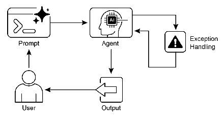

# 智能体实战之韧性之道：异常处理与恢复


## 一.简介

---

### **AI Agent 的韧性之道：异常处理与恢复模式解析**

在构建能够在复杂多变的现实世界中自主运行的 AI Agent 时，一个核心挑战在于如何应对无处不在的不确定性。正如经验丰富的探险家能在野外应对突发状况，一个真正智能的 Agent 也必须具备一套内在的“生存法则”，使其在遭遇意外障碍、系统错误或服务中断时，能够保持稳定，甚至从中学习和恢复。这种能力，我们称之为 AI Agent 的韧性，而其背后的设计哲学，便是异常处理与恢复模式。

此模式的核心目标，是打造出“皮实耐用”的 AI Agent，确保它们在面对压力和异常时，不会轻易崩溃，而是能够维持核心功能的完整性。它强调一种“居安思危”的设计思想：不仅要规划好成功的路径，更要为可能发生的失败预设应对策略。这种前瞻性的准备，是 Agent 在动态环境中持续、可靠运行的基石，也是提升其整体可信度和实用价值的关键。

一个具备韧性的 Agent，不仅在于其解决问题的能力，更在于其管理失败的能力。通过集成先进的监控和自我诊断机制，Agent 能够在问题萌芽阶段就将其识别，从而防止小故障演变成系统中断，确保在变化的条件下平稳运行。这对于维护 AI 系统的整体效能至关重要。

### **韧性构建的三大支柱**

异常处理与恢复模式可以分解为三个相互关联的阶段，共同构成了 Agent 的韧性支柱：

1.  **感知与诊断:**
    这是 Agent 的“感知系统”，用于主动或被动地发现异常。异常的表现形式多种多样，例如：调用外部 API 时返回的错误码（如 404 Not Found, 503 Service Unavailable）、工具返回了格式不符或无意义的结果、网络请求超时，甚至是 Agent 自身推理链条的断裂。一个高级的系统还可能包含独立的监控 Agent，实时分析主 Agent 的行为模式，以预测和发现潜在问题。

2.  **响应与策略:**
    一旦检测到异常，Agent 必须立即启动预设的响应计划。这不仅仅是简单的“报错”，而是一套策略组合：
    *   **日志记录:** 详细记录错误的上下文信息，如同飞机的黑匣子，为后续分析和复盘提供依据。
    *   **智能重试:** 对于临时性错误（如网络抖动），自动进行重试。有时甚至会微调参数再试，以提高成功率。
    *   **启用回退:** 当主要方法失效时，自动切换到备用方案。例如，当精确数据源不可用时，转而查询一个通用但可靠的数据源。
    *   **优雅降级:** 在无法完全恢复功能时，选择性地关闭部分非核心功能，以保证核心服务依然可用。例如，一个导航应用在无法获取实时路况时，仍能提供静态路线规划。
    *   **及时通知:** 当问题超出 Agent 自身处理能力时，向人类管理员或其他协同 Agent 发送警报，请求人工干预。

3.  **恢复与适应:**
    这个阶段的目标是让 Agent 从错误中“站起来”，并变得更强。
    *   **状态回滚:** 撤销因错误操作而产生的无效或有害状态变更，将系统恢复到错误发生前的稳定状态。
    *   **诊断与自愈:** Agent 分析错误的根本原因，并尝试自我修复。这可能涉及到调整其内部逻辑、参数，甚至是重新规划任务步骤。这一步常常与“反思模式”结合，通过分析失败原因来优化未来的行为。
    *   **问题升级:** 对于无法自行解决的严重或复杂问题，将任务和相关信息上报给更高级别的系统或人类专家。

通过实施这一模式，AI Agent 从一个脆弱的程序转变为一个能够在不确定性中稳健运行的可靠伙伴，确保了服务的连续性和用户体验的流畅性。

## 二.实战案例--机器人装配线异常恢复 Agent
构建一个监督机器人装配任务的 AI Agent。它的任务是指导一个机器人臂从料仓中拾取一个齿轮，并将其精确地安装到主体部件上。这个任务充满了物理世界的风险。

## 三.langchain实现
场景设计: 

    主要工具 (pick_and_place_gear): 这是一个复合工具，它首先指令机器人拾取齿轮，然后指令机器人进行安装。它会返回一个操作结果。 
    验证工具 (verify_assembly_with_vision): 安装完成后，使用视觉系统检查齿轮是否被正确安装。 
    恢复工具 (reset_robot_position): 如果发生错误，将机器人臂复位到安全位置。 
    报警工具 (alert_maintenance_team): 当问题无法自行解决时，向维护团队发送警报。 

核心异常处理逻辑: 

     如果 pick_and_place_gear 失败（例如，“拾取失败”），Agent 应该重试一次。如果再次失败，则复位机器人并报警。
     如果 pick_and_place_gear 成功，但 verify_assembly_with_vision 失败（例如，“安装位置偏移”），这表明装配过程有问题。Agent 应该启动一个恢复流程：复位机器人 -> 重新拾取和安装 -> 再次验证。这个循环最多尝试 2 次。如果最终仍然失败，则必须报警，因为这可能意味着设备校准出现了问题。
     

```python
import random
from langchain.tools import tool
from langchain_classic.agents import AgentExecutor, create_tool_calling_agent
from langchain_core.prompts import PromptTemplate

from init_client import init_llm
# --- 1. 定义工业工具 ---
@tool
def pick_and_place_gear(part_id: str) -> str:
    """指令机器人拾取并安装一个齿轮。输入是零件ID。"""
    print(f"--- 工具调用: 尝试拾取并安装齿轮 '{part_id}' ---")
    # 模拟 70% 的成功率
    if random.random() < 0.7:
        return "成功：齿轮已拾取并安装。"
    else:
        # 模拟不同类型的失败
        failure_type = random.choice(["拾取失败：料仓为空或齿轮位置偏移。", "安装失败：检测到碰撞或阻力过大。"])
        return f"错误：{failure_type}"

@tool
def verify_assembly_with_vision() -> str:
    """使用视觉系统验证齿轮是否安装正确。"""
    print("--- 工具调用: 使用视觉系统验证装配结果 ---")
    # 模拟 80% 的验证成功率
    if random.random() < 0.8:
        return "验证成功：齿轮位置正确。"
    else:
        return "验证失败：视觉系统检测到齿轮安装位置存在显著偏移。"

@tool
def reset_robot_position() -> str:
    """将机器人臂复位到安全的初始位置。"""
    print("--- 工具调用: 复位机器人到安全位置 ---")
    return "机器人已成功复位。"

@tool
def alert_maintenance_team(message: str) -> str:
    """向维护团队发送详细的警报信息。输入是警报内容。"""
    print(f"--- 工具调用: 向维护团队发送警报 ---")
    print(f"警报内容: {message}")
    return "警报已成功发送给维护团队。"

tools = [pick_and_place_gear, verify_assembly_with_vision, reset_robot_position, alert_maintenance_team]

# --- 2. 创建具备异常处理能力的工业 Agent ---

llm = init_llm(temperature=0.1)

# 定义一个强调安全、重试和升级的工业级 Prompt
prompt_template = """
你是一个负责监督机器人装配线的AI班组长。你的首要目标是安全、高效地完成任务，并在出现问题时进行妥善处理。

当前任务：安装一个齿轮（ID: G-1234）。

**核心操作流程与异常处理协议：**

1.  **开始任务**: 首先，你必须使用 `pick_and_place_gear` 工具，并输入零件ID "G-1234"。
2.  **处理 `pick_and_place_gear` 的结果**:
    - 如果结果以 "错误：" 开头，说明机器人操作失败。
        - 你必须立即调用 `reset_robot_position` 工具。
        - 然后，调用 `alert_maintenance_team` 工具，将错误信息作为警报内容发送出去。
        - 任务结束，不要进行任何其他操作。
    - 如果结果是 "成功"，则继续执行下一步。
3.  **执行验证**: 在成功安装后，你**必须**调用 `verify_assembly_with_vision` 工具来检查质量。
4.  **处理 `verify_assembly_with_vision` 的结果**:
    - 如果结果是 "验证成功"，恭喜你，任务圆满完成。
    - 如果结果是 "验证失败"，说明装配质量有问题。你必须启动一个**最多2次的重试恢复流程**。
        - **重试步骤**:
            a. 调用 `reset_robot_position`。
            b. 再次调用 `pick_and_place_gear` 工具。
            c. 再次调用 `verify_assembly_with_vision` 工具。
        - **评估重试结果**:
            - 如果重试后验证成功，任务完成。
            - 如果重试后验证**仍然失败**，说明可能存在设备校准等系统性问题。你必须：
                i. 调用 `reset_robot_position`。
                ii. 调用 `alert_maintenance_team`，发送消息"警报：齿轮装配多次验证失败，请检查机器人校准。"
                iii. 任务结束。

严格遵守以上协议。你的每一步操作都必须基于上一步的观察结果。

Question: {input}
Thought:{agent_scratchpad}
"""

prompt = PromptTemplate.from_template(prompt_template)

# 这个函数现在接受 llm, tools, 和 prompt 作为参数
agent = create_tool_calling_agent(llm, tools, prompt)

# 创建 Agent 执行器，设置 verbose=True 以观察其思考过程
agent_executor = AgentExecutor(agent=agent, tools=tools, verbose=True, handle_parsing_errors=True)

# --- 3. 运行并测试 ---

print("\n\n==================== 开始工业装配任务 ====================")
# 为了演示，我们设置随机种子以获得可预测的失败场景
# random.seed(1) # 可能会触发 pick_and_place 失败
random.seed(2) # 可能会触发 verify_assembly 失败，从而进入重试逻辑

agent_executor.invoke({"input": "请开始执行齿轮 G-1234 的装配任务。"})
```

## 代码解析

---

### **第一阶段：感知与诊断**

在这个系统中，“感知”和“诊断”不是通过代码中的 `if` 判断，而是通过 Agent 对工具返回结果的**语义理解**来完成的。

1.  **模拟故障源:**
    *   `pick_and_place_gear` 和 `verify_assembly_with_vision` 这两个工具是主要的“传感器”。它们内部通过 `random.random()` 模拟了物理世界中不可避免的失败。
    *   **关键设计**：它们在失败时返回的字符串格式是固定的，例如 `"错误：拾取失败..."` 或 `"验证失败：..."`。这为 Agent 提供了清晰、可解析的**诊断信号**。

2.  **LLM 作为诊断引擎:**
    *   LLM 的核心任务之一就是解读这些信号。Prompt 中的指令，如 `如果结果以 "错误：" 开头` 或 `如果结果是 "验证失败"`，就是赋予 LLM 的诊断规则。
    *   当 `AgentExecutor` 将工具的输出（`Observation`）反馈给 LLM 时，LLM 会根据 Prompt 中的规则，**“诊断”**出当前的状态是成功、是可重试的失败，还是需要升级的严重故障。

### **第二阶段：响应与策略**

这是整个设计的灵魂。Prompt 中定义的**“核心操作流程与异常处理协议”**，本质上就是一本详尽的、包含所有分支的**响应策略手册**。

1.  **安全第一的即时响应:**
    *   **协议**：`如果结果以 "错误：" 开头...你必须立即调用 reset_robot_position 工具。`
    *   **解析**：这体现了安全第一的原则。任何操作失败后，首要任务不是重试，而是将设备（机器人）恢复到一个已知的、安全的初始状态，防止故障扩大化。`reset_robot_position` 就是物理世界中的“安全停机”或“状态回滚”。

2.  **智能重试机制:**
    *   **协议**：`如果结果是 "验证失败"...你必须启动一个最多2次的重试恢复流程。`
    *   **解析**：这展示了比简单重试更高级的策略。它不是盲目地重复上一步，而是定义了一个**完整的恢复序列**：
        *   `a. 调用 reset_robot_position` (先恢复安全状态)
        *   `b. 再次调用 pick_and_place_gear` (重新执行核心操作)
        *   `c. 再次调用 verify_assembly_with_vision` (再次验证)
    *   这种多步骤的重试流程，模拟了人类专家在解决复杂问题时“复位-重做-再检查”的严谨逻辑。

3.  **问题升级:**
    *   **协议**：`如果重试后验证仍然失败...调用 alert_maintenance_team，发送消息"警报：齿轮装配多次验证失败，请检查机器人校准。"`
    *   **解析**：这是 Agent 自我能力边界的体现。当内置的重试策略无法解决问题时，它不会无限循环，而是判断这可能是一个更深层次的系统性问题（如设备校准），并果断地将问题**升级**给人类专家。
    *   **高级智能**：更值得注意的是，它发送的警报信息是经过智能加工的（“请检查机器人校准”），而不是简单地转发原始错误。这为人类维护人员提供了极具价值的诊断线索。

### **第三阶段：恢复与适应**

“恢复”在代码中是显式的，而“适应”则由整个架构所赋能。

1.  **状态恢复:**
    *   **工具**：`reset_robot_position` 是恢复的核心。每次异常后调用它，确保了系统从一个**稳定、已知的基线**重新开始，避免了因前次失败导致的“脏状态”问题。

2.  **动态任务重规划:**
    *   **机制**：整个 `AgentExecutor` 的循环（思考-行动-观察）就是一种动态重规划。Agent 的下一步行动**完全取决于上一步的观察结果**。
    *   **体现**：当 `verify_assembly_with_vision` 返回失败时，Agent 不会继续执行任何后续任务，而是**立即“重规划”**，跳转到 Prompt 中定义的“重试恢复流程”。这种基于实时反馈调整计划的能力，是系统韧性的关键。

3.  **知识沉淀与闭环:**
    *   **机制**：`alert_maintenance_team` 工具是知识沉淀的入口。
    *   **体现**：通过将包含丰富上下文（错误类型、重试次数、初步诊断）的警报发送给外部系统（如 CMMS），Agent 实现了**学习闭环**。虽然 Agent 本身没有“记住”这次失败，但它确保了整个组织系统能够从这次故障中学习，从而在未来进行改进（如调整设备校准周期），这是一种更高层次的“适应”。

### **总结**

这段代码将**异常处理的逻辑与执行的代码彻底解耦**。

*   **灵活性**：如果明天要修改重试次数为3次，或者增加一个新的恢复步骤，我们**只需修改 Prompt 文本**，而无需改动任何一行 Python 代码。这使得系统的行为策略可以像编辑文档一样轻松调整。
*   **可读性**：阅读 Prompt，任何人都能够清晰地理解 Agent 的所有行为逻辑，包括它如何应对各种异常情况。这比埋藏在复杂的 `if-else` 和 `try-catch` 结构中的逻辑要直观得多。
*   **鲁棒性**：通过模拟真实世界的随机失败，并为其设计完整的感知、响应和恢复策略，这个 Agent 展现了在不确定环境中持续运行的强大能力，真正实现了从“脆弱的程序”到“有韧性的智能体”的转变。

## 四.langgraph实现
```python
import random
from typing import Literal
from init_client import init_llm

# --- 1. 导入 LangGraph 核心组件 ---
from langgraph.graph import StateGraph, MessagesState, START, END
from langgraph.prebuilt import ToolNode
from langchain_core.messages import HumanMessage, AIMessage, ToolMessage
from langchain.tools import tool


# --- 2. 定义工业工具 ---

@tool
def pick_and_place_gear(part_id: str) -> str:
    """指令机器人拾取并安装一个齿轮。输入是零件ID。"""
    print(f"--- 工具调用: 尝试拾取并安装齿轮 '{part_id}' ---")
    if random.random() < 0.7:
        return "成功：齿轮已拾取并安装。"
    else:
        failure_type = random.choice(["拾取失败：料仓为空或齿轮位置偏移。", "安装失败：检测到碰撞或阻力过大。"])
        return f"错误：{failure_type}"


@tool
def verify_assembly_with_vision() -> str:
    """使用视觉系统验证齿轮是否安装正确。"""
    print("--- 工具调用: 使用视觉系统验证装配结果 ---")
    if random.random() < 0.8:
        return "验证成功：齿轮位置正确。"
    else:
        return "验证失败：视觉系统检测到齿轮安装位置存在显著偏移。"


@tool
def reset_robot_position() -> str:
    """将机器人臂复位到安全的初始位置。"""
    print("--- 工具调用: 复位机器人到安全位置 ---")
    return "机器人已成功复位。"


@tool
def alert_maintenance_team(message: str) -> str:
    """向维护团队发送详细的警报信息。"""
    print(f"--- 工具调用: 向维护团队发送警报 ---")
    print(f"警报内容: {message}")
    return "警报已成功发送给维护团队。"


tools = [pick_and_place_gear, verify_assembly_with_vision, reset_robot_position, alert_maintenance_team]


# --- 3. 定义 LangGraph 的状态 ---
# 继承 MessagesState，并添加一个自定义的 retry_count 字段来跟踪重试次数
class AgentState(MessagesState):
    retry_count: int


# --- 4. 创建图的核心组件 ---

# 初始化 LLM 和工具节点
llm = init_llm(temperature=0.1).bind_tools(tools)
tool_node = ToolNode(tools)


# 定义 "agent" 节点：这是 LLM 进行思考和决策的地方
def agent_node(state: AgentState):
    """调用 LLM 来决定下一步做什么。"""
    messages = state["messages"]
    # LLM 会根据历史消息和当前状态来生成响应（可能包含工具调用）
    response = llm.invoke(messages)
    return {"messages": [response]}


# 定义 "路由" 函数：决定在 agent 节点之后去哪里
def route_after_agent(state: AgentState) -> Literal["tools", "__end__"]:
    """如果 LLM 决定调用工具，则进入 tools 节点，否则结束。"""
    messages = state["messages"]
    last_message = messages[-1]
    if last_message.tool_calls:
        return "tools"
    return "__end__"


# 定义 "致命失败处理" 节点：当无法恢复的错误发生时，执行此节点
def handle_fatal_failure(state: AgentState):
    """
    处理无法恢复的失败，执行复位和报警。
    此函数现在会正确地从消息历史中查找导致失败的工具调用信息。
    """
    # 找到请求调用工具的 AIMessage，而不是 ToolMessage 响应。
    # 工具调用请求在工具结果之前，所以是倒数第二条消息。
    if len(state["messages"]) < 2:
        # 这是一个防御性检查，虽然在这个流程中不应该发生。
        return {"messages": [AIMessage(content="错误：无法确定失败的工具。")]}

    tool_call_message = state["messages"][-2]

    # 确保它确实是一个带有工具调用的 AIMessage
    if not isinstance(tool_call_message, AIMessage) or not tool_call_message.tool_calls:
         return {"messages": [AIMessage(content="错误：无法从消息历史中找到工具调用。")]}

    # 获取导致失败的工具调用信息
    tool_call = tool_call_message.tool_calls[0]

    # 根据失败原因构建报警信息
    failure_reason = ""
    if tool_call["name"] == "pick_and_place_gear":
        failure_reason = "拾取或安装齿轮失败"
    elif tool_call["name"] == "verify_assembly_with_vision":
        failure_reason = "装配验证多次失败，可能存在设备校准问题"

    # 构造一个包含工具调用的 AIMessage，以触发 ToolNode
    reset_call = {"name": "reset_robot_position", "args": {}, "id": "reset_call"}
    alert_call = {"name": "alert_maintenance_team", "args": {"message": f"致命错误: {failure_reason}，请立即介入。"}, "id": "alert_call"}

    # 返回一个新的 AIMessage，指示 ToolNode 执行这两个工具
    fatal_response = AIMessage(
        content="检测到致命错误，正在执行安全恢复程序。",
        tool_calls=[reset_call, alert_call]
    )
    return {"messages": [fatal_response]}


# 定义 "路由" 函数：在 tools 节点执行后，根据结果决定下一步
def route_after_tools(state: AgentState) -> Literal["agent", "handle_fatal_failure", "__end__"]:
    """
    检查工具执行的结果，决定是继续循环、处理致命失败还是结束任务。
    """
    messages = state["messages"]
    last_message = messages[-1]  # 这是 ToolMessage

    # 检查工具执行的结果
    if "错误：" in last_message.content:
        tool_call_that_failed = messages[-2].tool_calls[0]  # 同样，从 AIMessage 获取信息

        # 如果是拾取失败，这是致命的，需要立即处理
        if tool_call_that_failed["name"] == "pick_and_place_gear":
            return "handle_fatal_failure"

        # 如果是验证失败，检查重试次数
        if tool_call_that_failed["name"] == "verify_assembly_with_vision":
            # 从状态中获取并增加重试计数
            current_retry_count = state.get("retry_count", 0)
            if current_retry_count >= 2:
                return "handle_fatal_failure"  # 重试次数耗尽，处理致命失败
            # 如果还可以重试，不需要在这里做任何特殊操作，
            # 只需返回给 agent，让 agent 决定重试。
            # 需要在 agent 节点中管理重试计数。

    # 如果没有致命错误，或者任务成功，则返回给 agent 继续思考
    # Agent 会根据结果决定是重试还是结束
    return "agent"


def agent_node_with_retry(state: AgentState):
    """调用 LLM 来决定下一步做什么，并管理重试逻辑。"""
    messages = state["messages"]
    last_message = messages[-1]

    # 检查是否因为验证失败而需要重试
    if isinstance(last_message, ToolMessage) and "验证失败" in last_message.content:
        current_retry_count = state.get("retry_count", 0)
        if current_retry_count < 2:
            # 增加重试计数
            new_retry_count = current_retry_count + 1
            print(f"--- 验证失败，准备进行第 {new_retry_count} 次重试 ---")

            # 构造一个新的 AIMessage 来强制执行重试步骤
            # 这比让 LLM 自由重试更可控
            retry_call = {"name": "reset_robot_position", "args": {}, "id": "reset_for_retry"}
            response = AIMessage(
                content=f"验证失败，这是第 {new_retry_count} 次尝试。我将首先复位机器人，然后重新执行装配。",
                tool_calls=[retry_call]
            )
            return {"messages": [response], "retry_count": new_retry_count}

    # 如果不是重试场景，则正常调用 LLM
    response = llm.invoke(messages)
    return {"messages": [response]}

# --- 5. 构建状态图 ---

workflow = StateGraph(AgentState)

# 添加节点 (使用新的 agent_node)
workflow.add_node("agent", agent_node_with_retry)
workflow.add_node("tools", tool_node)
workflow.add_node("handle_fatal_failure", handle_fatal_failure)

# 设置入口点
workflow.add_edge(START, "agent")

# 添加条件边
workflow.add_conditional_edges("agent", route_after_agent)
workflow.add_conditional_edges("tools", route_after_tools)

# 致命失败处理流程
workflow.add_edge("handle_fatal_failure", "tools")
workflow.add_edge("tools", END) # 致命处理执行完工具后，应该直接结束

# 编译图
app = workflow.compile()

# 可选：可视化图的结构
app.get_graph().print_ascii()

# --- 6. 运行并测试 ---

print("\n\n==================== 开始工业装配任务 ====================")
# 为了演示，设置随机种子以获得可预测的失败场景
# random.seed(1) # 可能会触发 pick_and_place 失败
random.seed(2)  # 可能会触发 verify_assembly 失败，从而进入重试逻辑

# 设置初始状态
initial_state = {
    "messages": [
        HumanMessage(content="请开始执行齿轮 G-1234 的装配任务。")
    ],
    "retry_count": 0
}

# 使用 stream 方法来观察每一步的执行过程
for event in app.stream(initial_state):
    # print(event) # 可以打印完整的事件信息
    for key, value in event.items():
        if key != "__end__":
            print(f"--- 节点 '{key}' 执行完成 ---")
            # 打印该节点产生的最后一条消息
            print(f"最新消息: {value['messages'][-1].content.strip()}")
    print("-" * 20)

```

## 代码解析

### **核心思想：从“隐式规则”到“显式流程图”**

传统方法（如之前的 ReAct Agent）将所有异常处理逻辑写在 Prompt 中，LLM 负责解释和执行这些规则。这是一种**隐式**的控制流。

而 LangGraph 方法则将这个控制流**显式化**，构建成一个状态图。图的每个节点代表一个动作，每条边代表一个决策。这使得 Agent 的行为不再是黑盒，而是一张可以被精确设计和审查的蓝图。

---

### **异常处理与恢复模式的三阶段实现**

#### **第一阶段：感知与诊断**

在这个系统中，感知和诊断是通过工具的返回值和路由函数的解析来共同完成的。

1.  **模拟故障源:**
    *   `pick_and_place_gear` 和 `verify_assembly_with_vision` 这两个工具是系统的“传感器”。它们内部的 `random.random()` 模拟了物理世界中不可避免的随机失败。
    *   **关键设计**：失败时返回的字符串格式是固定的，例如 `"错误：拾取失败..."` 或 `"验证失败：..."`。这些是系统可以识别的**标准化诊断信号**。

2.  **路由函数作为诊断引擎:**
    *   `route_after_tools` 函数是核心的诊断单元。它不执行任何动作，只负责“诊断”上一步工具执行的结果。
    *   **代码体现**：`if "错误：" in last_message.content:` 这行代码就是诊断逻辑。它检查 `ToolMessage` 的内容，判断是否发生了异常。
    *   **精确诊断**：代码进一步通过 `tool_call_that_failed["name"]` 来区分是**“拾取失败”**还是**“验证失败”**，因为这两种失败的严重性和处理策略完全不同。这体现了从简单的“错误检测”到“根因分析”的升级。

#### **第二阶段：响应与策略**

这是整个设计的灵魂。LangGraph 的条件边完美地实现了复杂的、多分支的响应策略。

1.  **致命错误的即时响应:**
    *   **策略**：如果 `route_after_tools` 诊断出是 `pick_and_place_gear` 失败，它会立即将流程导向 `handle_fatal_failure` 节点。
    *   **代码体现**：`if tool_call_that_failed["name"] == "pick_and_place_gear": return "handle_fatal_failure"`。这条边代表了**“安全第一”**的原则：任何核心物理操作的失败都被视为致命事件，必须立即启动最高级别的恢复程序。

2.  **可重试错误的智能重试机制:**
    *   **策略**：如果诊断出是 `verify_assembly_with_vision` 失败，系统不会立即放弃，而是检查重试次数。
    *   **代码体现**：`if current_retry_count >= 2: return "handle_fatal_failure"`。这条边结合了**状态 (`retry_count`)** 和**条件判断**，实现了一个带上限的智能重试循环。如果重试次数未超限，流程会返回到 `agent` 节点，准备进行重试。

3.  **结构化的恢复与升级流程:**
    *   `handle_fatal_failure` 节点是一个“响应包”，它封装了一套完整的恢复动作。
    *   **代码体现**：它不是简单地发送一个消息，而是**主动构造**了两个工具调用（`reset_robot_position` 和 `alert_maintenance_team`），并将它们打包在一个 `AIMessage` 中。这确保了恢复流程（先复位，再报警）的顺序和完整性是固定的、可靠的。
    *   **智能升级**：它根据失败的来源（`failure_reason`）生成不同的报警信息，例如“可能存在设备校准问题”，为人类专家提供了有价值的上下文，这是高级智能的体现。

#### **第三阶段：恢复与适应**

“恢复”在代码中是显式的操作，而“适应”则体现在整个架构的设计中。

1.  **状态恢复与计数:**
    *   **工具恢复**：`reset_robot_position` 工具是物理世界的状态恢复。
    *   **程序状态恢复**：`AgentState` 中的 `retry_count` 字段是整个流程的“记忆”。`agent_node_with_retry` 函数中的 `new_retry_count = current_retry_count + 1` 是对程序状态的更新。这种**显式的状态管理**比在 Prompt 中尝试计数要可靠和清晰得多。

2.  **确定性的重试循环:**
    *   `agent_node_with_retry` 节点中的逻辑是实现可控重试的关键。
    *   **代码体现**：当检测到验证失败时，它没有让 LLM 自由发挥，而是**硬编码了重试的第一步**：`retry_call = {"name": "reset_robot_position", ...}`。这确保了每次重试都从一个已知的、安全的状态开始，避免了状态混乱。这种**程序化逻辑与 LLM 推理的结合**，是构建可靠 Agent 的强大模式。

3.  **知识闭环与系统适应:**
    *   `alert_maintenance_team` 工具是知识沉淀的入口。通过将包含丰富上下文的警报发送给外部系统，Agent 实现了**学习闭环**。虽然 Agent 本身没有“记住”这次失败，但它确保了整个组织系统能够从这次故障中学习，从而在未来进行改进（如调整设备校准周期），这是一种更高层次的“适应”。

