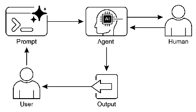

# 智能体实战之人机协同：融合人类智慧与AI能力


## 一.简介

### 人机协同的核心理念

人机协同(Human-in-the-Loop, HITL)是一种将人类智能与人工智能有机结合的战略方法，旨在充分发挥双方优势，创造超越单一系统能力的协同效应。这种模式认识到，尽管AI在数据处理、模式识别和大规模计算方面表现出色，但人类在复杂推理、道德判断、创造性思维和情境理解方面仍具有不可替代的价值。

在AI系统日益渗透到关键决策领域的今天，HITL不仅是一种技术选择，更是一种责任框架。它确保AI系统在增强人类能力的同时，始终受到人类价值观和伦理标准的引导。这种平衡在医疗诊断、金融决策、法律判断等高风险领域尤为重要，因为错误的自动化决策可能导致严重后果。

### HITL的架构与实施维度

人机协同模式可以通过多种方式实现，每种方式在不同场景下各有优势：

- **验证型协同**：人类作为AI输出的质量把关者，审查和验证系统生成的结果，确保准确性和合规性。
  
- **引导型协同**：人类主动指导AI行为，通过实时反馈和纠正来优化系统表现，这些交互数据又能反过来改进AI模型。

- **合作型协同**：人类与AI作为平等伙伴共同解决问题，通过共享界面或对话系统进行协作，各自贡献独特优势。

- **策略型协同**（人在循环外）：人类设定高层策略和边界条件，AI在这些框架内自主执行操作，适用于需要快速响应但又要保持战略一致性的场景。

### 实践应用与价值体现

HITL模式在各行业都有广泛应用，特别是在那些需要精确性、安全性和道德考量的领域：

- **医疗诊断**：AI系统可初步分析医学影像和患者数据，标记潜在异常，但最终诊断和治疗决策由专业医生做出，结合临床经验和患者具体情况。

- **金融风控**：AI算法实时监测交易模式，识别可疑活动，但复杂或高风险案例需要人类分析师进行深入调查和判断。

- **内容治理**：AI可快速处理大量内容，识别明显违规材料，但边界案例和需要文化背景理解的决策则交由人类审核员处理。

- **创意产业**：AI生成初步设计或文案，人类创意人员进行精炼和提升，确保最终作品符合品牌调性和情感需求。

### 挑战与平衡之道

尽管HITL模式带来诸多优势，但也面临一些关键挑战：

- **可扩展性限制**：人类参与虽然提高准确性，但限制了系统处理规模，需要精心设计自动化与人工干预的平衡点。

- **专业知识依赖**：HITL的有效性很大程度上取决于人类操作员的专业水平，需要持续培训和知识更新。

- **隐私与安全**：人类接触敏感数据需要严格的匿名化和访问控制机制，增加了系统复杂性。

- **延迟问题**：引入人工决策环节可能增加响应时间，需要针对不同场景设计合适的升级路径。

## 二.实战案例--人机协同医疗诊断系统
医疗领域是人机协同模式的典型应用场景，因为它完美结合了AI的计算优势与人类专家的专业判断。在医疗诊断中，AI可以快速处理大量医学数据、识别模式，但最终的诊断决策需要医生的临床经验、对患者整体情况的把握以及伦理考量。 

## 三.langchain实现 

```python
from langchain_classic.agents import create_openai_tools_agent, AgentExecutor
from langchain_core.prompts import ChatPromptTemplate, MessagesPlaceholder
from langchain_core.tools import tool
from typing import Dict, List
from datetime import datetime
from enum import Enum

from init_client import init_llm

llm = init_llm(
    temperature=0.1
)


class InteractionMode(Enum):
    """人机交互模式"""
    AI_GUIDED = "ai_guided"  # AI主导，人类监督
    HUMAN_GUIDED = "human_guided"  # 人类主导，AI辅助
    COLLABORATIVE = "collaborative"  # 平等协作


class ConfidenceLevel(Enum):
    """AI置信度级别"""
    LOW = 0.3
    MEDIUM = 0.6
    HIGH = 0.8
    VERY_HIGH = 0.95


# 医疗知识库（模拟）
class MedicalKnowledgeBase:
    def __init__(self):
        self.diseases = {
            "肺炎": {
                "symptoms": ["咳嗽", "发热", "胸痛", "呼吸困难"],
                "exams": ["胸部X光", "血常规", "C反应蛋白"],
                "treatments": ["抗生素治疗", "对症支持"],
                "confidence_factors": {
                    "咳嗽+发热": 0.7,
                    "X光斑片影": 0.9,
                    "白细胞升高": 0.8
                }
            },
            "心肌梗死": {
                "symptoms": ["胸痛", "呼吸困难", "出汗", "恶心"],
                "exams": ["心电图", "心肌酶谱", "冠脉造影"],
                "treatments": ["急诊PCI", "溶栓治疗", "抗凝治疗"],
                "confidence_factors": {
                    "剧烈胸痛": 0.8,
                    "心电图ST段抬高": 0.95,
                    "心肌酶升高": 0.9
                }
            }
        }

        self.learning_history = []  # 存储人工纠正的学习记录

    def analyze_symptoms(self, symptoms: List[str]) -> Dict:
        """AI分析症状"""
        results = []

        for disease, info in self.diseases.items():
            match_count = sum(1 for symptom in symptoms if symptom in info["symptoms"])
            total_symptoms = len(info["symptoms"])
            match_ratio = match_count / total_symptoms

            # 基于症状匹配计算初始置信度
            confidence = match_ratio * 0.7

            # 检查是否有高置信度因子
            for factor, factor_confidence in info["confidence_factors"].items():
                if any(keyword in " ".join(symptoms) for keyword in factor.split("+")):
                    confidence = max(confidence, factor_confidence)

            if confidence > ConfidenceLevel.LOW.value:
                results.append({
                    "disease": disease,
                    "confidence": confidence,
                    "matched_symptoms": [s for s in symptoms if s in info["symptoms"]],
                    "recommended_exams": info["exams"],
                    "treatments": info["treatments"]
                })

        return sorted(results, key=lambda x: x["confidence"], reverse=True)

    def learn_from_feedback(self, case_id: str, ai_diagnosis: str, human_diagnosis: str,
                            confidence: float, feedback_notes: str):
        """从人工反馈中学习"""
        learning_record = {
            "timestamp": datetime.now().isoformat(),
            "case_id": case_id,
            "ai_diagnosis": ai_diagnosis,
            "human_diagnosis": human_diagnosis,
            "ai_confidence": confidence,
            "feedback": feedback_notes,
            "correct": ai_diagnosis == human_diagnosis
        }

        self.learning_history.append(learning_record)

        # 模拟学习过程：调整置信度计算
        if not learning_record["correct"]:
            # 如果AI诊断错误，降低相似病例的置信度
            for disease in self.diseases:
                if disease == ai_diagnosis:
                    for factor in self.diseases[disease]["confidence_factors"]:
                        current_conf = self.diseases[disease]["confidence_factors"][factor]
                        self.diseases[disease]["confidence_factors"][factor] = max(0.3, current_conf - 0.1)


# 人机协同交互界面
class HumanAIInteractionInterface:
    def __init__(self):
        self.knowledge_base = MedicalKnowledgeBase()
        self.current_session = None
        self.interaction_history = []

    def start_diagnostic_session(self, patient_info: Dict, mode: InteractionMode) -> Dict:
        """开始诊断会话"""
        session_id = f"SESSION-{datetime.now().strftime('%Y%m%d%H%M%S')}"

        self.current_session = {
            "session_id": session_id,
            "patient_info": patient_info,
            "mode": mode,
            "start_time": datetime.now(),
            "symptoms": [],
            "ai_suggestions": [],
            "human_feedback": [],
            "final_diagnosis": None,
            "confidence_evolution": []
        }

        return {
            "session_id": session_id,
            "message": f"诊断会话已开始，模式：{mode.value}",
            "next_step": "请输入患者症状"
        }

    def add_symptoms(self, symptoms: List[str]) -> Dict:
        """添加症状并获取AI分析"""
        if not self.current_session:
            return {"error": "未激活的诊断会话"}

        self.current_session["symptoms"].extend(symptoms)

        # AI分析症状
        ai_analysis = self.knowledge_base.analyze_symptoms(self.current_session["symptoms"])

        # 记录AI建议
        self.current_session["ai_suggestions"] = ai_analysis

        # 计算整体置信度
        overall_confidence = ai_analysis[0]["confidence"] if ai_analysis else 0.0
        self.current_session["confidence_evolution"].append({
            "timestamp": datetime.now().isoformat(),
            "symptoms": symptoms.copy(),
            "ai_suggestions": ai_analysis.copy(),
            "confidence": overall_confidence
        })

        # 根据交互模式决定下一步
        if self.current_session["mode"] == InteractionMode.AI_GUIDED:
            if overall_confidence >= ConfidenceLevel.HIGH.value:
                return {
                    "ai_analysis": ai_analysis,
                    "confidence": overall_confidence,
                    "recommendation": "AI置信度高，建议进行相关检查",
                    "human_action_needed": "确认检查项目或提供额外信息"
                }
            else:
                return {
                    "ai_analysis": ai_analysis,
                    "confidence": overall_confidence,
                    "recommendation": "AI置信度不足，需要人工指导",
                    "human_action_needed": "请提供诊断方向或排除某些疾病"
                }

        elif self.current_session["mode"] == InteractionMode.HUMAN_GUIDED:
            return {
                "ai_analysis": ai_analysis,
                "confidence": overall_confidence,
                "message": "AI分析完成，等待人工决策",
                "human_action_needed": "请选择诊断方向或要求AI进一步分析"
            }

        else:  # COLLABORATIVE
            return {
                "ai_analysis": ai_analysis,
                "confidence": overall_confidence,
                "message": "人机协作模式，请共同讨论诊断方案",
                "collaboration_points": [
                    "AI建议的疾病可能性",
                    "需要补充的检查",
                    "诊断的不确定因素"
                ]
            }

    def provide_human_feedback(self, feedback: Dict) -> Dict:
        """提供人工反馈，AI据此调整分析"""
        if not self.current_session:
            return {"error": "未激活的诊断会话"}

        feedback_record = {
            "timestamp": datetime.now().isoformat(),
            "feedback": feedback
        }
        self.current_session["human_feedback"].append(feedback_record)

        # 根据人工反馈调整AI分析
        if "confirm_disease" in feedback:
            confirmed_disease = feedback["confirm_disease"]
            # AI学习这次确认
            if self.current_session["ai_suggestions"]:
                top_suggestion = self.current_session["ai_suggestions"][0]
                self.knowledge_base.learn_from_feedback(
                    self.current_session["session_id"],
                    top_suggestion["disease"],
                    confirmed_disease,
                    top_suggestion["confidence"],
                    feedback.get("notes", "")
                )

            self.current_session["final_diagnosis"] = confirmed_disease

            return {
                "message": f"诊断已确认为：{confirmed_disease}",
                "ai_learning": "AI已从此次反馈中学习",
                "treatment_suggestions": self.knowledge_base.diseases.get(confirmed_disease, {}).get("treatments", [])
            }

        elif "exclude_disease" in feedback:
            excluded = feedback["exclude_disease"]
            # 重新分析，排除指定疾病
            filtered_suggestions = [
                s for s in self.current_session["ai_suggestions"]
                if s["disease"] != excluded
            ]

            self.current_session["ai_suggestions"] = filtered_suggestions

            return {
                "message": f"已排除{excluded}，重新分析结果",
                "updated_suggestions": filtered_suggestions,
                "next_step": "请确认新的诊断方向"
            }

        elif "request_more_info" in feedback:
            info_type = feedback["request_more_info"]

            if info_type == "differential_diagnosis":
                # 提供鉴别诊断
                return {
                    "differential_diagnosis": [
                        s["disease"] for s in self.current_session["ai_suggestions"][:3]
                    ],
                    "comparison": self._compare_diseases(self.current_session["ai_suggestions"][:3]),
                    "human_action_needed": "请选择最可能的诊断"
                }

            elif info_type == "exam_recommendations":
                # 提供检查建议
                all_exams = set()
                for suggestion in self.current_session["ai_suggestions"]:
                    all_exams.update(suggestion["recommended_exams"])

                return {
                    "recommended_exams": list(all_exams),
                    "priority": self._prioritize_exams(self.current_session["ai_suggestions"]),
                    "human_action_needed": "请选择要进行的检查"
                }

        return {"message": "反馈已记录，AI正在调整分析"}

    def _compare_diseases(self, suggestions: List[Dict]) -> Dict:
        """比较不同疾病的特征"""
        comparison = {}
        for suggestion in suggestions:
            disease = suggestion["disease"]
            disease_info = self.knowledge_base.diseases.get(disease, {})
            comparison[disease] = {
                "key_symptoms": disease_info.get("symptoms", [])[:3],
                "definitive_exams": disease_info.get("exams", [])[:2],
                "confidence": suggestion["confidence"]
            }
        return comparison

    def _prioritize_exams(self, suggestions: List[Dict]) -> List[Dict]:
        """根据诊断可能性优先级排序检查"""
        exam_scores = {}

        for suggestion in suggestions:
            weight = suggestion["confidence"]
            for exam in suggestion["recommended_exams"]:
                exam_scores[exam] = exam_scores.get(exam, 0) + weight

        prioritized = sorted(exam_scores.items(), key=lambda x: x[1], reverse=True)
        return [{"exam": exam, "score": score} for exam, score in prioritized]

    def end_session(self, final_diagnosis: str, summary: str) -> Dict:
        """结束诊断会话"""
        if not self.current_session:
            return {"error": "未激活的诊断会话"}

        session_summary = {
            "session_id": self.current_session["session_id"],
            "duration": str(datetime.now() - self.current_session["start_time"]),
            "final_diagnosis": final_diagnosis,
            "ai_confidence_evolution": self.current_session["confidence_evolution"],
            "human_feedback_count": len(self.current_session["human_feedback"]),
            "summary": summary,
            "learning_outcome": "AI已从本次人机协作中学习"
        }

        self.interaction_history.append(session_summary)
        self.current_session = None

        return session_summary


# LangChain工具（用于更复杂的分析）
@tool
def analyze_medical_report(report_text: str) -> Dict:
    """深度分析医疗报告"""
    # 模拟深度分析
    analysis = {
        "key_findings": ["发现异常密度影", "边界不清", "大小约3cm"],
        "impressions": ["不能排除恶性肿瘤", "建议进一步检查"],
        "confidence": 0.65,
        "recommendations": ["增强CT", "活检"]
    }
    return analysis


@tool
def get_treatment_guidelines(diagnosis: str, patient_profile: Dict) -> Dict:
    """获取个性化治疗指南"""
    guidelines = {
        "standard_treatment": ["药物治疗", "定期随访"],
        "alternative_options": ["手术治疗", "放射治疗"],
        "contraindications": ["患者过敏史", "合并症"],
        "lifestyle_recommendations": ["饮食调整", "适量运动"]
    }
    return guidelines


# 创建医疗代理
medical_prompt = ChatPromptTemplate.from_messages([
    ("system", """你是一个医疗诊断AI助手，与医生协作进行诊断。请记住：

    1. 你是医生的助手，不是决策者
    2. 明确表达你的置信度
    3. 主动指出不确定性
    4. 从医生的反馈中学习
    5. 提供鉴别诊断和检查建议

    在人机协作中，保持专业、谦逊和学习的态度。"""),
    ("user", "{input}"),
    MessagesPlaceholder(variable_name="agent_scratchpad"),
])

medical_agent = create_openai_tools_agent(llm, [
    analyze_medical_report,
    get_treatment_guidelines
], medical_prompt)

medical_executor = AgentExecutor(
    agent=medical_agent,
    tools=[analyze_medical_report, get_treatment_guidelines],
    verbose=True
)


# 人机协同医疗诊断系统
class CollaborativeMedicalDiagnosisSystem:
    def __init__(self):
        self.interface = HumanAIInteractionInterface()
        self.agent_executor = medical_executor

    def demonstrate_collaborative_diagnosis(self):
        """演示完整的人机协同诊断流程"""
        print("=" * 60)
        print("人机协同医疗诊断系统演示")
        print("=" * 60)

        # 步骤1：开始诊断会话
        print("\n步骤1：开始诊断会话")
        patient_info = {
            "patient_id": "P001",
            "age": 45,
            "gender": "男",
            "medical_history": ["高血压", "吸烟史"]
        }

        session = self.interface.start_diagnostic_session(
            patient_info,
            InteractionMode.COLLABORATIVE
        )
        print(f"会话ID: {session['session_id']}")
        print(f"交互模式: {session['message']}")

        # 步骤2：输入初步症状
        print("\n步骤2：输入初步症状")
        initial_symptoms = ["胸痛", "呼吸困难"]
        result = self.interface.add_symptoms(initial_symptoms)

        print("AI分析结果:")
        for suggestion in result["ai_analysis"]:
            print(f"  - {suggestion['disease']}: 置信度 {suggestion['confidence']:.2f}")
            print(f"    匹配症状: {suggestion['matched_symptoms']}")

        print(f"\n协作要点: {result['collaboration_points']}")

        # 步骤3：人工反馈 - 请求更多信息
        print("\n步骤3：医生请求鉴别诊断")
        feedback = {
            "request_more_info": "differential_diagnosis"
        }
        more_info = self.interface.provide_human_feedback(feedback)

        print("\n鉴别诊断比较:")
        for disease, info in more_info["comparison"].items():
            print(f"\n{disease}:")
            print(f"  关键症状: {info['key_symptoms']}")
            print(f"  确诊检查: {info['definitive_exams']}")
            print(f"  AI置信度: {info['confidence']:.2f}")

        # 步骤4：医生提供额外症状
        print("\n步骤4：医生补充症状信息")
        additional_symptoms = ["出汗", "恶心"]
        result = self.interface.add_symptoms(additional_symptoms)

        print("\n更新后的AI分析:")
        for suggestion in result["ai_analysis"]:
            print(f"  - {suggestion['disease']}: 置信度 {suggestion['confidence']:.2f}")

        # 步骤5：医生确认诊断
        print("\n步骤5：医生确认诊断")
        final_feedback = {
            "confirm_disease": "心肌梗死",
            "notes": "患者症状典型，心电图支持诊断"
        }
        confirmation = self.interface.provide_human_feedback(final_feedback)

        print(f"\n{confirmation['message']}")
        print(f"治疗建议: {confirmation['treatment_suggestions']}")
        print(f"AI学习状态: {confirmation['ai_learning']}")

        # 步骤6：使用LangChain代理进行深度分析
        print("\n步骤6：使用AI代理进行深度分析")
        deep_analysis = self.agent_executor.invoke({
            "input": "患者确诊为心肌梗死，45岁男性，有高血压病史，请提供个性化治疗建议",
            "patient_profile": patient_info
        })

        print("深度分析结果:")
        print(deep_analysis["output"])

        # 步骤7：结束会话
        print("\n步骤7：结束诊断会话")
        summary = self.interface.end_session(
            "心肌梗死",
            "通过人机协作，快速准确诊断。AI初步分析，医生确认，AI学习改进。"
        )

        print(f"\n会话总结:")
        print(f"  诊断: {summary['final_diagnosis']}")
        print(f"  时长: {summary['duration']}")
        print(f"  人工反馈次数: {summary['human_feedback_count']}")
        print(f"  学习成果: {summary['learning_outcome']}")

        # 步骤8：展示AI学习效果
        print("\n步骤8：展示AI学习效果")
        print("AI学习历史记录:")
        for record in self.interface.knowledge_base.learning_history[-1:]:
            print(f"  案例: {record['case_id']}")
            print(f"  AI诊断: {record['ai_diagnosis']}")
            print(f"  人工诊断: {record['human_diagnosis']}")
            print(f"  正确性: {'✓' if record['correct'] else '✗'}")
            print(f"  反馈: {record['feedback']}")


# 运行演示
if __name__ == "__main__":
    system = CollaborativeMedicalDiagnosisSystem()
    system.demonstrate_collaborative_diagnosis()
```

## 代码解析

---

### 人机协同的五大体现

#### 1. **动态交互模式：协同角色的灵活性**

人机协同并非一成不变，而是根据任务复杂度和风险动态调整的。

```python
class InteractionMode(Enum):
    AI_GUIDED = "ai_guided"      # AI主导，人类监督
    HUMAN_GUIDED = "human_guided"  # 人类主导，AI辅助
    COLLABORATIVE = "collaborative"  # 平等协作
```

**协同体现：**
这段代码定义了三种协同模式，这是HITL设计的核心。它承认在不同场景下，人与AI的最佳角色是不同的：
*   **AI主导 (`AI_GUIDED`)**：适用于常规、高风险但模式清晰的场景。AI快速处理，人类把关，确保效率和安全。
*   **人类主导 (`HUMAN_GUIDED`)**：适用于复杂、罕见或需要深度经验的场景。人类专家设定方向，AI提供数据支持和辅助分析。
*   **平等协作 (`COLLABORATIVE`)**：最理想的协同状态。AI和人类像两位专家一样讨论，AI提供数据驱动的洞察，人类贡献经验和直觉，共同达成最佳决策。

代码通过 `start_diagnostic_session` 方法允许在启动会话时就选择协同模式，体现了系统设计的灵活性。

---

#### 2. **双向反馈循环：协同的核心机制**

这是HITL的“循环”所在，也是区别于单向AI工具的关键。

```python
def provide_human_feedback(self, feedback: Dict) -> Dict:
    # ...
    if "confirm_disease" in feedback:
        # AI学习这次确认
        self.knowledge_base.learn_from_feedback(...)
    elif "exclude_disease" in feedback:
        # 重新分析，排除指定疾病
        filtered_suggestions = [...]
    # ...
```

**协同体现：**
这里的 `provide_human_feedback` 方法是协同的枢纽。它不是简单地让人类“批准”或“拒绝”，而是允许人类进行**有指导意义的干预**：
*   **确认**：人类告诉AI“你对了”，AI通过 `learn_from_feedback` 强化这种正确的关联。
*   **排除**：人类告诉AI“你错了，不是这个病”，AI会立即从候选列表中移除，并重新计算其他可能性。
*   **请求更多信息**：人类可以要求AI提供“鉴别诊断”或“检查建议”，AI则根据当前分析结果，生成结构化的对比信息供人类参考。

这个循环是**智能的**：AI不仅仅是被动接收，它会根据反馈**调整其内部状态和后续行为**，形成一个真正的“学习-适应”闭环。

---

#### 3. **透明性与可解释性：建立协同信任的基础**

人类无法与一个“黑箱”有效协作。AI必须让人类理解它的“思考过程”。

```python
self.current_session["confidence_evolution"].append({
    "timestamp": datetime.now().isoformat(),
    "symptoms": symptoms.copy(),
    "ai_suggestions": ai_analysis.copy(),
    "confidence": overall_confidence
})

def _compare_diseases(self, suggestions: List[Dict]) -> Dict:
    # ...
    comparison[disease] = {
        "key_symptoms": disease_info.get("symptoms", [])[:3],
        "definitive_exams": disease_info.get("exams", [])[:2],
        "confidence": suggestion["confidence"]
    }
```

**协同体现：**
*   **置信度透明**：AI每次分析都会给出明确的置信度分数 (`confidence`)。当置信度高时，人类可以更放心地采纳建议；当置信度低时，人类就知道需要更加警惕和深入介入。
*   **推理过程展示**：`_compare_diseases` 方法将不同疾病的可能性、关键症状和确诊检查并列呈现。这相当于AI在说：“我认为可能是A、B、C三种病，因为它们都符合这些症状，但A的匹配度最高。要确诊A，建议做X检查；要排除B，建议做Y检查。”
*   **演化历史记录**：`confidence_evolution` 记录了整个诊断过程中AI置信度的变化，让人类可以追溯AI的判断是如何随着新信息的加入而演变的。

这种透明度让人类专家能够**基于AI的推理，而不是盲从AI的结论**来做出最终决策，这是高效协同的基石。

---

#### 4. **协作式决策制定：1+1>2的智慧涌现**

协同的最终目的是做出比任何一方单独决策都更好的结果。

```python
# 步骤3：人工反馈 - 请求更多信息
feedback = {"request_more_info": "differential_diagnosis"}
more_info = self.interface.provide_human_feedback(feedback)

# 步骤5：医生确认诊断
final_feedback = {
    "confirm_disease": "心肌梗死",
    "notes": "患者症状典型，心电图支持诊断"
}
```

**协同体现：**
在演示流程中，我们看到了一个典型的协作决策过程：
1.  **AI初步分析**：基于“胸痛、呼吸困难”，AI给出几种可能。
2.  **人类引导深入**：医生没有直接拍板，而是要求AI提供“鉴别诊断”，利用AI的分析能力来拓宽思路。
3.  **信息补充与再分析**：医生补充“出汗、恶心”等关键信息，AI更新分析，心肌梗死的置信度显著提升。
4.  **人类最终决断**：结合AI的分析和自己的专业知识（如心电图结果），医生做出最终诊断。

这个过程不是AI代替医生，也不是医生无视AI。而是**AI充当了不知疲倦的数据分析师和知识检索器，医生则作为经验丰富的战略决策者**，两者结合，实现了速度、广度和深度的统一。

---

#### 5. **持续学习与进化：协同系统的长期价值**

一个优秀的HITL系统，其价值会随着使用时间的增长而增长。

```python
class MedicalKnowledgeBase:
    def __init__(self):
        # ...
        self.learning_history = []  # 存储人工纠正的学习记录

    def learn_from_feedback(self, ...):
        # ...
        if not learning_record["correct"]:
            # 如果AI诊断错误，降低相似病例的置信度
            for factor in self.diseases[disease]["confidence_factors"]:
                # ... 调整置信度计算
```

**协同体现：**
`MedicalKnowledgeBase` 类的设计是点睛之笔。它将每一次人机协同的成果都转化为系统进化的动力：
*   **记录历史**：每一次人类的纠正都被记录在 `learning_history` 中，形成宝贵的“教材”。
*   **模型自调整**：当AI诊断错误时，`learn_from_feedback` 方法会动态调整内部疾病模型中相关症状的“权重”（`confidence_factors`）。例如，如果AI多次将“非典型胸痛”误判为心肌梗死，系统就会降低“胸痛”这一症状对心肌梗死诊断的权重。

这意味着，**每一位使用这个系统的医生，都在无形中“训练”和“优化”这个AI Agent**。系统不再是静态的，而是在与人类专家的持续协作中，变得越来越聪明、越来越可靠。

---

### 协同流程可视化

为了更直观地理解，我们可以将整个协同过程抽象为以下流程：

```
[开始诊断会话]
       |
       v
[选择协同模式] ---> (AI主导 / 人类主导 / 协作)
       |
       v
[输入患者信息/症状]
       |
       v
+-----------------+
| AI Agent 分析   |
| - 计算置信度    |
| - 生成候选诊断  |
| - 提供检查建议  |
+-----------------+
       |
       v
[呈现AI分析结果 (透明化)]
       |
       v
+-----------------+
| 人类专家介入     |
| - 确认/排除诊断  |
| - 补充信息       |
| - 请求深度分析   |
+-----------------+
       |
       v
[AI接收反馈并调整]
       |
       +---[是]---> [AI学习并更新知识库] ---+
       |                                   |
       v                                   |
[最终诊断是否确定?] <----------------------+
       |
       +---[否]---> (返回分析步骤，形成循环)
       |
       v
[结束会话，记录协同成果]
```

### 结论

此案例通过**动态的角色分配、智能的反馈循环、彻底的透明度、深度的决策融合和持续的自学习机制**，完美诠释了现代Agent人机协同的先进理念。它所构建的不是一个冷冰冰的工具，而是一个有“记忆”、会“学习”、能“沟通”的智能伙伴。这正是人机协同模式的终极目标：**让AI增强人类，让人类指引AI，共同创造超越个体能力的智慧与价值。**
