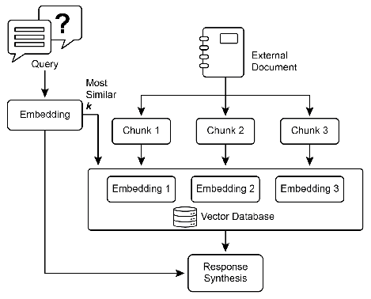

# 智能体实战之检索增强生成（RAG）：让AI基于事实进行思考 

## 一.简介

---

大型语言模型（LLM）的强大能力受限于其静态的训练数据。检索增强生成（RAG）技术正是为了突破这一限制，它通过将 LLM 与外部知识库动态连接，使其在生成答案前能先“查阅”相关资料，从而极大地提升了回答的准确性、时效性和可信度。

### **核心工作原理**

RAG 的核心机制是将信息检索与文本生成无缝结合：
1.  **知识准备**：首先，将海量文档分解成有意义的“块”，并通过“嵌入”技术将这些文本块转换为高维向量。这些向量被存储在专门的向量数据库中，实现了基于语义而非关键字的智能检索。
2.  **智能检索**：当用户提问时，系统会将问题也转换为向量，并在数据库中快速查找语义最相近的文本块。
3.  **增强生成**：最后，这些检索到的信息作为上下文与原始问题一同提交给 LLM，从而生成基于事实的精准回答，并能提供信息来源。

### **RAG 的典型开发流程**

构建一个高效的 RAG 系统通常遵循一个迭代的开发流程：

1.  **数据准备与预处理**：
    *   **数据收集**：确定并整合所有外部知识来源，如内部文档、网页、数据库等。
    *   **文档分块**：将大型文档切分成更小、更集中的信息块。分块策略（如按段落、按章节）至关重要，它直接影响后续检索的精准度和上下文的完整性。

2.  **嵌入与索引**：
    *   **向量化**：选择一个合适的嵌入模型，将所有文本块转换成高维向量。
    *   **构建索引**：将这些向量存储在向量数据库中。这个“索引”过程是为了实现毫秒级的快速搜索，是系统性能的基础。

3.  **检索与生成**：
    *   **查询处理**：接收用户查询，并将其转换为向量。
    *   **相似性搜索**：在向量数据库中，查询与用户问题向量最相似的 Top K 个文本块。
    *   **提示增强**：将原始问题和检索到的文本块组合成一个丰富的提示。
    *   **答案生成**：将增强后的提示发送给 LLM，生成最终的答案。

4.  **评估与优化**：
    *   这是一个持续的循环。需要评估系统表现，包括检索到的信息是否相关，以及最终答案是否准确、全面。
    *   根据评估结果，回头优化各个环节，例如调整分块大小、更换嵌入模型或优化提示词，以不断提升系统性能。

### **核心价值与应用场景**

RAG 的价值在于它让 AI 能够回答基于最新事实的问题（如实时新闻），有效减少了模型“幻觉”的产生。更重要的是，它赋予了 AI 访问私有数据的能力，使其在企业级应用中大放异彩，例如：
*   **企业知识库**：构建智能问答系统，快速检索公司政策、技术文档。
*   **客户支持**：打造精准的客服机器人，自动解答产品使用问题。
*   **个性化推荐**：基于用户历史和偏好，提供更贴合其需求的内容。

### **演进与挑战**

尽管标准 RAG 功能强大，但在处理分散或矛盾的信息时仍面临挑战。为此，RAG 正在向更高级的形态演进：

*   **light RAG**：利用知识图谱连接实体关系，擅长综合来自多个文档的复杂信息，但构建和维护成本高昂。
*   **Agentic RAG**：引入智能代理进行多步推理、信息验证和工具调用（如实时搜索），能主动解决信息冲突和知识盲区，但系统更复杂、延迟更高。

总之，RAG 通过赋予 LLM 动态检索和验证信息的能力，正将其从一个对话工具转变为能够执行复杂任务的可靠智能体。

## 二.实战案例--pdf多模态rag问答
### 项目地址
https://github.com/jiangnanboy/pdf_multimodal_rag

### 项目简介
本项目对PDF文件进行解析，对其中的图、表以及文本进行Embedding化，并进行存储。根据用户query进行检索，将检索后的结果(包括图表和文本)和query输送到多模态LLM,

项目主要包含pdf解析，表格检测，文本和图表的embedding化，向量存储，向量检索，LLM问答等部分。

### 项目功能
1. pdf文字及图解析
2. pdf表格检测
3. text/image/table embedding
4. embedding存储(embedding store)
5. embedding检索(embedding retriever)
6. LLM问答(LLM QA)
