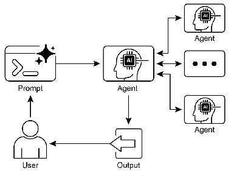

# 智能体实战之A2A——构建agent协作生态系统的通用语言


## 一.简介

在当今的 AI 领域，单个 AI Agent（智能体）虽然在特定任务上表现出色，但它们如同孤岛，难以独立应对需要多领域知识、多步骤协作的复杂挑战。为了打破这些壁垒，让 AI 智能体能够协同工作，形成强大的集体智慧，**Agent 间通信（A2A）协议**应运而生。它旨在建立一个开放、标准的沟通桥梁，使得无论底层技术栈是 LangChain、CrewAI 还是 Google ADK，不同的智能体都能无缝对话、共享信息、委派任务。

**A2A 的核心愿景**是创建一个互操作的 AI 生态系统。它得到了众多行业巨头的支持，包括 Atlassian、Salesforce、SAP 等，并且 Microsoft 也计划将其集成到 Azure AI Foundry 中，这预示着一个更加开放和协作的 AI 未来正在形成。作为一个开源协议，A2A 鼓励全球开发者共同参与其演进。

### A2A 的基石：协作的核心要素

A2A 协议的运作依赖于几个关键概念，它们共同构成了智能体协作的框架：

1.  **角色定义与数字身份**
    *   **参与者**：协作场景中主要有三方：发起请求的**用户**、代表用户向其他智能体寻求帮助的**客户端智能体**，以及提供特定能力服务的**服务器智能体**。服务器智能体被视为一个“黑盒”，客户端无需关心其内部实现，只需知道它能做什么。
    *   **Agent 卡片**：每个智能体都有一张“数字名片”，通常是一个 JSON 文件。这张卡片详细描述了智能体的身份、服务地址、支持的功能（如流式响应）、所具备的“技能”、输入输出格式以及身份验证方式。它是其他智能体发现和与之交互的依据。

2.  **发现与连接**
    *   **智能体发现**：客户端如何找到合适的服务器智能体？A2A 提供了多种发现机制：
        *   **知名路径**：智能体在标准的网络路径（如 `/.well-known/agent.json`）上托管其卡片，便于自动化发现。
        *   **注册中心**：在企业环境中，可以建立一个集中的“智能体黄页”，方便管理和查询。
        *   **直接配置**：对于紧密耦合的系统，可以直接在客户端配置服务器智能体的卡片信息。

3.  **协作工作流与交互模式**
    *   **任务与消息**：A2A 的所有协作都围绕“任务”展开。任务是一个异步的工作单元，拥有唯一 ID 和状态（如“已提交”、“处理中”、“已完成”）。智能体之间通过结构化的“消息”进行通信，消息包含元数据和实际内容（文本、文件等）。任务产生的最终或中间结果称为“工件”。
    *   **交互模式**：根据任务性质，A2A 提供了灵活的交互方式：
        *   **同步请求/响应**：适用于快速、即时完成的任务，客户端发送请求后等待完整结果。
        *   **异步轮询**：对于耗时较长的任务，客户端提交任务后可立即获得任务 ID，然后定期查询任务状态。
        *   **流式更新**：通过服务器发送事件（SSE），服务器可以持续向客户端推送实时、增量式的结果，非常适合生成式 AI 的场景。
        *   **推送通知**：对于极长时间运行的任务，客户端可以提供一个 Webhook URL，当任务完成或出现重大状态变化时，服务器会主动通知客户端。

4.  **安全基石**
    *   安全是协作的命脉。A2A 内置了多层安全机制，包括使用双向 TLS 加密通信通道、全面记录交互日志以便审计、在 Agent 卡片中明确身份验证要求，以及通过标准 HTTP 头安全地传递 API 密钥或 OAuth 令牌。

### A2A 与 MCP 的关系

A2A 协议与 Anthropic 的模型上下文协议（MCP）是互补的。**MCP** 专注于解决单个智能体如何高效地与外部工具和数据源“对话”以构建其上下文。而 **A2A** 则专注于解决智能体与智能体之间如何“对话”以实现任务委派和协作。简而言之，MCP 连接智能体与工具，A2A 连接智能体与智能体。

---

## 实践案例：多智能体研究报告生成系统
利用2个agent实现多智能体研究报告生成系统

## A2A-server实现
```python
from fastapi import FastAPI, HTTPException, Header
from langchain_classic.agents import AgentExecutor, initialize_agent, AgentType
from langchain_core.prompts import PromptTemplate
from langchain_core.tools import Tool
from pydantic import BaseModel
from typing import List, Optional, Literal


# --- 1. A2A 消息结构定义 (使用 Pydantic 进行验证) ---
from init_client import init_llm


class A2AMessagePart(BaseModel):
    type: str
    text: Optional[str] = None


class A2AMessage(BaseModel):
    role: Literal["user", "assistant"]
    parts: List[A2AMessagePart]


class A2ARequestParams(BaseModel):
    id: str
    message: A2AMessage


class A2ARequest(BaseModel):
    jsonrpc: Literal["2.0"] = "2.0"
    id: str
    method: Literal["sendTask"]
    params: A2ARequestParams


class A2AResponseResult(BaseModel):
    taskId: str
    status: dict
    message: A2AMessage


class A2AResponse(BaseModel):
    jsonrpc: Literal["2.0"] = "2.0"
    id: str
    result: A2AResponseResult


# --- 2. 初始化 LangChain 研究员 Agent ---
try:
    llm = init_llm(temperature=0)

    # 创建一个简单的"研究"工具，实际上只是让LLM基于其训练数据回答
    research_prompt = PromptTemplate.from_template(
        "作为一个专业研究员，请提供关于以下主题的最新信息和进展：{topic}\n\n"
        "请提供详细、准确的信息，包括关键概念、最新发展和重要事件。"
    )


    def research_function(topic: str) -> str:
        """研究一个主题并提供相关信息"""
        return llm.invoke(research_prompt.format(topic=topic))


    tools = [
        Tool(
            name="Research",
            func=research_function,
            description="研究一个主题并提供相关信息"
        )
    ]

    # 使用 ReAct 框架创建一个能够思考和行动的 Agent
    agent_executor: AgentExecutor = initialize_agent(
        tools,
        llm,
        agent=AgentType.ZERO_SHOT_REACT_DESCRIPTION,
        verbose=True,
        handle_parsing_errors=True,
        max_execution_time=60,
    )
    print("LangChain agent initialized successfully.")
except Exception as e:
    print(f"Error initializing LangChain agent: {e}")
    agent_executor = None

# --- 3. 创建 FastAPI 应用 ---
app = FastAPI(
    title="Research Agent A2A Server",
    description="An A2A server that provides research capabilities."
)

# 模拟的 API Key 存储
VALID_A2A_API_KEY = "fjroejg50j34hg50"


# A2A 端点，用于处理任务
@app.post("/a2a", response_model=A2AResponse)
async def handle_a2a_request(
        request: A2ARequest,
        authorization: str = Header(None, description="Expected format: 'Bearer <API_KEY>'")
):
    # 1. 身份验证
    if not authorization or f"Bearer {VALID_A2A_API_KEY}" != authorization:
        raise HTTPException(status_code=401, detail="Invalid or missing API Key")

    if not agent_executor:
        raise HTTPException(status_code=503, detail="Agent executor is not available.")

    # 2. 解析请求
    if request.method != "sendTask":
        raise HTTPException(status_code=400, detail="Unsupported method")

    task_id = request.params.id
    user_message = ""
    # 从 A2A 消息结构中提取文本
    for part in request.params.message.parts:
        if part.type == "text" and part.text:
            user_message = part.text
            break

    print(f"[Server] Received task '{task_id}': {user_message}")

    # 3. 调用 LangChain Agent 执行任务
    try:
        # 使用 ainvoke 进行异步调用
        result = await agent_executor.ainvoke({"input": user_message})
        response_text = result['output']
    except Exception as e:
        print(f"[Server] Agent execution failed: {e}")
        raise HTTPException(status_code=500, detail=f"Agent execution failed: {e}")

    # 4. 封装 A2A 响应
    a2a_response = A2AResponse(
        id=request.id,
        result=A2AResponseResult(
            taskId=task_id,
            status={"state": "completed"},
            message=A2AMessage(
                role="assistant",
                parts=[A2AMessagePart(type="text", text=response_text)]
            )
        )
    )
    print(f"[Server] Sending response for task '{task_id}'.")
    return a2a_response


if __name__ == "__main__":
    import uvicorn

    print("Starting Research Agent Server on http://127.0.0.1:8001")
    uvicorn.run(app, host="127.0.0.1", port=8001)
```

## A2A-client实现
```python
import asyncio
import httpx

# --- 1. 初始化写作者 Agent 的 LLM ---
from init_client import init_llm

try:
    writer_llm = init_llm(temperature=0.7)
except Exception as e:
    print(f"Error initializing writer LLM: {e}")
    writer_llm = None


# --- 2. 定义 A2A 客户端逻辑 ---
async def run_writer_agent():
    if not writer_llm:
        print("Writer LLM is not available. Exiting.")
        return

    # A2A 服务器配置
    server_url = "http://127.0.0.1:8001/a2a"
    api_key = "fjroejg50j34hg50"
    headers = {"Authorization": f"Bearer {api_key}", "Content-Type": "application/json"}

    # 用户请求
    user_topic = "最新的量子计算进展"
    print(f"用户请求: 撰写一份关于 '{user_topic}' 的报告。")
    print("-" * 30)

    # 步骤 1: 写作者 Agent 向研究员 Agent 发送 A2A 请求
    research_request_payload = {
        "jsonrpc": "2.0",
        "id": "req-001",
        "method": "sendTask",
        "params": {
            "id": "task-research-001",
            "message": {
                "role": "user",
                "parts": [
                    {
                        "type": "text",
                        "text": f"请搜索关于 '{user_topic}' 的最新信息，总结关键突破和重要发现。"
                    }
                ]
            }
        }
    }

    research_data = "未能获取到研究数据。"

    # --- 1: 增加超时时间 ---
    # 将超时时间设置为 3 分钟 (180秒)，给 Agent 充足的时间
    async with httpx.AsyncClient(timeout=180.0) as client:
        try:
            print("[Writer Agent] 正在向研究员 Agent 请求数据...")
            response = await client.post(server_url, json=research_request_payload, headers=headers)
            response.raise_for_status()  # 如果状态码不是 2xx，则引发异常

            response_json = response.json()
            # 检查 JSON-RPC 是否有错误
            if "error" in response_json:
                print(f"[Writer Agent] 研究员 Agent 返回错误: {response_json['error']}")
            else:
                # 从 A2A 响应中提取研究数据
                research_data = response_json.get("result", {}).get("message", {}).get("parts", [{}])[0].get("text", "")
                print("[Writer Agent] 成功获取研究数据。")
                print("\n--- 来自研究员 Agent 的原始数据 ---\n")
                print(research_data)
                print("\n" + "-" * 30 + "\n")

        # --- 2: 捕获并打印更详细的错误 ---
        except httpx.HTTPStatusError as e:
            print(f"\n[Writer Agent] HTTP 错误: {e.response.status_code} {e.response.reason_phrase}")
            print(f"[Writer Agent] 服务器响应内容: {e.response.text}")
        except httpx.RequestError as e:
            # 这将捕获连接错误、超时等
            print(f"\n[Writer Agent] 请求失败: {type(e).__name__}: {e}")
        except Exception as e:
            print(f"\n[Writer Agent] 处理响应时发生未知错误: {type(e).__name__}: {e}")

    # 步骤 2: 写作者 Agent 基于获取的数据撰写报告
    if research_data != "未能获取到研究数据。":
        print("[Writer Agent] 正在基于数据撰写报告...")
        writer_prompt = f"""
        你是一位专业的科技报告写作者。你的任务是基于下面提供的研究数据，撰写一份关于 '{user_topic}' 的简洁、清晰、结构化的报告。
        报告应包含引言、关键进展总结和结论。

        --- 研究数据 ---
        {research_data}
        --- 数据结束 ---

        请开始撰写报告：
        """

        final_report = await writer_llm.ainvoke(writer_prompt)

        print("\n--- 最终报告 ---\n")
        print(final_report)
    else:
        print("[Writer Agent] 由于无法获取研究数据，报告撰写失败。")


if __name__ == "__main__":
    asyncio.run(run_writer_agent())
```

## 代码解析

### A2A 核心思想回顾

A2A 的核心是**标准化**和**任务委派**。它定义了一套通用的通信协议（如 JSON-RPC over HTTP），使得一个 AI Agent（客户端）可以像调用 API 一样，向另一个 AI Agent（服务器）请求服务，而无需了解其内部实现细节（例如，它是用 LangChain、CrewAI 还是其他框架构建的）。

---

### 服务器代码解析 (`research_agent_server.py`)

服务器代码扮演了 **A2A 服务器** 的角色。它是一个专门提供“研究”能力的 AI Agent，对外暴露一个标准的 A2A 接口。

#### 1. A2A 通信契约定义

```python
# --- 1. A2A 消息结构定义 (使用 Pydantic 进行验证) ---
class A2ARequest(BaseModel):
    jsonrpc: Literal["2.0"] = "2.0"
    id: str
    method: Literal["sendTask"]
    params: A2ARequestParams
# ... (A2AResponse, A2AMessage 等)
```

*   **代码作用**：这些 Pydantic 类定义了客户端和服务器之间交换数据的严格格式。`A2ARequest` 定义了请求的结构，`A2AResponse` 定义了响应的结构。
*   **A2A 突出**：这正是 A2A 协议的**“语言”**。通过定义这个标准化的“通信契约”，任何能理解这个契约的客户端都可以与这个服务器通信。这确保了**互操作性**，是 A2A 的基石。`jsonrpc: "2.0"` 和 `method: "sendTask"` 都是协议规范的一部分。

#### 2. 专业化 Agent 的实现

```python
# --- 2. 初始化 LangChain 研究员 Agent ---
try:
    llm = init_llm(temperature=0)
    tools = [Tool(name="Research", ...)]
    agent_executor: AgentExecutor = initialize_agent(...)
except Exception as e:
    # ...
```

*   **代码作用**：这部分代码使用 LangChain 框架创建了一个具有“研究”能力的 AI Agent。它有自己的 LLM、工具和执行逻辑。
*   **A2A 突出**：这代表了 A2A 模型中的**服务器 Agent**。它是一个“不透明”的服务提供者。客户端不需要知道它内部使用了 LangChain 的 ReAct 框架，只需要知道它能完成“研究”任务。A2A 协议将 Agent 的**内部实现**与**对外服务**完全解耦。

#### 3. A2A 通信端点

```python
# --- 3. 创建 FastAPI 应用 ---
app = FastAPI(...)

@app.post("/a2a", response_model=A2AResponse)
async def handle_a2a_request(...):
```

*   **代码作用**：使用 FastAPI 创建了一个 HTTP 服务器，并定义了一个 `/a2a` 端点来监听 POST 请求。
*   **A2A 突出**：A2A 协议通常建立在 HTTP(S) 这样的标准传输层之上。这个 `/a2a` 端点就是这个服务器 Agent 在网络世界的“地址”或“门牌号”，其他 Agent 可以通过这个地址找到它并发起通信。

#### 4. 核心通信逻辑：验证、解析、执行、封装

```python
# 1. 身份验证
if not authorization or f"Bearer {VALID_A2A_API_KEY}" != authorization:
    raise HTTPException(status_code=401, detail="Invalid or missing API Key")

# 2. 解析请求
user_message = ""
for part in request.params.message.parts:
    if part.type == "text" and part.text:
        user_message = part.text
        break

# 3. 调用 LangChain Agent 执行任务
result = await agent_executor.ainvoke({"input": user_message})

# 4. 封装 A2A 响应
a2a_response = A2AResponse(
    id=request.id,
    result=A2AResponseResult(
        taskId=task_id,
        status={"state": "completed"},
        message=A2AMessage(...)
    )
)
```

*   **代码作用**：这是 A2A 交互的核心流程。
    1.  **身份验证**：检查请求头中的 `Authorization`，确保调用者是可信的。这是 A2A **安全性**的体现。
    2.  **解析请求**：从标准化的 `A2ARequest` 对象中提取出真正的用户指令（`user_message`）。这是对 A2A 协议的**解封**过程。
    3.  **执行任务**：将指令交给内部的 LangChain Agent 去处理。这是**任务委派**的执行环节。
    4.  **封装响应**：将 Agent 的处理结果，按照 `A2AResponse` 的格式重新打包。这是对 A2A 协议的**封装**过程。
*   **A2A 突出**：这个流程完美展示了 A2A 服务器如何处理一个标准化的请求。它像一名翻译官，将外部的 A2A“语言”翻译成内部 Agent 能理解的指令，执行完毕后，再将结果翻译回 A2A“语言”返回给调用方。

---

### 客户端代码解析 (`writer_agent_client.py`)

客户端代码扮演了 **A2A 客户端** 的角色。它代表用户，负责协调整个流程，并在需要时将任务委派给专门的 Agent。

#### 1. 客户端 Agent 的角色

```python
# --- 1. 初始化写作者 Agent 的 LLM ---
try:
    writer_llm = init_llm(temperature=0.7)
# ...
```

*   **代码作用**：客户端本身也是一个 AI Agent（写作者 Agent），它有自己的 LLM，用于最终的报告撰写。
*   **A2A 突出**：这代表了 A2A 模型中的**客户端 Agent**。它不直接执行所有任务，而是扮演一个“协调者”或“管理者”的角色。它知道自己的能力（写作），也知道何时需要求助其他 Agent（研究）。

#### 2. A2A 任务的构建与发送

```python
# 步骤 1: 写作者 Agent 向研究员 Agent 发送 A2A 请求
research_request_payload = {
    "jsonrpc": "2.0",
    "id": "req-001",
    "method": "sendTask",
    "params": {
        "id": "task-research-001",
        "message": {
            "role": "user",
            "parts": [{"type": "text", "text": f"请搜索关于 '{user_topic}' 的最新信息..."}]
        }
    }
}

async with httpx.AsyncClient(timeout=180.0) as client:
    response = await client.post(server_url, json=research_request_payload, headers=headers)
```

*   **代码作用**：
    1.  **构建请求**：客户端代码手动创建了一个符合 `A2ARequest` 结构的 Python 字典。它明确指定了 `method` 为 `sendTask`，并将用户的查询包装在 `message.parts` 中。
    2.  **发送请求**：使用 `httpx` 库，通过 HTTP POST 方法将这个 JSON 格式的请求发送到服务器 Agent 的地址 (`/a2a`)。同时，在请求头中附带了用于身份验证的 `Authorization` 信息。
*   **A2A 突出**：这是 A2A 客户端最核心的动作——**发起任务委派**。它没有自己去做研究，而是遵循 A2A 协议，向一个专业的服务提供者（服务器 Agent）发出了一个标准化的工作请求。

#### 3. A2A 响应的接收与整合

```python
response_json = response.json()
# 从 A2A 响应中提取研究数据
research_data = response_json.get("result", {}).get("message", {}).get("parts", [{}])[0].get("text", "")

# 步骤 2: 写作者 Agent 基于获取的数据撰写报告
final_report = await writer_llm.ainvoke(writer_prompt)
```

*   **代码作用**：
    1.  **接收响应**：客户端接收到服务器返回的 HTTP 响应，并将其从 JSON 格式解析为 Python 对象。
    2.  **提取数据**：它知道如何从 `A2AResponse` 的标准结构中（`result.message.parts[0].text`）提取出它需要的研究数据。
    3.  **整合**：客户端使用自己的 LLM，将获取到的 `research_data` 作为上下文，生成最终的报告。
*   **A2A 突出**：这展示了 A2A 协作的闭环。客户端成功接收并理解了服务器 Agent 的返回结果，并将其作为自己工作流程的一部分，最终完成了用户交付的原始任务。这体现了 Agent 间的**无缝协作**。

### 总结：A2A 如何将两者联系起来

整个流程清晰地展示了 A2A 的价值：

1.  **专业化**：研究员 Agent 专注于信息检索，写作者 Agent 专注于内容生成。
2.  **解耦**：写作者 Agent 无需关心研究员 Agent 是如何工作的（是搜索网络还是查询数据库），只需知道它能提供所需信息。
3.  **标准化**：两者通过 `A2ARequest` 和 `A2AResponse` 这个“通用语言”进行交流，避免了自定义协议的复杂性和不兼容性。
4.  **任务委派**：核心交互模式。一个 Agent 将自己不擅长或耗时的工作，委派给另一个更专业的 Agent。

最终，两个简单的 Agent 通过 A2A 协议组合在一起，完成了一个更复杂的、端到端的任务，其能力远超任何一个单独的 Agent。这就是 A2A 协议所倡导的构建模块化、可扩展的 AI 系统的核心思想。

