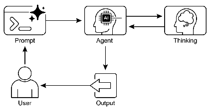

# 智能体实战之高级推理方法：重新思考与实现 


## 一.简介

### 智能Agent的推理革命

现代AI系统正经历从被动工具到主动问题解决者的转变。这种转变的核心在于高级推理方法的发展，使Agent能够处理需要多步骤逻辑和战略规划的复杂任务。传统AI模型往往只能提供直接的答案，而高级推理方法则赋予Agent"思考"的能力，使其能够分解问题、评估多种解决方案，并在必要时调整策略。

这些高级推理方法的关键在于将计算资源分配给推理过程本身，而不仅仅是模型的初始训练。通过给予Agent更多的处理时间或推理步骤，系统能够进行迭代改进、探索多种解决方案，并利用外部工具来增强其能力。这种延长推理时间的方法显著提升了Agent在处理复杂问题时的准确性、连贯性和鲁棒性。

### 高级推理的核心技术

#### 1. 分步推理技术

分步推理是高级Agent的基础能力，它允许模型将复杂问题分解为更小、更易管理的子问题。与直接生成最终答案不同，分步推理使Agent能够展示其内部思考过程，提高透明度和可解释性。

思维链(Chain-of-Thought, CoT)是这一技术的典型代表，它引导模型生成一系列中间推理步骤，而非直接输出最终答案。这种方法显著提升了模型在算术计算、常识推理和符号操作等任务上的表现。

思维树(Tree-of-Thought, ToT)则进一步扩展了这一概念，允许模型探索多个推理路径，形成树状结构。这种方法支持回溯、自我纠正和探索替代解决方案，特别适用于需要战略规划和决策的复杂任务。

#### 2. 自我纠正与迭代改进

自我纠正是Agent推理过程中的关键环节，它使模型能够评估其生成内容和中间思考过程，识别模糊性、信息缺口或不准确性。通过审查和改进的迭代循环，Agent可以调整方法、提升响应质量，并在提供最终输出前确保准确性和完整性。

这种内部批评机制增强了Agent产生可靠和高质量结果的能力，使其能够在没有人类干预的情况下改进自身输出。

#### 3. 混合推理系统

程序辅助语言模型(PALMs)将LLM与符号推理能力相结合，允许模型在问题解决过程中生成和执行代码。这种集成将复杂的计算、逻辑操作和数据操作卸载到确定性编程环境中，利用传统编程的优势来处理LLM在准确性或一致性方面可能存在局限的任务。

#### 4. 交互式推理框架

ReAct(推理和行动)框架将思维链提示与Agent通过工具与外部环境交互的能力相结合。Agent首先对要采取哪些行动进行推理，然后执行工具或函数调用，如查询数据库、执行计算或与API交互。这种"思考、行动、观察、思考…"的迭代循环允许Agent动态调整计划、纠正错误并实现需要与环境进行多次交互的目标。

#### 5. 协作推理系统

辩论链(Chain of Debates, CoD)和辩论图(Graph of Debates, GoD)代表了多Agent协作推理的先进方法。在这些框架中，多个不同的模型协作和争论以解决问题，通过集体智慧提高准确性、减少偏见并改善最终答案的整体质量。

### 实际应用领域

高级推理方法在多个领域展现出巨大潜力：

1. **复杂问答系统**：处理需要整合不同来源数据的多跳查询，检查多个推理路径以综合信息。

2. **数学问题解决**：将复杂数学问题分解为更小、可解决的组件，展示逐步解题过程，并使用代码执行进行精确计算。

3. **代码开发与调试**：解释生成或修改代码的理由，按顺序识别潜在问题，并根据测试结果迭代改进代码。

4. **战略规划**：通过对各种选项、后果和前提条件进行推理，协助制定全面计划，并根据实时反馈调整策略。

5. **专业领域分析**：在医疗诊断、法律分析等领域，帮助评估症状、检查结果和病史以达成诊断，或分析法律文件和先例以构建论点。

## 二.实践案例：内部知识库的法律分析助手
在法律领域，分析一个案件远不止是简单的信息检索。它要求律师或法律专家：

    解构案情：从复杂的叙述中提取关键事实。 
    识别法律问题：确定适用的法律领域（如合同法、侵权法）和具体争议点。 
    研究先例：查找相关的法律法规、判例和学术解释。 
    构建论点：基于事实和法律，构建一个逻辑严密、有说服力的法律论点。 
    自我批判：预见并反驳对方可能提出的论点，检查自身逻辑的漏洞。

## 三.langchain实现
```python
from langchain_classic.agents import create_react_agent, AgentExecutor
from langchain_core.prompts import PromptTemplate
from langchain_core.tools import Tool

from init_client import init_llm

# --- 定义模拟知识库和工具---
legal_knowledge_base = {
    "合同违约": "合同违约是指合同当事人一方或双方不履行合同义务或履行合同义务不符合约定的行为。违约方应当承担继续履行、采取补救措施或者赔偿损失等违约责任。",
    "根本违约": "根本违约是指一方的违约行为严重影响了另一方订立合同时所期望的经济利益。在此情况下，守约方有权解除合同，并要求违约方承担违约责任。",
    "合同变更": "合同变更需经合同双方当事人协商一致。如果一方主张合同内容发生变更，该方负有举证责任，需提供证据（如书面协议、邮件等）证明双方已就变更内容达成合意。",
    "损害赔偿": "违约损害赔偿额应当相当于因违约所造成的损失，包括合同履行后可以获得的利益；但是，不得超过违约一方订立合同时预见到或者应当预见到的因违约可能造成的损失。"
}

def query_legal_database(query: str) -> str:
    """根据关键词查询内部法律知识库。"""
    for key in legal_knowledge_base:
        if key in query:
            return f"在知识库中找到关于 '{key}' 的信息：\n{legal_knowledge_base[key]}"
    return f"在知识库中未找到与 '{query}' 相关的信息。请尝试其他关键词。"

legal_research_tool = Tool(
    name="LegalKB",
    description="一个包含合同法条文的内部数据库。使用关键词进行查询，例如 '合同违约'。",
    func=query_legal_database,
)

# 初始化模型
llm = init_llm(temperature=0.1)

legal_analysis_prompt = PromptTemplate.from_template("""
你是一个顶级的法律分析AI助手。你必须严格遵循 ReAct (Reasoning and Acting) 格式来回答问题。

**可用工具:**
{tools}

**ReAct 格式要求:**
你必须严格按照以下格式进行思考和行动，使用英文关键词：
Thought: [你在此处进行推理，分析问题，决定下一步做什么]
Action: [你必须选择的工具名称，必须是以下之一: {tool_names}]
Action Input: [你传递给工具的输入]
Observation: [工具的输出结果]
... (这个 Thought/Action/Action Input/Observation 循环可以重复多次)
当你认为已经收集了足够的信息，可以给出最终答案时，请直接输出最终的法律备忘录。

**案情摘要:**
{input}

**思考过程:**
{agent_scratchpad}
""")

# 创建Agent
tools = [legal_research_tool]
agent = create_react_agent(llm, tools, legal_analysis_prompt)

# 在 AgentExecutor 中启用错误处理
agent_executor = AgentExecutor(
    agent=agent,
    tools=tools,
    verbose=True,
    max_iterations=8,
    handle_parsing_errors=True
)

# 提供一个案例并运行Agent
case_summary = """
2023年1月，一家初创公司"创新科技"与一家软件开发工作室"卓越代码"签订了一份合同。
合同规定，"卓越代码"应在2023年6月30日前，为"创新科技"开发一款具有特定功能的移动应用，总费用为10万美元。
合同明确列出五项核心功能。截止到2023年7月15日，"卓越代码"交付的应用仅实现了三项核心功能，且存在多处bug，导致无法正常使用。
"创新科技"拒绝支付尾款，并要求"卓越代码"赔偿因其延迟交付和质量问题造成的商业损失。
"卓越代码"辩称，延迟是由于"创新科技"在开发中期提出了额外的需求变更，导致了工作量的增加。
"""

print("--- 开始法律分析 (使用内部知识库) ---")
result = agent_executor.invoke({"input": case_summary})
print("\n--- 分析完成 ---")
print(result['output'])
```

## 项目分析

### 1. ReAct (推理和行动) 框架：从思考到行动的闭环

**核心思想：**
传统的 AI 模型是“被动”的，接收问题并生成答案。ReAct 框架则赋予了 AI **“主动性”**，使其能够遵循一个 **“思考 -> 行动 -> 观察 -> 再思考”** 的循环。这模拟了人类解决复杂问题时的方式：先规划，再执行，然后根据结果调整计划。

**为什么是高级推理？**
它将语言模型的推理能力与外部工具的执行能力相结合，打破了模型自身知识和能力的边界。Agent 不再仅仅依赖于其内部参数中存储的静态知识，而是可以动态地与外部世界（在这里是我们的模拟法律数据库）交互以获取新信息。

**代码中的实现：**

*   **`create_react_agent(llm, tools, prompt)`**: 这是 LangChain 提供的核心函数，它将一个 LLM、一组工具和一个提示词组合成一个遵循 ReAct 范式的 Agent。
*   **提示词中的强制格式**:
    ```python
    Thought: [你在此处进行推理，分析问题，决定下一步做什么]
    Action: [你必须选择的工具名称，必须是以下之一: {tool_names}]
    Action Input: [你传递给工具的输入]
    Observation: [工具的输出结果]
    ```
    这个模板是 ReAct 的“剧本”。它强制 LLM 在每一步都明确地输出其思考过程、下一步要执行的行动以及行动的输入。
*   **`AgentExecutor`**: 这个类是 ReAct 循环的“引擎”。它读取 LLM 的 `Action`，调用相应的工具，获取 `Observation`，然后将这个观察结果作为新的上下文再次提供给 LLM，启动下一轮 `Thought`。

### 2. 思维链 (CoT)：将复杂问题分解为可管理的步骤

**核心思想：**
面对一个复杂问题（如“分析这个法律案件”），直接要求模型给出答案往往会导致失败或错误。CoT 技术通过引导模型 **“逐步思考”**，将一个大问题分解成一系列更小、更简单的子问题。

**为什么是高级推理？**
它极大地提高了模型在需要多步逻辑推理任务上的准确性和可靠性。通过让模型展示其“心路历程”，我们不仅得到了更好的答案，还获得了推理过程的透明度，这对于调试、信任和验证至关重要。

**代码中的实现：**

*   **`Thought:` 字段**: ReAct 框架中的 `Thought` 部分本身就是 CoT 的完美载体。例如，Agent 的第一个思考可能是：
    > `Thought: 我需要分析这个合同纠纷案。第一步是解构案情，然后查找相关的法律依据。核心问题是“卓越代码”未按时交付合格产品，这可能构成违约。我应该先查询“合同违约”的定义。`
    这就是一个清晰的思维链，它将“分析案件”分解为“解构 -> 查找依据 -> 确定核心问题 -> 执行查询”。
*   **提示词中的高层级指令**:
    ```python
    你是一个顶级的法律分析AI助手。你必须严格遵循 ReAct (Reasoning and Acting) 格式来回答问题。
    ```
    这条指令设定了 Agent 的角色和行为模式，本质上是在告诉它：“不要急于求成，要像一个专家一样，一步步地来。”

### 3. 自我纠正：从错误中学习和迭代

**核心思想：**
一个真正智能的系统不仅能够执行任务，还应该能够 **评估自己的表现并发现错误**。自我纠正机制允许 Agent 在其推理过程中识别不一致、信息缺失或逻辑漏洞，并主动进行调整。

**为什么是高级推理？**
它显著增强了系统的鲁棒性和可靠性。没有自我纠正能力的 Agent 在遇到第一个障碍或犯下第一个错误时就可能失败。具备自我纠正能力的 Agent 则能从失败中恢复，迭代优化其解决方案，最终达成更准确、更完备的结果。

**代码中的实现：**

*   **`handle_parsing_errors=True`**: 这是 `AgentExecutor` 的一个关键参数。如果 LLM 的输出格式不正确（例如，没有使用正确的 `Action:` 关键词），程序不会崩溃。相反，`AgentExecutor` 会将错误信息作为 `Observation` 反馈给 LLM，并要求它再次尝试。这是一种底层的、自动化的自我纠正。
    > **模拟反馈**: `Observation: 你的输出格式不正确，请确保使用 'Action:' 关键字。`
    > **LLM 的下一次 Thought**: `Thought: 我之前的输出格式有误，现在我需要修正它。正确的 Action 应该是...`
*   **ReAct 循环本身**: 更高层次上的自我纠正体现在 ReAct 的迭代性中。如果 Agent 的一次搜索（`Action`）没有找到有用的信息（`Observation`），它的下一个 `Thought` 可能会是：“上一次搜索结果不理想，我应该换一个关键词，比如查询‘根本违约’。” 这就是基于观察结果对策略进行的动态调整。

### 4. 工具使用：扩展 Agent 的能力边界

**核心思想：**
LLM 本身是封闭的，其知识受限于训练数据。工具使用机制允许 LLM **调用外部程序或 API** 来执行它自身不擅长或无法完成的任务，如精确计算、实时信息检索或（如此例中）查询特定数据库。

**为什么是高级推理？**
它将 LLM 从一个“语言大师”转变为一个“行动指挥家”。LLM 负责理解、规划和推理，而将具体的、确定性的任务交给最合适的工具去完成。这种混合模式结合了 LLM 的通用智能和专用工具的精确性与可靠性。

**代码中的实现：**

*   **`Tool` 类的定义**:
    ```python
    legal_research_tool = Tool(
        name="LegalKB",
        description="一个包含合同法条文的内部数据库。使用关键词进行查询，例如 '合同违约'。",
        func=query_legal_database,
    )
    ```
    这里，我们将一个普通的 Python 函数 `query_legal_database` 包装成了一个 LLM 可以理解和调用的 `Tool`。
*   **将工具提供给 Agent**:
    ```python
    tools = [legal_research_tool]
    agent = create_react_agent(llm, tools, legal_analysis_prompt)
    ```
    通过将 `tools` 列表传递给 `create_react_agent`，我们赋予了 Agent 使用这个法律数据库的能力。现在，当 Agent 在 `Thought` 中决定需要查找法律条文时，它可以在 `Action` 中明确地调用 `LegalKB` 这个工具。

### 总结：重新思考与实现

这段代码完美地诠释了“重新思考与实现”这一主题。它没有试图通过寻找一个“更聪明”的模型来解决问题，而是通过 **精心设计的推理框架** 来“放大”现有模型的能力。

| 推理方法 | 传统方法的局限 | 本代码中的实现（重新思考与实现） |
| :--- | :--- | :--- |
| **ReAct** | 模型是静态的，无法获取新信息。 | **实现动态交互**：通过 `AgentExecutor` 循环，让模型能主动查询工具并根据结果调整策略。 |
| **思维链 (CoT)** | 直接要求答案，对复杂问题效果差。 | **实现分步规划**：通过提示词强制模型输出 `Thought`，将复杂任务分解为可管理的步骤。 |
| **自我纠正** | 一次失败，全盘皆输。 | **实现迭代优化**：通过 `handle_parsing_errors` 和 ReAct 循环本身，使 Agent 能从错误中恢复并改进。 |
| **工具使用** | 模型知识陈旧，无法执行精确任务。 | **实现能力扩展**：通过 `Tool` 类，将模型与外部功能（如法律数据库）连接，突破自身限制。 |

## 四.langgraph实现
```python
from typing import TypedDict, Annotated, List
from langchain_core.prompts import ChatPromptTemplate
from langchain_community.tools import Tool
from langgraph.graph import StateGraph, END

# --- 步骤 1: 定义模拟知识库和工具 ---
from init_client import init_llm

legal_knowledge_base = {
    "合同违约": "合同违约是指合同当事人一方或双方不履行合同义务或履行合同义务不符合约定的行为。违约方应当承担继续履行、采取补救措施或者赔偿损失等违约责任。",
    "根本违约": "根本违约是指一方的违约行为严重影响了另一方订立合同时所期望的经济利益。在此情况下，守约方有权解除合同，并要求违约方承担违约责任。",
    "合同变更": "合同变更需经合同双方当事人协商一致。如果一方主张合同内容发生变更，该方负有举证责任，需提供证据（如书面协议、邮件等）证明双方已就变更内容达成合意。",
    "损害赔偿": "违约损害赔偿额应当相当于因违约所造成的损失，包括合同履行后可以获得的利益；但是，不得超过违约一方订立合同时预见到或者应当预见到的因违约可能造成的损失。",
    "合同变更举证": "主张合同变更的一方负有举证责任。如果无法提供证据证明变更内容，则法律上推定为合同未变更。",
    "预期损失": "损失赔偿额不得超过违约一方订立合同时预见到或者应当预见到的因违约可能造成的损失。"
}


def query_legal_database(query: str) -> str:
    """根据关键词查询内部法律知识库。"""
    for key in legal_knowledge_base:
        if key in query:
            return f"在知识库中找到关于 '{key}' 的信息：\n{legal_knowledge_base[key]}"
    return f"在知识库中未找到与 '{query}' 相关的信息。请尝试其他关键词。"


legal_research_tool = Tool(
    name="LegalKB",
    description="一个包含合同法条文的内部数据库。使用关键词进行查询，例如 '合同违约'。",
    func=query_legal_database,
)

# 2. 初始化模型
llm = init_llm(temperature=0.1)


# --- 步骤 2: 定义图的状态 ---
# 确保状态中包含所有必要的键
class AgentState(TypedDict):
    initial_query: str
    search_query: str
    search_results: Annotated[List[str], "The list of search results"]
    final_answer: str
    loop_count: int


# --- 步骤 3: 定义图的节点 ---

def generate_query(state: AgentState):
    """节点1: 分析初始问题，生成第一个搜索查询"""
    print("--- 节点: 生成查询 ---")
    prompt = ChatPromptTemplate.from_template("""
    你是一个法律专家。根据案情摘要，生成一个用于查询法律知识库的关键词。
    案情摘要: {initial_query}
    只返回关键词，不要任何解释。
    """)
    chain = prompt | llm
    ai_message = chain.invoke({"initial_query": state["initial_query"]})
    search_query_text = ai_message.content.strip()
    return {"search_query": search_query_text, "loop_count": 1}


def web_research(state: AgentState):
    """节点2: 执行搜索并存储结果"""
    print(f"--- 节点: 执行研究 (查询: {state['search_query']}) ---")
    result = legal_research_tool.run(state["search_query"])
    return {"search_results": state["search_results"] + [result], "loop_count": state["loop_count"] + 1}


# reflection 节点
def reflect_and_decide(state: AgentState):
    """节点3: 反思研究结果，并决定下一步行动"""
    print("--- 节点: 反思与决策 ---")
    all_results = "\n\n".join(state["search_results"])
    last_query = state.get("search_query", "")

    # 安全网：防止无限循环
    if state.get("loop_count", 0) > 5:
        print("达到最大循环次数，强制结束。")
        return {"decision": "finalize"}

    prompt = ChatPromptTemplate.from_template("""
    你是一个法律专家。你正在分析一个案件。
    案情摘要: {initial_query}
    你已经进行了 {loop_count} 次研究。上一次的查询是 "{last_query}"。
    到目前为止，你获得了以下研究结果:
    {all_results}

    现在，请判断：
    - 如果信息已足够撰写一份完整的法律备忘录，请只返回 "FINALIZE"。
    - 如果信息不足，请返回一个与之前不同的、新的搜索关键词。

    你的回答必须严格遵循以上要求。
    """)
    chain = prompt | llm
    ai_message = chain.invoke({
        "initial_query": state["initial_query"],
        "all_results": all_results,
        "loop_count": state["loop_count"],
        "last_query": last_query
    })

    response_text = ai_message.content.strip()
    print(f"LLM 响应: '{response_text}'")

    # 决策逻辑
    if response_text == "FINALIZE":
        return {"decision": "finalize"}
    elif response_text and response_text != last_query:
        print(f"决定继续研究，新查询为: {response_text}")
        return {"decision": "continue", "search_query": response_text}
    else:
        print(f"LLM 未提供有效的新查询（可能是空字符串或重复查询），强制结束。")
        return {"decision": "finalize"}


def finalize_answer(state: AgentState):
    """节点4: 生成最终的法律备忘录"""
    print("--- 节点: 生成最终答案 ---")
    all_results = "\n\n".join(state["search_results"])
    prompt = ChatPromptTemplate.from_template("""
    你是一个顶级的法律分析AI助手。请根据以下案情摘要和你的研究结果，生成一份结构清晰、逻辑严谨的法律分析备忘录。

    案情摘要: {initial_query}

    研究结果:
    {all_results}

    备忘录应包含以下部分：
    1. 案件概述
    2. 核心法律问题
    3. 法律分析与论点构建
    4. 结论与建议
    """)
    chain = prompt | llm
    ai_message = chain.invoke({"initial_query": state["initial_query"], "all_results": all_results})
    final_answer_text = ai_message.content
    return {"final_answer": final_answer_text}


# --- 步骤 4: 构建图 ---
workflow = StateGraph(AgentState)

workflow.add_node("generate_query", generate_query)
workflow.add_node("web_research", web_research)
workflow.add_node("reflect_and_decide", reflect_and_decide)  # 节点名也改了
workflow.add_node("finalize_answer", finalize_answer)

workflow.set_entry_point("generate_query")

workflow.add_edge("generate_query", "web_research")
workflow.add_edge("web_research", "reflect_and_decide")

workflow.add_conditional_edges(
    "reflect_and_decide",
    lambda state: state["decision"],
    {
        "continue": "web_research",
        "finalize": "finalize_answer"
    }
)

workflow.add_edge("finalize_answer", END)

app = workflow.compile()

# 可选：可视化图的结构
app.get_graph().print_ascii()

# --- 步骤 5: 可视化图 ---
try:
    print("\n--- 工作流图结构 ---")
    mermaid_code = app.get_graph().draw_mermaid()
    print(mermaid_code)
except Exception as e:
    print(f"无法可视化图: {e}")

# --- 步骤 6: 运行图 ---
case_summary = """
2023年1月，一家初创公司"创新科技"与一家软件开发工作室"卓越代码"签订了一份合同。
合同规定，"卓越代码"应在2023年6月30日前，为"创新科技"开发一款具有特定功能的移动应用，总费用为10万美元。
合同明确列出五项核心功能。截止到2023年7月15日，"卓越代码"交付的应用仅实现了三项核心功能，且存在多处bug，导致无法正常使用。
"创新科技"拒绝支付尾款，并要求"卓越代码"赔偿因其延迟交付和质量问题造成的商业损失。
"卓越代码"辩称，延迟是由于"创新科技"在开发中期提出了额外的需求变更，导致了工作量的增加。
"""

initial_state = {
    "initial_query": case_summary,
    "search_query": "",
    "search_results": [],
    "final_answer": "",
    "loop_count": 0
}

print("\n--- 开始法律分析 ---")
final_state = app.invoke(initial_state, config={"recursion_limit": 15})

print("\n--- 分析完成 ---")
print("最终法律备忘录:")
print(final_state["final_answer"])
```

## 项目分析

### 1. 从“隐式思维链”到“显式工作流”

**传统思维链 的局限：**
传统的 CoT 是通过在提示词中加入“请逐步思考”来实现的。这虽然有效，但推理过程是**隐式**的、**线性**的，并且完全发生在 LLM 的“黑盒”内部。我们无法干预其中的某一个步骤，也无法轻易地验证单个步骤的正确性。

**LangGraph 的重新思考与实现：**
LangGraph 将 CoT 的概念**显式化**和**结构化**。

*   **实现方式**：代码不再依赖于一个单一的 `Thought:` 文本块，而是将整个推理过程分解为独立的、可命名的**节点**。
    *   `generate_query`：思考的第一步——明确研究方向。
    *   `web_research`：执行信息收集。
    *   `reflect_and_decide`：思考的核心——评估进展并规划下一步。
    *   `finalize_answer`：综合所有信息，形成最终结论。

*   **代码体现**：
    ```python
    workflow.add_node("generate_query", generate_query)
    workflow.add_node("web_research", web_research)
    workflow.add_node("reflect_and_decide", reflect_and_decide)
    workflow.add_node("finalize_answer", finalize_answer)
    ```
    每一个 `add_node` 调用，都是在将一个抽象的“思考步骤”固化为一个可执行、可调试的软件模块。

*   **为何是高级推理**：
    *   **透明度**：推理路径不再是黑盒，而是一个清晰可见的图（`app.get_graph().draw_mermaid()`）。
    *   **可控性**：我们可以轻松地修改、替换或重新排序任何一个节点，而不影响其他部分。例如，我们可以用一个更强大的网络搜索工具来替换 `legal_research_tool`。
    *   **可复用性**：每个节点都是一个独立的函数，可以在其他不同的工作流中被复用。

---

### 2. 从“ReAct 循环”到“状态机”

**传统 ReAct 框架的局限：**
经典的 ReAct 框架依赖于 LLM 生成 `Thought:`, `Action:`, `Action Input:` 这样的文本来驱动循环。这种方式的控制流是**隐式**的，非常脆弱。如果 LLM 的输出格式稍有偏差，整个循环就会崩溃。

**LangGraph 的重新思考与实现：**
LangGraph 将 ReAct 的循环逻辑**形式化**为一个**确定性状态机**。

*   **实现方式**：
    1.  **中心化状态管理**：`AgentState` 类是这个状态机的核心。它定义了在节点之间传递的所有信息（`search_query`, `search_results`, `decision` 等）。所有节点都从这个统一的状态中读取信息，并将更新写回状态。这比不断将整个对话历史塞给 LLM 要高效和清晰得多。
    2.  **显式控制流**：节点之间的连接不再依赖于解析 LLM 的文本，而是通过**边**来明确定义。
        *   `workflow.add_edge("A", "B")`：定义了固定的执行顺序。
        *   `workflow.add_conditional_edges(...)`：这是最强大的部分。它将**决策逻辑**从 LLM 的文本生成中解放出来，交给了我们的 Python 代码。

*   **代码体现**：
    ```python
    # 决策逻辑由我们的代码决定，而不是解析 LLM 输出
    workflow.add_conditional_edges(
        "reflect_and_decide",
        lambda state: state["decision"], # 代码读取状态中的 'decision' 字段
        {
            "continue": "web_research",
            "finalize": "finalize_answer"
        }
    )
    ```
    在这里，`reflect_and_decide` 节点只负责在状态中设置 `decision` 字段，而 `add_conditional_edges` 则根据这个字段的值来决定下一步的去向。这使得整个流程的控制变得**可预测**和**健壮**。

*   **为何是高级推理**：
    *   **鲁棒性**：即使 LLM 的输出格式不完美，我们的 Python 代码也能处理，并确保工作流能继续下去或安全地终止。
    *   **确定性**：图的逻辑是预先定义好的，使得 Agent 的行为更加可预测和可靠。
    *   **解耦**：LLM 专注于内容生成（思考），而 LangGraph 专注于流程控制（行动），实现了职责分离。

---

### 3. 从“简单自我纠正”到“战略性规划与重新规划”

**传统自我纠正的局限：**
简单的自我纠正通常是 LLM 在生成文本时，突然说“等等，我之前的想法有误，应该是...”。这是一种临时的、不可靠的、缺乏全局观的纠正。

**LangGraph 的重新思考与实现：**
`reflect_and_decide` 节点将自我纠正提升到了**战略性规划**的层面。

*   **实现方式**：这个节点不再仅仅是“纠错”，而是一个**指挥中心**。
    1.  **全局评估**：它接收 `all_results`（所有历史发现）、`loop_count`（已执行的步数）和 `last_query`（上一次的行动），从而对当前进展有一个全面的了解。
    2.  **战略决策**：它基于全局评估，做出高层决策：是继续深入研究，还是结束研究并生成最终答案？
    3.  **避免重复**：代码中明确检查新的查询是否与上一个查询重复 (`response_text != last_query`)，这是一种**元认知**能力，即 Agent 知道自己过去做了什么，并避免无效的重复劳动。

*   **代码体现**：
    ```python
    def reflect_and_decide(state: AgentState):
        # ...
        # 检查是否陷入循环
        if state.get("loop_count", 0) > 5:
            # ...
            return {"decision": "finalize"}
        
        # ...
        # 检查新查询是否与旧查询重复
        elif response_text and response_text != last_query:
            # ...
            return {"decision": "continue", "search_query": response_text}
        else:
            # ...
            return {"decision": "finalize"}
    ```

*   **为何是高级推理**：
    *   **目标导向**：Agent 的行为不再是简单的“反应”，而是围绕“完成法律备忘录”这一最终目标进行的战略性规划。
    *   **效率与成本意识**：通过 `loop_count` 限制，Agent 避免了在无用的搜索上浪费计算资源（和金钱），这是一种实际的、面向应用的智能。
    *   **元认知**：Agent 对自身的思考过程进行思考和监控（“我是否在原地打转？”），这是高级智能的标志。

### 总结：重新思考与实现的胜利

*   **旧范式**：设计一个巧妙的**提示词**，希望 LLM 能“悟”出正确的推理过程。
*   **新范式**：设计一个清晰的**工作流图**，将复杂的推理过程分解为可控的、可组合的模块。
