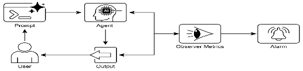

# 智能体实战之评估与监控：确保智能系统的可靠性与性能


## 一.简介

### 评估框架的核心概念

AI Agent评估与监控是确保智能系统在实际环境中可靠运行的关键环节。与传统软件不同，AI Agent具有概率性和非确定性特征，需要专门的评估方法来确保其在动态环境中的持续性能。

### 评估维度

全面的Agent评估应涵盖多个维度：

- **性能指标**：包括响应准确性、处理延迟、资源消耗等量化指标
- **行为一致性**：Agent在不同场景下是否保持预期行为模式
- **适应性**：面对环境变化时的调整能力
- **协作效能**：多Agent系统中的协同工作能力
- **合规性**：是否符合道德准则和监管要求

### 持续监控的重要性

AI Agent的性能可能因数据分布变化(概念漂移)或环境演变而退化。建立持续监控机制可以及早发现这些问题，确保Agent始终与预期目标保持一致。

### 实际应用场景

Agent评估与监控在多个场景中发挥关键作用：

- **实时系统优化**：监控生产环境中的Agent性能，如客服机器人的问题解决率和响应时间
- **版本迭代验证**：通过A/B测试比较不同Agent版本或策略的效果
- **合规性保障**：自动生成审计报告，确保Agent行为符合法规要求
- **异常检测**：识别Agent的异常行为，可能表明系统错误或安全威胁
- **学习进度跟踪**：对于学习型Agent，监控其技能提升和泛化能力

## 二.实践案例：智能合同审核
在当今企业环境中，AI Agent正越来越多地承担着高风险任务，其中合同审核是一个极具代表性的应用场景。合同审核不仅要求高度准确性，还需要对法律风险有深刻理解。本案例将以智能合同审核Agent为例，探讨如何构建全面的评估与监控框架，确保AI系统在关键业务场景中的可靠性与性能。 

合同审核具备以下特点：

     高风险性：合同中的疏漏可能导致重大财务损失或法律纠纷
     标准化与复杂性并存：合同有一定格式规范，但内容复杂多变
     明确的评估标准：风险识别、合规性检查等有相对清晰的判断依据
     可量化的性能指标：审核速度、准确率、召回率等可直接测量

## 三.langchain实现
```python
# -*- coding: utf-8 -*-
"""
一个完整的合同审核AI Agent评估与监控案例

此脚本演示了以下核心概念，并使用 LangChain LCEL (链式调用) 实现：
1. 使用Pydantic定义结构化数据模型（任务合约、分析报告）。
2. 使用LangChain和DeepSeek构建一个合同审核Agent。
3. 使用LLM-as-a-Judge的方法来评估Agent的输出质量。
4. 实施一个性能监控器来跟踪关键指标并分析趋势。

"""

import json
import time
from datetime import datetime
from typing import List, Dict, Literal, Any

from langchain_core.output_parsers import PydanticOutputParser
from langchain_core.prompts import PromptTemplate
from pydantic import BaseModel, Field


# --- 1. 数据模型定义 ---
from init_client import init_llm
llm = init_llm(temperature=0.1)

class ContractClause(BaseModel):
    """表示单个合同条款及其分析结果"""
    clause_id: str = Field(description="条款唯一标识符")
    text: str = Field(description="条款原文")
    type: str = Field(description="条款类型，如赔偿、责任限制、保密等")
    risk_level: Literal["low", "medium", "high", "critical"] = Field(description="风险等级")
    concerns: List[str] = Field(description="识别出的风险点")
    suggestions: List[str] = Field(description="修改建议")


class ContractAnalysisReport(BaseModel):
    """合同审核Agent生成的分析报告"""
    contract_id: str = Field(description="合同唯一标识符")
    analysis_timestamp: datetime = Field(default_factory=datetime.now)
    overall_risk_score: float = Field(description="整体风险评分(0-10)")
    critical_clauses: List[ContractClause] = Field(description="高风险条款列表")
    missing_clauses: List[str] = Field(description="缺失的重要条款类型")
    compliance_issues: List[str] = Field(description="合规性问题")
    recommendations: List[str] = Field(description="整体建议")
    processing_time_seconds: float = Field(description="处理耗时(秒)")


class ContractReviewContract(BaseModel):
    """定义合同审核任务的'高级合约'"""
    task_id: str = Field(description="任务唯一标识符")
    contract_text: str = Field(description="待审核的合同全文")
    review_standards: Dict[str, str] = Field(description="审核标准，定义各类条款的判断依据")
    compliance_frameworks: List[str] = Field(description="需遵循的合规框架，如GDPR、SOX等")
    company_policies: List[str] = Field(description="公司特定政策要求")
    acceptance_criteria: List[str] = Field(description="验收标准")
    quality_metrics: Dict[str, float] = Field(description="质量指标阈值")


# --- 2. 核心Agent实现 (使用LCEL) ---

class ContractReviewAgent:

    def __init__(self):
        self.parser = PydanticOutputParser(pydantic_object=ContractAnalysisReport)

        self.review_prompt = PromptTemplate(
            template="""
            作为一名专业的法律顾问，请仔细审核以下合同，并识别其中的风险条款。

            合同内容:
            {contract_text}

            审核标准:
            {review_standards}

            需要检查的合规框架:
            {compliance_frameworks}

            公司政策:
            {company_policies}

            请按照以下格式提供分析报告:
            {format_instructions}
            """,
            input_variables=["contract_text", "review_standards", "compliance_frameworks", "company_policies"],
            partial_variables={"format_instructions": self.parser.get_format_instructions()}
        )

        # 使用 LCEL 创建链: prompt -> llm -> parser
        self.chain = self.review_prompt | llm | self.parser

    def review_contract(self, contract: ContractReviewContract) -> ContractAnalysisReport:
        """审核合同并生成分析报告"""
        print(f"\n[Agent] 开始审核合同任务: {contract.task_id}...")
        start_time = time.time()

        # 准备链的输入
        inputs = {
            "contract_text": contract.contract_text,
            "review_standards": contract.review_standards,
            "compliance_frameworks": contract.compliance_frameworks,
            "company_policies": contract.company_policies
        }

        try:
            # 调用链，它会自动解析输出为 Pydantic 对象
            report = self.chain.invoke(inputs)
            report.contract_id = contract.task_id
        except Exception as e:
            print(f"[Agent] 解析LLM输出失败，生成默认错误报告: {e}")
            report = ContractAnalysisReport(
                contract_id=contract.task_id,
                overall_risk_score=0.0,
                critical_clauses=[],
                missing_clauses=[],
                compliance_issues=[f"解析错误: {str(e)}"],
                recommendations=["请重新提交合同进行审核"],
                processing_time_seconds=time.time() - start_time
            )

        report.processing_time_seconds = time.time() - start_time
        print(f"[Agent] 审核完成，耗时: {report.processing_time_seconds:.2f}秒。")
        return report


# --- 3. 评估框架实现 (使用LCEL) ---

class ContractReviewEvaluator:
    """使用LLM-as-a-Judge评估合同审核Agent的性能 (使用LCEL实现)"""

    def __init__(self):
        self.evaluation_prompt = PromptTemplate(
            template="""
            作为一名资深法律专家，请评估以下AI Agent对合同的审核质量。

            原始合同:
            {contract_text}

            AI Agent生成的审核报告:
            {agent_report}

            专家参考报告(黄金标准):
            {expert_report}

            请从以下维度评估AI Agent的审核质量(1-10分):
            1. 风险识别准确性: 是否准确识别了所有风险条款
            2. 风险评估准确性: 是否正确评估了风险的严重程度
            3. 建议实用性: 提出的修改建议是否具体可行
            4. 合规性检查: 是否正确识别了合规性问题
            5. 报告完整性: 报告是否包含了所有必要信息

            请以JSON格式返回评估结果:
            {{
                "overall_score": 总体质量评分(1-10),
                "risk_identification_score": 风险识别准确性评分(1-10),
                "risk_assessment_score": 风险评估准确性评分(1-10),
                "suggestion_usefulness_score": 建议实用性评分(1-10),
                "compliance_check_score": 合规性检查评分(1-10),
                "report_completeness_score": 报告完整性评分(1-10),
                "missed_risks": ["AI Agent遗漏的风险1", "AI Agent遗漏的风险2"],
                "false_positives": ["AI Agent误报的风险1", "AI Agent误报的风险2"],
                "improvement_suggestions": ["改进建议1", "改进建议2"]
            }}
            """,
            input_variables=["contract_text", "agent_report", "expert_report"]
        )

        # 使用 LCEL 创建链: prompt -> llm
        self.chain = self.evaluation_prompt | llm

    def evaluate_review(self, contract_text: str, agent_report: ContractAnalysisReport, expert_report: dict) -> dict:
        """评估合同审核报告的质量"""
        print("\n[Evaluator] 开始评估AI Agent的审核质量...")

        agent_report_str = f"""
        整体风险评分: {agent_report.overall_risk_score}/10
        高风险条款: {len(agent_report.critical_clauses)}条
        合规性问题: {', '.join(agent_report.compliance_issues)}
        建议: {', '.join(agent_report.recommendations)}
        """

        expert_report_str = f"""
        整体风险评分: {expert_report.get('overall_risk_score', 'N/A')}/10
        高风险条款: {len(expert_report.get('critical_clauses', []))}条
        合规性问题: {', '.join(expert_report.get('compliance_issues', []))}
        建议: {', '.join(expert_report.get('recommendations', []))}
        """

        # 准备链的输入
        inputs = {
            "contract_text": contract_text,
            "agent_report": agent_report_str,
            "expert_report": expert_report_str
        }

        # 调用链
        response = self.chain.invoke(inputs)
        response = response.content.replace('```json', '').replace('```', '').strip()

        try:
            result = json.loads(response)
            print(f"[Evaluator] 评估完成，总体得分: {result.get('overall_score', 'N/A')}/10")
            return result
        except json.JSONDecodeError:
            print("[Evaluator] 评估结果JSON解析失败。")
            return {
                "overall_score": 5,
                "error": "评估结果解析失败",
                "raw_response": response
            }


# --- 4. 性能监控实现 ---

class ContractReviewMonitor:
    """合同审核Agent性能监控器"""

    def __init__(self, metrics_file: str = "contract_review_metrics.json"):
        self.metrics_file = metrics_file
        self.metrics_history: List[Dict[str, Any]] = []
        try:
            with open(self.metrics_file, 'r') as f:
                self.metrics_history = json.load(f)
        except (FileNotFoundError, json.JSONDecodeError):
            self.metrics_history = []

    def record_review_metrics(self, task_id: str, contract_length: int, report: ContractAnalysisReport,
                              evaluation: Dict[str, Any]):
        """记录单次审核的指标"""
        print(f"\n[Monitor] 记录任务 {task_id} 的性能指标...")

        metrics = {
            "timestamp": datetime.now().isoformat(),
            "task_id": task_id,
            "contract_length_chars": contract_length,
            "processing_time_seconds": report.processing_time_seconds,
            "overall_risk_score": report.overall_risk_score,
            "critical_clauses_count": len(report.critical_clauses),
            "compliance_issues_count": len(report.compliance_issues),
            "evaluation_score": evaluation.get("overall_score", 0),
            "risk_identification_score": evaluation.get("risk_identification_score", 0),
            "missed_risks_count": len(evaluation.get("missed_risks", [])),
            "false_positives_count": len(evaluation.get("false_positives", []))
        }

        self.metrics_history.append(metrics)

        with open(self.metrics_file, "w") as f:
            json.dump(self.metrics_history, f, indent=2)

        print(f"[Monitor] 指标已记录到 {self.metrics_file}")
        return metrics

    def get_performance_summary(self, last_n_records: int = 10) -> Dict[str, Any]:
        """获取最近n次审核的性能摘要"""
        if not self.metrics_history:
            return {"message": "暂无性能数据"}

        recent_metrics = self.metrics_history[-last_n_records:]

        avg_processing_time = sum(m["processing_time_seconds"] for m in recent_metrics) / len(recent_metrics)
        avg_evaluation_score = sum(m["evaluation_score"] for m in recent_metrics) / len(recent_metrics)
        avg_risk_identification = sum(m["risk_identification_score"] for m in recent_metrics) / len(recent_metrics)
        avg_missed_risks = sum(m["missed_risks_count"] for m in recent_metrics) / len(recent_metrics)

        return {
            "evaluations_count": len(recent_metrics),
            "average_processing_time_seconds": round(avg_processing_time, 2),
            "average_evaluation_score": round(avg_evaluation_score, 2),
            "average_risk_identification_score": round(avg_risk_identification, 2),
            "average_missed_risks_count": round(avg_missed_risks, 2),
            "performance_trend": self._calculate_trend("evaluation_score", recent_metrics)
        }

    def _calculate_trend(self, metric_name: str, metrics: List[Dict[str, Any]]) -> str:
        """计算指标趋势"""
        if len(metrics) < 2:
            return "insufficient_data"

        x = list(range(len(metrics)))
        y = [m[metric_name] for m in metrics]

        n = len(x)
        sum_x = sum(x)
        sum_y = sum(y)
        sum_xy = sum(x[i] * y[i] for i in range(n))
        sum_x2 = sum(x[i] ** 2 for i in range(n))

        if (n * sum_x2 - sum_x ** 2) == 0: return "stable"

        slope = (n * sum_xy - sum_x * sum_y) / (n * sum_x2 - sum_x ** 2)

        if slope > 0.1:
            return "improving"
        elif slope < -0.1:
            return "declining"
        else:
            return "stable"


# --- 5. 主执行流程 ---

if __name__ == "__main__":
    # --- 示例数据准备 ---
    sample_contract_text = """
    软件开发服务协议

    甲方：ABC科技有限公司
    乙方：XYZ软件开发公司

    第一条 服务内容
    乙方为甲方开发一套客户关系管理系统，包括需求分析、系统设计、编码实现、测试和部署。

    第二条 知识产权
    乙方保留所有开发过程中产生的代码和文档的知识产权。甲方获得软件的永久使用权，但不得进行修改或二次开发。

    第三条 保密义务
    双方应对在合作过程中获知的对方商业秘密保密，保密期限为合同终止后一年。

    第四条 责任限制
    乙方对因软件缺陷导致的甲方损失不承担任何责任，最高赔偿金额不超过合同总金额的10%。
    """

    # 模拟专家报告，作为评估的黄金标准
    expert_reference_report = {
        "overall_risk_score": 8.5,
        "critical_clauses": [
            {"text": "乙方保留所有开发过程中产生的代码和文档的知识产权", "type": "知识产权", "risk_level": "high",
             "concerns": ["甲方应拥有定制开发软件的全部知识产权"], "suggestions": ["修改为甲方拥有全部知识产权"]},
            {"text": "保密期限为合同终止后一年", "type": "保密义务", "risk_level": "medium", "concerns": ["保密期限过短，通常应为3-5年"],
             "suggestions": ["延长保密期限至3年"]}
        ],
        "compliance_issues": ["未包含GDPR要求的数据处理条款"],
        "recommendations": ["修改知识产权条款", "延长保密期限", "添加数据处理条款"]
    }

    # --- 步骤 1: 定义任务合约 ---
    task_contract = ContractReviewContract(
        task_id="contract_2023_001",
        contract_text=sample_contract_text,
        review_standards={
            "知识产权": "甲方应拥有定制开发软件的全部知识产权",
            "保密义务": "保密期限通常应为合同终止后3-5年",
            "责任限制": "责任限制条款应合理，不应完全免除乙方责任"
        },
        compliance_frameworks=["GDPR"],
        company_policies=["所有软件项目必须包含源代码交付"],
        acceptance_criteria=["识别所有高风险条款", "提供具体修改建议"],
        quality_metrics={"min_risk_detection_rate": 0.95}
    )
    print("=" * 50)
    print("步骤 1: 任务合约已定义")
    print(f"任务ID: {task_contract.task_id}")

    # --- 步骤 2: Agent执行合同审核 ---
    agent = ContractReviewAgent()
    agent_report = agent.review_contract(task_contract)
    print("\n" + "=" * 50)
    print("步骤 2: Agent审核报告")
    print(f"整体风险评分: {agent_report.overall_risk_score}/10")
    print(f"高风险条款数量: {len(agent_report.critical_clauses)}")
    print(f"合规性问题: {', '.join(agent_report.compliance_issues)}")
    print(f"建议: {', '.join(agent_report.recommendations)}")

    # --- 步骤 3: 评估Agent的审核质量 ---
    evaluator = ContractReviewEvaluator()
    evaluation_result = evaluator.evaluate_review(
        task_contract.contract_text,
        agent_report,
        expert_reference_report
    )
    print("\n" + "=" * 50)
    print("步骤 3: LLM-as-a-Judge 评估结果")
    print(json.dumps(evaluation_result, indent=2, ensure_ascii=False))

    # --- 步骤 4: 记录和监控性能 ---
    monitor = ContractReviewMonitor()
    monitor.record_review_metrics(
        task_contract.task_id,
        len(task_contract.contract_text),
        agent_report,
        evaluation_result
    )

    print("\n" + "=" * 50)
    print("步骤 4: 性能监控摘要")
    performance_summary = monitor.get_performance_summary()
    print(json.dumps(performance_summary, indent=2, ensure_ascii=False))

    print("\n" + "=" * 50)
    print("工作流程演示完成！")
```

## 项目分析

这个案例不仅仅是一个执行任务的AI Agent，它更是一个**包含自我评估和性能监控的闭环系统**。其核心思想是：一个可靠的AI系统不能只是一个“黑箱”，它必须能够被衡量、被评估，并且其性能表现需要被持续跟踪。

---

### 1. 基础：定义清晰的“契约” (Pydantic Models)

在实现评估之前，首先必须有一个标准。代码中的 `ContractAnalysisReport` 和 `ContractReviewContract` 等Pydantic模型就扮演了这个角色。

```python
class ContractAnalysisReport(BaseModel):
    """合同审核Agent生成的分析报告"""
    contract_id: str
    overall_risk_score: float
    critical_clauses: List[ContractClause]
    # ... 其他字段
```

**核心作用：**
*   **结构化输出**：它强制Agent输出一个结构化的、可预测的JSON对象。这使得后续的自动化评估变得极其简单，因为评估器知道该去哪里找`overall_risk_score`，该去哪里遍历`critical_clauses`。
*   **定义评估标准**：这个模型本身就定义了“一份好的报告”应该包含哪些要素（如风险评分、关键条款、建议等）。评估将围绕这些预定义的要素展开。

这是实现可靠性的第一步：**通过强制结构化，消除了输出的不确定性，为后续的量化评估奠定了基础。**

### 2. 评估核心：LLM-as-a-Judge 的实现

`ContractReviewEvaluator` 类是整个评估体系的核心。它没有使用硬编码的规则，而是采用了更灵活、更强大的“LLM-as-a-Judge”模式。

```python
class ContractReviewEvaluator:
    def __init__(self, model_name="deepseek-chat"):
        self.llm = DeepSeek(model=model_name)
        self.evaluation_prompt = PromptTemplate(...)
        self.chain = self.evaluation_prompt | self.llm

    def evaluate_review(self, ...):
        # ... 准备输入数据
        response = self.chain.invoke(inputs)
        # ... 解析评估结果
```

**评估流程解析：**

1.  **设定评估标准**：`evaluation_prompt` 的提示词模板是关键。它明确告诉“裁判”LLM，需要从哪些维度（风险识别准确性、建议实用性等）进行评估，并要求输出一个结构化的JSON结果。这使得评估过程是**系统性的、可重复的**。

2.  **提供对比基准**：评估不是凭空进行的。`evaluate_review` 方法接收三个关键输入：
    *   `contract_text` (原始合同)
    *   `agent_report` (待评估的AI输出)
    *   `expert_report` (专家的“黄金标准”报告)

    通过将AI报告与专家报告进行对比，评估可以非常精确地指出AI**遗漏了什么** (`missed_risks`)、**误报了什么** (`false_positives`)，从而得出量化的分数。

3.  **实现量化评估**：最终输出的JSON包含了 `overall_score`、`risk_identification_score` 等多个维度的1-10分评分。这使得AI的性能不再是“好”或“坏”的模糊概念，而是可以被精确量化和比较的指标。

**核心价值：**
这种评估方式将主观的“质量”问题，转化为一个可以被**自动化、规模化**执行的任务。它解决了传统AI评估中难以衡量输出“有用性”和“准确性”的难题。

### 3. 监控与反馈：性能趋势的持续追踪

一次评估只能反映单次任务的表现。要确保长期可靠性，必须进行**持续监控**。`ContractReviewMonitor` 类就实现了这个功能。

```python
class ContractReviewMonitor:
    def record_review_metrics(self, ...):
        # ... 记录单次任务的所有关键指标
        metrics = {
            "timestamp": datetime.now().isoformat(),
            "processing_time_seconds": ...,
            "evaluation_score": ...,
            "missed_risks_count": ...
        }
        self.metrics_history.append(metrics)
        # ... 持久化到文件

    def get_performance_summary(self, ...):
        # ... 计算历史数据的平均值和趋势
        avg_evaluation_score = ...
        performance_trend = self._calculate_trend(...)
```

**监控流程解析：**

1.  **多维度指标收集**：`record_review_metrics` 方法不仅记录了评估分数，还记录了**处理时间**、**遗漏风险数量**、**误报数量**等多个维度的数据。这提供了一个全面的性能视图，而不仅仅是准确性。

2.  **数据持久化**：所有指标都被保存到 `contract_review_metrics.json` 文件中。这意味着**性能数据不会丢失**，可以进行长期的历史分析。

3.  **趋势分析**：`get_performance_summary` 方法的亮点在于 `_calculate_trend` 函数。它通过简单的线性回归分析，判断Agent的性能是在**提升**、**下降**还是**保持稳定**。

**核心价值：**
监控将单点的评估连接成一条线，揭示了AI系统性能的**动态变化**。这使得我们可以：
*   **及时发现性能退化**：如果发现 `evaluation_score` 持续下降，可能意味着模型出现了漂移或需要重新训练。
*   **驱动迭代优化**：通过分析哪些类型的合同经常导致 `missed_risks`，可以有针对性地优化Agent的提示词或模型。
*   **建立信任**：一个有持续监控和性能报告的系统，比一个黑箱系统更容易获得用户的信任。

### 4. 完整工作流的编排

`if __name__ == "__main__":` 部分将所有组件串联起来，展示了从任务执行到评估再到监控的完整闭环。

```python
if __name__ == "__main__":
    # 1. 定义任务合约
    task_contract = ContractReviewContract(...)
    # 2. Agent执行合同审核
    agent = ContractReviewAgent()
    agent_report = agent.review_contract(task_contract)
    # 3. 评估Agent的审核质量
    evaluator = ContractReviewEvaluator()
    evaluation_result = evaluator.evaluate_review(...)
    # 4. 记录和监控性能
    monitor = ContractReviewMonitor()
    monitor.record_review_metrics(...)
    performance_summary = monitor.get_performance_summary()
```

这个流程清晰地展示了**“执行-评估-监控”**的循环，这是构建可靠AI系统的最佳实践。

### 总结：如何确保可靠性与性能

这个案例通过以下几个层面，系统地回答了“如何确保智能系统的可靠性与性能”：

1.  **可靠性通过标准化和评估来保证**：
    *   **标准化**：使用Pydantic模型强制输出格式，消除了不确定性。
    *   **可量化的评估**：通过“LLM-as-a-Judge”将主观质量转化为客观分数，实现了对单次任务可靠性的精确度量。

2.  **性能通过监控和反馈来保证**：
    *   **持续监控**：通过`Monitor`类跟踪关键性能指标（KPIs）随时间的变化。
    *   **趋势分析**：识别性能是提升还是下降，为系统维护和优化提供了数据驱动的决策依据。
    *   **闭环反馈**：监控的结果可以反过来指导Agent的优化，形成一个持续改进的良性循环。

## 四.langgraph实现
```python
# -*- coding: utf-8 -*-
"""
使用 LangGraph 和 DeepSeek 实现的合同审核AI Agent评估与监控案例

工作流步骤:
1. Agent Node: 执行合同审核。
2. Evaluator Node: 评估Agent的输出质量。
3. Conditional Edge: 根据评估分数决定是重试还是继续。
4. Increment Retry Node: 增加重试计数器。
5. Monitor Node: 记录最终性能指标。
"""
import json
import time
from datetime import datetime
from typing import List, Dict, Optional, Literal, TypedDict, Annotated, Any

from langchain_core.output_parsers import PydanticOutputParser
from langchain_core.prompts import PromptTemplate
from pydantic import BaseModel, Field
from langgraph.graph import StateGraph, END
from langgraph.checkpoint.memory import MemorySaver

from init_client import init_llm

llm = init_llm(temperature=0.1)

# --- 1. 数据模型与状态定义 ---

class ContractClause(BaseModel):
    clause_id: str = Field(description="条款唯一标识符")
    text: str = Field(description="条款原文")
    type: str = Field(description="条款类型")
    risk_level: Literal["low", "medium", "high", "critical"] = Field(description="风险等级")
    concerns: List[str] = Field(description="识别出的风险点")
    suggestions: List[str] = Field(description="修改建议")


class ContractAnalysisReport(BaseModel):
    contract_id: str = Field(description="合同唯一标识符")
    analysis_timestamp: datetime = Field(default_factory=datetime.now)
    overall_risk_score: float = Field(description="整体风险评分(0-10)")
    critical_clauses: List[ContractClause] = Field(description="高风险条款列表")
    missing_clauses: List[str] = Field(description="缺失的重要条款类型")
    compliance_issues: List[str] = Field(description="合规性问题")
    recommendations: List[str] = Field(description="整体建议")
    processing_time_seconds: float = Field(description="处理耗时(秒)")


class GraphState(TypedDict):
    task_id: str
    contract_text: str
    review_standards: Dict[str, str]
    compliance_frameworks: List[str]
    company_policies: List[str]

    agent_report: Optional[ContractAnalysisReport]
    evaluation_result: Optional[Dict[str, Any]]

    retry_count: Annotated[int, "当前重试次数"]
    max_retries: Annotated[int, "最大重试次数"]
    final_decision: Annotated[str, "最终决策: 'accepted' 或 'failed_after_retries'"]


# --- 2. 节点逻辑实现 ---

def run_agent_review(state: GraphState):
    """节点1: 运行合同审核Agent"""
    print(f"\n--- [Node 1: Agent Review] ---")
    print(f"正在执行任务: {state['task_id']} (尝试次数: {state['retry_count'] + 1})")

    # 为了简化，我们在这里直接使用之前的 Agent 类
    class ContractReviewAgent:
        def __init__(self):
            self.parser = PydanticOutputParser(pydantic_object=ContractAnalysisReport)
            self.review_prompt = PromptTemplate(
                template="""
            作为一名专业的法律顾问，请仔细审核以下合同，并识别其中的风险条款。

            合同内容:
            {contract_text}

            审核标准:
            {review_standards}

            需要检查的合规框架:
            {compliance_frameworks}

            公司政策:
            {company_policies}

            请按照以下格式提供分析报告:
            {format_instructions}
            """,
                input_variables=["contract_text", "review_standards", "compliance_frameworks", "company_policies"],
                partial_variables={"format_instructions": self.parser.get_format_instructions()}
            )
            self.chain = self.review_prompt | llm | self.parser

        def review(self, contract_details: dict) -> ContractAnalysisReport:
            start_time = time.time()
            try:
                report = self.chain.invoke(contract_details)
                report.contract_id = contract_details['task_id']
                report.processing_time_seconds = time.time() - start_time
                return report
            except Exception as e:
                return ContractAnalysisReport(
                    contract_id=contract_details['task_id'], overall_risk_score=0.0, critical_clauses=[],
                    missing_clauses=[], compliance_issues=[f"错误: {str(e)}"], recommendations=["请重新提交"],
                    processing_time_seconds=time.time() - start_time
                )

    agent = ContractReviewAgent()
    contract_details = {k: state[k] for k in
                        ["task_id", "contract_text", "review_standards", "compliance_frameworks", "company_policies"]}
    report = agent.review(contract_details)
    print(f"Agent 审核完成，风险评分: {report.overall_risk_score}/10")
    return {"agent_report": report}


def run_evaluation(state: GraphState):
    """节点2: 评估Agent的输出质量"""
    print("\n--- [Node 2: Evaluator] ---")
    print("正在评估Agent报告质量...")

    class ContractReviewEvaluator:
        def __init__(self):
            self.evaluation_prompt = PromptTemplate(template="""
            作为一名资深法律专家，请评估以下AI Agent对合同的审核质量。

            原始合同:
            {contract_text}

            AI Agent生成的审核报告:
            {agent_report}

            专家参考报告(黄金标准):
            {expert_report}

            请从以下维度评估AI Agent的审核质量(1-10分):
            1. 风险识别准确性: 是否准确识别了所有风险条款
            2. 风险评估准确性: 是否正确评估了风险的严重程度
            3. 建议实用性: 提出的修改建议是否具体可行
            4. 合规性检查: 是否正确识别了合规性问题
            5. 报告完整性: 报告是否包含了所有必要信息

            请以JSON格式返回评估结果:
            {{
                "overall_score": 总体质量评分(1-10),
                "risk_identification_score": 风险识别准确性评分(1-10),
                "risk_assessment_score": 风险评估准确性评分(1-10),
                "suggestion_usefulness_score": 建议实用性评分(1-10),
                "compliance_check_score": 合规性检查评分(1-10),
                "report_completeness_score": 报告完整性评分(1-10),
                "missed_risks": ["AI Agent遗漏的风险1", "AI Agent遗漏的风险2"],
                "false_positives": ["AI Agent误报的风险1", "AI Agent误报的风险2"],
                "improvement_suggestions": ["改进建议1", "改进建议2"]
            }}
            """,
            input_variables=["contract_text", "agent_report", "expert_report"])
            self.chain = self.evaluation_prompt | llm

        def evaluate(self, contract_text: str, agent_report: ContractAnalysisReport, expert_report: dict) -> dict:
            agent_report_str = f"..."
            expert_report_str = f"..."
            inputs = {"contract_text": contract_text, "agent_report": agent_report_str,
                      "expert_report": expert_report_str}
            response = self.chain.invoke(inputs)
            response = response.content.replace('```json', '').replace('```', '').strip()
            try:
                return json.loads(response)
            except json.JSONDecodeError:
                return {"overall_score": 5, "error": "评估结果解析失败"}

    evaluator = ContractReviewEvaluator()
    expert_report = {"overall_risk_score": 8.5, "critical_clauses": [...], "compliance_issues": [...]}  # 模拟专家报告
    result = evaluator.evaluate(state["contract_text"], state["agent_report"], expert_report)
    print(f"评估完成，总体得分: {result.get('overall_score', 'N/A')}/10")
    return {"evaluation_result": result}


# --- 新增：用于增加重试次数的节点 ---
def increment_retry(state: GraphState):
    """节点3: 增加重试计数器"""
    print("\n--- [Node 3: Increment Retry] ---")
    print(f"重试计数器从 {state['retry_count']} 增加到 {state['retry_count'] + 1}")
    return {"retry_count": state['retry_count'] + 1}


def run_monitoring(state: GraphState):
    """节点4: 记录最终性能指标"""
    print("\n--- [Node 4: Monitor] ---")
    print("正在记录最终性能指标...")

    class ContractReviewMonitor:
        def __init__(self, metrics_file: str = "langgraph_metrics.json"):
            self.metrics_file = metrics_file
            self.metrics_history = []
            try:
                with open(self.metrics_file, 'r') as f:
                    self.metrics_history = json.load(f)
            except (FileNotFoundError, json.JSONDecodeError):
                self.metrics_history = []

        def record(self, state: GraphState):
            report, evaluation = state['agent_report'], state['evaluation_result']
            metrics = {
                "timestamp": datetime.now().isoformat(), "task_id": state['task_id'],
                "final_decision": state['final_decision'],
                "retry_count": state['retry_count'], "processing_time_seconds": report.processing_time_seconds,
                "final_evaluation_score": evaluation.get("overall_score", 0),
            }
            self.metrics_history.append(metrics)
            with open(self.metrics_file, "w") as f: json.dump(self.metrics_history, f, indent=2)
            print(f"指标已记录到 {self.metrics_file}")

    monitor = ContractReviewMonitor()
    monitor.record(state)
    return state


# --- 3. 条件路由逻辑 (更新后) ---

def should_retry(state: GraphState) -> str:
    """条件边: 根据评估结果决定下一步"""
    print("\n--- [Conditional Edge: Should Retry?] ---")
    evaluation = state['evaluation_result']
    if not evaluation: return "monitor"

    score = evaluation.get("overall_score", 10)
    print(f"当前评估分数: {score}, 最大重试次数: {state['max_retries']}, 当前重试次数: {state['retry_count']}")

    if score < 7 and state['retry_count'] < state['max_retries']:
        print("分数低于7且未达到最大重试次数，决定重试。")
        return "increment_retry"  # 路由到新的节点
    else:
        decision = "accepted" if score >= 7 else "failed_after_retries"
        print(f"决定进入监控阶段。最终决策: {decision}。")
        return "monitor"


# --- 4. 构建和编译图 (更新后) ---

def create_contract_review_graph():
    memory = MemorySaver()
    workflow = StateGraph(GraphState)

    # 添加所有节点
    workflow.add_node("agent", run_agent_review)
    workflow.add_node("evaluator", run_evaluation)
    workflow.add_node("increment_retry", increment_retry)  # 新增节点
    workflow.add_node("monitor", run_monitoring)

    workflow.set_entry_point("agent")

    # 添加边
    workflow.add_edge("agent", "evaluator")

    # 更新条件边
    workflow.add_conditional_edges(
        "evaluator",
        should_retry,
        {
            "increment_retry": "increment_retry",  # 新增路由
            "monitor": "monitor"
        }
    )

    # 新增：从 increment_retry 节点返回到 agent 节点
    workflow.add_edge("increment_retry", "agent")

    workflow.add_edge("monitor", END)

    app = workflow.compile(checkpointer=memory)
    return app


# --- 5. 主执行流程 ---

if __name__ == "__main__":

    sample_contract_text = """
    软件开发服务协议
    甲方：ABC科技有限公司
    乙方：XYZ软件开发公司
    第二条 知识产权
    乙方保留所有开发过程中产生的代码和文档的知识产权。甲方获得软件的永久使用权，但不得进行修改或二次开发。
    第三条 保密义务
    双方应对在合作过程中获知的对方商业秘密保密，保密期限为合同终止后一年。
    """

    app = create_contract_review_graph()

    initial_state = {
        "task_id": "contract_langgraph_001",
        "contract_text": sample_contract_text,
        "review_standards": {"知识产权": "甲方应拥有全部知识产权"},
        "compliance_frameworks": ["GDPR"],
        "company_policies": ["必须包含源代码交付"],
        "agent_report": None,
        "evaluation_result": None,
        "retry_count": 0,
        "max_retries": 2,
        "final_decision": ""
    }

    print("=" * 50)
    print("开始执行 LangGraph 合同审核工作流...")

    final_state = app.invoke(initial_state, config={"configurable": {"thread_id": "contract-review-001"}})

    print("\n" + "=" * 50)
    print("工作流执行完毕！")
    print(f"最终决策: {final_state['final_decision']}")
    print(f"最终Agent报告风险评分: {final_state['agent_report'].overall_risk_score}/10")
    print(f"最终评估得分: {final_state['evaluation_result'].get('overall_score', 'N/A')}/10")
    print(f"总重试次数: {final_state['retry_count']}")
```

## 项目分析

从代码的四个核心部分来解析其如何构建一个可靠的、性能可观测的系统。

### 1. 基础：定义单一事实来源 (`GraphState`)

在 LangGraph 中，`GraphState` (TypedDict) 是整个工作流的“大脑”和“共享内存”。所有节点都从这里读取数据，并将结果写回这里。

```python
class GraphState(TypedDict):
    # ... 输入和输出状态 ...
    retry_count: Annotated[int, "当前重试次数"]
    max_retries: Annotated[int, "最大重试次数"]
    final_decision: Annotated[str, "最终决策"]
```

**核心作用：**

*   **确保可靠性**：通过强制所有节点使用一个预定义的状态结构，系统消除了因数据格式不一致或变量丢失而导致的错误。每个节点都清楚地知道输入是什么，输出应该更新到哪个字段。这种**确定性**是可靠性的基石。
*   **内置监控指标**：`GraphState` 本身就是监控数据的载体。像 `retry_count`、`agent_report`、`evaluation_result` 这些字段不仅仅是临时变量，它们是系统运行的关键性能指标（KPIs）。**监控不是事后添加的功能，而是与系统设计融为一体的。**

### 2. 核心逻辑：职责单一的节点

LangGraph 鼓励将复杂任务分解为一系列职责单一的节点。这使得每个部分都易于理解、测试和维护。

*   **执行节点 (`run_agent_review`)**：
    *   **职责**：执行核心任务——合同审核。
    *   **可靠性**：其内部使用 `PydanticOutputParser`，确保即使 LLM 的输出有轻微的格式波动，也能被强制解析为结构化的 `ContractAnalysisReport` 对象，避免了下游处理因格式错误而崩溃。

*   **评估节点 (`run_evaluation`)**：
    *   **职责**：作为“质检员”，对执行节点的输出进行质量评估。这是**评估**机制的核心。
    *   **如何实现评估**：它采用“LLM-as-a-Judge”模式，将 AI 的报告与“黄金标准”（`expert_report`）进行多维度对比，并生成一个量化的分数（`overall_score`）。
    *   **可靠性**：这种评估方式将主观的“质量”问题，转化为一个客观、可重复、可自动化的流程。它不再依赖于人的直觉，而是基于一个明确的、系统化的标准。

*   **修正节点 (`increment_retry`)**：
    *   **职责**：唯一的功能就是将 `retry_count` 加 1。
    *   **可靠性**：这个看似微不足道的节点，却是解决无限循环bug的关键。它将状态更新的逻辑**显式化、原子化**。这确保了重试计数器能够被正确、可靠地修改，使整个自修正循环得以正常工作。

*   **监控节点 (`run_monitoring`)**：
    *   **职责**：作为“记录员”，将工作流的最终结果和所有关键指标持久化存储。
    *   **如何实现监控**：它从 `GraphState` 中读取所有需要的数据（如 `final_decision`、`retry_count`、`processing_time_seconds`、`final_evaluation_score`），并将其写入一个 JSON 文件。
    *   **性能分析**：这个持久化的日志文件是性能分析的**数据基础**。我们可以通过分析这个文件来了解系统的长期表现，例如：
        *   平均重试次数是多少？
        *   任务成功率有多高？
        *   处理一个合同平均需要多长时间？
        *   Agent 的性能是在提升还是在下降？

### 3. 智能：条件路由 (`should_retry`)

这是整个工作流的“决策大脑”，也是 LangGraph 最强大的功能之一。它根据当前状态，动态地决定下一步的走向。

```python
def should_retry(state: GraphState) -> str:
    score = evaluation.get("overall_score", 10)
    if score < 7 and state['retry_count'] < state['max_retries']:
        return "increment_retry" # 决定重试
    else:
        return "monitor" # 决定结束
```

**核心价值：**

*   **实现自修正，提升可靠性**：这个条件边使系统具备了**韧性**。当 LLM 的输出质量不达标时（`score < 7`），系统不会直接失败并返回一个糟糕的结果，而是会自动触发重试机制。这种自我修复的能力极大地提高了系统在处理不确定性任务时的最终可靠性。
*   **优化性能**：这里的“性能”不仅仅指速度，更指**任务成功率**。一个返回低质量结果的系统，其有效性能为零。通过重试机制，系统投入更多计算资源来换取一个高质量的、可用的结果，从而优化了整体的**有效吞吐量**。

### 4. 蓝图：图的构建与编译 (`create_contract_review_graph`)

最后，`StateGraph` 将所有节点和边组合成一个完整、可执行的工作流蓝图。

```python
workflow.add_conditional_edges("evaluator", should_retry, {...})
workflow.add_edge("increment_retry", "agent")
app = workflow.compile(checkpointer=memory)
```

**核心价值：**

*   **清晰的可视化逻辑**：通过 `add_node` 和 `add_edge`，整个工作流的逻辑变得非常清晰，远比一堆嵌套的 `if-else` 语句易于理解和维护。
*   **生产级的可靠性**：`checkpointer=memory` 的引入，使得工作流具备了**状态持久化和故障恢复**的能力。如果工作流在执行过程中因任何原因中断，它可以从上一个检查点恢复，而不是从头开始。这对于处理长时间运行或高价值的任务至关重要。

### 总结：从“脆弱”到“健壮”的演变

这个 LangGraph 案例完美地展示了如何构建一个可靠的、性能可观测的 AI 系统：

1.  **可靠性**：
    *   通过**结构化状态** (`GraphState`) 消除不确定性。
    *   通过**量化评估** (`Evaluator` 节点) 将主观质量客观化。
    *   通过**条件路由** (`should_retry`) 实现自修正，从失败中恢复。
    *   通过**检查点** (`checkpointer`) 实现故障恢复能力。

2.  **性能**：
    *   通过**监控节点** (`Monitor`) 收集详细的运行时指标。
    *   通过**持久化日志** 为长期性能趋势分析提供数据。
    *   通过**重试机制** 优化任务成功率，提升整体有效性能。

