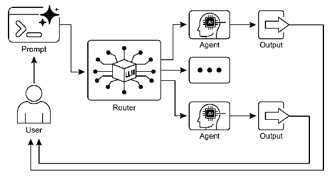

# 智能体实战之路由模式：智能决策与动态流程控制


## 路由模式概述

在构建智能Agent系统时，顺序处理虽然能够执行确定性的线性工作流，但在需要自适应响应的场景中却显得力不从心。现实世界的Agent系统必须能够根据多种因素（如环境状态、用户输入或前一操作的结果）在多个潜在行动之间进行动态选择。这种动态决策能力，通过一种称为"路由"的机制实现，它控制着系统流向不同的专门函数、工具或子流程。

路由将条件逻辑引入Agent的操作框架，使其从固定的执行路径转变为动态评估特定标准并选择后续操作的模型。这使得系统行为更加灵活且具有上下文感知能力，能够根据不同情况采取不同的应对策略。

## 路由模式的实现原理

路由模式的核心在于建立一个"决策-执行"的循环。系统首先分析输入信息，然后根据预设规则或模型判断选择哪条处理路径，最后将请求路由到相应的处理程序。这种设计允许系统在不修改核心逻辑的情况下，通过添加新的处理程序来扩展功能。

## LangChain的路由实现

下面是使用LangChain实现的路由示例，该系统根据用户查询类型将请求路由到不同的专业处理程序：

实例目标是构建一个智能客服系统。当用户提出问题时，系统不会盲目地用一个通用模型去回答，而是首先理解问题的意图，然后将问题精准地派发给最合适的专家处理程序。这样做的好处是，每个专家可以专注于自己的领域，提供更专业、更准确的答案。 
代码结构分解 

我们可以将整个实例拆解为四个关键部分： 

    大脑 (路由决策核心)：负责分析用户问题并做出分类决策。 
    专家 (处理程序)：负责处理特定类型的问题。 
    协调器 (路由器类)：连接大脑和专家，协调整个流程。 
    演示 (主函数)：展示整个系统是如何工作的。 

1. 大脑 (路由决策核心) 

这是整个系统的“智慧中枢”，由 LangChain 和 DeepSeek 模型共同构成。 

# 定义输出解析器，提取路由决策
class RouteOutputParser(BaseOutputParser):
    def parse(self, text: str) -> str:
        # 清理输出并转换为小写
        return text.strip().lower()
    
    def get_format_instructions(self) -> str:
        return "只输出一个词：'technical'、'billing'、'general' 或 'unknown'"

# 定义路由决策链
router_prompt = PromptTemplate(
    input_variables=["query"],
    template="""分析用户查询并确定它属于哪个类别：
    - 如果查询涉及技术问题、产品功能或故障排除，返回"technical"
    - 如果查询涉及账单、付款、订阅或退款，返回"billing"
    - 如果查询是一般性问题、产品信息或公司政策，返回"general"
    - 如果查询不明确或不属于任何类别，返回"unknown"
    
    只返回一个词：technical, billing, general 或 unknown
    
    用户查询：{query}"""
)

# 创建路由决策链
router_chain = LLMChain(
    llm=llm,
    prompt=router_prompt,
    output_parser=RouteOutputParser()
)

讲解： 

    router_prompt (提示模板)：这是给 DeepSeek 模型的“指令”。它非常清晰地定义了任务： 
         目标：分析用户查询并分类。
         规则：明确列出了四种类别（technical, billing, general, unknown）以及每种类别对应的问题类型。
         输出格式：严格要求模型只返回一个词。这对于后续的程序逻辑判断至关重要，避免了模型返回冗长的句子导致程序出错。

    RouteOutputParser (输出解析器)：LLM 的输出有时可能带有一些多余的空格或换行符。这个解析器的作用就是“清理”输出，确保我们得到的是一个干净的、小写的分类词（例如，将 " Technical " 变成 "technical"），保证后续路由判断的准确性。 

    router_chain (路由链)：这是 LangChain 的核心组件。它将提示模板、LLM模型 和 输出解析器 打包成一个单一、可重用的对象。当我们调用 router_chain.run(query="...") 时，LangChain 会自动完成以下所有步骤： 
        将用户的问题填入 router_prompt 的 {query} 占位符。 
        将完整的提示发送给 DeepSeek 模型。 
        获取模型的原始输出。 
        使用 RouteOutputParser 清理输出。 
        返回最终的分类结果（如 "technical"）。

2. 专家 (处理程序) 

这些是最终执行具体任务的函数。在这个简化的例子中，它们只是模拟了处理过程并返回一个字符串。但在真实应用中，它们可能会连接到数据库、调用其他专门的 API 或运行更复杂的 AI 模型。 

def technical_handler(query: str) -> str:
    """处理技术相关查询"""
    print("\n--- 路由到技术支持 ---")
    return f"技术支持处理了查询：'{query}'。结果：已生成技术解决方案。"

def billing_handler(query: str) -> str:
    """处理账单相关查询"""
    print("\n--- 路由到账单支持 ---")
    return f"账单支持处理了查询：'{query}'。结果：已提供账单信息。"

# ... 其他 handler

讲解： 

     每个函数（technical_handler, billing_handler 等）都代表一个领域的“专家”。
     它们都接收一个参数 query（即用户的原始问题），这样它们就能在处理时引用完整的上下文。
     print 语句是为了在演示时让我们能清楚地看到问题被路由到了哪个专家那里。

3. 协调器 (路由器类) 

QueryRouter 类是整个系统的总指挥，它将“大脑”和“专家”们组织起来。 

class QueryRouter:
    def __init__(self):
        self.handlers = {
            "technical": technical_handler,
            "billing": billing_handler,
            "general": general_handler,
            "unknown": unknown_handler
        }
    
    def route_query(self, query: str) -> str:
        """路由查询到适当的处理程序"""
        # 1. 获取路由决策
        route_decision = router_chain.run(query=query)
        
        # 2. 根据决策选择处理程序
        handler = self.handlers.get(route_decision, self.handlers["unknown"])
        
        # 3. 调用处理程序并返回结果
        return handler(query)

讲解： 

    __init__ (初始化)： 
         self.handlers 是一个路由表，它是一个字典。
         键 是“大脑”可能输出的分类词（如 "technical"）。
         值 是对应的专家函数（如 technical_handler）。
         这种设计使得系统极易扩展：如果想增加一个新的“物流”专家，只需添加 shipping_handler 函数，并在 self.handlers 中增加一行 "shipping": shipping_handler 即可，核心路由逻辑无需改动。

    route_query (核心方法)： 
        决策：调用 router_chain.run(query)，将用户问题交给“大脑”进行分析，得到一个分类词（如 "billing"）。 
        查找：使用 self.handlers.get(route_decision, ...) 在路由表中查找对应的专家函数。.get() 方法非常巧妙，如果找不到对应的分类（比如大脑返回了一个意外的词），它会自动使用 unknown_handler 作为默认选项，增强了系统的健壮性。 
        执行：调用找到的专家函数，并将原始问题 query 传递给它。 
        返回：将专家函数的处理结果返回给调用者。 

4. 演示 (主函数) 

main 函数向我们展示了如何使用这个 QueryRouter。 

def main():
    router = QueryRouter()
    
    tech_query = "我的软件无法启动，显示错误代码0x80070005。"
    print(f"用户查询: {tech_query}")
    response = router.route_query(tech_query)
    print(f"回复: {response}")
    
    # ... 其他测试用例

执行流程追踪（以技术查询为例）： 

    router.route_query("我的软件无法启动...") 被调用。 
    QueryRouter 内部，router_chain.run() 被调用。 
    DeepSeek 模型收到提示，分析“软件无法启动”、“错误代码”等关键词，判断为技术问题，输出 "technical"。 
    RouteOutputParser 将输出清理为 "technical"。 
    route_query 方法在 self.handlers 字典中查找 "technical"，找到了 technical_handler 函数。 
    代码执行 technical_handler("我的软件无法启动...")。 
    控制台打印 --- 路由到技术支持 ---。 
    technical_handler 返回字符串 "技术支持处理了查询：'...'。结果：已生成技术解决方案。"。 
    route_query 将此字符串作为最终结果返回。 
    main 函数打印出最终的回复。 

总结 

这个实例完美地展示了路由模式的精髓：决策与执行分离。 

     决策层（大脑）：利用 LLM 强大的自然语言理解能力，动态、智能地判断任务类型。
     执行层（专家）：由专门的、可独立优化的模块负责具体任务。

这种架构带来的好处是显而易见的： 

     模块化：每个部分职责单一，易于维护和测试。
     可扩展性：增加新功能就像添加新专家一样简单，对现有代码无侵入。
     专业性：可以为不同领域配置不同的专家（例如，技术问题可以用更详细的技术文档作为上下文），提升回答质量。
     成本效益：可以为简单的查询使用更轻量级的模型或工具，为复杂的查询使用更强大的资源，从而优化成本。

## LangGraph的路由实现

LangGraph 的核心思想是将你的应用逻辑建模为一个**图**，其中：
*   **节点** 代表一个操作或一个工具调用（比如我们的路由决策或处理程序）。
*   **边** 定义了节点之间的转换流程。
*   **状态** 是一个共享的对象，它在节点之间传递，并携带所有必要的信息。

下面，我将使用 LangGraph 重写你提供的代码，并详细解释其结构和优势。

### 讲解与对比

#### 1. 状态 (`AgentState`)
在原始代码中，我们通过函数参数 `query` 和返回值来传递信息。在 LangGraph 中，所有信息都被封装在一个**状态对象**中。

```python
class AgentState(TypedDict):
    query: str
    category: str
    response: str
```
这个 `AgentState` 就像一个共享的记事本，每个节点都可以读取它，也可以在上面写下新的内容（即返回一个更新字典）。

#### 2. 节点
原始代码中的 `router_chain` 和各个 `handler` 函数，在 LangGraph 中被统一建模为**节点**。

```python
def route_query_node(state: AgentState):
    # ...
    return {"category": category} # 更新状态
```
每个节点函数的签名是固定的：接收一个 `state`，返回一个字典来更新 `state`。这使得逻辑非常清晰和一致。

#### 3. 条件边 - 路由的核心
这是 LangGraph 相比于传统 `if-else` 或字典映射最强大的地方。

```python
workflow.add_conditional_edges(
    "route_query",  # 从哪个节点开始判断
    lambda state: state["category"],  # 如何做判断（从状态中取 category）
    {  # 判断结果与下一节点的映射关系
        "technical": "technical_handler",
        "billing": "billing_handler",
        # ...
    }
)
```
这段代码清晰地定义了：当 `route_query` 节点执行完毕后，检查 `state` 中的 `category` 字段。如果它的值是 `"technical"`，那么下一个执行的节点就是 `technical_handler`。这完美地将**决策逻辑**从**执行逻辑**中分离了出来。

#### 4. 图的构建与编译
我们通过 `workflow.add_node`、`workflow.add_edge` 等方法，像搭积木一样构建出整个工作流的蓝图。最后，`app = workflow.compile()` 将这个蓝图编译成一个可执行的应用。

#### 5. 运行与可视化
运行图非常简单，只需 `app.invoke({"query": "..."})`，并提供初始状态即可。

更重要的是，LangGraph 提供了内置的可视化功能：
```python
app.get_graph().print_ascii()
```
执行后会打印出图的 ASCII 结构，让你对整个流程一目了然：
```
                                                 +-----------+                                                   
                                                 | __start__ |                                                   
                                                 +-----------+                                                   
                                                        *                                                        
                                                        *                                                        
                                                        *                                                        
                                                +-------------+                                                  
                                             ...| route_query |....                                              
                                     ........   +-------------+    .......                                       
                             ........          ..             ...         .........                              
                     ........               ...                  ..                .......                       
                 ....                     ..                       ..                     .....                  
+-----------------+           +-----------------+           +-------------------+           +-----------------+  
| billing_handler |***        | general_handler |           | technical_handler |         **| unknown_handler |  
+-----------------+   ********+-----------------+           +-------------------+ ********  +-----------------+  
                              ********         **             ***        *********                               
                                      ********   ***        **   ********                                        
                                              ***** **    *******                                                
                                                  +---------+                                                    
                                                  | __end__ |                                                    
                                                  +---------+   
```

## 路由模式的优势与应用场景

路由模式为Agent系统带来了多重优势：

1. **模块化设计**：不同类型的请求可以由专门的处理程序处理，使系统更加模块化和可维护。

2. **可扩展性**：添加新的处理程序或路由规则无需修改现有代码，符合开闭原则。

3. **专业化处理**：每个处理程序可以专注于特定领域的知识和技能，提供更专业的响应。

4. **资源优化**：根据请求复杂性和类型，可以调用不同级别的计算资源，提高效率。

路由模式广泛应用于各种智能系统，包括：

- 客服机器人：根据用户查询类型路由到不同专业领域
- 内容审核系统：根据内容类型和风险级别采用不同的审核策略
- 智能家居控制：根据传感器数据和用户习惯选择不同的自动化场景
- 工作流自动化：根据业务规则和条件将任务路由到适当的处理节点

## 总结

路由模式是构建智能Agent系统的关键技术，它通过引入条件逻辑和动态决策，使系统能够灵活应对复杂多变的场景。通过合理设计路由规则和处理程序，开发者可以创建出既高效又智能的Agent系统，为用户提供更加精准和个性化的服务体验。
