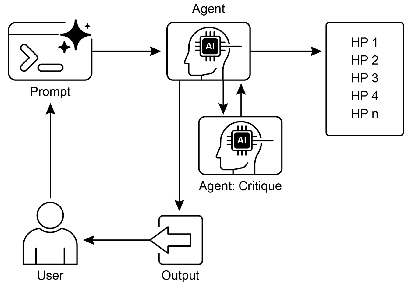

# 智能体实战之探索与发现：主动认知拓展的新范式 


## 一.简介

## 引言：超越预定义边界的智能体

在人工智能的发展历程中，我们见证了从被动执行指令到主动探索未知的转变。探索与发现模式代表了AI Agent的一种高级能力，使其能够超越预编程的知识边界，主动寻求新信息、发现新可能性并识别环境中的未知因素。这种能力不同于简单的优化或在已知解决方案空间内寻找答案，而是赋予Agent一种类似人类的好奇心和探索欲，使其能够在复杂、开放和快速变化的环境中自主导航。

## 核心概念：主动认知与未知探索

探索与发现模式的核心在于将AI Agent从被动的响应者转变为主动的探索者。这种模式的关键特征包括：

- **主动信息获取**：Agent能够自主识别知识空白并主动寻找相关信息
- **可能性空间扩展**：不局限于已知解决方案，而是探索全新的可能性
- **未知因素识别**：能够发现并表征"未知的未知"因素
- **知识生成**：通过探索过程创造新的理解和知识

这种模式对于在开放式、复杂或快速演变的环境中运行的Agent至关重要，因为在这些环境中，静态知识或预编程的解决方案往往不足以应对挑战。它强调的是Agent扩展自身理解和能力的能力，而非简单地执行预设任务。

## 实际应用：多领域的探索与创新

探索与发现模式在各个领域都有广泛应用，以下是一些典型场景：

- **科学研究**：AI Agent可以设计实验、分析结果并提出新假设，加速科学发现过程
- **战略规划**：在商业或军事领域，探索多种可能的未来情景并制定应对策略
- **创意产业**：探索风格、主题或数据的新组合，生成创新的艺术、音乐或文学作品
- **安全分析**：主动探测系统或网络中的潜在漏洞和威胁
- **教育个性化**：根据学习者的情况动态调整教学内容和路径
- **市场洞察**：分析非结构化数据以识别新兴趋势和消费者行为变化

## 二.实践案例：智能网络安全漏洞分析系统

该系统能够主动探测系统或网络中的潜在漏洞和威胁。这个系统模拟了安全专家的分析过程，通过多Agent协作来全面评估网络系统的安全性。  

几个核心组件组成： 

    网络扫描Agent：负责收集目标系统的基本信息 
    漏洞分析Agent：使用DeepSeek分析潜在漏洞 
    威胁评估Agent：评估发现的威胁的严重程度 
    报告生成Agent：生成详细的安全报告和建议 

## 三.langchain实现
```python
from typing import Optional

from langchain_classic.agents import create_openai_tools_agent, AgentExecutor
from langchain_core.prompts import ChatPromptTemplate
from langchain_core.tools import Tool

from init_client import init_llm

llm = init_llm(temperature=0.2)


# 使用本地模拟搜索结果
def local_search(query: str) -> str:
    """使用本地模拟搜索结果"""
    # 这里可以根据关键词返回一些预定义的搜索结果
    # 实际应用中，可以构建一个本地知识库或使用离线搜索引擎

    # 模拟一些常见漏洞的搜索结果
    if "CVE" in query or "vulnerability" in query.lower():
        return """
        常见漏洞信息：
        1. CVE-2023-1234: Apache Struts2 远程代码执行漏洞，影响版本2.0.0-2.5.30
        2. CVE-2023-5678: OpenSSL 拒绝服务漏洞，影响版本1.1.1-1.1.1t
        3. CVE-2023-9012: Spring Framework 路径遍历漏洞，影响版本5.3.0-5.3.31
        """
    elif "apache" in query.lower():
        return """
        Apache常见安全问题：
        1. 默认配置可能泄露敏感信息
        2. 旧版本可能存在已知漏洞
        3. 不安全的HTTP方法可能被启用
        """
    elif "ssh" in query.lower():
        return """
        SSH常见安全问题：
        1. 弱密码或默认密码
        2. 使用不安全的加密算法
        3. 允许root用户直接登录
        4. 未限制登录尝试次数
        """
    else:
        return "未找到相关信息。请尝试更具体的搜索词，如'Apache CVE'或'SSH安全配置'。"


# 使用本地漏洞数据库
def local_vulnerability_db(component: str, version: str = "") -> str:
    """查询本地漏洞数据库"""
    # 这里可以维护一个本地漏洞数据库，如JSON文件或SQLite数据库
    # 示例中使用简单的字典

    vulnerability_db = {
        "apache": {
            "2.4.48": ["CVE-2021-34798: mod_proxy 漏洞", "CVE-2021-36160: 路径遍历漏洞"],
            "2.4.49": ["CVE-2021-40438: mod_proxy 漏洞", "CVE-2021-44790: 缓冲区溢出"],
            "2.4.50": ["CVE-2021-41773: 路径遍历漏洞", "CVE-2021-42013: 路径遍历漏洞"]
        },
        "openssh": {
            "8.2p1": ["CVE-2021-28041: scp 客户端漏洞"],
            "8.5p1": ["CVE-2021-41617: 特权提升漏洞"],
            "9.0p1": ["CVE-2023-25136: 前置条件竞争漏洞"]
        },
        "nginx": {
            "1.18.0": ["CVE-2021-23017: 解析器漏洞"],
            "1.20.1": ["CVE-2021-3618: 内存泄漏漏洞"],
            "1.21.6": ["CVE-2022-41741: 内存损坏漏洞"]
        }
    }

    component = component.lower()
    if component in vulnerability_db:
        if version and version in vulnerability_db[component]:
            return f"{component} {version} 的已知漏洞: {', '.join(vulnerability_db[component][version])}"
        else:
            all_vulns = []
            for ver, vulns in vulnerability_db[component].items():
                all_vulns.extend(vulns)
            return f"{component} 的已知漏洞: {', '.join(all_vulns)}"
    else:
        return f"未找到 {component} 的漏洞信息"


# 定义工具
tools = [
    Tool(
        name="NetworkScan",
        func=lambda target: "模拟网络扫描结果：发现端口22(SSH), 80(HTTP), 443(HTTPS)",
        description="对目标IP或域名执行基本的网络扫描，识别开放端口和服务"
    ),
    Tool(
        name="WebCrawl",
        func=lambda url: f"模拟网页内容爬取：从 {url} 获取到服务器信息：Apache/2.4.49",
        description="爬取网站的基本信息，包括HTML内容和响应头"
    ),
    Tool(
        name="LocalSearch",
        func=local_search,
        description="使用本地搜索功能查找安全相关信息，不需要外网访问"
    ),
    Tool(
        name="LocalVulnerabilityDB",
        func=local_vulnerability_db,
        description="查询本地漏洞数据库，查找已知组件的漏洞信息"
    ),
    Tool(
        name="DeepSeekAnalyze",
        func=lambda x: llm.invoke(
            f"作为网络安全专家，请分析以下信息中的潜在安全漏洞和威胁:\n\n{x}\n\n请提供:\n1. 发现的潜在漏洞列表\n2. 每个漏洞的严重程度评估(高/中/低)\n3. 可能的攻击向量\n4. 建议的修复措施"),
        description="使用DeepSeek进行深度安全分析，识别代码或配置中的潜在漏洞"
    )
]

# 创建Agent
# 1. 网络扫描Agent
network_scanner_prompt = ChatPromptTemplate.from_messages([
    ("system", "你是一名网络安全专家，负责对目标系统进行初步扫描和信息收集。你的任务是使用NetworkScan和WebCrawl工具收集目标的基本信息，为后续分析做准备。"),
    ("user", "{input}"),
    ("assistant", "{agent_scratchpad}")
])

network_scanner_agent = create_openai_tools_agent(llm, tools, network_scanner_prompt)
network_scanner_executor = AgentExecutor(agent=network_scanner_agent, tools=tools, verbose=True)

# 2. 漏洞分析Agent
vulnerability_analyzer_prompt = ChatPromptTemplate.from_messages([
    ("system", "你是一名漏洞分析专家，负责分析系统配置和代码中的潜在安全漏洞。使用DeepSeekAnalyze工具进行深度分析，并使用LocalVulnerabilityDB和LocalSearch查找已知漏洞。"),
    ("user", "{input}"),
    ("assistant", "{agent_scratchpad}")
])

vulnerability_analyzer_agent = create_openai_tools_agent(llm, tools, vulnerability_analyzer_prompt)
vulnerability_analyzer_executor = AgentExecutor(agent=vulnerability_analyzer_agent, tools=tools, verbose=True)

# 3. 威胁评估Agent
threat_assessor_prompt = ChatPromptTemplate.from_messages([
    ("system", "你是一名威胁评估专家，负责评估已发现漏洞的威胁程度和潜在影响。你需要考虑漏洞的严重性、利用难度和潜在的业务影响。"),
    ("user", "{input}"),
    ("assistant", "{agent_scratchpad}")
])

threat_assessor_agent = create_openai_tools_agent(llm, tools, threat_assessor_prompt)
threat_assessor_executor = AgentExecutor(agent=threat_assessor_agent, tools=tools, verbose=True)

# 4. 报告生成Agent
report_generator_prompt = ChatPromptTemplate.from_messages([
    ("system", "你是一名安全报告专家，负责生成详细的安全评估报告，包括发现的漏洞、威胁评估和修复建议。报告应该清晰、专业且可操作。"),
    ("user", "{input}"),
    ("assistant", "{agent_scratchpad}")
])

report_generator_agent = create_openai_tools_agent(llm, tools, report_generator_prompt)
report_generator_executor = AgentExecutor(agent=report_generator_agent, tools=tools, verbose=True)


# 主函数
def security_analysis(target: str, config_or_code: Optional[str] = None) -> str:
    """执行完整的安全分析流程"""

    # 阶段1：网络扫描和信息收集
    print("=== 阶段1：网络扫描和信息收集 ===")
    scan_result = network_scanner_executor.invoke({
        "input": f"请对目标 {target} 进行网络扫描和信息收集，包括开放端口、运行的服务和网站基本信息。"
    })

    # 阶段2：漏洞分析
    print("\n=== 阶段2：漏洞分析 ===")
    vulnerability_input = f"基于以下扫描结果分析潜在漏洞：\n{scan_result['output']}"
    if config_or_code:
        vulnerability_input += f"\n\n同时分析以下配置或代码中的安全漏洞：\n{config_or_code}"

    vulnerability_result = vulnerability_analyzer_executor.invoke({
        "input": vulnerability_input
    })

    # 阶段3：威胁评估
    print("\n=== 阶段3：威胁评估 ===")
    threat_result = threat_assessor_executor.invoke({
        "input": f"基于以下漏洞分析结果，评估每个漏洞的威胁程度和潜在影响：\n{vulnerability_result['output']}"
    })

    # 阶段4：生成报告
    print("\n=== 阶段4：生成安全报告 ===")
    report_input = f"""
    基于以下信息生成详细的安全评估报告：

    1. 扫描结果：
    {scan_result['output']}

    2. 漏洞分析：
    {vulnerability_result['output']}

    3. 威胁评估：
    {threat_result['output']}

    报告应包括：
    - 执行摘要
    - 发现的漏洞列表及严重程度
    - 潜在业务影响
    - 详细的修复建议
    - 长期安全改进措施
    """

    report_result = report_generator_executor.invoke({
        "input": report_input
    })

    return report_result['output']


# 使用示例
if __name__ == "__main__":
    # 示例1：模拟分析网站
    target_website = "example.com"
    security_report = security_analysis(target_website)
    print("=== 安全分析报告 ===")
    print(security_report)

    # 示例2：分析网络配置
    network_config = """
    # 路由器配置
    interface GigabitEthernet0/0
     ip address 192.168.1.1 255.255.255.0
     no shutdown
    !
    line vty 0 4
     password cisco123
     login
    !
    enable secret 5 $1$mERr$hh5V0fV9B9kXpWEp6oY6X.
    """

    security_report_config = security_analysis("192.168.1.1", network_config)
    print("\n=== 网络配置安全分析报告 ===")
    print(security_report_config)
```

## 项目分析

### 1. 从“被动匹配”到“主动推理”的认知飞跃

这是该范式最核心的体现。

*   **旧范式（被动匹配）**：传统的漏洞扫描器，其本质是一个“数据库查询工具”。它将扫描到的软件版本（如 Apache 2.4.49）与一个已知的CVE漏洞数据库进行比对。如果匹配，就报告一个已知漏洞。它的能力上限是其数据库的大小，它只能发现“**已知的已知**”。

*   **本案例（主动推理）**：系统的核心是 `DeepSeekAnalyze` 工具。当它接收到一段网络配置或代码时，它不是在查找字符串，而是在进行**深度推理**。
    *   **代码体现**：
        ```python
        def deepseek_analyze_security(code_or_config: str, analysis_type: str) -> str:
            prompt = f"""
            作为网络安全专家，请分析以下{analysis_type}中的潜在安全漏洞和威胁:
            
            {code_or_config}
            
            请提供:
            1. 发现的潜在漏洞列表
            2. 每个漏洞的严重程度评估(高/中/低)
            3. 可能的攻击向量
            4. 建议的修复措施
            """
            response = llm.invoke(prompt)
            return response
        ```
    *   **范式解读**：这里的 `llm.invoke(prompt)` 触发的是一个认知过程。DeepSeek模型会**理解**配置的语义，**推理**其中的逻辑关系。它可能会发现：
        *   **逻辑漏洞**：“虽然A和B两条规则单独看是安全的，但它们的组合在特定流量模式下会产生一个竞态条件，导致权限绕过。” 这种漏洞几乎不可能出现在任何CVE数据库中。
        *   **上下文风险**：“这个配置在测试环境中是安全的，但暴露在公网上会泄露内部网络拓扑。”
        *   **非标准威胁**：“这个自定义脚本虽然实现了功能，但其错误处理机制不当，可能被用来进行DoS攻击。”

    这就是**主动探索**未知威胁空间，从“匹配”升级到了“**发现**”。

### 2. 超越预定义知识边界，生成“新知识”

该系统的目标不是复述信息，而是创造新的见解。

*   **旧范式**：输出是漏洞列表和CVE编号。
*   **本案例**：输出是结构化的、包含**新见解**的报告。
    *   **代码体现**：整个多Agent工作流的设计就是为了知识的生成。
        1.  `network_scanner` 收集原始数据。
        2.  `vulnerability_analyzer` 将原始数据转化为初步的安全洞察。
        3.  `threat_assessor` 评估这些洞察的影响，生成“威胁等级”和“业务影响”等新信息。
        4.  `report_generator` 将所有碎片化的信息**综合、提炼、升华**，形成一份具有战略价值的报告。
    *   **范式解读**：`report_generator` Agent的提示词明确要求它不仅仅是罗列，而是要**生成**“执行摘要”、“潜在业务影响”和“长期安全改进措施”。这些内容在输入信息中是不存在的，是系统通过**认知拓展**创造出来的新知识。它将分散的技术点，连接成了一个有价值的商业或战略叙事。

### 3. 通过多Agent协作模拟复杂认知过程

人类的探索与发现往往不是单打独斗，而是团队协作的结果。这个系统巧妙地模拟了这一点。

*   **代码体现**：系统定义了四个具有不同“专业”和“认知角色”的Agent：
    *   `network_scanner`：**感知与信息收集者**。它的任务是“看”和“听”，为系统提供原始素材。
    *   `vulnerability_analyzer`：**分析师与侦探**。它的任务是深入挖掘，寻找线索和证据。
    *   `threat_assessor`：**风险评估师与战略家**。它的任务是评估发现的威胁有多大，以及可能造成的后果。
    *   `report_generator`：**沟通者与报告撰写人**。它的任务是整合所有发现，并以清晰、有说服力的方式呈现出来。
*   **范式解读**：这种分工协作使得整个系统能够处理一个极其复杂的开放式问题——“评估这个系统的安全性”。每个Agent专注于一个认知子任务，它们的输出串联起来，就形成了一个完整的、从数据到智慧的认知链条。这远比一个单一、庞大的程序要灵活和强大，也更接近人类的智慧工作方式。

### 4. 在开放式环境中进行适应性探索

现实世界的网络环境是复杂、多变且信息不完整的。一个好的探索系统必须能应对这种不确定性。

*   **代码体现**：
    *   工具的设计允许处理不完美的信息。例如，`LocalSearch` 和 `LocalVulnerabilityDB` 提供了基础上下文，但真正的探索能力来自于 `DeepSeekAnalyze` 对这些信息的**超越性解读**。
    *   整个工作流是**数据驱动**的。`vulnerability_analyzer` 的输入是 `network_scanner` 的输出。这意味着如果扫描结果不同，后续的分析路径也会完全不同。系统会根据它“看到”的东西来决定下一步“想”什么。
*   **范式解读**：系统没有被写死“如果看到Apache 2.4.49，就报告CVE-2021-41773”。相反，它的指令是“分析你看到的东西，并告诉我这意味着什么”。这种**适应性**是主动探索的关键。它允许系统在面对前所未见的配置或软件时，依然能够基于其推理能力做出有价值的判断，从而实现了认知边界的**拓展**。

## 四.langgraph实现
```python
from typing import Optional, List

from typing_extensions import TypedDict, Annotated
from langchain_core.messages import BaseMessage, HumanMessage, AIMessage
from langgraph.graph import StateGraph, END
from langgraph.checkpoint.memory import MemorySaver
from init_client import init_llm

# --- 1. 初始化核心模型 ---
llm = init_llm(temperature=0.2)

# --- 2. 定义“认知状态” ---
class SecurityAnalysisState(TypedDict):
    target: str
    config_or_code: Optional[str]
    # messages 列表记录了整个探索过程的“思考轨迹”
    messages: Annotated[List[BaseMessage], "The messages in the conversation"]
    scan_results: Optional[str]
    vulnerability_analysis: Optional[str]
    threat_assessment: Optional[str]
    final_report: Optional[str]


# --- 3. 定义“工具”函数（模拟外部知识获取） ---

def local_search(query: str) -> str:
    """模拟本地搜索，提供上下文知识。"""
    if "CVE" in query or "vulnerability" in query.lower():
        return "常见漏洞信息：CVE-2023-1234 (Apache RCE), CVE-2023-5678 (OpenSSL DoS)"
    elif "apache" in query.lower():
        return "Apache常见安全问题：默认配置泄露、旧版本漏洞、不安全的HTTP方法。"
    else:
        return "未找到相关信息。"


def local_vulnerability_db(component: str, version: str = "") -> str:
    """查询本地漏洞数据库。"""
    db = {
        "apache": {"2.4.49": "存在路径遍历漏洞 (CVE-2021-41773) 和 mod_proxy 漏洞 (CVE-2021-40438)。"},
        "openssh": {"8.2p1": "存在scp客户端信息泄露漏洞 (CVE-2021-28041)。"}
    }
    if component.lower() in db:
        return db[component.lower()].get(version, f"找到 {component} 的相关漏洞信息。")
    return f"未找到 {component} 的漏洞信息。"


# --- 4. 定义“认知节点” ---

def initial_scan_node(state: SecurityAnalysisState):
    """节点1：信息收集与初步扫描"""
    print("--- 🔍 执行节点1: 初始扫描与信息收集 ---")
    # 模拟扫描结果，以体现探索的起点
    simulated_scan_result = f"对 {state['target']} 的扫描结果：\n- 开放端口: 22(SSH), 80(HTTP)\n- Web服务器: Apache/2.4.49\n- SSH版本: OpenSSH_8.2p1"

    # 将发现作为消息添加到状态中，形成“思考链”
    new_message = AIMessage(content=f"初步扫描完成。发现:\n{simulated_scan_result}")

    return {"scan_results": simulated_scan_result, "messages": [new_message]}


def vulnerability_analysis_node(state: SecurityAnalysisState):
    """节点2：深度漏洞分析（核心探索与发现）"""
    print("\n--- 🧠 执行节点2: 深度漏洞分析 ---")

    # 构建一个复杂的提示，引导 LLM 进行主动推理和探索
    analysis_prompt = f"""
    作为一名资深的网络安全专家，请基于以下信息进行深度分析。
    你的任务不仅仅是匹配已知漏洞，更是要**推理和发现潜在的、组合式的安全风险**。

    **扫描结果:**
    {state['scan_results']}

    **本地知识库查询:**
    - Apache 2.4.49: {local_vulnerability_db('apache', '2.4.49')}
    - OpenSSH 8.2p1: {local_vulnerability_db('openssh', '8.2p1')}

    **分析要求:**
    1.  **关联分析**: 结合扫描结果和本地知识，评估这些服务同时运行可能带来的复合风险。
    2.  **推理未知**: 基于这些版本，推测可能存在的、尚未被广泛记录的配置错误或逻辑漏洞。
    3.  **生成新知**: 提出一个你的独特见解，例如一个非标准的攻击向量或一个容易被忽视的安全隐患。

    请提供结构化的分析报告。
    """

    # 使用 llm 进行深度分析，这是从“数据”到“洞察”的关键一步
    analysis = llm.invoke(analysis_prompt)

    new_message = AIMessage(content=f"深度漏洞分析完成。分析结果:\n{analysis.content}")

    return {"vulnerability_analysis": analysis.content, "messages": [new_message]}


def threat_assessment_node(state: SecurityAnalysisState):
    """节点3：威胁评估与优先级排序"""
    print("\n--- ⚖️ 执行节点3: 威胁评估 ---")

    assessment_prompt = f"""
    作为一名安全主管，请对以下漏洞分析结果进行威胁评估。

    **漏洞分析报告:**
    {state['vulnerability_analysis']}

    **评估标准:**
    - 可利用性: 攻击者利用该漏洞的难易程度。
    - 影响范围: 成功攻击后可能对业务造成的损害。
    - 修复成本: 修复该漏洞所需的时间和资源。

    请为每个发现的漏洞评定一个威胁等级（高、中、低），并解释原因。最后，给出一个修复优先级的建议。
    """

    assessment = llm.invoke(assessment_prompt)

    new_message = AIMessage(content=f"威胁评估完成。评估结果:\n{assessment.content}")

    return {"threat_assessment": assessment.content, "messages": [new_message]}


def report_generation_node(state: SecurityAnalysisState):
    """节点4：综合报告生成"""
    print("\n--- 📄 执行节点4: 生成最终报告 ---")

    report_prompt = f"""
    请将以下所有分析过程和结果，整合成一份专业的安全评估报告。

    **目标:** {state['target']}
    **扫描结果:** {state['scan_results']}
    **漏洞分析:** {state['vulnerability_analysis']}
    **威胁评估:** {state['threat_assessment']}

    报告应包含以下部分：
    1. 执行摘要
    2. 详细发现
    3. 风险评估与优先级
    4. 可操作的修复建议
    5. 结论
    """

    final_report = llm.invoke(report_prompt)

    new_message = AIMessage(content=f"最终报告已生成。")

    return {"final_report": final_report.content, "messages": [new_message]}

# --- 5. 构建并编译“认知工作流图” ---

def create_security_analysis_workflow():
    workflow = StateGraph(SecurityAnalysisState)

    # 添加节点
    workflow.add_node("initial_scan", initial_scan_node)
    workflow.add_node("vulnerability_analysis", vulnerability_analysis_node)
    workflow.add_node("threat_assessment", threat_assessment_node)
    workflow.add_node("report_generation", report_generation_node)

    # 定义入口点
    workflow.set_entry_point("initial_scan")

    # 定义边（流程）-> 这定义了认知的线性推进路径
    workflow.add_edge("initial_scan", "vulnerability_analysis")
    workflow.add_edge("vulnerability_analysis", "threat_assessment")
    workflow.add_edge("threat_assessment", "report_generation")
    workflow.add_edge("report_generation", END)

    # 编译图，添加内存以保存状态
    memory = MemorySaver()
    app = workflow.compile(checkpointer=memory)

    return app


# --- 6. 执行探索与发现流程 ---

def run_security_analysis(target: str, config_or_code: Optional[str] = None):
    """启动并运行整个安全分析工作流。"""

    # 创建工作流实例
    app = create_security_analysis_workflow()

    # 初始化状态
    initial_state = {
        "target": target,
        "config_or_code": config_or_code,
        "messages": [HumanMessage(content=f"开始对 {target} 进行全面的安全分析。")],
        "scan_results": None,
        "vulnerability_analysis": None,
        "threat_assessment": None,
        "final_report": None
    }

    # 执行工作流，thread_id 用于在内存中跟踪特定会话
    config = {"configurable": {"thread_id": "security-analysis-001"}}
    final_state = app.invoke(initial_state, config)

    # 打印完整的思考轨迹
    print("\n\n===== 完整的认知探索轨迹 =====")
    for message in final_state["messages"]:
        print(f"{message.type}: {message.content[:100]}...")

    # 返回最终发现
    return final_state["final_report"]

if __name__ == "__main__":
    # 模拟网站
    target_system = "internal-web-server.example.com"
    final_security_report = run_security_analysis(target_system)

    print("\n\n===============================")
    print("   最终安全分析报告")
    print("===============================")
    print(final_security_report)
```

## 项目分析

### 1. 显式的“认知状态”代表知识的累积

这是该范式最核心的体现，也是 LangGraph 相较于其他框架最独特的优势。

*   **旧范式（信息孤岛）**：在传统的脚本或简单的 Agent 链中，信息通过函数参数传来传去，没有一个统一的、演进的“知识体”。系统的“记忆”是碎片化的。

*   **本案例（统一认知状态）**：
    *   **代码体现**：
        ```python
        class SecurityAnalysisState(TypedDict):
            target: str
            messages: Annotated[List[BaseMessage], "The messages in the conversation"]
            scan_results: Optional[str]
            vulnerability_analysis: Optional[str]
            # ... 其他状态字段
        ```
    *   **范式解读**：`SecurityAnalysisState` 不仅仅是一个数据结构，它是整个系统的**核心记忆和认知载体**。它代表了系统在探索过程中的**完整认知状态**。每经过一个节点，状态就被更新，新的发现被整合进来。这完美模拟了人类专家在分析过程中不断积累信息、修正假设、深化理解的过程。特别是 `messages` 字段，它记录了整个“思考链”，使认知过程完全透明、可追溯。**系统在探索，它的“世界观”（State）就在不断拓展。**

### 2. “认知节点”是专门化的探索模块

人类的探索与发现往往不是单打独斗，而是团队协作的结果。这个系统巧妙地模拟了这一点。

*   **旧范式（混沌的单一智能体）**：一个单一的 Agent 循环，根据 LLM 的判断调用工具，过程相对“混沌”，缺乏结构化的分工。

*   **本案例（结构化的专家团队）**：
    *   **代码体现**：每个节点都是一个独立的认知功能模块，拥有明确的“专业”和“认知角色”。
        ```python
        def vulnerability_analysis_node(state: SecurityAnalysisState):
            # ...
            analysis_prompt = f"""
            ...
            2.  **推理未知**: 基于这些版本，推测可能存在的、尚未被广泛记录的配置错误或逻辑漏洞。
            3.  **生成新知**: 提出一个你的独特见解...
            """
            analysis = llm.invoke(analysis_prompt)
            # ...
        ```
    *   **范式解读**：这种分工协作使得整个系统能够处理一个极其复杂的开放式问题。每个节点专注于一个认知子任务：
        *   `initial_scan_node`：**感知与信息收集者**。
        *   `vulnerability_analysis_node`：**分析师与侦探**。这是“探索与发现”的核心。它的提示词明确要求 LLM **超越已知信息，进行关联推理和生成新知**，而不是简单地匹配 CVE。
        *   `threat_assessment_node`：**风险评估师与战略家**。
        *   `report_generation_node`：**沟通者与报告撰写人**。
    这种模块化使得系统更强大、更易于理解，也更接近人类智慧工作方式。

### 3. “工作流图”定义了结构化的探索路径

现实世界的网络环境是复杂、多变且信息不完整的。一个好的探索系统必须能应对这种不确定性。

*   **旧范式（随机的探索路径）**：探索路径是动态生成的，依赖于 LLM 的每一次决策，虽然灵活但可能缺乏全局最优性和严谨性。

*   **本案例（科学化的探索流程）**：
    *   **代码体现**：
        ```python
        workflow.add_edge("initial_scan", "vulnerability_analysis")
        workflow.add_edge("vulnerability_analysis", "threat_assessment")
        workflow.add_edge("threat_assessment", "report_generation")
        ```
    *   **范式解读**：`StateGraph` 明确定义了一个**结构化的、线性的认知路径**。这代表了一种成熟的、经过验证的科学探索方法：
        1.  收集数据 (`initial_scan`)
        2.  分析数据，形成假设 (`vulnerability_analysis`)
        3.  评估假设的重要性 (`threat_assessment`)
        4.  得出结论 (`report_generation`)
    这种确定性确保了探索过程的严谨性和完整性，避免了遗漏关键步骤。它将一个复杂的开放式问题，分解为一系列可管理的、有序的认知阶段。**系统不是在随机漫步，而是在遵循一张认知地图进行有序探索。**

### 4. 从“反应式工具调用”到“主动式状态演进”

这是对系统自主性层次的深刻洞察。

*   **旧范式（反应式）**：`LangChain Agent` 通常是反应式的：“我看到一个结果，我决定下一个工具。” 它的意图是局部的、即时的。

*   **本案例（主动式与状态驱动）**：
    *   **代码体现**：整个流程的驱动力是**状态的演进**。每个节点的目标就是将当前状态推进到下一个更丰富的状态。
        ```python
        def initial_scan_node(state: SecurityAnalysisState):
            # ...
            return {"scan_results": simulated_scan_result, "messages": [new_message]}
        ```
    *   **范式解读**：系统的“意图”不是“我下一步该调用哪个工具？”，而是“我该如何完成我的认知任务，以更新整体状态？”。这是一种更高层次的自主性，更接近于人类设定目标并分步实现的过程。**系统被一个更高层次的目标——“完成安全分析”——所驱动，而不是被底层的工具选择所驱动。**

