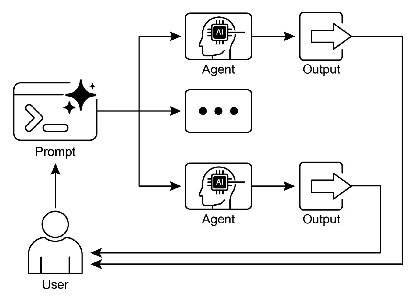

# 智能体实战之并行化：多任务协同的智能体


## 一.并行化模式概述

在前面的章节中，我们探讨了用于顺序工作流的提示链和用于动态决策及不同路径间转换的路由。虽然这些模式不可或缺，但许多复杂的Agent任务涉及多个可同时执行而非顺序执行的子任务。这正是并行化模式变得至关重要的场景。

并行化涉及并发执行多个组件，包括LLM调用、工具使用乃至整个子Agent。不同于顺序等待每个步骤完成，并行执行允许独立任务同时运行，从而显著缩短可分解为独立部分的任务的总执行时间。

设想一个旨在分析文档并提取不同方面信息的Agent。顺序方法可能如下：

```
分析文档的情感倾向
提取文档中的关键实体
总结文档的主要内容
基于以上分析生成综合报告
```

而并行方法则可改为：

```
同时分析文档的情感倾向、提取关键实体和总结内容
基于所有并行分析结果生成综合报告（此步骤通常为顺序执行，需等待并行步骤完成）
```

核心思想是识别工作流中不依赖其他部分输出的环节并并行执行。这在处理具有延迟的外部服务（如API或数据库）时尤其有效，因为您可以并发发出多个请求。

实现并行化通常需要支持异步执行或多线程/多进程的框架。现代Agent框架在设计时已充分考虑异步操作，使您能够轻松定义可并行运行的步骤。并行化模式对于提升Agent系统的效率和响应能力至关重要，特别是在处理涉及多个独立查询、计算或与外部服务交互的任务时。这是优化复杂Agent工作流性能的关键技术。

## 二.案例实战
核心目标是：**从给定的网页URL加载文档，然后同时（并行）对该文档进行四种不同类型的分析，最后将所有分析结果整合成一份全面的报告。**

## 三.LangChain实现

以下实现展示了使用LangChain框架与DeepSeek模型构建的并行文档分析工作流。该工作流设计用于对同一文档并行执行多种分析任务，然后将结果整合为综合报告。

```python
import asyncio
import os
os.environ["USER_AGENT"] = "chapter3/langchain_example"  # 可自定义名称和联系方式

from langchain_core.prompts import ChatPromptTemplate
from langchain_core.output_parsers import StrOutputParser, JsonOutputParser
from langchain_core.runnables import Runnable, RunnableParallel, RunnablePassthrough
from langchain_community.document_loaders import WebBaseLoader
from langchain_text_splitters import RecursiveCharacterTextSplitter

# --- 初始化llm ---
from init_client import init_llm

llm = init_llm(0.3)


# --- 文档加载和预处理 ---
def load_and_process_document(url: str) -> str:
    """加载并处理文档，返回文本内容"""
    loader = WebBaseLoader(url)
    documents = loader.load()
    text_splitter = RecursiveCharacterTextSplitter(chunk_size=2000, chunk_overlap=200)
    texts = text_splitter.split_documents(documents)
    # 合并所有文本块为一个完整文档
    full_text = "\n\n".join([doc.page_content for doc in texts])
    return full_text


# --- 定义并行分析链 ---
# 情感分析链
sentiment_chain: Runnable = (
        ChatPromptTemplate.from_messages([
            ("system", "分析以下文本的整体情感倾向（积极、消极或中性），并提供简短解释："),
            ("user", "{text}")
        ])
        | llm
        | StrOutputParser()
)

# 关键实体提取链
entities_chain: Runnable = (
        ChatPromptTemplate.from_messages([
            ("system", "从以下文本中提取并列出所有重要实体（人物、组织、地点等），以JSON格式返回，包含实体类型和实体名称："),
            ("user", "{text}")
        ])
        | llm
        | JsonOutputParser()
)

# 主题提取链
topics_chain: Runnable = (
        ChatPromptTemplate.from_messages([
            ("system", "从以下文本中识别3-5个主要主题或概念，每个主题不超过5个词："),
            ("user", "{text}")
        ])
        | llm
        | StrOutputParser()
)

# 摘要生成链
summary_chain: Runnable = (
        ChatPromptTemplate.from_messages([
            ("system", "为以下文本生成一个简洁的摘要（不超过200字）："),
            ("user", "{text}")
        ])
        | llm
        | StrOutputParser()
)

# --- 构建并行 + 综合链 ---
# 1. 定义要并行运行的任务块
parallel_analysis = RunnableParallel(
    {
        "sentiment": sentiment_chain,
        "entities": entities_chain,
        "topics": topics_chain,
        "summary": summary_chain,
        "text": RunnablePassthrough(),  # 传递原始文本
    }
)

# 2. 定义将组合并行结果的最终综合提示词
synthesis_prompt = ChatPromptTemplate.from_messages([
    ("system", """基于以下分析结果：
    情感分析：{sentiment}
    关键实体：{entities}
    主要主题：{topics}
    内容摘要：{summary}

    生成一个全面的分析报告，包含以上所有方面的洞察，并突出最重要的发现。"""),
    ("user", "原始文本片段：{text}...")
])

# 3. 构建完整链
full_analysis_chain = parallel_analysis | synthesis_prompt | llm | StrOutputParser()


# --- 运行链 ---
async def analyze_document(url: str) -> None:
    """
    异步分析文档，并行执行多种分析任务
    参数：
        url: 要分析的文档URL
    """
    if not llm:
        print("LLM未初始化。无法运行示例。")
        return

    # print(f"\n--- 开始分析文档：{url} ---")
    try:
        # 加载并处理文档
        document_text = load_and_process_document(url)
        document_text = document_text[:500]
        print(f"文档加载完成，长度：{len(document_text)} 字符")

        # 并行执行分析
        print("\n--- 执行并行分析 ---")
        response = await full_analysis_chain.ainvoke(document_text)

        print("\n--- 分析结果 ---")
        print(response)
    except Exception as e:
        print(f"\n分析过程中发生错误：{e}")


if __name__ == "__main__":
    article_url = "https://hub.baai.ac.cn/view/50604"
    asyncio.run(analyze_document(article_url))


```

## 代码解释：

---

### 1. 模型初始化

```python
from init_client import init_llm

llm = init_llm(0.3)

```

### 2. 文档加载与预处理

```python
from langchain_community.document_loaders import WebBaseLoader
from langchain_text_splitters import RecursiveCharacterTextSplitter

def load_and_process_document(url: str) -> str:
    loader = WebBaseLoader(url)
    documents = loader.load()
    text_splitter = RecursiveCharacterTextSplitter(chunk_size=2000, chunk_overlap=200)
    texts = text_splitter.split_documents(documents)
    full_text = "\n\n".join([doc.page_content for doc in texts])
    return full_text
```

**解释：**

*   `WebBaseLoader(url)`：这是一个LangChain社区组件，用于抓取指定URL的网页内容，并将其转换为LangChain的`Document`对象格式。
*   `RecursiveCharacterTextSplitter`：LLM的上下文窗口（一次能处理的文本长度）是有限的。因此，长文档需要被分割成更小的块。
    *   `chunk_size=2000`：每个文本块大约2000个字符。
    *   `chunk_overlap=200`：相邻的文本块之间有200个字符的重叠。这可以确保在分割时不会丢失上下文信息，比如一个句子不会被硬生生切断。
*   `full_text = "\n\n".join(...)`：在这个特定示例中，我们的分析链是针对**整个文档**进行操作的。因此，在分割后，我们又用换行符将所有文本块重新合并成一个大的字符串，以便后续的并行分析可以基于完整的上下文。

---

### 3. 定义独立的并行任务（“分”）

这是并行化模式的核心。我们定义了四个完全独立的LangChain链，每个链执行一种特定的分析任务。

```python
# 情感分析链
sentiment_chain: Runnable = (
    ChatPromptTemplate.from_messages([...]) | llm | StrOutputParser()
)

# 关键实体提取链
entities_chain: Runnable = (
    ChatPromptTemplate.from_messages([...]) | llm | JsonOutputParser()
)

# 主题提取链
topics_chain: Runnable = (
    ChatPromptTemplate.from_messages([...]) | llm | StrOutputParser()
)

# 摘要生成链
summary_chain: Runnable = (
    ChatPromptTemplate.from_messages([...]) | llm | StrOutputParser()
)
```

**解释：**

*   **LCEL语法**：`|` 是LangChain表达式语言（LCEL）的管道操作符。它将前一个组件的输出作为后一个组件的输入。
*   **每个链的结构**：
    1.  `ChatPromptTemplate`：定义发送给LLM的提示词。`{text}` 是一个占位符，在运行时会被实际的文档文本替换。
    2.  `llm`：我们之前初始化的DeepSeek模型实例。
    3.  `OutputParser`：解析LLM的原始输出。
        *   `StrOutputParser()`：将LLM的响应转换为纯字符串。
        *   `JsonOutputParser()`：强制LLM输出JSON格式的字符串，并将其解析为Python字典，非常适合结构化数据提取（如实体列表）。
*   **独立性**：这四个链互不依赖，它们都只需要同一个输入——`{text}`。这使得它们成为并行执行的理想候选者。

---

### 4. 构建并行执行与综合流程（“合”）

现在，我们将独立的任务组合起来，先并行执行，再汇总结果。

```python
# 1. 定义要并行运行的任务块
parallel_analysis = RunnableParallel(
    {
        "sentiment": sentiment_chain,
        "entities": entities_chain,
        "topics": topics_chain,
        "summary": summary_chain,
        "text": RunnablePassthrough(),  # 传递原始文本
    }
)

# 2. 定义将组合并行结果的最终综合提示词
synthesis_prompt = ChatPromptTemplate.from_messages([...])

# 3. 构建完整链
full_analysis_chain = parallel_analysis | synthesis_prompt | llm | StrOutputParser()
```

**解释：**

*   **`RunnableParallel`**：这是实现并行的关键组件。
    *   它接收一个字典。字典的**键**（如 `"sentiment"`, `"entities"`）将成为最终输出字典的键。
    *   字典的**值**（如 `sentiment_chain`, `entities_chain`）是之前定义的可运行对象（即我们的分析链）。
    *   `RunnablePassthrough()`：这是一个特殊的可运行对象，它不做任何处理，只是将输入原封不动地传递到输出中。在这里，它的作用是把原始的`document_text`也放入输出字典，键为`"text"`，以便后续的综合步骤可以使用。
    *   **工作原理**：当 `parallel_analysis` 被调用时，LangChain会**同时（并发）**启动字典中的所有链。

*   **`synthesis_prompt`**：这个提示词模板非常巧妙。它使用了与 `parallel_analysis` 输出字典完全相同的键作为占位符（`{sentiment}`, `{entities}` 等）。当它接收到 `parallel_analysis` 的输出时，会自动将这些占位符填充为对应的并行分析结果。

*   **`full_analysis_chain`**：这是最终的、完整的端到端工作流。
    1.  输入`document_text`首先进入 `parallel_analysis`。
    2.  `parallel_analysis` 并发执行四个分析链，并输出一个包含所有结果的字典。
    3.  这个字典被自动传递给 `synthesis_prompt`，生成一个包含所有分析结果的最终提示词。
    4.  这个最终提示词被发送给 `llm`（DeepSeek），生成综合报告。
    5.  `StrOutputParser()` 将报告格式化为字符串。

---

### 5. 异步执行与运行

```python
async def analyze_document(url: str) -> None:
    # ...
    document_text = load_and_process_document(url)
    response = await full_analysis_chain.ainvoke(document_text)
    # ...

if __name__ == "__main__":
    article_url = "..."
    asyncio.run(analyze_document(article_url))
```

**解释：**

*   **`async def analyze_document(...)`**：我们将主逻辑封装在一个异步函数中。这是因为LLM的API调用是网络I/O操作，会花费时间等待服务器响应。使用异步编程可以让程序在等待时去做其他事情（在这里就是同时处理其他并行任务）。
*   **`await full_analysis_chain.ainvoke(document_text)`**：
    *   `.ainvoke()` 是LangChain可运行对象的**异步调用方法**。
    *   `await` 关键字会暂停当前函数的执行，直到 `full_analysis_chain` 完成其所有工作（包括内部的并行调用和最终的综合调用），但在此期间，`asyncio`事件循环可以高效地管理并发的网络请求。
*   **`asyncio.run(...)`**：这是Python中启动顶层异步函数的标准方式。它创建并管理一个事件循环来运行我们的 `analyze_document` 协程。

### 总结

这段代码是一个展示现代Agent开发中**并行化模式**的绝佳范例。它利用LangChain的LCEL和`RunnableParallel`组件，优雅地将一个复杂任务分解为多个独立的子任务，并发执行它们，最后再进行综合。通过配置`ChatOpenAI`来使用DeepSeek API，它也展示了框架的灵活性和可扩展性。整个过程是异步的，确保了在处理多个网络请求时的高效率，最终实现了对文档的快速、多维度深度分析。

这个代码示例展示了如何使用LangChain与DeepSeek模型实现文档的并行分析。与原始示例相比，主要变化在于语言模型的初始化部分，我们使用了DeepSeek的API端点和模型名称，同时保留了原有的并行处理逻辑。

代码首先从Web加载文档并进行预处理，将其转换为适合分析的文本格式。然后定义了四个独立的分析链，每个链负责执行不同的分析任务：情感分析、实体提取、主题识别和摘要生成。

通过`RunnableParallel`组件，这些分析任务被组织成一个并行执行的块。当输入文档传递给这个并行块时，所有四个分析任务会同时执行，各自独立调用DeepSeek模型。这种并行执行方式大大缩短了总分析时间，特别是当处理大型文档或复杂分析时。

最后，所有并行分析的结果被传递给一个综合链，该链将所有分析结果整合成一个全面的分析报告。这种设计允许系统先并行收集各种维度的信息，然后基于这些信息生成更深入的综合洞察。

在LangChain中，并行执行主要通过LangChain表达式语言（LCEL）的`RunnableParallel`组件实现。这个组件允许开发者将多个可运行对象组织在一起，当输入传递给这个并行组件时，LCEL运行时会并发执行其中包含的所有可运行对象。

DeepSeek模型与OpenAI的API格式兼容，因此我们可以继续使用LangChain中的`ChatOpenAI`类，只需指定正确的API基础URL和模型名称即可。这种兼容性使得在不同LLM提供商之间切换变得非常简单，而不需要改变应用程序的核心逻辑。

值得注意的是，虽然我们使用Python的`asyncio`库来管理异步执行，但在大多数情况下，LangChain的抽象层已经处理了底层的并发细节。开发者只需要专注于定义并行任务的结构，而不需要直接管理线程或进程。

这种并行化模式特别适合于以下场景：

1. 文档分析：对同一文档执行多种分析任务
2. 多源信息收集：从多个不同来源获取信息
3. 多角度评估：从不同角度评估同一问题或方案
4. 批量处理：对多个项目应用相同的处理流程

通过并行化这些任务，Agent系统可以显著提高处理效率，减少总体响应时间，特别是在涉及外部API调用或复杂计算的任务中。


## 并行化模式的挑战与最佳实践

虽然并行化带来了显著的性能优势，但在实现时也需要考虑一些挑战：

1. **资源管理**：并行执行多个LLM调用可能会快速消耗API配额或计算资源。实现适当的速率限制和资源管理策略是必要的。

2. **错误处理**：并行任务中的任何一个失败都可能影响整个工作流。设计健壮的错误处理和恢复机制很重要。

3. **结果聚合**：并行任务的结果需要有效整合。设计清晰的综合步骤可以确保所有并行分析的价值得到充分利用。

4. **依赖关系**：识别哪些任务可以真正并行执行，哪些之间存在依赖关系，是设计高效并行工作流的关键。

最佳实践包括：

1. 仔细分析工作流，识别可以并行执行的任务
2. 使用适当的抽象层（如LangChain的`RunnableParallel`）简化并行实现
3. 实现全面的错误处理和日志记录
4. 监控并行任务的性能，优化资源使用
5. 考虑实现动态并行化，根据任务特性调整并行度

通过遵循这些最佳实践，开发者可以充分利用并行化模式的优势，构建高效、响应迅速的Agent系统。


## 四.LangGraph实现
```python
import asyncio
import os
os.environ["USER_AGENT"] = "chapter3/langgraph_example"  # 可自定义名称和联系方式

from typing import Optional, Dict, Any, List, TypedDict
from langchain_core.prompts import ChatPromptTemplate
from langchain_core.output_parsers import StrOutputParser, JsonOutputParser
from langchain_community.document_loaders import WebBaseLoader
from langchain_text_splitters import RecursiveCharacterTextSplitter
from langgraph.graph import StateGraph, END
from langgraph.checkpoint.memory import MemorySaver


# --- 定义状态结构 ---
class AnalysisState(TypedDict):
    """定义图中的状态结构，包含所有需要在节点间传递的数据"""
    url: str
    document_text: str
    sentiment: Optional[str]
    entities: Optional[Dict[str, List[str]]]
    topics: Optional[str]
    summary: Optional[str]
    final_report: Optional[str]


# --- 初始化llm ---
from init_client import init_llm

llm = init_llm(0.3)


# --- 文档加载和预处理 ---
def load_and_process_document(state: AnalysisState) -> AnalysisState:
    """加载并处理文档，返回更新后的状态"""
    loader = WebBaseLoader(state["url"])
    documents = loader.load()
    text_splitter = RecursiveCharacterTextSplitter(chunk_size=2000, chunk_overlap=200)
    texts = text_splitter.split_documents(documents)
    full_text = "\n\n".join([doc.page_content for doc in texts])

    # 返回一个新的状态字典，只包含需要更新的键
    return {"document_text": full_text}


# --- 定义并行分析节点 ---
def analyze_sentiment(state: AnalysisState) -> Dict[str, str]:
    """分析文档的情感倾向，只返回sentiment"""
    if not llm:
        return {"sentiment": "语言模型未初始化"}

    prompt = ChatPromptTemplate.from_messages([
        ("system", "分析以下文本的整体情感倾向（积极、消极或中性），并提供简短解释："),
        ("user", "{text}")
    ])
    chain = prompt | llm | StrOutputParser()
    result = chain.invoke({"text": state["document_text"]})

    # 只返回本节点新增的数据
    return {"sentiment": result}


def extract_entities(state: AnalysisState) -> Dict[str, Any]:
    """提取文档中的关键实体，只返回entities"""
    if not llm:
        return {"entities": {"error": "语言模型未初始化"}}

    prompt = ChatPromptTemplate.from_messages([
        ("system", "从以下文本中提取并列出所有重要实体（人物、组织、地点等），以JSON格式返回，包含实体类型和实体名称："),
        ("user", "{text}")
    ])
    chain = prompt | llm | JsonOutputParser()
    result = chain.invoke({"text": state["document_text"]})

    # 只返回本节点新增的数据
    return {"entities": result}


def extract_topics(state: AnalysisState) -> Dict[str, str]:
    """提取文档的主要主题，只返回topics"""
    if not llm:
        return {"topics": "语言模型未初始化"}

    prompt = ChatPromptTemplate.from_messages([
        ("system", "从以下文本中识别3-5个主要主题或概念，每个主题不超过5个词："),
        ("user", "{text}")
    ])
    chain = prompt | llm | StrOutputParser()
    result = chain.invoke({"text": state["document_text"]})

    # 只返回本节点新增的数据
    return {"topics": result}


def generate_summary(state: AnalysisState) -> Dict[str, str]:
    """生成文档的摘要，只返回summary"""
    if not llm:
        return {"summary": "语言模型未初始化"}

    prompt = ChatPromptTemplate.from_messages([
        ("system", "为以下文本生成一个简洁的摘要（不超过200字）："),
        ("user", "{text}")
    ])
    chain = prompt | llm | StrOutputParser()
    result = chain.invoke({"text": state["document_text"]})

    # 只返回本节点新增的数据
    return {"summary": result}


def synthesize_report(state: AnalysisState) -> Dict[str, str]:
    """综合所有分析结果生成最终报告，只返回final_report"""
    if not llm:
        return {"final_report": "语言模型未初始化"}

    prompt = ChatPromptTemplate.from_messages([
        ("system", """基于以下分析结果：
        情感分析：{sentiment}
        关键实体：{entities}
        主要主题：{topics}
        内容摘要：{summary}

        生成一个全面的分析报告，包含以上所有方面的洞察，并突出最重要的发现。"""),
        ("user", "原始文本片段：{text}...")
    ])
    chain = prompt | llm | StrOutputParser()
    result = chain.invoke({
        "sentiment": state["sentiment"],
        "entities": state["entities"],
        "topics": state["topics"],
        "summary": state["summary"],
        "text": state["document_text"][:500]
    })

    # 只返回本节点新增的数据
    return {"final_report": result}


# --- 构建图 ---
def build_analysis_graph():
    """构建并返回分析图"""
    workflow = StateGraph(AnalysisState)

    # 添加节点
    workflow.add_node("load_document", load_and_process_document)
    workflow.add_node("analyze_sentiment", analyze_sentiment)
    workflow.add_node("extract_entities", extract_entities)
    workflow.add_node("extract_topics", extract_topics)
    workflow.add_node("generate_summary", generate_summary)
    workflow.add_node("synthesize_report", synthesize_report)

    # 设置入口点
    workflow.set_entry_point("load_document")

    # 添加边 - 从文档加载到并行分析节点
    workflow.add_edge("load_document", "analyze_sentiment")
    workflow.add_edge("load_document", "extract_entities")
    workflow.add_edge("load_document", "extract_topics")
    workflow.add_edge("load_document", "generate_summary")

    # 添加边 - 从并行分析节点到综合节点
    workflow.add_edge("analyze_sentiment", "synthesize_report")
    workflow.add_edge("extract_entities", "synthesize_report")
    workflow.add_edge("extract_topics", "synthesize_report")
    workflow.add_edge("generate_summary", "synthesize_report")

    # 设置结束点
    workflow.add_edge("synthesize_report", END)

    # 编译图
    memory = MemorySaver()
    app = workflow.compile(checkpointer=memory)

    return app


# --- 运行图 ---
async def analyze_document_with_graph(url: str) -> Dict[str, Any]:
    if not llm:
        print("LLM未初始化。无法运行示例。")
        return {"error": "LLM未初始化"}

    app = build_analysis_graph()
    # 打印图的结构（可选，非常直观！）
    try:
        print("--- 图结构 ---")
        app.get_graph().print_ascii()
        print("\n" + "=" * 20 + "\n")
    except Exception as e:
        print(f"无法打印图结构: {e}")

    print(f"\n--- 开始使用LangGraph分析文档：{url} ---")

    try:
        # 初始状态
        initial_state = {"url": url}

        # 运行图
        config = {"configurable": {"thread_id": "1"}}
        final_state = await app.ainvoke(initial_state, config=config)

        print("\n--- 分析结果 ---")
        print(final_state["final_report"])

        return final_state
    except Exception as e:
        print(f"\n分析过程中发生错误：{e}")
        return {"error": str(e)}


if __name__ == "__main__":
    article_url = "https://hub.baai.ac.cn/view/50604"
    asyncio.run(analyze_document_with_graph(article_url))
```

## 代码解释：

这段代码的核心目标是构建一个**有状态的、可视化的工作流图**，用于并行分析文档。与 LangChain 的链式结构不同，LangGraph 将工作流定义为由节点（代表操作）和边（代表流程）组成的图，这使得处理复杂的依赖关系和并行任务变得更加直观和强大。

---

### 1. 核心概念：状态 (`AnalysisState`)

```python
class AnalysisState(TypedDict):
    """定义图中的状态结构，包含所有需要在节点间传递的数据"""
    url: str
    document_text: str
    sentiment: Optional[str]
    entities: Optional[Dict[str, List[str]]]
    topics: Optional[str]
    summary: Optional[str]
    final_report: Optional[str]
```

**解释：**

*   **状态是核心**：在 LangGraph 中，`State` 是整个工作流的“共享内存”或“单一事实来源”。它是一个字典，包含了在所有节点之间流动和共享的所有数据。
*   **`TypedDict`**：我们使用 `TypedDict` 来为状态定义一个清晰的结构。这不仅提供了代码自动补全和类型检查的好处，更重要的是，它让我们的工作流结构一目了然。
*   **字段含义**：
    *   `url` 和 `document_text` 是初始输入和中间数据。
    *   `sentiment`, `entities`, `topics`, `summary` 是并行分析任务的输出结果。
    *   `final_report` 是最终的综合输出。
*   **`Optional`**：我们将分析结果字段标记为 `Optional`，因为在工作流开始时，它们是 `None`，只有在对应的节点执行完毕后才被填充。

---

### 2. 核心概念：节点

每个节点是一个函数，它接收当前的状态，执行一个特定的任务，并返回一个**包含状态更新**的字典。

```python
# 示例节点：分析情感
def analyze_sentiment(state: AnalysisState) -> Dict[str, str]:
    """分析文档的情感倾向，只返回sentiment"""
    if not llm:
        return {"sentiment": "语言模型未初始化"}
    
    # ... 调用LLM进行分析 ...
    result = chain.invoke({"text": state["document_text"]})
    
    # 关键：只返回本节点新增的数据
    return {"sentiment": result}
```

**解释：**

*   **输入**：每个节点函数的第一个参数是当前的 `state`。节点可以从 `state` 中读取它需要的数据（例如，`state["document_text"]`）。
*   **输出（关键修正点）**：
    *   **旧方式（导致错误）**：节点返回整个 `state` 对象。当多个并行节点都这样做时，它们会尝试同时更新 `url` 等共享键，导致冲突。
    *   **新方式（已修复）**：节点只返回一个**包含它所负责更新的键的字典**。例如，`analyze_sentiment` 节点只返回 `{"sentiment": "..."}`。
*   **工作原理**：当一个节点返回 `{"sentiment": "..."}` 时，它是在告诉 LangGraph：“请将主状态中的 `sentiment` 字段更新为这个值。” 这种方式是幂等的，多个节点可以安全地并行执行，因为它们更新的键互不冲突。

---

### 3. 核心概念：图 (`build_analysis_graph`)

这是整个工作流的“蓝图”，它定义了节点如何连接以及执行顺序。

```python
def build_analysis_graph():
    workflow = StateGraph(AnalysisState)
    
    # 1. 添加节点
    workflow.add_node("load_document", load_and_process_document)
    workflow.add_node("analyze_sentiment", analyze_sentiment)
    # ... 添加其他节点 ...
    
    # 2. 设置入口点
    workflow.set_entry_point("load_document")
    
    # 3. 添加边（定义流程）
    # 从加载节点到所有并行分析节点
    workflow.add_edge("load_document", "analyze_sentiment")
    workflow.add_edge("load_document", "extract_entities")
    workflow.add_edge("load_document", "extract_topics")
    workflow.add_edge("load_document", "generate_summary")
    
    # 从所有并行分析节点到综合节点
    workflow.add_edge("analyze_sentiment", "synthesize_report")
    workflow.add_edge("extract_entities", "synthesize_report")
    workflow.add_edge("extract_topics", "synthesize_report")
    workflow.add_edge("generate_summary", "synthesize_report")
    
    # 4. 设置结束点
    workflow.add_edge("synthesize_report", END)
    
    # 5. 编译图
    memory = MemorySaver()
    app = workflow.compile(checkpointer=memory)
    return app
```

**解释：**

1.  **`workflow = StateGraph(AnalysisState)`**：创建一个图实例，并将其与我们之前定义的 `AnalysisState` 绑定。
2.  **`add_node`**：将每个函数注册为图中的一个命名节点。
3.  **`set_entry_point`**：定义工作流的起点。
4.  **`add_edge`**：这是定义流程的核心。
    *   **实现并行**：当您从一个节点（如 `load_document`）添加多条边指向多个不同的节点（如 `analyze_sentiment`, `extract_entities` 等）时，LangGraph 会自动将这些目标节点**并行执行**。
    *   **实现汇聚**：当多个节点（如所有分析节点）的边都指向同一个节点（如 `synthesize_report`）时，`synthesize_report` 节点会成为一个**同步点**。它只有在所有前置节点都执行完毕后才会开始执行。
5.  **`END`**：一个特殊的节点，表示工作流的结束。
6.  **`compile`**：将图的蓝图编译成一个可执行的应用程序 (`app`)。`checkpointer=MemorySaver()` 允许我们在每一步之后保存状态，这对于调试、恢复和与人交互非常有用。

---

### 4. 执行图 (`analyze_document_with_graph`)

这是运行我们构建好的工作流的代码。

```python
async def analyze_document_with_graph(url: str) -> Dict[str, Any]:
    app = build_analysis_graph() # 获取编译好的图
    
    initial_state = {"url": url} # 定义初始状态
    
    config = {"configurable": {"thread_id": "1"}} # 配置，用于checkpointer
    
    # 异步调用图，传入初始状态
    final_state = await app.ainvoke(initial_state, config=config)
    
    print(final_state["final_report"]) # 从最终状态中提取结果
    return final_state
```

**解释：**

*   **`initial_state`**：我们用一个包含初始数据（`url`）的字典来启动图。
*   **`app.ainvoke(initial_state, ...)`**：这是执行图的命令。
    *   `ainvoke` 是异步版本，适合在 I/O 密集型应用（如调用LLM API）中使用。
    *   LangGraph 会根据图的定义，从 `load_document` 节点开始，沿着边流动状态，直到到达 `END` 节点。
*   **`final_state`**：`ainvoke` 返回的是工作流完成后的**最终状态**。这个字典包含了所有节点累积的所有信息，我们可以从中提取任何我们关心的结果。

执行后会打印出图的 ASCII 结构，让你对整个流程一目了然：

```
                                                  +-----------+                                                   
                                                  | __start__ |                                                   
                                                  +-----------+                                                   
                                                        *                                                         
                                                        *                                                         
                                                        *                                                         
                                                +---------------+                                                 
                                              **| load_document |***                                              
                                      ********  +---------------+   ********                                      
                              ********          ***            ***          *******                               
                      ********                **                  **               ********                       
                  ****                      **                      **                     ****                   
+-------------------+           +------------------+           +----------------+           +------------------+  
| analyze_sentiment |*          | extract_entities |           | extract_topics |          *| generate_summary |  
+-------------------+ ********  +------------------+           +----------------+  ******** +------------------+  
                              ********          ***            ***          *******                               
                                      ********     **        **     ********                                      
                                              ****   **    **   ****                                              
                                              +-------------------+                                               
                                              | synthesize_report |                                               
                                              +-------------------+                                               
                                                        *                                                         
                                                        *                                                         
                                                        *                                                         
                                                   +---------+                                                    
                                                   | __end__ |                                                    
                                                   +---------+   
``` 