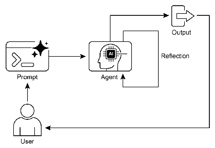

# 智能体实战之反思模式：智能体的自我进化机制-自我反思


*自我反思*

## 一.概述

在构建高级智能体系统的过程中，我们已经探索了多种基础执行模式：线性链式处理、动态路径选择以及并行任务处理。这些模式赋予了智能体处理复杂任务的能力，但即便是最精心设计的工作流，初次生成的结果也可能存在不足。反思模式正是为了解决这一局限性而设计的关键机制。

反思模式使智能体能够审视自身的输出、决策过程或内部状态，并基于这种自我评估来提升表现质量。它本质上是一种自我纠正和持续优化的循环机制，允许智能体通过对比预期标准、分析反馈或进行内部评审，逐步完善其输出或调整执行策略。在某些实现中，这种反思过程可能由专门的"评审智能体"来促进，其核心职责就是分析初始智能体的工作成果。

与简单的顺序处理或条件分支不同，反思模式引入了一个关键的反馈循环。智能体不仅产生输出，还会审视该输出（或其生成过程），识别潜在问题或改进空间，并利用这些洞察来生成优化版本或调整后续行动。

### 1.反思模式的核心流程

反思模式通常包含以下关键环节：

1. **执行阶段**：智能体执行任务或生成初始输出
2. **评估阶段**：智能体（通常通过另一次LLM调用或规则集）分析上一步的结果，评估标准可能包括事实准确性、连贯性、风格一致性、完整性、指令遵循度等
3. **反思阶段**：基于评估结果，智能体确定改进方向，可能包括生成优化输出、调整参数或修改整体策略
4. **迭代优化**：将优化后的输出或调整后的方法重新投入执行，重复反思过程，直至达到满意结果或满足停止条件

### 2.双角色架构：生产者与评审者

反思模式的高效实现通常依赖于角色分离策略，即"生产者-评审者"模型。虽然单个智能体理论上可以执行自我反思，但使用两个专门角色（或两个不同系统提示的独立LLM调用）通常能产生更客观、更稳健的结果。

- **生产者角色**：负责执行任务的初始工作，专注于内容生成，无论是编写代码、创作文本还是制定计划
- **评审者角色**：专门评估生产者的输出，通常被赋予特定身份（如"资深专家"、"严格审查员"），根据预设标准分析工作质量，发现缺陷并提供改进建议

这种角色分离有效避免了自我审查时可能产生的认知偏差，确保评审过程更加客观和全面。

## 二.案例实战

## 三.LangChain实现案例

下面是一个使用DeepSeek和LangChain实现的反思模式案例，展示如何通过迭代优化生成高质量的数据分析报告：

```python
from langchain_core.prompts import PromptTemplate
from langchain_core.output_parsers import StrOutputParser


# 初始化模型
from init_client import init_llm

llm = init_llm(0.1)

def generate_data_analysis_report():
    """
    使用反思模式生成高质量数据分析报告
    """
    # 定义核心任务
    task_prompt = """
    你是一名数据分析师，需要基于以下销售数据生成一份简洁而全面的分析报告：

    数据：
    - 产品A：Q1销售额120万，Q2销售额150万，Q3销售额180万，Q4销售额210万
    - 产品B：Q1销售额80万，Q2销售额75万，Q3销售额90万，Q4销售额85万
    - 产品C：Q1销售额200万，Q2销售额220万，Q3销售额195万，Q4销售额240万

    报告应包括：
    1. 整体销售趋势分析
    2. 各产品表现对比
    3. 季度增长/下降率
    4. 关键洞察和建议
    """

    # 生产者提示模板
    producer_template = """
    {task}

    {feedback}

    请根据以上要求生成数据分析报告：
    """

    # 评审者提示模板
    reviewer_template = """
    你是一名资深数据分析专家，负责评估数据分析报告的质量。

    原始任务要求：
    {task}

    待评估报告：
    {report}

    请评估报告是否满足以下标准：
    1. 数据准确性
    2. 分析深度
    3. 洞察价值
    4. 结构清晰度
    5. 语言专业性

    如果报告完美无缺，请回复"REPORT_IS_PERFECT"。
    否则，请提供具体改进建议，以项目符号形式列出：
    """

    # 创建生产者和评审者链
    producer_prompt = PromptTemplate(template=producer_template, input_variables=["task", "feedback"])
    producer_chain = producer_prompt | llm | StrOutputParser()

    reviewer_prompt = PromptTemplate(template=reviewer_template, input_variables=["task", "report"])
    reviewer_chain = reviewer_prompt | llm | StrOutputParser()

    # 初始化变量
    current_report = ""
    feedback = "请生成初始报告。"
    max_iterations = 3

    # 反思循环
    for i in range(max_iterations):
        print(f"\n{'=' * 30} 反思循环：迭代 {i + 1} {'=' * 30}")

        # 生产者生成/优化报告
        print("\n>>> 阶段1：生成/优化报告...")
        current_report = producer_chain.invoke({"task": task_prompt, "feedback": feedback})

        print(f"\n--- 生成的报告 (v{i + 1}) ---\n{current_report}")

        # 评审者评估报告
        print("\n>>> 阶段2：评估报告质量...")
        review = reviewer_chain.invoke({"task": task_prompt, "report": current_report})

        # 检查停止条件
        if "REPORT_IS_PERFECT" in review:
            print("\n--- 评估结果 ---\n报告质量满意，无需进一步改进。")
            break

        print(f"\n--- 评估结果 ---\n{review}")

        # 更新反馈用于下一轮迭代
        feedback = f"请根据以下评估结果优化报告：\n{review}"

    print(f"\n{'=' * 35} 最终结果 {'=' * 35}")
    print("\n经过反思过程优化的最终数据分析报告：\n")
    print(current_report)


if __name__ == "__main__":
    generate_data_analysis_report()
```

## 案例解析

这个案例展示了如何使用DeepSeek和LangChain实现反思模式，生成高质量的数据分析报告：

1. **环境配置**：加载DeepSeek API密钥，初始化DeepSeek模型，使用低温度确保输出一致性

2. **任务定义**：创建一个数据分析任务，要求基于销售数据生成包含趋势分析、产品对比、增长率计算和关键洞察的报告

3. **双角色设计**：
   - **生产者**：负责根据任务要求和反馈生成或优化数据分析报告
   - **评审者**：担任资深数据分析专家，评估报告质量并提供改进建议

4. **反思循环**：
   - 生产者生成初始报告
   - 评审者评估报告质量
   - 评审结果作为反馈传递给生产者
   - 生产者基于反馈优化报告
   - 循环重复直至报告质量达标或达到最大迭代次数

5. **停止条件**：当评审者返回"REPORT_IS_PERFECT"或达到最大迭代次数时，循环终止

## 代码解释


好的，我们来详细解析这个使用 DeepSeek 和 LangChain 实现反思模式的案例代码。

这个代码的核心目标是模拟一个拥有“自我批评”和“持续改进”能力的智能体，用于生成一份高质量的数据分析报告。整个过程就像一个初级分析师（生产者）在一位资深专家（评审者）的指导下，反复修改和完善自己的报告。

---

### 代码结构逐段解析

#### 1. 导入与环境设置

```python
# 初始化模型
from init_client import init_llm

llm = init_llm(0.1)
```

#### 2. 核心任务与提示词定义

```python
def generate_data_analysis_report():
    # 定义核心任务
    task_prompt = """
    你是一名数据分析师，需要基于以下销售数据生成一份简洁而全面的分析报告：
    ...
    """
    
    # 生产者提示模板
    producer_template = """
    {task}
    
    {feedback}
    
    请根据以上要求生成数据分析报告：
    """
    
    # 评审者提示模板
    reviewer_template = """
    你是一名资深数据分析专家，负责评估数据分析报告的质量。
    ...
    """
```

- **`task_prompt`**: 这是整个任务的“金标准”或“需求文档”。它清晰地定义了目标（生成报告）、输入数据（销售数据）和具体要求（趋势分析、产品对比等）。**生产者和评审者都会参考这个提示词**，以确保它们的目标一致。
- **`producer_template`**: 这是“生产者”角色的指令模板。
    - `{task}`: 这是一个占位符，在运行时会被 `task_prompt` 的内容替换。
    - `{feedback}`: 这是实现反思模式的关键占位符。在第一次迭代时，它被替换为“请生成初始报告”；在后续迭代中，它会被替换为“评审者”提出的具体修改意见。
- **`reviewer_template`**: 这是“评审者”角色的指令模板。
    - `{task}`: 同样被 `task_prompt` 替换，让评审者知道原始需求是什么。
    - `{report}`: 这个占位符会被“生产者”当前生成的报告内容替换。
    - **评审标准**: 模板中明确列出了评估标准（数据准确性、分析深度等），引导模型进行有针对性的批评。
    - **停止条件**: `如果报告完美无缺，请回复"REPORT_IS_PERFECT"`。这是与模型约定的一个特殊信号，用于终止反思循环。

#### 3. 创建 LangChain 链

```python
    # 创建生产者和评审者链
    producer_prompt = PromptTemplate(template=producer_template, input_variables=["task", "feedback"])
    producer_chain = producer_prompt | llm | StrOutputParser()
    
    reviewer_prompt = PromptTemplate(template=reviewer_template, input_variables=["task", "report"])
    reviewer_chain = reviewer_prompt | llm | StrOutputParser()
```

这里使用了 LangChain 的表达式语言（LCEL），它通过管道符 `|` 将组件串联起来，非常直观。

- **`producer_chain`**:
    1.  `producer_prompt`: 接收一个字典 `{"task": ..., "feedback": ...}`，并根据模板生成完整的提示词字符串。
    2.  `|`: 将上一步的输出（提示词字符串）传递给下一步。
    3.  `llm`: 接收提示词，调用 DeepSeek API，并返回一个包含元数据的响应对象（如 `AIMessage`）。
    4.  `|`: 将响应对象传递给下一步。
    5.  `StrOutputParser()`: 从响应对象中提取纯文本内容（即生成的报告）。
- **`reviewer_chain`**: 逻辑与 `producer_chain` 完全相同，只是使用了 `reviewer_prompt` 作为起点。

#### 4. 反思循环

```python
    # 初始化变量
    current_report = ""
    feedback = "请生成初始报告。"
    max_iterations = 3
    
    # 反思循环
    for i in range(max_iterations):
        # ... (打印日志)
        
        # 生产者生成/优化报告
        current_report = producer_chain.invoke({"task": task_prompt, "feedback": feedback})
        
        # ... (打印日志)
        
        # 评审者评估报告
        review = reviewer_chain.invoke({"task": task_prompt, "report": current_report})
        
        # 检查停止条件
        if "REPORT_IS_PERFECT" in review:
            # ... (打印日志)
            break
        
        # ... (打印日志)
        
        # 更新反馈用于下一轮迭代
        feedback = f"请根据以下评估结果优化报告：\n{review}"
```

这是整个程序的核心逻辑，实现了“生成-评估-反馈”的闭环。

- **初始化**:
    - `current_report = ""`: 存储当前版本的报告。
    - `feedback = "请生成初始报告。"`: 为第一次生成提供初始指令。
    - `max_iterations = 3`: 设置最大迭代次数，防止因模型无法满足要求而陷入无限循环。
- **循环开始 (`for i in range(max_iterations)`)**:
    1.  **生产者工作**: `producer_chain.invoke(...)` 被调用。它将 `task_prompt` 和当前的 `feedback` 传递给生产者链，生成一个新的 `current_report`。
    2.  **评审者工作**: `reviewer_chain.invoke(...)` 被调用。它将 `task_prompt` 和刚刚生成的 `current_report` 传递给评审者链，得到一份评估意见 `review`。
    3.  **检查停止条件**: `if "REPORT_IS_PERFECT" in review:`。代码检查评审者的回复中是否包含约定的停止信号。如果包含，说明报告已达标，`break` 语句会立即跳出循环。
    4.  **更新反馈**: 如果报告不完美，`feedback` 变量就会被更新。它将评审者的批评意见包装成新的指令，用于指导下一轮的生产者进行修改。**这是反思模式能够自我优化的关键**。

#### 5. 输出最终结果

```python
    print(f"\n{'='*35} 最终结果 {'='*35}")
    print("\n经过反思过程优化的最终数据分析报告：\n")
    print(current_report)

if __name__ == "__main__":
    generate_data_analysis_report()
```

- 循环结束后（无论是通过 `break` 还是自然结束），`current_report` 变量中保存的就是最后一次迭代生成的、质量最高的报告版本。
- 最后，程序将这份最终报告打印出来。
- `if __name__ == "__main__":` 是 Python 的标准写法，确保只有当这个脚本被直接运行时，才会执行 `generate_data_analysis_report()` 函数。

### 总结

这个案例巧妙地利用 LangChain 的链式调用和提示词模板，将一个复杂的反思模式流程清晰地实现了出来。它通过**角色分离**（生产者 vs. 评审者）和**状态传递**（通过 `feedback` 变量），构建了一个健壮的反馈循环，使得智能体能够像人类一样，在专家的指导下反复打磨自己的工作成果，最终产出远超单次生成质量的报告。


## langgraph案例分析

下面我将使用LangGraph和DeepSeek重新实现之前的反思模式案例，并详细解释代码。LangGraph是一个基于图的工作流框架，非常适合实现带有条件分支和循环的复杂流程，如反思模式。

## 完整代码实现

```python
from typing import TypedDict
from langchain_core.prompts import PromptTemplate
from langchain_core.output_parsers import StrOutputParser
from langgraph.graph import StateGraph, END
from langgraph.checkpoint.memory import MemorySaver

# 初始化模型
from init_client import init_llm

llm = init_llm(0.1)

# 定义状态结构
class GraphState(TypedDict):
    """定义图中节点之间共享的状态"""
    task: str  # 原始任务描述
    report: str  # 当前生成的报告
    feedback: str  # 评审反馈
    iteration: int  # 当前迭代次数
    max_iterations: int  # 最大迭代次数
    is_perfect: bool  # 报告是否完美

# 定义生产者节点
def producer_node(state: GraphState):
    """生产者节点：根据任务和反馈生成或优化报告"""
    print(f"\n>>> 阶段1：生成/优化报告 (迭代 {state['iteration']})...")
    
    # 生产者提示模板
    producer_template = """
    你是一名数据分析师，需要根据任务要求和反馈生成或优化数据分析报告。
    
    任务要求：
    {task}
    
    反馈：
    {feedback}
    
    请根据以上要求生成数据分析报告：
    """
    
    producer_prompt = PromptTemplate(
        template=producer_template,
        input_variables=["task", "feedback"]
    )
    
    producer_chain = producer_prompt | llm | StrOutputParser()
    
    # 生成报告
    report = producer_chain.invoke({
        "task": state["task"],
        "feedback": state["feedback"]
    })
    
    print(f"\n--- 生成的报告 (v{state['iteration']}) ---\n{report}")
    
    # 更新状态
    return {
        **state,
        "report": report,
        "iteration": state["iteration"] + 1
    }

# 定义评审者节点
def reviewer_node(state: GraphState):
    """评审者节点：评估报告质量并提供反馈"""
    print("\n>>> 阶段2：评估报告质量...")
    
    # 评审者提示模板
    reviewer_template = """
    你是一名资深数据分析专家，负责评估数据分析报告的质量。
    
    原始任务要求：
    {task}
    
    待评估报告：
    {report}
    
    请评估报告是否满足以下标准：
    1. 数据准确性
    2. 分析深度
    3. 洞察价值
    4. 结构清晰度
    5. 语言专业性
    
    如果报告完美无缺，请回复"REPORT_IS_PERFECT"。
    否则，请提供具体改进建议，以项目符号形式列出：
    """
    
    reviewer_prompt = PromptTemplate(
        template=reviewer_template,
        input_variables=["task", "report"]
    )
    
    reviewer_chain = reviewer_prompt | llm | StrOutputParser()
    
    # 评估报告
    review = reviewer_chain.invoke({
        "task": state["task"],
        "report": state["report"]
    })
    
    # 检查报告是否完美
    is_perfect = "REPORT_IS_PERFECT" in review
    
    if is_perfect:
        print("\n--- 评估结果 ---\n报告质量满意，无需进一步改进。")
    else:
        print(f"\n--- 评估结果 ---\n{review}")
    
    # 更新状态
    return {
        **state,
        "feedback": f"请根据以下评估结果优化报告：\n{review}",
        "is_perfect": is_perfect
    }

# 定义条件边函数
def should_continue(state: GraphState):
    """决定是否继续迭代"""
    # 如果报告完美或达到最大迭代次数，则结束
    if state["is_perfect"] or state["iteration"] >= state["max_iterations"]:
        return "end"
    # 否则继续生产者节点
    return "producer"

# 创建工作流图
def create_reflection_graph():
    """创建反思模式的工作流图"""
    # 初始化状态图
    workflow = StateGraph(GraphState)
    
    # 添加节点
    workflow.add_node("producer", producer_node)
    workflow.add_node("reviewer", reviewer_node)
    
    # 设置入口点
    workflow.set_entry_point("producer")
    
    # 添加边
    workflow.add_edge("producer", "reviewer")
    workflow.add_conditional_edges(
        "reviewer",
        should_continue,
        {
            "producer": "producer",  # 如果继续，回到生产者
            "end": END  # 如果结束，终止流程
        }
    )
    
    # 设置内存保存器（用于状态持久化）
    memory = MemorySaver()
    
    # 编译图
    app = workflow.compile(checkpointer=memory)
    
    return app

# 主函数
def generate_data_analysis_report_with_langgraph():
    """使用LangGraph实现反思模式生成数据分析报告"""
    
    # 定义核心任务
    task_prompt = """
    你是一名数据分析师，需要基于以下销售数据生成一份简洁而全面的分析报告：
    
    数据：
    - 产品A：Q1销售额120万，Q2销售额150万，Q3销售额180万，Q4销售额210万
    - 产品B：Q1销售额80万，Q2销售额75万，Q3销售额90万，Q4销售额85万
    - 产品C：Q1销售额200万，Q2销售额220万，Q3销售额195万，Q4销售额240万
    
    报告应包括：
    1. 整体销售趋势分析
    2. 各产品表现对比
    3. 季度增长/下降率
    4. 关键洞察和建议
    """
    
    # 创建工作流图
    app = create_reflection_graph()
    
    # 初始状态
    initial_state = {
        "task": task_prompt,
        "report": "",
        "feedback": "请生成初始报告。",
        "iteration": 1,
        "max_iterations": 3,
        "is_perfect": False
    }
    
    # 运行工作流
    print(f"\n{'='*30} 开始反思模式工作流 {'='*30}")
    
    # 使用线程ID和配置运行图
    config = {"configurable": {"thread_id": "1"}}
    final_state = app.invoke(initial_state, config)
    
    print(f"\n{'='*35} 最终结果 {'='*35}")
    print("\n经过反思过程优化的最终数据分析报告：\n")
    print(final_state["report"])

if __name__ == "__main__":
    generate_data_analysis_report_with_langgraph()
```

## 代码解释

### 1. 导入与配置

```python
import os
from dotenv import load_dotenv
from typing import TypedDict, Annotated, List
from langchain_community.llms import DeepSeek
from langchain_core.prompts import PromptTemplate
from langchain_core.output_parsers import StrOutputParser
from langgraph.graph import StateGraph, END
from langgraph.checkpoint.memory import MemorySaver

# 配置环境
load_dotenv()

# 检查API密钥
if not os.getenv("DEEPSEEK_API_KEY"):
    raise ValueError("在 .env 文件中未找到 DEEPSEEK_API_KEY。请添加它。")

# 初始化DeepSeek模型
llm = DeepSeek(model="deepseek-coder", temperature=0.1)
```

这部分代码导入了所需的库和模块：
- `os`和`dotenv`用于环境变量管理
- `TypedDict`用于定义状态类型
- `DeepSeek`作为LLM
- `PromptTemplate`和`StrOutputParser`用于构建提示和处理输出
- `StateGraph`和`END`用于构建工作流图
- `MemorySaver`用于状态持久化

然后加载环境变量，检查API密钥，并初始化DeepSeek模型。

### 2. 状态定义

```python
# 定义状态结构
class GraphState(TypedDict):
    """定义图中节点之间共享的状态"""
    task: str  # 原始任务描述
    report: str  # 当前生成的报告
    feedback: str  # 评审反馈
    iteration: int  # 当前迭代次数
    max_iterations: int  # 最大迭代次数
    is_perfect: bool  # 报告是否完美
```

`GraphState`类定义了在工作流中节点之间共享的状态结构。使用`TypedDict`可以提供类型提示，使代码更加清晰和可维护。状态包括：
- `task`: 原始任务描述
- `report`: 当前生成的报告
- `feedback`: 评审反馈
- `iteration`: 当前迭代次数
- `max_iterations`: 最大迭代次数
- `is_perfect`: 报告是否完美的标志

### 3. 节点定义

```python
# 定义生产者节点
def producer_node(state: GraphState):
    """生产者节点：根据任务和反馈生成或优化报告"""
    print(f"\n>>> 阶段1：生成/优化报告 (迭代 {state['iteration']})...")
    
    # 生产者提示模板
    producer_template = """
    你是一名数据分析师，需要根据任务要求和反馈生成或优化数据分析报告。
    
    任务要求：
    {task}
    
    反馈：
    {feedback}
    
    请根据以上要求生成数据分析报告：
    """
    
    producer_prompt = PromptTemplate(
        template=producer_template,
        input_variables=["task", "feedback"]
    )
    
    producer_chain = producer_prompt | llm | StrOutputParser()
    
    # 生成报告
    report = producer_chain.invoke({
        "task": state["task"],
        "feedback": state["feedback"]
    })
    
    print(f"\n--- 生成的报告 (v{state['iteration']}) ---\n{report}")
    
    # 更新状态
    return {
        **state,
        "report": report,
        "iteration": state["iteration"] + 1
    }

# 定义评审者节点
def reviewer_node(state: GraphState):
    """评审者节点：评估报告质量并提供反馈"""
    print("\n>>> 阶段2：评估报告质量...")
    
    # 评审者提示模板
    reviewer_template = """
    你是一名资深数据分析专家，负责评估数据分析报告的质量。
    
    原始任务要求：
    {task}
    
    待评估报告：
    {report}
    
    请评估报告是否满足以下标准：
    1. 数据准确性
    2. 分析深度
    3. 洞察价值
    4. 结构清晰度
    5. 语言专业性
    
    如果报告完美无缺，请回复"REPORT_IS_PERFECT"。
    否则，请提供具体改进建议，以项目符号形式列出：
    """
    
    reviewer_prompt = PromptTemplate(
        template=reviewer_template,
        input_variables=["task", "report"]
    )
    
    reviewer_chain = reviewer_prompt | llm | StrOutputParser()
    
    # 评估报告
    review = reviewer_chain.invoke({
        "task": state["task"],
        "report": state["report"]
    })
    
    # 检查报告是否完美
    is_perfect = "REPORT_IS_PERFECT" in review
    
    if is_perfect:
        print("\n--- 评估结果 ---\n报告质量满意，无需进一步改进。")
    else:
        print(f"\n--- 评估结果 ---\n{review}")
    
    # 更新状态
    return {
        **state,
        "feedback": f"请根据以下评估结果优化报告：\n{review}",
        "is_perfect": is_perfect
    }
```

我们定义了两个主要节点：

1. **生产者节点 (`producer_node`)**:
   - 接收当前状态作为输入
   - 根据任务和反馈生成或优化报告
   - 使用LangChain的提示模板和链式调用
   - 返回更新后的状态，包括新报告和递增的迭代次数

2. **评审者节点 (`reviewer_node`)**:
   - 接收当前状态作为输入
   - 评估报告质量并提供反馈
   - 检查报告是否完美（是否包含"REPORT_IS_PERFECT"）
   - 返回更新后的状态，包括反馈和完美标志

每个节点都遵循相同的模式：接收状态，执行特定任务，然后返回更新后的状态。

### 4. 条件边函数

```python
# 定义条件边函数
def should_continue(state: GraphState):
    """决定是否继续迭代"""
    # 如果报告完美或达到最大迭代次数，则结束
    if state["is_perfect"] or state["iteration"] >= state["max_iterations"]:
        return "end"
    # 否则继续生产者节点
    return "producer"
```

`should_continue`函数是一个条件边函数，它根据当前状态决定工作流的下一步：
- 如果报告完美或达到最大迭代次数，返回"end"，表示工作流应该结束
- 否则返回"producer"，表示应该继续回到生产者节点进行下一轮迭代

### 5. 工作流图创建

```python
# 创建工作流图
def create_reflection_graph():
    """创建反思模式的工作流图"""
    # 初始化状态图
    workflow = StateGraph(GraphState)
    
    # 添加节点
    workflow.add_node("producer", producer_node)
    workflow.add_node("reviewer", reviewer_node)
    
    # 设置入口点
    workflow.set_entry_point("producer")
    
    # 添加边
    workflow.add_edge("producer", "reviewer")
    workflow.add_conditional_edges(
        "reviewer",
        should_continue,
        {
            "producer": "producer",  # 如果继续，回到生产者
            "end": END  # 如果结束，终止流程
        }
    )
    
    # 设置内存保存器（用于状态持久化）
    memory = MemorySaver()
    
    # 编译图
    app = workflow.compile(checkpointer=memory)
    
    return app
```

`create_reflection_graph`函数创建并配置工作流图：
1. 初始化一个`StateGraph`，使用之前定义的`GraphState`作为状态模式
2. 添加两个节点：生产者和评审者
3. 设置入口点为生产者节点
4. 添加边：
   - 从生产者到评审者的普通边
   - 从评审者出发的条件边，根据`should_continue`函数的结果决定下一步
5. 设置内存保存器，用于状态持久化
6. 编译图并返回应用实例

这个图定义了反思模式的核心工作流：生产者→评审者→(条件分支)→生产者/结束。

### 6. 主函数

```python
# 主函数
def generate_data_analysis_report_with_langgraph():
    """使用LangGraph实现反思模式生成数据分析报告"""
    
    # 定义核心任务
    task_prompt = """
    你是一名数据分析师，需要基于以下销售数据生成一份简洁而全面的分析报告：
    
    数据：
    - 产品A：Q1销售额120万，Q2销售额150万，Q3销售额180万，Q4销售额210万
    - 产品B：Q1销售额80万，Q2销售额75万，Q3销售额90万，Q4销售额85万
    - 产品C：Q1销售额200万，Q2销售额220万，Q3销售额195万，Q4销售额240万
    
    报告应包括：
    1. 整体销售趋势分析
    2. 各产品表现对比
    3. 季度增长/下降率
    4. 关键洞察和建议
    """
    
    # 创建工作流图
    app = create_reflection_graph()
    
    # 初始状态
    initial_state = {
        "task": task_prompt,
        "report": "",
        "feedback": "请生成初始报告。",
        "iteration": 1,
        "max_iterations": 3,
        "is_perfect": False
    }
    
    # 运行工作流
    print(f"\n{'='*30} 开始反思模式工作流 {'='*30}")
    
    # 使用线程ID和配置运行图
    config = {"configurable": {"thread_id": "1"}}
    final_state = app.invoke(initial_state, config)
    
    print(f"\n{'='*35} 最终结果 {'='*35}")
    print("\n经过反思过程优化的最终数据分析报告：\n")
    print(final_state["report"])

if __name__ == "__main__":
    generate_data_analysis_report_with_langgraph()
```

主函数`generate_data_analysis_report_with_langgraph`负责：
1. 定义核心任务提示
2. 创建工作流图
3. 设置初始状态
4. 运行工作流并获取最终状态
5. 打印最终结果

## LangGraph实现的优势

与之前的LangChain实现相比，使用LangGraph实现反思模式有以下优势：

1. **更清晰的工作流结构**：图结构直观地展示了节点之间的关系和工作流路径
2. **更好的状态管理**：LangGraph提供了专门的状态管理机制，使状态在节点之间传递更加可靠
3. **更灵活的条件分支**：通过条件边可以轻松实现复杂的决策逻辑
4. **更强的可扩展性**：添加新节点或修改工作流路径更加简单
5. **内置持久化支持**：通过检查点机制可以保存和恢复工作流状态

## 总结

这个使用LangGraph和DeepSeek实现的反思模式案例展示了如何利用图结构构建复杂的AI工作流。通过定义节点、边和状态，我们创建了一个能够自我评估和优化的系统，这与人类专家的工作方式非常相似：先完成工作，然后评估质量，最后根据反馈进行改进。

LangGraph的图结构使得这种反思循环变得直观且易于管理，而DeepSeek作为强大的LLM，则为生产者和评审者角色提供了高质量的文本生成和评估能力。这种组合非常适合构建需要迭代优化和自我评估的AI应用。

## 反思模式的价值

反思模式对于构建能够生成高质量输出、处理精细任务并展现自我适应性的智能体系统至关重要。它推动智能体从简单的指令执行者转变为能够持续优化、自我完善的智能系统。通过引入反思机制，智能体能够在执行过程中不断学习和调整，最终产出更符合预期、更高质量的成果。

这种模式特别适用于需要高度精确性、创造性和专业性的任务，如内容创作、代码开发、数据分析和决策支持等领域。通过迭代优化，反思模式能够显著提升智能体系统的输出质量，使其更接近甚至超越人类专家的水平。