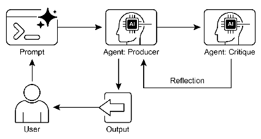

# 智能体实战之反思模式：智能体的自我进化机制-生产者与评审者


*生产者与评审者*

# 使用LangChain和DeepSeek实现顺序Agent管道

下面我将使用LangChain和DeepSeek实现一个顺序Agent管道，包含一个生成者Agent和一个审核者Agent。

```python
from typing import Dict, TypedDict
from langchain_core.prompts import ChatPromptTemplate
from langchain_core.output_parsers import JsonOutputParser, StrOutputParser
from langchain_core.runnables import RunnablePassthrough, RunnableLambda
import json

# 初始化模型
from init_client import init_llm

# 初始化两个DeepSeek实例
generator_llm = init_llm(temperature=0.7)
reviewer_llm = init_llm(temperature=0.1)

# 定义状态类
class AgentState(TypedDict):
    """Agent之间共享的状态"""
    user_input: str  # 用户输入的主题
    draft_text: str  # 生成者创建的草稿
    review_output: Dict[str, str]  # 审核者的评审结果

# 创建生成者Agent
generator_prompt = ChatPromptTemplate.from_messages([
    ("system", "你是一个专业的内容创作者，擅长撰写关于各种主题的简短、信息丰富的段落。"),
    ("human", "撰写关于以下主题的简短、信息丰富的段落：\n{user_input}")
])

generator_chain = generator_prompt | generator_llm | StrOutputParser()

# 创建审核者Agent
reviewer_prompt = ChatPromptTemplate.from_messages([
    ("system", """
    你是一个细致的事实核查员。
    1. 阅读提供的文本。
    2. 仔细验证所有声明的事实准确性。
    3. 你的最终输出必须是包含两个键的字典：
       - "status": 字符串，"ACCURATE" 或 "INACCURATE"。
       - "reasoning": 字符串，提供对你的状态的清楚解释，如果发现任何问题则引用具体问题。
    """),
    ("human", "请审核以下文本：\n{draft_text}")
])

# 使用JsonOutputParser确保输出为结构化JSON
reviewer_chain = reviewer_prompt | reviewer_llm | JsonOutputParser()


# 创建顺序执行管道
def create_sequential_pipeline():
    """创建一个顺序执行的Agent管道"""

    # 定义第一步：生成草稿
    def generate_draft(state: AgentState) -> AgentState:
        """生成者Agent：创建初始草稿"""
        print(">>> 生成者Agent正在创建草稿...")
        draft = generator_chain.invoke({"user_input": state["user_input"]})
        print(f"生成的草稿：\n{draft}\n")
        return {**state, "draft_text": draft}

    # 定义第二步：审核草稿
    def review_draft(state: AgentState) -> AgentState:
        """审核者Agent：审核草稿内容"""
        print(">>> 审核者Agent正在审核草稿...")
        review = reviewer_chain.invoke({"draft_text": state["draft_text"]})
        json_str = json.dumps(review, ensure_ascii=False, indent=2)
        print(f"审核结果：\n{json_str}\n")
        return {**state, "review_output": review}

    # 创建顺序执行链
    sequential_chain = RunnablePassthrough.assign(
        draft_text=RunnableLambda(lambda state: generate_draft(state)["draft_text"])
    ).assign(
        review_output=RunnableLambda(lambda state: review_draft(state)["review_output"])
    )

    return sequential_chain


# 执行管道的函数
def run_review_pipeline(user_topic: str) -> AgentState:
    """运行生成和审核管道"""
    # 创建管道
    pipeline = create_sequential_pipeline()

    # 初始状态
    initial_state = {
        "user_input": user_topic,
        "draft_text": "",
        "review_output": {}
    }

    # 执行管道
    print(f"{'=' * 50}\n开始处理主题：{user_topic}\n{'=' * 50}")
    final_state = pipeline.invoke(initial_state)

    # 输出最终结果
    print(f"{'=' * 50}\n最终结果\n{'=' * 50}")
    print(f"原始主题：{final_state['user_input']}")
    print(f"生成草稿：\n{final_state['draft_text']}")
    print(f"审核结果：\n状态：{final_state['review_output']['status']}")
    print(f"说明：{final_state['review_output']['reasoning']}")

    return final_state


# 测试函数
if __name__ == "__main__":
    # 测试主题
    test_topic = "量子计算的基本原理"

    # 运行管道
    result = run_review_pipeline(test_topic)

```

## 代码解释

### 1. 初始化llm与状态定义

```python
from init_client import init_llm

# 初始化两个DeepSeek实例
generator_llm = init_llm(temperature=0.7)
reviewer_llm = init_llm(temperature=0.1)

# 定义状态类
class AgentState(TypedDict):
    """Agent之间共享的状态"""
    user_input: str  # 用户输入的主题
    draft_text: str  # 生成者创建的草稿
    review_output: Dict[str, str]  # 审核者的评审结果
```

这部分代码导入了所需的库和模块，并定义了`AgentState`类来管理Agent之间共享的状态。这个状态类包含了用户输入、生成草稿和审核结果三个字段。

### 2. 初始化DeepSeek实例

```python
# 初始化两个DeepSeek实例
generator_llm = DeepSeek(model="deepseek-chat", temperature=0.7)
reviewer_llm = DeepSeek(model="deepseek-chat", temperature=0.1)
```

这里初始化了两个DeepSeek LLM实例：
- `generator_llm`：用于生成内容，设置了较高的温度(0.7)以增加创造性
- `reviewer_llm`：用于审核内容，设置了较低的温度(0.1)以确保更准确、一致的结果

### 3. 创建生成者Agent

```python
# 创建生成者Agent
generator_prompt = ChatPromptTemplate.from_messages([
    ("system", "你是一个专业的内容创作者，擅长撰写关于各种主题的简短、信息丰富的段落。"),
    ("human", "撰写关于以下主题的简短、信息丰富的段落：\n{user_input}")
])

generator_chain = generator_prompt | generator_llm | StrOutputParser()
```

这里创建了生成者Agent：
- 使用`ChatPromptTemplate`定义了系统消息和用户消息模板
- 系统消息指示AI角色为专业内容创作者
- 用户消息模板接受`user_input`参数，指示AI撰写关于该主题的段落
- 将提示、LLM和输出解析器连接成一个链

### 4. 创建审核者Agent

```python
# 创建审核者Agent
reviewer_prompt = ChatPromptTemplate.from_messages([
    ("system", """
    你是一个细致的事实核查员。
    1. 阅读提供的文本。
    2. 仔细验证所有声明的事实准确性。
    3. 你的最终输出必须是包含两个键的字典：
       - "status": 字符串，"ACCURATE" 或 "INACCURATE"。
       - "reasoning": 字符串，提供对你的状态的清楚解释，如果发现任何问题则引用具体问题。
    """),
    ("human", "请审核以下文本：\n{draft_text}")
])

# 使用JsonOutputParser确保输出为结构化JSON
reviewer_chain = reviewer_prompt | reviewer_llm | JsonOutputParser()
```

这里创建了审核者Agent：
- 使用`ChatPromptTemplate`定义了系统消息和用户消息模板
- 系统消息指示AI角色为事实核查员，并详细说明了输出格式要求
- 用户消息模板接受`draft_text`参数，指示AI审核该文本
- 使用`JsonOutputParser`确保输出为结构化的JSON格式，包含"status"和"reasoning"字段

### 5. 创建顺序执行管道

```python
# 创建顺序执行管道
def create_sequential_pipeline():
    """创建一个顺序执行的Agent管道"""
    
    # 定义第一步：生成草稿
    def generate_draft(state: AgentState) -> AgentState:
        """生成者Agent：创建初始草稿"""
        print(">>> 生成者Agent正在创建草稿...")
        draft = generator_chain.invoke({"user_input": state["user_input"]})
        print(f"生成的草稿：\n{draft}\n")
        return {**state, "draft_text": draft}
    
    # 定义第二步：审核草稿
    def review_draft(state: AgentState) -> AgentState:
        """审核者Agent：审核草稿内容"""
        print(">>> 审核者Agent正在审核草稿...")
        review = reviewer_chain.invoke({"draft_text": state["draft_text"]})
        print(f"审核结果：\n{json.dumps(review, indent=2)}\n")
        return {**state, "review_output": review}
    
    # 创建顺序执行链
    sequential_chain = RunnablePassthrough.assign(
        draft_text=RunnableLambda(lambda state: generate_draft(state)["draft_text"])
    ).assign(
        review_output=RunnableLambda(lambda state: review_draft(state)["review_output"])
    )
    
    return sequential_chain
```

这部分代码创建了顺序执行管道：
- 定义了两个函数：`generate_draft`和`review_draft`，分别对应生成者和审核者的操作
- 每个函数接收状态，执行相应操作，然后返回更新后的状态
- 使用`RunnablePassthrough.assign`创建顺序执行链，确保生成者先运行，然后是审核者
- 使用`RunnableLambda`将自定义函数包装为可运行组件

### 6. 执行管道的函数

```python
# 执行管道的函数
def run_review_pipeline(user_topic: str) -> AgentState:
    """运行生成和审核管道"""
    # 创建管道
    pipeline = create_sequential_pipeline()
    
    # 初始状态
    initial_state = {
        "user_input": user_topic,
        "draft_text": "",
        "review_output": {}
    }
    
    # 执行管道
    print(f"{'='*50}\n开始处理主题：{user_topic}\n{'='*50}")
    final_state = pipeline.invoke(initial_state)
    
    # 输出最终结果
    print(f"{'='*50}\n最终结果\n{'='*50}")
    print(f"原始主题：{final_state['user_input']}")
    print(f"生成草稿：\n{final_state['draft_text']}")
    print(f"审核结果：\n状态：{final_state['review_output']['status']}")
    print(f"说明：{final_state['review_output']['reasoning']}")
    
    return final_state
```

这个函数负责：
1. 创建顺序管道
2. 初始化状态，包含用户输入、空的草稿和审核结果
3. 执行管道
4. 输出最终结果，包括原始主题、生成草稿和审核结果

### 7. 测试函数

```python
# 测试函数
if __name__ == "__main__":
    # 测试主题
    test_topic = "量子计算的基本原理"
    
    # 运行管道
    result = run_review_pipeline(test_topic)
```

这部分代码定义了测试函数，使用"量子计算的基本原理"作为测试主题，运行管道并获取结果。

## 总结

1. **角色分离**：两个独立的Agent，一个负责生成内容，一个负责审核内容
2. **顺序执行**：确保生成者先运行，然后是审核者。LangChain使用`RunnablePassthrough.assign`和自定义函数创建顺序执行流程
3. **状态管理**：使用共享状态在Agent之间传递信息
4. **结构化输出**：审核者输出包含"status"和"reasoning"的结构化结果

这个实现展示了如何使用LangChain和DeepSeek创建一个功能强大的顺序Agent管道，实现内容生成和审核的自动化流程。


# 使用LangGraph和DeepSeek实现顺序Agent管道

下面我将使用LangGraph和DeepSeek重新实现顺序Agent管道案例，该管道包含一个生成者Agent和一个审核者Agent，用于创建和审核文本内容。

```python
from typing import Dict, TypedDict
from langchain_core.prompts import ChatPromptTemplate
from langchain_core.output_parsers import JsonOutputParser, StrOutputParser
from langgraph.graph import StateGraph, END
from langgraph.checkpoint.memory import MemorySaver
import json

# 初始化模型
from init_client import init_llm

# 初始化两个DeepSeek实例
generator_llm = init_llm(temperature=0.7)
reviewer_llm = init_llm(temperature=0.1)


# 定义状态类
class AgentState(TypedDict):
    """Agent之间共享的状态"""
    user_input: str  # 用户输入的主题
    draft_text: str  # 生成者创建的草稿
    review_output: Dict[str, str]  # 审核者的评审结果


# 创建生成者Agent
generator_prompt = ChatPromptTemplate.from_messages([
    ("system", "你是一个专业的内容创作者，擅长撰写关于各种主题的简短、信息丰富的段落。"),
    ("human", "撰写关于以下主题的简短、信息丰富的段落：\n{user_input}")
])

generator_chain = generator_prompt | generator_llm | StrOutputParser()

# 创建审核者Agent
reviewer_prompt = ChatPromptTemplate.from_messages([
    ("system", """
    你是一个细致的事实核查员。
    1. 阅读提供的文本。
    2. 仔细验证所有声明的事实准确性。
    3. 你的最终输出必须是包含两个键的字典：
       - "status": 字符串，"ACCURATE" 或 "INACCURATE"。
       - "reasoning": 字符串，提供对你的状态的清楚解释，如果发现任何问题则引用具体问题。
    """),
    ("human", "请审核以下文本：\n{draft_text}")
])

# 使用JsonOutputParser确保输出为结构化JSON
reviewer_chain = reviewer_prompt | reviewer_llm | JsonOutputParser()


# 定义生成者节点
def generator_node(state: AgentState) -> AgentState:
    """生成者Agent：创建初始草稿"""
    print(">>> 生成者Agent正在创建草稿...")
    draft = generator_chain.invoke({"user_input": state["user_input"]})
    print(f"生成的草稿：\n{draft}\n")
    return {"draft_text": draft}


# 定义审核者节点
def reviewer_node(state: AgentState) -> AgentState:
    """审核者Agent：审核草稿内容"""
    print(">>> 审核者Agent正在审核草稿...")
    review = reviewer_chain.invoke({"draft_text": state["draft_text"]})
    json_str = json.dumps(review, ensure_ascii=False, indent=2)
    print(f"审核结果：\n{json_str}\n")
    return {"review_output": review}


# 创建工作流图
def create_sequential_graph():
    """创建顺序执行的Agent工作流图"""
    # 初始化状态图
    workflow = StateGraph(AgentState)

    # 添加节点
    workflow.add_node("generator", generator_node)
    workflow.add_node("reviewer", reviewer_node)

    # 设置入口点
    workflow.set_entry_point("generator")

    # 添加边
    workflow.add_edge("generator", "reviewer")
    workflow.add_edge("reviewer", END)

    # 设置内存保存器（用于状态持久化）
    memory = MemorySaver()

    # 编译图
    app = workflow.compile(checkpointer=memory)

    return app


# 执行工作流的函数
def run_review_graph(user_topic: str) -> AgentState:
    """运行生成和审核工作流"""
    # 创建工作流图
    app = create_sequential_graph()

    # 打印图的结构（可选，非常直观！）
    try:
        print("--- 图结构 ---")
        app.get_graph().print_ascii()
        print("\n" + "=" * 20 + "\n")
    except Exception as e:
        print(f"无法打印图结构: {e}")

    # 初始状态
    initial_state = {
        "user_input": user_topic,
        "draft_text": "",
        "review_output": {}
    }

    # 执行工作流
    print(f"{'=' * 50}\n开始处理主题：{user_topic}\n{'=' * 50}")

    # 使用线程ID和配置运行图
    config = {"configurable": {"thread_id": "1"}}
    final_state = app.invoke(initial_state, config)

    # 输出最终结果
    print(f"{'=' * 50}\n最终结果\n{'=' * 50}")
    print(f"原始主题：{final_state['user_input']}")
    print(f"生成草稿：\n{final_state['draft_text']}")
    print(f"审核结果：\n状态：{final_state['review_output']['status']}")
    print(f"说明：{final_state['review_output']['reasoning']}")

    return final_state


# 测试函数
if __name__ == "__main__":
    # 测试主题
    test_topic = "量子计算的基本原理"

    # 运行工作流
    result = run_review_graph(test_topic)
```

## 代码解释

### 1. 初始化llm与状态定义

```python
from init_client import init_llm

# 初始化两个DeepSeek实例
generator_llm = init_llm(temperature=0.7)
reviewer_llm = init_llm(temperature=0.1)

# 定义状态类
class AgentState(TypedDict):
    """Agent之间共享的状态"""
    user_input: str  # 用户输入的主题
    draft_text: str  # 生成者创建的草稿
    review_output: Dict[str, str]  # 审核者的评审结果
```

这部分代码导入了所需的库和模块，并定义了`AgentState`类来管理Agent之间共享的状态。这个状态类包含了用户输入、生成草稿和审核结果三个字段。

### 2. 初始化DeepSeek实例

```python
# 初始化两个DeepSeek实例
generator_llm = DeepSeek(model="deepseek-chat", temperature=0.7)
reviewer_llm = DeepSeek(model="deepseek-chat", temperature=0.1)
```

这里初始化了两个DeepSeek LLM实例：
- `generator_llm`：用于生成内容，设置了较高的温度(0.7)以增加创造性
- `reviewer_llm`：用于审核内容，设置了较低的温度(0.1)以确保更准确、一致的结果

### 3. 创建生成者Agent

```python
# 创建生成者Agent
generator_prompt = ChatPromptTemplate.from_messages([
    ("system", "你是一个专业的内容创作者，擅长撰写关于各种主题的简短、信息丰富的段落。"),
    ("human", "撰写关于以下主题的简短、信息丰富的段落：\n{user_input}")
])

generator_chain = generator_prompt | generator_llm | StrOutputParser()
```

这里创建了生成者Agent：
- 使用`ChatPromptTemplate`定义了系统消息和用户消息模板
- 系统消息指示AI角色为专业内容创作者
- 用户消息模板接受`user_input`参数，指示AI撰写关于该主题的段落
- 将提示、LLM和输出解析器连接成一个链

### 4. 创建审核者Agent

```python
# 创建审核者Agent
reviewer_prompt = ChatPromptTemplate.from_messages([
    ("system", """
    你是一个细致的事实核查员。
    1. 阅读提供的文本。
    2. 仔细验证所有声明的事实准确性。
    3. 你的最终输出必须是包含两个键的字典：
       - "status": 字符串，"ACCURATE" 或 "INACCURATE"。
       - "reasoning": 字符串，提供对你的状态的清楚解释，如果发现任何问题则引用具体问题。
    """),
    ("human", "请审核以下文本：\n{draft_text}")
])

# 使用JsonOutputParser确保输出为结构化JSON
reviewer_chain = reviewer_prompt | reviewer_llm | JsonOutputParser()
```

这里创建了审核者Agent：
- 使用`ChatPromptTemplate`定义了系统消息和用户消息模板
- 系统消息指示AI角色为事实核查员，并详细说明了输出格式要求
- 用户消息模板接受`draft_text`参数，指示AI审核该文本
- 使用`JsonOutputParser`确保输出为结构化的JSON格式，包含"status"和"reasoning"字段

### 5. 定义节点函数

```python
# 定义生成者节点
def generator_node(state: AgentState) -> AgentState:
    """生成者Agent：创建初始草稿"""
    print(">>> 生成者Agent正在创建草稿...")
    draft = generator_chain.invoke({"user_input": state["user_input"]})
    print(f"生成的草稿：\n{draft}\n")
    return {"draft_text": draft}

# 定义审核者节点
def reviewer_node(state: AgentState) -> AgentState:
    """审核者Agent：审核草稿内容"""
    print(">>> 审核者Agent正在审核草稿...")
    review = reviewer_chain.invoke({"draft_text": state["draft_text"]})
    print(f"审核结果：\n{json.dumps(review, indent=2)}\n")
    return {"review_output": review}
```

这里定义了两个节点函数，分别对应生成者和审核者的操作：
- `generator_node`：接收状态，使用生成者链创建草稿，并返回包含草稿的状态更新
- `reviewer_node`：接收状态，使用审核者链审核草稿，并返回包含审核结果的状态更新

### 6. 创建工作流图

```python
# 创建工作流图
def create_sequential_graph():
    """创建顺序执行的Agent工作流图"""
    # 初始化状态图
    workflow = StateGraph(AgentState)
    
    # 添加节点
    workflow.add_node("generator", generator_node)
    workflow.add_node("reviewer", reviewer_node)
    
    # 设置入口点
    workflow.set_entry_point("generator")
    
    # 添加边
    workflow.add_edge("generator", "reviewer")
    workflow.add_edge("reviewer", END)
    
    # 设置内存保存器（用于状态持久化）
    memory = MemorySaver()
    
    # 编译图
    app = workflow.compile(checkpointer=memory)
    
    return app
```

这个函数创建并配置工作流图：
1. 初始化一个`StateGraph`，使用之前定义的`AgentState`作为状态模式
2. 添加两个节点：生成者和审核者
3. 设置入口点为生成者节点
4. 添加边，定义执行顺序：生成者→审核者→结束
5. 设置内存保存器，用于状态持久化
6. 编译图并返回应用实例

### 7. 执行工作流的函数

```python
# 执行工作流的函数
def run_review_graph(user_topic: str) -> AgentState:
    """运行生成和审核工作流"""
    # 创建工作流图
    app = create_sequential_graph()
    
    # 初始状态
    initial_state = {
        "user_input": user_topic,
        "draft_text": "",
        "review_output": {}
    }
    
    # 执行工作流
    print(f"{'='*50}\n开始处理主题：{user_topic}\n{'='*50}")
    
    # 使用线程ID和配置运行图
    config = {"configurable": {"thread_id": "1"}}
    final_state = app.invoke(initial_state, config)
    
    # 输出最终结果
    print(f"{'='*50}\n最终结果\n{'='*50}")
    print(f"原始主题：{final_state['user_input']}")
    print(f"生成草稿：\n{final_state['draft_text']}")
    print(f"审核结果：\n状态：{final_state['review_output']['status']}")
    print(f"说明：{final_state['review_output']['reasoning']}")
    
    return final_state
```

这个函数负责：
1. 创建工作流图
2. 初始化状态，包含用户输入、空的草稿和审核结果
3. 执行工作流
4. 输出最终结果，包括原始主题、生成草稿和审核结果

### 8. 测试函数

```python
# 测试函数
if __name__ == "__main__":
    # 测试主题
    test_topic = "量子计算的基本原理"
    
    # 运行工作流
    result = run_review_graph(test_topic)
```

这部分代码定义了测试函数，使用"量子计算的基本原理"作为测试主题，运行工作流并获取结果。

## 总结

1. **角色分离**：两个独立的Agent，一个负责生成内容，一个负责审核内容
2. **顺序执行**：确保生成者先运行，然后是审核者。langGraph使用`StateGraph`和节点函数创建顺序执行流程
3. **状态管理**：使用共享状态在Agent之间传递信息
4. **结构化输出**：审核者输出包含"status"和"reasoning"的结构化结果

## LangGraph实现的优势

与之前的LangChain实现相比，使用LangGraph实现顺序Agent管道有以下优势：

1. **更清晰的工作流结构**：图结构直观地展示了节点之间的关系和工作流路径
2. **更好的状态管理**：LangGraph提供了专门的状态管理机制，使状态在节点之间传递更加可靠
3. **更强的可扩展性**：添加新节点或修改工作流路径更加简单
4. **内置持久化支持**：通过检查点机制可以保存和恢复工作流状态
5. **可视化能力**：LangGraph工作流可以可视化，便于理解和调试

这个实现展示了如何使用LangGraph和DeepSeek创建一个功能强大的顺序Agent管道，实现内容生成和审核的自动化流程。图结构使得这种顺序流程变得直观且易于管理，而DeepSeek作为强大的LLM，则为生成者和审核者角色提供了高质量的文本生成和评估能力。