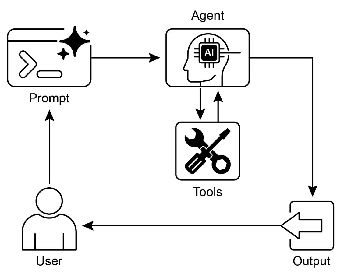

# 智能体实战之工具使用模式：赋予AI Agent“行动”的能力



## 一.简介
工具使用模式是解锁AI Agent真正潜力的关键。如果说大语言模型（LLM）是Agent的“大脑”，负责思考、推理和语言理解，那么工具就是它的“手和脚”，让它能够感知和操作数字世界。

传统的LLM受限于其训练数据，如同一个博学但只能纸上谈兵的谋士。它能告诉你过去的知识，却无法获取实时信息，也无法执行任何具体的操作。工具使用模式彻底改变了这一点，它将LLM从一个被动的“知识库”转变为一个主动的“任务执行者”。

这个过程的核心在于一个智能决策循环：

1.  **意图理解**：Agent接收用户的复杂请求，并理解其最终目标。
2.  **策略规划**：LLM分析可用的工具集，并制定一个行动计划。它会决定需要调用哪些工具、以何种顺序调用，以及如何将前一个工具的输出作为后一个工具的输入。
3.  **指令翻译**：LLM将抽象的行动计划翻译成机器可读的结构化指令（如JSON），精确指定要调用的工具名称和所需参数。
4.  **任务执行**：Agent框架接收这些指令，并像一位忠实的助手一样，调用相应的API、查询数据库或执行代码来完成具体任务。
5.  **结果整合**：工具执行的结果被返回给LLM。LLM根据这些新获得的信息，继续执行计划或进行最终总结，形成一个连贯、有用的回答给用户。

这种模式使得Agent能够编排一系列外部能力，解决远超其自身知识范围的问题。它不再仅仅是“说”，而是真正地“做”。

## 二.案例：电子商务商品研究助理

想象一下，你想购买一台新笔记本电脑，但面对琳琅满目的型号和复杂的参数，你感到无从下手。一个具备工具使用能力的Agent可以成为你的私人购物助理。

**场景**：用户希望比较两款热门笔记本电脑，以便做出购买决策。

**Agent能力**：
*   **搜索商品**：根据关键词在数据库中查找相关商品。
*   **获取详情**：获取特定商品的详细规格、价格和描述。
*   **分析评论**：获取并总结其他用户对商品的评价，了解其优缺点。

这个Agent将组合使用这三个工具，先找到目标商品，然后获取它们的详细信息和用户反馈，最后生成一份全面的对比报告。

## 三.langchain实现

```python
from langchain_classic.agents import create_tool_calling_agent, AgentExecutor
from langchain_core.tools import tool
from langchain_core.prompts import ChatPromptTemplate

# 1.初始化模型
from init_client import init_llm
llm = init_llm(0.1)

# --- 2. 模拟数据库 ---
# 模拟一个包含商品信息的数据库
product_database = {
    "prod_001": {
        "name": "UltraBook Pro 14",
        "brand": "FutureTech",
        "price": 12999,
        "specs": {
            "cpu": "Intel Core i7-13代",
            "ram": "16GB LPDDR5",
            "storage": "512GB NVMe SSD",
            "display": "14英寸 2.8K OLED"
        }
    },
    "prod_002": {
        "name": "MegaBook X",
        "brand": "Infinity",
        "price": 11999,
        "specs": {
            "cpu": "AMD Ryzen 7 7840HS",
            "ram": "32GB DDR5",
            "storage": "1TB NVMe SSD",
            "display": "15.6英寸 1080p IPS"
        }
    },
    "prod_003": {
        "name": "SlimAir Go",
        "brand": "CloudWalk",
        "price": 8999,
        "specs": {
            "cpu": "Apple M2",
            "ram": "8GB",
            "storage": "256GB SSD",
            "display": "13.6英寸 Liquid Retina"
        }
    }
}

# 模拟一个用户评论数据库
reviews_database = {
    "prod_001": [
        {"rating": 5, "comment": "屏幕素质惊人，性能强劲，非常满意！"},
        {"rating": 4, "comment": "一切都好，就是价格有点贵。"},
        {"rating": 5, "comment": "OLED屏幕看电影的体验无敌了。"}
    ],
    "prod_002": [
        {"rating": 5, "comment": "性价比之王，32GB内存太爽了，多任务无压力。"},
        {"rating": 3, "comment": "性能不错，但做工一般，而且有点重。"},
        {"rating": 4, "comment": "AMD处理器表现很好，续航比预想中长。"}
    ],
    "prod_003": [
        {"rating": 1, "comment": "不咋的，内存真小。"},
        {"rating": 2, "comment": "还行吧，一般办公用用。"},
        {"rating": 3, "comment": "参数一般，但苹果质量还是不错的。"}
    ]
}


# --- 3. 工具定义 ---
@tool
def search_product(query: str) -> str:
    """
    根据关键词搜索商品。返回匹配商品的ID和名称。
    例如，输入 'FutureTech' 或 'UltraBook'。
    """
    print(f"\n--- 🛠️ 工具调用: search_product, 查询: '{query}' ---")
    results = []
    for pid, product in product_database.items():
        if query.lower() in product["name"].lower() or query.lower() in product["brand"].lower():
            results.append(f"ID: {pid}, 名称: {product['name']}")

    if not results:
        return f"未找到与 '{query}' 相关的商品。"

    print(f"--- 工具结果: 找到 {len(results)} 个商品 ---")
    return "\n".join(results)


@tool
def get_product_details(product_id: str) -> str:
    """
    获取指定商品ID的详细信息，包括价格和规格。
    """
    print(f"\n--- 🛠️ 工具调用: get_product_details, 商品ID: '{product_id}' ---")
    product = product_database.get(product_id)
    if not product:
        return f"错误：未找到ID为 '{product_id}' 的商品。"

    details = (
        f"名称: {product['name']}\n"
        f"品牌: {product['brand']}\n"
        f"价格: ¥{product['price']}\n"
        f"规格:\n"
        f"  - CPU: {product['specs']['cpu']}\n"
        f"  - 内存: {product['specs']['ram']}\n"
        f"  - 存储: {product['specs']['storage']}\n"
        f"  - 屏幕: {product['specs']['display']}"
    )
    print(f"--- 工具结果: 已获取商品详情 ---")
    return details


@tool
def analyze_reviews(product_id: str) -> str:
    """
    获取并总结指定商品ID的用户评论。
    """
    print(f"\n--- 🛠️ 工具调用: analyze_reviews, 商品ID: '{product_id}' ---")
    reviews = reviews_database.get(product_id)
    if not reviews:
        return f"错误：未找到ID为 '{product_id}' 的商品评论。"

    summary = "用户评论总结:\n"
    positive_count = sum(1 for r in reviews if r['rating'] >= 4)
    negative_count = len(reviews) - positive_count

    summary += f"- 好评 ({positive_count}条): 用户普遍赞赏其性能和屏幕。\n"
    if negative_count > 0:
        summary += f"- 差评/中评 ({negative_count}条): 主要抱怨价格和重量。\n"

    summary += "\n代表性评论:\n" + "\n".join([f"- ({r['rating']}/5) {r['comment']}" for r in reviews])

    print(f"--- 工具结果: 已分析评论 ---")
    return summary


# --- 4. Agent组装 ---
tools = [search_product, get_product_details, analyze_reviews]

# 创建一个专门的提示词模板，指导Agent如何扮演购物助理
prompt = ChatPromptTemplate.from_messages([
    ("system", "你是一个专业的电子商务商品研究助理。你的任务是帮助用户比较商品，提供详细的信息和洞察。你可以使用提供的工具来搜索商品、获取详情和分析评论。请以清晰、有条理的方式呈现最终结果。"),
    ("human", "{input}"),
    ("placeholder", "{agent_scratchpad}"),  # Agent思考和行动的记录
])

# 创建Agent，将LLM、工具和提示词绑定
agent = create_tool_calling_agent(llm, tools, prompt)

# 创建Agent执行器，这是实际运行Agent的引擎
agent_executor = AgentExecutor(agent=agent, tools=tools, verbose=True)

# --- 5. 执行与演示 ---
def product_research_agent():
    query = "我想比较一下 FutureTech 和 Infinity 这两个品牌的旗舰笔记本，帮我做个决定。"
    print(f"用户问题: {query}\n")

    try:
        response = agent_executor.invoke({"input": query})
        print("\n--- ✅ 最终助理报告 ---")
        print(response['output'])
    except Exception as e:
        print(f"\n🛑 Agent 执行期间发生错误: {e}")


# 运行测试
if __name__ == "__main__":
    product_research_agent()
```

## 代码解释

1.  **ll初始化**
    *   llm = init_llm(0.1)

2.  **模拟数据库**
    *   为了使示例独立运行，我们创建了两个Python字典 `product_database` 和 `reviews_database` 来模拟真实世界的后端数据存储。
    *   `product_database` 存储了每个商品的ID、名称、品牌、价格和规格。
    *   `reviews_database` 存储了与商品ID关联的用户评论列表。

3.  **工具定义**
    *   我们使用 LangChain 的 `@tool` 装饰器将普通Python函数转换为Agent可用的工具。装饰器会自动解析函数名、参数和文档字符串，并将其呈现给LLM。
    *   **`search_product(query)`**：接收一个关键词字符串，遍历 `product_database`，查找名称或品牌中包含该关键词的商品，并返回一个包含ID和名称的列表。
    *   **`get_product_details(product_id)`**：接收一个商品ID，从 `product_database` 中检索对应的详细信息，并将其格式化为可读的字符串返回。
    *   **`analyze_reviews(product_id)`**：接收一个商品ID，从 `reviews_database` 中获取评论，进行简单的汇总分析（如好评/差评数量），并返回总结和代表性评论。
    *   每个工具函数中的 `print` 语句是为了在运行时清晰地展示Agent何时调用了哪个工具，便于我们理解其工作流程。

4.  **Agent组装**
    *   **`tools = [...]`**：将所有定义好的工具放入一个列表中。
    *   **`ChatPromptTemplate`**：这是给LLM的指令。`system` 消息定义了Agent的角色（专业助理）和目标（帮助用户比较商品）。`human` 消息是用户输入的占位符。`{agent_scratchpad}` 是一个特殊的占位符，LangChain会自动将Agent的思考过程（如选择哪个工具）和工具的执行结果填充在这里，形成上下文，供LLM进行下一步决策。
    *   **`create_tool_calling_agent(llm, tools, prompt)`**：这个函数将LLM、工具列表和提示词模板“打包”成一个Agent对象。它教会LLM如何根据提示和可用工具来生成函数调用。
    *   **`AgentExecutor`**：这是Agent的“运行时环境”或“调度器”。它接收用户的输入，将其传递给Agent，拦截Agent生成的函数调用，执行真实的工具函数，然后将结果返回给Agent，直到Agent给出最终答案。`verbose=True` 会打印出每一步的详细日志，非常适合调试和理解。

5.  **执行与演示**
    *   `product_research_agent` 函数定义了一个复杂的用户查询，要求比较两个品牌的旗舰笔记本。
    *   当 `agent_executor.invoke({"input": query})` 被调用时，以下流程会发生（由于`verbose=True`，你会在控制台看到）：
        1.  LLM收到请求，意识到需要先找到这两个品牌的笔记本。
        2.  它决定调用 `search_product` 工具，参数分别是 `"FutureTech"` 和 `"Infinity"`。
        3.  AgentExecutor执行这两个调用，并返回商品ID（`prod_001` 和 `prod_002`）。
        4.  LLM看到ID后，决定需要获取它们的详细信息，于是调用两次 `get_product_details`。
        5.  获得详情后，为了提供更全面的建议，它决定查看用户评论，于是调用两次 `analyze_reviews`。
        6.  最后，LLM将所有收集到的信息（商品详情、评论分析）整合在一起，生成一份结构清晰、对比鲜明的最终报告，作为 `response['output']` 返回。

这个案例生动地展示了工具使用模式如何让AI Agent从一个简单的问答机器人，升级为一个能够执行多步骤、多工具协作任务的智能助理。


## 四.langgraph实现

```python
from typing import TypedDict, List
from typing_extensions import Annotated

from langchain_core.tools import tool
from langchain_core.messages import BaseMessage, HumanMessage, AIMessage
from langgraph.graph import StateGraph, END
from langgraph.prebuilt import ToolNode

# --- 1.初始化模型 ---
from init_client import init_llm
llm = init_llm(0.1)

# --- 2. 模拟数据库 ---
# 模拟一个包含商品信息的数据库
product_database = {
    "prod_001": {
        "name": "UltraBook Pro 14",
        "brand": "FutureTech",
        "price": 12999,
        "specs": {
            "cpu": "Intel Core i7-13代",
            "ram": "16GB LPDDR5",
            "storage": "512GB NVMe SSD",
            "display": "14英寸 2.8K OLED"
        }
    },
    "prod_002": {
        "name": "MegaBook X",
        "brand": "Infinity",
        "price": 11999,
        "specs": {
            "cpu": "AMD Ryzen 7 7840HS",
            "ram": "32GB DDR5",
            "storage": "1TB NVMe SSD",
            "display": "15.6英寸 1080p IPS"
        }
    },
    "prod_003": {
        "name": "SlimAir Go",
        "brand": "CloudWalk",
        "price": 8999,
        "specs": {
            "cpu": "Apple M2",
            "ram": "8GB",
            "storage": "256GB SSD",
            "display": "13.6英寸 Liquid Retina"
        }
    }
}

# 模拟一个用户评论数据库
reviews_database = {
    "prod_001": [
        {"rating": 5, "comment": "屏幕素质惊人，性能强劲，非常满意！"},
        {"rating": 4, "comment": "一切都好，就是价格有点贵。"},
        {"rating": 5, "comment": "OLED屏幕看电影的体验无敌了。"}
    ],
    "prod_002": [
        {"rating": 5, "comment": "性价比之王，32GB内存太爽了，多任务无压力。"},
        {"rating": 3, "comment": "性能不错，但做工一般，而且有点重。"},
        {"rating": 4, "comment": "AMD处理器表现很好，续航比预想中长。"}
    ],
    "prod_003": [
        {"rating": 1, "comment": "不咋的，内存真小。"},
        {"rating": 2, "comment": "还行吧，一般办公用用。"},
        {"rating": 3, "comment": "参数一般，但苹果质量还是不错的。"}
    ]
}


# --- 3. 工具定义 ---
@tool
def search_product(query: str) -> str:
    """
    根据关键词搜索商品。返回匹配商品的ID和名称。
    例如，输入 'FutureTech' 或 'UltraBook'。
    """
    print(f"\n--- 🛠️ 工具调用: search_product, 查询: '{query}' ---")
    results = []
    for pid, product in product_database.items():
        if query.lower() in product["name"].lower() or query.lower() in product["brand"].lower():
            results.append(f"ID: {pid}, 名称: {product['name']}")
    if not results:
        return f"未找到与 '{query}' 相关的商品。"
    print(f"--- 工具结果: 找到 {len(results)} 个商品 ---")
    return "\n".join(results)


@tool
def get_product_details(product_id: str) -> str:
    """获取指定商品ID的详细信息，包括价格和规格。"""
    print(f"\n--- 🛠️ 工具调用: get_product_details, 商品ID: '{product_id}' ---")
    product = product_database.get(product_id)
    if not product:
        return f"错误：未找到ID为 '{product_id}' 的商品。"
    details = (
        f"名称: {product['name']}\n品牌: {product['brand']}\n价格: ¥{product['price']}\n规格:\n  - CPU: {product['specs']['cpu']}\n  - 内存: {product['specs']['ram']}\n  - 存储: {product['specs']['storage']}\n  - 屏幕: {product['specs']['display']}")
    print(f"--- 工具结果: 已获取商品详情 ---")
    return details


@tool
def analyze_reviews(product_id: str) -> str:
    """获取并总结指定商品ID的用户评论。"""
    print(f"\n--- 🛠️ 工具调用: analyze_reviews, 商品ID: '{product_id}' ---")
    reviews = reviews_database.get(product_id)
    if not reviews:
        return f"错误：未找到ID为 '{product_id}' 的商品评论。"
    summary = "用户评论总结:\n"
    positive_count = sum(1 for r in reviews if r['rating'] >= 4)
    negative_count = len(reviews) - positive_count
    summary += f"- 好评 ({positive_count}条): 用户普遍赞赏其性能和屏幕。\n"
    if negative_count > 0:
        summary += f"- 差评/中评 ({negative_count}条): 主要抱怨价格和重量。\n"
    summary += "\n代表性评论:\n" + "\n".join([f"- ({r['rating']}/5) {r['comment']}" for r in reviews])
    print(f"--- 工具结果: 已分析评论 ---")
    return summary


tools = [search_product, get_product_details, analyze_reviews]

# --- 4. LangGraph 工作流定义 ---

# 定义 Agent 的状态。状态是在图的节点之间传递的信息。
# 这里我们使用一个预定义的状态，它只包含一个 `messages` 键。
from langgraph.graph.message import add_messages


class State(TypedDict):
    messages: Annotated[List[BaseMessage], add_messages]

# 定义决定下一步路由的函数
def should_continue(state: State) -> str:
    """
    决定下一步是调用工具还是结束。
    """
    messages = state['messages']
    last_message = messages[-1]
    # 如果 LLM 决定调用工具，我们路由到 "tools" 节点
    if last_message.tool_calls:
        return "tools"
    # 否则，我们结束
    return END


# 定义调用模型的节点
def call_model(state: State):
    """
    调用模型并获取响应。
    """
    messages = state['messages']
    # 将工具绑定到模型上
    model_with_tools = llm.bind_tools(tools)
    response = model_with_tools.invoke(messages)
    # 返回一个包含新消息列表的状态
    return {"messages": [response]}


# --- 5. 构建图 ---
# 从我们的状态定义创建一个 StateGraph
workflow = StateGraph(State)

# 添加节点
workflow.add_node("agent", call_model)
workflow.add_node("tools", ToolNode(tools))

# 设置入口点
workflow.set_entry_point("agent")

# 添加条件边
workflow.add_conditional_edges(
    "agent",
    should_continue,
    ["tools", END]
)

# 添加从 tools 回到 agent 的普通边
workflow.add_edge("tools", "agent")

# 编译图
app = workflow.compile()

# 打印图的结构（可选，非常直观！）
try:
    print("--- 图结构 ---")
    app.get_graph().print_ascii()
    print("\n" + "=" * 20 + "\n")
except Exception as e:
    print(f"无法打印图结构: {e}")

# --- 6. 执行与演示 ---
def product_research_agent():
    query = "我想比较一下 FutureTech 和 Infinity 这两个品牌的旗舰笔记本，帮我做个决定。"
    print(f"用户问题: {query}\n")

    # 初始状态，包含用户的第一个消息
    initial_state = {"messages": [HumanMessage(content=query)]}

    # 使用 stream 来实时查看每一步的输出
    for event in app.stream(initial_state):
        for key, value in event.items():
            print(f"--- 节点 '{key}' 的输出 ---")
            # pprint(value) # 可以打印完整的状态，但通常我们只关心最后一条消息
            if 'messages' in value and value['messages']:
                last_message = value['messages'][-1]
                if isinstance(last_message, AIMessage) and last_message.content:
                    print(f"AI 思考/回答: {last_message.content}")
                elif isinstance(last_message, AIMessage) and last_message.tool_calls:
                    print(f"AI 决定调用工具: {last_message.tool_calls}")
            print("-" * 20)

    # 获取最终状态
    final_state = app.invoke(initial_state)
    final_message = final_state['messages'][-1]
    print("\n--- ✅ 最终助理报告 ---")
    print(final_message.content)


# 运行测试
if __name__ == "__main__":

    product_research_agent()
```

## 代码解释

### 核心区别：从 `AgentExecutor` 到 `StateGraph`

- **`AgentExecutor` (旧方法)**：你提供一个 LLM、工具和提示词，它内部封装了一个固定的循环：思考 -> 行动 -> 观察。你无法轻易改变这个循环的结构。
- **`StateGraph` (新方法)**：你像画流程图一样，**显式地定义**出 Agent 的每一个工作节点（思考、行动）以及它们之间的连接关系（决策逻辑）。这让你对 Agent 的行为有完全的控制。

---

### 1. 初始化llm
```python
llm = init_llm(0.1)
```

---

### 2. LangGraph 工作流定义

这是代码的核心变化所在。

**a. 定义状态**

```python
from langgraph.graph.message import add_messages
class State(TypedDict):
    messages: Annotated[List[BaseMessage], add_messages]
```

- **状态** 是在图的各个节点之间传递的数据结构。它就像是 Agent 的“短期记忆”。
- 我们定义了一个 `State` 类，它只有一个键 `messages`。
- `messages` 的值是一个消息列表，用来存储整个对话历史，包括用户的输入、AI 的思考、工具调用和工具返回的结果。
- `Annotated[List[BaseMessage], add_messages]` 是一个特殊用法，它告诉 LangGraph 如何更新这个 `messages` 列表：当新消息传来时，使用 `add_messages` 函数将其追加到现有列表中，而不是覆盖。LangGraph 提供了 `MessagesState` 这个预构建的状态类，所以我们直接使用它更简单。

**b. 定义节点**

节点是图中的执行单元，可以是一个函数调用、一个 LLM 调用等。

```python
def call_model(state: State):
    messages = state['messages']
    model_with_tools = llm.bind_tools(tools)
    response = model_with_tools.invoke(messages)
    return {"messages": [response]}
```

- `call_model` 是我们自定义的**“思考”节点**。它接收当前的 `state`，从 `state` 中取出消息历史，然后调用绑定了工具的 LLM。
- LLM 的响应（可能是一个回答，也可能是一个工具调用指令）被包装成一个新的消息，并更新到 `state` 中返回。

```python
from langgraph.prebuilt import ToolNode
# ...
workflow.add_node("tools", ToolNode(tools))
```

- `ToolNode` 是 LangGraph 提供的一个**预构建的“行动”节点**。它非常智能，能自动检查传入的状态中是否包含工具调用指令。
- 如果有，它会执行相应的工具，并将工具的输出作为一条新消息添加到状态中。
- 如果没有，它什么都不做。这大大简化了我们的代码。

**c. 定义边**

边定义了节点之间的流转逻辑。

```python
def should_continue(state: State) -> str:
    messages = state['messages']
    last_message = messages[-1]
    if last_message.tool_calls:
        return "tools"
    return END
```

- `should_continue` 是一个**“条件边”函数**。它决定了从 `agent` 节点出来后，下一步该去哪里。
- 它检查 `agent` 节点（即 `call_model` 函数）产生的最后一条消息。
- 如果这条消息包含 `tool_calls`（即 LLM 决定使用工具），函数返回 `"tools"`，表示下一步应该流向 `tools` 节点。
- 如果不包含 `tool_calls`（即 LLM 给出了最终答案），函数返回 `END`，表示工作流结束。

**d. 构建和编译图**

```python
workflow = StateGraph(State)
workflow.add_node("agent", call_model)
workflow.add_node("tools", ToolNode(tools))
workflow.set_entry_point("agent")
workflow.add_conditional_edges("agent", should_continue, ["tools", END])
workflow.add_edge("tools", "agent")
app = workflow.compile()
```

- 我们创建一个 `StateGraph` 实例，并告诉它我们定义的 `State` 结构。
- 使用 `add_node` 将我们定义的节点（`call_model` 和 `ToolNode` 实例）添加到图中，并给它们命名（`"agent"` 和 `"tools"`）。
- `set_entry_point("agent")` 设置工作流的起点。
- `add_conditional_edges` 添加了从 `agent` 节点出发的条件边，告诉它根据 `should_continue` 函数的返回值来决定流向。
- `add_edge("tools", "agent")` 添加了一条从 `tools` 节点回到 `agent` 节点的普通边，形成了“行动-观察-再思考”的循环。
- 最后，`workflow.compile()` 将这个图结构编译成一个可执行的应用 `app`。

---

### 3. 执行与演示

```python
for event in app.stream(initial_state):
    # ...
```

- 我们使用 `app.stream()` 来执行图。与 `invoke()` 不同，`stream()` 会产生一个生成器，每当一个节点执行完毕，它就会产生一个事件。
- 这让我们可以实时地看到 Agent 的每一步操作：它在哪个节点、做了什么、输出了什么。这对于调试和理解 Agent 的行为非常有帮助。
- 最终，我们通过 `app.invoke()` 获取完整执行后的最终状态，并从中提取出 AI 的最终答案。

### 总结：LangGraph 的优势

通过这个案例，我们可以看到 LangGraph 的几个关键优势：

1.  **透明性与可控性**：你不再是把任务交给一个黑盒。你亲手绘制了 Agent 的“思维导图”，每一步的决策逻辑都清晰可见，可以随时修改和优化。
2.  **灵活性**：可以轻松构建比简单循环更复杂的流程，比如并行调用工具、添加人工审核节点、实现更复杂的条件分支等。
3.  **状态管理**：`State` 的概念让管理复杂、多步骤的长期任务变得简单。你可以在状态中存储任何你需要的信息，并在任何节点中访问它。
4.  **强大的调试能力**：`stream()` 方法和清晰的节点结构让你能像调试程序一样，一步步跟踪 Agent 的执行过程，快速定位问题。

对于构建生产级的、可靠的复杂 Agent，LangGraph 提供了一个比传统 `AgentExecutor` 更加强大和坚实的基础。

