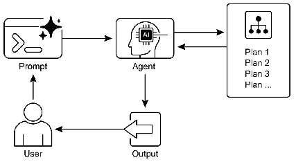

# 智能体实战之智能规划：AI Agent的高级决策能力



## 一．简介
### 规划模式的本质

在人工智能领域，真正的智能不仅表现为对即时刺激的响应，更体现在对未来行动的前瞻性思考。规划模式是AI Agent展现高级智能的核心机制，它使系统能够将复杂目标分解为可执行的步骤序列，从而系统性地从当前状态过渡到期望状态。

规划Agent就像一位战略家，当面对"组织一次国际会议"这样的复杂任务时，它不会盲目行动，而是首先分析现状（预算、参与者、时间限制）和目标（成功的会议体验），然后设计一条最优路径。这个过程不是预设的，而是动态生成的，能够根据环境变化实时调整。

### 规划的双重特性：灵活性与可靠性

规划模式的精髓在于其适应性。当遇到意外障碍——如关键演讲者取消出席或场地突然不可用——优秀的规划Agent不会崩溃，而是将这些新约束纳入考量，重新评估并调整策略。这种弹性使AI系统能够在不确定的环境中保持功能。

然而，并非所有场景都需要完全动态的规划。对于那些解决方案明确且重复性高的任务，限制Agent的自主性反而能提高效率和可预测性。这就引出了一个关键决策：何时需要探索"如何做"，何时只需执行已知流程？

### 规划模式的应用领域

规划模式在多个领域展现其价值：

在**业务流程管理**中，规划Agent可以协调复杂的跨部门项目，如产品发布，将高级目标转化为具体的任务序列，管理依赖关系并优化资源分配。

在**科学研究**中，规划模式帮助设计实验方案，从假设验证到数据分析，创建系统性的研究路径。

在**教育领域**，个性化学习路径规划Agent可以根据学生表现动态调整课程内容和学习节奏，确保最优学习效果。

## 二．案例实战：旅行规划 Agent
分别使用langchain和langgraph框架创建一个旅行规划Agent，它能够根据用户偏好制定详细的旅行计划。

## 三．langchain实现
```python
from typing import Dict
import json
from langchain_classic.memory import ConversationBufferMemory
from langchain_core.output_parsers import BaseOutputParser
from langchain_core.prompts import PromptTemplate

# 初始化llm
from init_client import init_llm

llm = init_llm(0.7)

# 定义输出解析器，将模型输出转换为结构化数据
class TravelPlanParser(BaseOutputParser):
    def parse(self, text: str) -> Dict:
        try:
            # 尝试提取JSON部分
            start_idx = text.find('{')
            end_idx = text.rfind('}') + 1
            if start_idx != -1 and end_idx != 0:
                json_str = text[start_idx:end_idx]
                return json.loads(json_str)
            else:
                # 如果没有找到JSON，返回原始文本
                return {"plan": text}
        except Exception as e:
            print(f"解析错误: {e}")
            return {"plan": text}

# 创建规划模板
planning_template = """
你是一位专业的旅行规划师，擅长根据客户需求创建详细的旅行计划。

客户需求：
- 目的地：{destination}
- 旅行时长：{duration}
- 预算：{budget}
- 兴趣偏好：{interests}
- 出行时间：{travel_date}

请创建一个详细的旅行计划，包括：
1. 每日行程安排
2. 推荐景点和活动
3. 餐饮建议
4. 交通方案
5. 预算分配

请以JSON格式返回计划，结构如下：
{{
  "daily_itinerary": [
    {{
      "day": 1,
      "activities": ["活动1", "活动2"],
      "meals": ["早餐建议", "午餐建议", "晚餐建议"],
      "transportation": "当日交通方案"
    }}
  ],
  "budget_breakdown": {{
    "accommodation": "预算金额",
    "food": "预算金额",
    "activities": "预算金额",
    "transportation": "预算金额"
  }},
  "general_tips": ["旅行提示1", "旅行提示2"]
}}
"""

# 创建调整模板
adjustment_template = """
根据新的情况调整旅行计划：

原始计划：
{original_plan}

新情况/调整需求：
{adjustment_request}

请提供调整后的旅行计划，保持相同的JSON格式。
"""

# 创建提示模板
planning_prompt = PromptTemplate(
    input_variables=["destination", "duration", "budget", "interests", "travel_date"],
    template=planning_template
)

adjustment_prompt = PromptTemplate(
    input_variables=["original_plan", "adjustment_request"],
    template=adjustment_template
)

# 使用LCEL语法创建链
planning_chain = planning_prompt | llm | TravelPlanParser()
adjustment_chain = adjustment_prompt | llm | TravelPlanParser()

# 创建记忆组件
memory = ConversationBufferMemory()


# 定义旅行规划Agent类
class TravelPlannerAgent:
    def __init__(self):
        self.current_plan = None
        self.planning_chain = planning_chain
        self.adjustment_chain = adjustment_chain
        self.memory = memory

    def create_plan(self, destination, duration, budget, interests, travel_date):
        """创建初始旅行计划"""
        response = self.planning_chain.invoke({
            "destination": destination,
            "duration": duration,
            "budget": budget,
            "interests": interests,
            "travel_date": travel_date
        })

        self.current_plan = response
        self.memory.save_context(
            {"input": f"创建旅行计划到{destination}，时长{duration}天，预算{budget}"},
            {"output": str(response)}
        )

        return response

    def adjust_plan(self, adjustment_request):
        """根据新情况调整计划"""
        if not self.current_plan:
            return "没有可调整的计划，请先创建计划。"

        response = self.adjustment_chain.invoke({
            "original_plan": str(self.current_plan),
            "adjustment_request": adjustment_request
        })

        self.current_plan = response
        self.memory.save_context(
            {"input": f"调整计划：{adjustment_request}"},
            {"output": str(response)}
        )

        return response

    def get_current_plan(self):
        """获取当前计划"""
        return self.current_plan


# 使用示例
if __name__ == "__main__":
    # 初始化旅行规划Agent
    agent = TravelPlannerAgent()

    # 创建初始计划
    print("## 创建初始旅行计划 ##")
    initial_plan = agent.create_plan(
        destination="中国北京",
        duration="5天",
        budget="10000元",
        interests="传统文化、美食、古迹",
        travel_date="2026年1月"
    )

    print("初始计划:")
    print(json.dumps(initial_plan, indent=2, ensure_ascii=False))

    # 调整计划
    print("\n## 调整旅行计划 ##")
    adjusted_plan = agent.adjust_plan("预算减少到8000元，并增加一天行程")

    print("调整后的计划:")
    print(json.dumps(adjusted_plan, indent=2, ensure_ascii=False))
```

这个案例的核心是演示 **规划模式**：一个 AI Agent 如何接收一个高级目标（“规划一次旅行”），将其分解为一系列步骤，生成一个结构化的计划，并且能够在遇到新情况时动态调整这个计划。

---

### 代码结构概览

整个代码可以分为以下几个主要部分：

1.  **导入模块**：引入所需的库。
2.  **自定义输出解析器 (`TravelPlanParser`)**：一个关键组件，用于将大语言模型的原始文本输出转换为机器可读的结构化数据（Python字典）。
3.  **初始化核心组件**：设置语言模型（LLM）和提示模板。
4.  **创建处理链**：使用 LangChain 的表达式语法（LCEL）将提示、模型和解析器串联成两个可执行的“链”——一个用于创建计划，一个用于调整计划。
5.  **封装 Agent 类 (`TravelPlannerAgent`)**：将处理链和状态（如当前计划、记忆）封装成一个易于使用的类。
6.  **执行示例**：演示如何实例化并使用这个 Agent。

---

### 详细代码解释

#### １. 自定义输出解析器 (`TravelPlanParser`)

```python
class TravelPlanParser(BaseOutputParser):
    def parse(self, text: str) -> Dict:
        try:
            # 尝试提取JSON部分
            start_idx = text.find('{')
            end_idx = text.rfind('}') + 1
            if start_idx != -1 and end_idx != 0:
                json_str = text[start_idx:end_idx]
                return json.loads(json_str)
            else:
                return {"plan": text}
        except Exception as e:
            print(f"解析错误: {e}")
            return {"plan": text}
```

- **目的**：LLM 的输出是纯文本。为了让程序能方便地使用计划内容（比如访问某一天的行程），我们需要将文本转换为 Python 字典。
- **工作原理**：
    - `parse` 方法接收 LLM 返回的原始文本。
    - `text.find('{')` 和 `text.rfind('}')`：智能地定位文本中 JSON 格式的开始和结束位置。这很关键，因为 LLM 有时会在 JSON 前后添加一些解释性文字，如“好的，这是为您生成的计划：{...}”。
    - `json.loads(json_str)`：将提取出的 JSON 字符串解析成一个 Python 字典。
    - `try...except`：这是一个健壮性设计。如果 LLM 的输出格式不正确，导致无法解析，程序不会崩溃，而是将原始文本包装在一个字典中返回，保证了流程的连续性。

#### ２. 初始化核心组件

```python
# 初始化llm
from init_client import init_llm
llm = init_llm(0.7)

# 创建规划模板
planning_template = """
你是一位专业的旅行规划师...
客户需求：
- 目的地：{destination}
...
请以JSON格式返回计划，结构如下：
{{
  "daily_itinerary": [ ... ],
  ...
}}
"""
# 创建提示模板
planning_prompt = PromptTemplate(
    input_variables=["destination", "duration", "budget", "interests", "travel_date"],
    template=planning_template
)
```

- **llm = init_llm(0.7)**:
    - `temperature=0.7`: 这是一个非常重要的参数，控制输出的随机性。0.7 意味着模型在生成内容时既有一定的创造性（适合规划行程），又不会过于天马行空，能较好地遵循指令。
- **提示模板 (`planning_template` 和 `planning_prompt`)**:
    - **角色扮演**：`你是一位专业的旅行规划师...` 这部分设定了 LLM 的身份，有助于它生成更专业、更相关的回答。
    - **变量占位符**：`{destination}`, `{duration}` 等是占位符，稍后会被具体的用户输入替换。
    - **输出格式指令**：`请以JSON格式返回计划...` 这是整个规划成功的关键。它明确指示 LLM 必须按照给定的 JSON 结构来组织输出，这极大地提高了 `TravelPlanParser` 解析成功的概率。
    - `PromptTemplate(...)` 将这个字符串模板转换成一个 LangChain 对象，使其能够被用于 LCEL 链中。

#### ３. 创建处理链

```python
# 使用LCEL语法创建链
planning_chain = planning_prompt | llm | TravelPlanParser()
adjustment_chain = adjustment_prompt | llm | TravelPlanParser()
```

这是 LangChain 表达式语言（LCEL）的精髓，它用管道符 `|` 来表示数据流向，非常直观。

- **`planning_chain` 的工作流程**：
    1.  **输入**：一个包含 `destination`, `duration` 等键的字典。
    2.  **`planning_prompt`**：接收这个字典，将变量填充到模板中，生成一个完整的提示字符串。
    3.  **`|` (管道)**：将提示字符串传递给下一个组件。
    4.  **`llm`**：接收提示字符串，调用 DeepSeek API，生成一个原始文本响应。
    5.  **`|` (管道)**：将文本响应传递给下一个组件。
    6.  **`TravelPlanParser()`**：接收文本，将其解析成 Python 字典。
    7.  **输出**：一个结构化的 Python 字典。

`adjustment_chain` 的工作流程完全相同，只是它使用的是用于调整计划的提示模板。

#### ４. 封装 Agent 类 (`TravelPlannerAgent`)

```python
class TravelPlannerAgent:
    def __init__(self):
        self.current_plan = None
        self.planning_chain = planning_chain
        self.adjustment_chain = adjustment_chain
        self.memory = ConversationBufferMemory()
    
    def create_plan(self, destination, duration, budget, interests, travel_date):
        response = self.planning_chain.invoke({
            "destination": destination,
            "duration": duration,
            # ...
        })
        self.current_plan = response
        self.memory.save_context(...)
        return response
```

- **目的**：将复杂的逻辑封装成一个简单易用的接口。使用者不需要关心内部的链是如何工作的，只需要调用 `create_plan` 或 `adjust_plan` 方法即可。
- **`__init__`**:
    - `self.current_plan = None`: 定义一个实例变量来存储当前的计划状态。这使得 Agent 具有了“记忆”能力，知道自己在处理哪个计划。
    - `self.memory`: 初始化对话记忆，虽然本例中未深度使用，但在构建更复杂的对话式 Agent 时至关重要。
- **`create_plan` 方法**:
    - `self.planning_chain.invoke({...})`: 这是调用 LCEL 链的标准方法。传入一个字典，其键与 `PromptTemplate` 中定义的 `input_variables` 相匹配。
    - `self.current_plan = response`: 将生成的计划保存为 Agent 的当前状态。
    - `self.memory.save_context(...)`: 将本次交互（用户输入和AI输出）记录到记忆中。

#### ５. 执行示例

```python
if __name__ == "__main__":
    agent = TravelPlannerAgent()
    
    # 1. 创建初始计划
    initial_plan = agent.create_plan(...)
    print(json.dumps(initial_plan, indent=2, ensure_ascii=False))
    
    # 2. 调整计划
    adjusted_plan = agent.adjust_plan("预算减少到8000元，并增加一天行程")
    print(json.dumps(adjusted_plan, indent=2, ensure_ascii=False))
```

- `if __name__ == "__main__":`: 这是 Python 的标准写法，确保这部分代码只在脚本被直接运行时执行，而不会在被其他脚本导入时执行。
- **实例化与调用**：
    1.  创建一个 `TravelPlannerAgent` 的实例。
    2.  调用 `create_plan` 方法，传入旅行需求，并打印出结构化的初始计划。`json.dumps` 用于将 Python 字典格式化为漂亮的 JSON 字符串，`ensure_ascii=False` 确保中文字符能正常显示。
    3.  调用 `adjust_plan` 方法，传入一个新的约束条件（“预算减少”），并打印出调整后的计划。这完美展示了 Agent 的**动态适应性**。

### 总结

这个案例通过一个具体的旅行规划任务，生动地展示了 AI 规划模式的几个核心要素：

1. **目标导向**：Agent 的行为由一个高级目标（规划旅行）驱动。
2. **分解与结构化**：将复杂任务分解为每日行程、预算等结构化步骤，并要求 LLM 以结构化格式（JSON）输出。
3. **动态适应**：当环境变化（预算调整）时，Agent 不是从头再来，而是在现有计划基础上进行修改，体现了规划的灵活性。
4. **模块化设计**：通过 LCEL 和类的封装，代码清晰、可复用，易于理解和扩展。这正是一个优秀 AI 系统设计的体现。

这个旅行规划Agent展示了规划模式的核心特性：

1. **目标分解**：将"规划旅行"这一复杂目标分解为每日行程、餐饮、交通等具体任务
2. **动态适应**：当情况变化（如预算调整）时，能够重新评估并调整计划
3. **结构化输出**：生成格式化的旅行计划，便于后续处理
4. **记忆功能**：保留交互历史，支持上下文相关的调整

该系统首先根据用户输入创建全面的旅行计划，然后能够根据新的约束条件动态调整，体现了规划模式的核心价值——在变化环境中保持目标导向的行为能力。

通过这种设计，AI Agent从简单的响应式系统转变为能够处理复杂、多步骤任务的智能规划者，展现了更接近人类的决策能力。


## 四．langgraph实现

```python
from typing import Dict, List, Optional, TypedDict, Annotated, Literal
import json
import operator
from langchain_core.messages import HumanMessage, AIMessage, BaseMessage
from langchain_core.output_parsers import BaseOutputParser, JsonOutputParser
from langchain_core.prompts import PromptTemplate
from langgraph.graph import StateGraph, END
from langgraph.checkpoint.memory import MemorySaver

# 初始化LLM
from init_client import init_llm

llm = init_llm(0.7)


# 定义输出解析器，将模型输出转换为结构化数据
class TravelPlanParser(BaseOutputParser):
    def parse(self, text: str) -> Dict:
        try:
            # 尝试提取JSON部分
            start_idx = text.find('{')
            end_idx = text.rfind('}') + 1
            if start_idx != -1 and end_idx != 0:
                json_str = text[start_idx:end_idx]
                return json.loads(json_str)
            else:
                # 如果没有找到JSON，返回原始文本
                return {"plan": text}
        except Exception as e:
            print(f"解析错误: {e}")
            return {"plan": text}


# 定义用户意图解析结果
class UserIntent(TypedDict):
    intent: Literal["create", "adjust", "unknown"]
    destination: Optional[str]
    duration: Optional[str]
    budget: Optional[str]
    interests: Optional[str]
    travel_date: Optional[str]
    adjustment_request: Optional[str]


# 定义用户意图解析器
class UserIntentParser(JsonOutputParser):
    def parse(self, text: str) -> UserIntent:
        try:
            result = super().parse(text)
            # 确保所有必需的字段都存在
            if "intent" not in result:
                result["intent"] = "unknown"
            return result
        except Exception as e:
            print(f"用户意图解析错误: {e}")
            return {"intent": "unknown"}


# 定义Agent状态
class AgentState(TypedDict):
    messages: Annotated[List[BaseMessage], operator.add]
    current_plan: Optional[Dict]
    destination: Optional[str]
    duration: Optional[str]
    budget: Optional[str]
    interests: Optional[str]
    travel_date: Optional[str]
    adjustment_request: Optional[str]
    user_intent: Optional[str]


# 创建用户意图解析模板
intent_extraction_template = """
你是一个旅行规划助手，需要解析用户的输入，确定他们的意图并提取相关信息。

用户输入：{user_input}

请分析用户输入，确定是创建新的旅行计划还是调整现有计划，并提取相关信息。

请以JSON格式返回结果，包含以下字段：
- intent: 用户意图，只能是 "create"（创建新计划）或 "adjust"（调整现有计划）或 "unknown"（无法确定）
- destination: 目的地（如果是创建计划）
- duration: 旅行时长（如果是创建计划）
- budget: 预算（如果是创建计划）
- interests: 兴趣偏好（如果是创建计划）
- travel_date: 出行时间（如果是创建计划）
- adjustment_request: 调整请求的具体内容（如果是调整计划）

示例：
输入："我想去巴黎玩5天，预算1万元，喜欢艺术和美食，下个月出发"
输出：{{"intent": "create", "destination": "巴黎", "duration": "5天", "budget": "1万元", "interests": "艺术和美食", "travel_date": "下个月", "adjustment_request": null}}

输入："把预算减少到8000元，增加一天行程"
输出：{{"intent": "adjust", "destination": null, "duration": null, "budget": null, "interests": null, "travel_date": null, "adjustment_request": "把预算减少到8000元，增加一天行程"}}
"""

# 创建规划模板
planning_template = """
你是一位专业的旅行规划师，擅长根据客户需求创建详细的旅行计划。

客户需求：
- 目的地：{destination}
- 旅行时长：{duration}
- 预算：{budget}
- 兴趣偏好：{interests}
- 出行时间：{travel_date}

请创建一个详细的旅行计划，包括：
1. 每日行程安排
2. 推荐景点和活动
3. 餐饮建议
4. 交通方案
5. 预算分配

请以JSON格式返回计划，结构如下：
{{
  "daily_itinerary": [
    {{
      "day": 1,
      "activities": ["活动1", "活动2"],
      "meals": ["早餐建议", "午餐建议", "晚餐建议"],
      "transportation": "当日交通方案"
    }}
  ],
  "budget_breakdown": {{
    "accommodation": "预算金额",
    "food": "预算金额",
    "activities": "预算金额",
    "transportation": "预算金额"
  }},
  "general_tips": ["旅行提示1", "旅行提示2"]
}}
"""

# 创建调整模板
adjustment_template = """
根据新的情况调整旅行计划：

原始计划：
{original_plan}

新情况/调整需求：
{adjustment_request}

请提供调整后的旅行计划，保持相同的JSON格式。
"""

# 创建提示模板
intent_extraction_prompt = PromptTemplate(
    input_variables=["user_input"],
    template=intent_extraction_template
)

planning_prompt = PromptTemplate(
    input_variables=["destination", "duration", "budget", "interests", "travel_date"],
    template=planning_template
)

adjustment_prompt = PromptTemplate(
    input_variables=["original_plan", "adjustment_request"],
    template=adjustment_template
)

# 创建意图解析链
intent_extraction_chain = intent_extraction_prompt | llm | UserIntentParser()


# 定义LangGraph节点函数
def extract_travel_info(state: AgentState):
    """从消息中提取旅行信息"""
    last_message = state["messages"][-1]
    if isinstance(last_message, HumanMessage):
        content = last_message.content

        # 使用LLM解析用户意图
        try:
            intent_result = intent_extraction_chain.invoke({"user_input": content})
            intent = intent_result.get("intent", "unknown")

            if intent == "create":
                # 创建新计划的请求
                return {
                    "user_intent": "create",
                    "destination": intent_result.get("destination"),
                    "duration": intent_result.get("duration"),
                    "budget": intent_result.get("budget"),
                    "interests": intent_result.get("interests"),
                    "travel_date": intent_result.get("travel_date"),
                    "adjustment_request": None
                }
            elif intent == "adjust":
                # 调整计划的请求
                return {
                    "user_intent": "adjust",
                    "adjustment_request": intent_result.get("adjustment_request"),
                    "destination": None,
                    "duration": None,
                    "budget": None,
                    "interests": None,
                    "travel_date": None
                }
            else:
                # 无法确定意图
                return {
                    "user_intent": "unknown",
                    "messages": [AIMessage(content="抱歉，我不太理解您的需求。请明确说明是创建新的旅行计划还是调整现有计划。")]
                }
        except Exception as e:
            print(f"解析用户输入时出错: {e}")
            return {
                "user_intent": "unknown",
                "messages": [AIMessage(content="抱歉，解析您的请求时遇到了问题。请再试一次。")]
            }

    return state


def create_travel_plan(state: AgentState):
    """创建旅行计划"""
    response = planning_prompt | llm | TravelPlanParser()
    result = response.invoke({
        "destination": state.get("destination", ""),
        "duration": state.get("duration", ""),
        "budget": state.get("budget", ""),
        "interests": state.get("interests", ""),
        "travel_date": state.get("travel_date", "")
    })

    return {
        "current_plan": result,
        "messages": [AIMessage(content=f"已创建旅行计划：{json.dumps(result, indent=2, ensure_ascii=False)}")]
    }


def adjust_travel_plan(state: AgentState):
    """调整旅行计划"""
    if not state.get("current_plan"):
        return {
            "messages": [AIMessage(content="没有可调整的计划，请先创建计划。")]
        }

    response = adjustment_prompt | llm | TravelPlanParser()
    result = response.invoke({
        "original_plan": json.dumps(state["current_plan"], indent=2, ensure_ascii=False),
        "adjustment_request": state.get("adjustment_request", "")
    })

    return {
        "current_plan": result,
        "messages": [AIMessage(content=f"已调整旅行计划：{json.dumps(result, indent=2, ensure_ascii=False)}")]
    }


def handle_unknown_intent(state: AgentState):
    """处理未知意图"""
    return {
        "messages": [AIMessage(content="抱歉，我不太理解您的需求。请明确说明是创建新的旅行计划还是调整现有计划。")]
    }


def route_request(state: AgentState):
    """路由请求到适当的节点"""
    intent = state.get("user_intent", "unknown")
    if intent == "create":
        return "create_plan"
    elif intent == "adjust":
        return "adjust_plan"
    else:
        return "handle_unknown"


# 构建LangGraph
def build_travel_planner_graph():
    """构建旅行规划图"""
    workflow = StateGraph(AgentState)

    # 添加节点
    workflow.add_node("extract_info", extract_travel_info)
    workflow.add_node("create_plan", create_travel_plan)
    workflow.add_node("adjust_plan", adjust_travel_plan)
    workflow.add_node("handle_unknown", handle_unknown_intent)

    # 设置入口点
    workflow.set_entry_point("extract_info")

    # 添加条件边
    workflow.add_conditional_edges(
        "extract_info",
        route_request,
        {
            "create_plan": "create_plan",
            "adjust_plan": "adjust_plan",
            "handle_unknown": "handle_unknown"
        }
    )

    # 添加结束边
    workflow.add_edge("create_plan", END)
    workflow.add_edge("adjust_plan", END)
    workflow.add_edge("handle_unknown", END)

    # 添加内存
    memory = MemorySaver()

    return workflow.compile(checkpointer=memory)


# 定义旅行规划Agent类
class TravelPlannerAgent:
    def __init__(self):
        self.graph = build_travel_planner_graph()
        # 打印图的结构（可选，非常直观！）
        try:
            print("--- 图结构 ---")
            self.graph.get_graph().print_ascii()
            print("\n" + "=" * 20 + "\n")
        except Exception as e:
            print(f"无法打印图结构: {e}")

        self.config = {"configurable": {"thread_id": "travel_planner"}}
        self.current_plan = None

    def create_plan(self, destination, duration, budget, interests, travel_date):
        """创建初始旅行计划"""
        # 构建用户消息
        user_message = f"创建旅行计划到{destination}，时长{duration}天，预算{budget}，兴趣偏好：{interests}，出行时间：{travel_date}"

        # 运行图
        result = self.graph.invoke(
            {
                "messages": [HumanMessage(content=user_message)],
                "destination": destination,
                "duration": duration,
                "budget": budget,
                "interests": interests,
                "travel_date": travel_date
            },
            config=self.config
        )

        self.current_plan = result.get("current_plan")
        return self.current_plan

    def adjust_plan(self, adjustment_request):
        """根据新情况调整计划"""
        # 构建用户消息
        user_message = f"调整计划：{adjustment_request}"

        # 运行图
        result = self.graph.invoke(
            {
                "messages": [HumanMessage(content=user_message)],
                "adjustment_request": adjustment_request,
                "current_plan": self.current_plan
            },
            config=self.config
        )

        self.current_plan = result.get("current_plan")
        return self.current_plan

    def get_current_plan(self):
        """获取当前计划"""
        return self.current_plan

    def chat(self, user_input):
        """与Agent对话"""
        result = self.graph.invoke(
            {
                "messages": [HumanMessage(content=user_input)]
            },
            config=self.config
        )

        self.current_plan = result.get("current_plan")
        return result["messages"][-1].content


# 使用示例
if __name__ == "__main__":
    # 初始化旅行规划Agent
    agent = TravelPlannerAgent()

    # 创建初始计划
    print("## 创建初始旅行计划 ##")
    initial_plan = agent.create_plan(
        destination="中国北京",
        duration="5天",
        budget="10000元",
        interests="传统文化、美食、古迹",
        travel_date="2026年1月"
    )

    print("初始计划:")
    print(json.dumps(initial_plan, indent=2, ensure_ascii=False))

    # 调整计划
    print("\n## 调整旅行计划 ##")
    adjusted_plan = agent.adjust_plan("预算减少到8000元，并增加一天行程")

    print("调整后的计划:")
    print(json.dumps(adjusted_plan, indent=2, ensure_ascii=False))

    # 使用聊天接口 - 测试自然语言输入
    print("\n## 使用聊天接口 - 自然语言输入测试 ##")

    # 测试创建计划的自然语言输入
    response1 = agent.chat("我想去美国洛杉矶玩7天，预算15000元，喜欢好莱坞和美食，明年春天出发")
    print(response1)

    # 测试调整计划的自然语言输入
    response2 = agent.chat("把预算减少到12000元，增加一些购物时间")
    print(response2)
```


好的，我们来详细解释一下这份经过改进和泛化的旅行规划Agent代码。

这份代码的核心目标是构建一个能够理解自然语言、创建并调整旅行计划的智能对话Agent。它利用了 **LangChain** 和 **LangGraph** 框架，并以 **DeepSeek** 作为其背后的语言模型（LLM）。

---

### 代码整体架构

代码可以分为以下几个主要部分：

1.  **初始化与核心组件**：导入库、初始化LLM、定义输出解析器。
2.  **状态定义**：使用 `TypedDict` 定义Agent在工作流中需要维护和传递的状态。
3.  **提示工程**：设计用于指导LLM完成特定任务的模板。
4.  **工作流节点**：定义图中的每个处理步骤（节点）。
5.  **图构建**：将节点和边连接起来，形成一个完整的工作流图。
6.  **Agent封装**：创建一个用户友好的类来与图进行交互。
7.  **使用示例**：展示如何调用这个Agent。

---

### 1. 初始化与核心组件

```python
from init_client import init_llm
llm = init_llm(0.7)
```
这部分很简单，就是从 `init_client.py` 文件中导入 `init_llm` 函数，并初始化一个温度为0.7的DeepSeek LLM实例。温度0.7意味着模型在生成文本时会有一定的创造性，但不会太离谱。

```python
class TravelPlanParser(BaseOutputParser):
    # ...
```
这是一个自定义的输出解析器。LLM在生成JSON格式的旅行计划时，有时会在JSON前后加上一些解释性的文字（例如："好的，这是您的旅行计划：`{...}`"）。这个解析器的作用就是**鲁棒地从文本中提取出有效的JSON部分**，并将其转换为Python字典。如果提取失败，它会将原始文本包装在一个字典中返回，防止程序崩溃。

```python
class UserIntent(TypedDict):
    # ...
class UserIntentParser(JsonOutputParser):
    # ...
```
这是本次改进的核心部分。
*   `UserIntent` (TypedDict)：它定义了一个**数据结构模板**，用来规范用户意图的解析结果。它明确指出解析结果必须包含 `intent` 字段（值为 "create", "adjust" 或 "unknown"），以及其他可选字段如 `destination`, `budget` 等。这为后续的数据处理提供了类型安全保障。
*   `UserIntentParser` (JsonOutputParser)：这是一个专门用于解析 `UserIntent` 结构的JSON解析器。它继承自LangChain的 `JsonOutputParser`，确保LLM的输出必须是符合 `UserIntent` 结构的JSON。

---

### 2. 状态定义

```python
class AgentState(TypedDict):
    messages: Annotated[List[BaseMessage], operator.add]
    current_plan: Optional[Dict]
    # ... 其他字段
```
`AgentState` 是LangGraph的**核心概念**。它定义了在整个工作流（图）中流动的数据包。你可以把它想象成一个“共享的记事本”，图中的每个节点都可以读取这个记事本的内容，也可以在上面写下新的内容。

*   `messages`: 使用 `Annotated[List[BaseMessage], operator.add]` 是LangGraph的惯用写法。它表示这是一个消息列表，每当有新的消息添加进来时，它会自动追加到列表的末尾，而不是覆盖。这天然地实现了**对话记忆**功能。
*   `current_plan`: 存储当前生成的旅行计划。
*   `destination`, `duration`, ...: 存储从用户输入中解析出的具体旅行信息。
*   `user_intent`: 存储解析出的用户意图（"create" 或 "adjust"）。

---

### 3. 提示工程

代码中定义了三个关键的提示模板：

1.  **`intent_extraction_template` (意图提取模板)**
    *   **目的**：这是实现泛化的关键。它的任务是**理解用户的自然语言输入**。
    *   **工作方式**：它告诉LLM：“给你一段用户输入，请判断他是想创建新计划还是调整旧计划，并把相关的信息（如目的地、预算等）提取出来，用指定的JSON格式返回。”
    *   **示例**：模板中包含了输入和输出的示例，这是一种强大的**少样本提示**技术，能极大地提高LLM解析的准确性。

2.  **`planning_template` (规划模板)**
    *   **目的**：指导LLM根据已提取的结构化信息（目的地、预算等）生成一个详细的、符合JSON格式的旅行计划。

3.  **`adjustment_template` (调整模板)**
    *   **目的**：指导LLM根据用户的调整请求和已有的旧计划，生成一个符合JSON格式的新计划。

---

### 4. 工作流节点

节点是图中的基本处理单元，每个都是一个Python函数，接收 `AgentState` 作为输入，并返回一个字典来更新状态。

```python
def extract_travel_info(state: AgentState):
    # ...
```
这是**最重要的节点**，也是本次的焦点。
*   **逻辑**：
    1.  获取最新的用户消息。
    2.  调用 `intent_extraction_chain`（由 `intent_extraction_prompt` | `llm` | `UserIntentParser` 组成）。
    3.  这个链将用户输入发送给LLM，LLM根据提示模板返回一个结构化的JSON，然后 `UserIntentParser` 将其解析为 `UserIntent` 字典。
    4.  函数检查解析出的 `intent` 字段。
    5.  如果是 `"create"`，它就更新状态中的 `destination`, `budget` 等字段。
    6.  如果是 `"adjust"`，它就更新状态中的 `adjustment_request` 字段。
    7.  如果是 `"unknown"`，它就返回一个错误消息。

这个函数将**自然语言理解（NLU）**的任务完全交给了LLM，实现了真正的泛化。

```python
def create_travel_plan(state: AgentState):
    # ...
def adjust_travel_plan(state: AgentState):
    # ...
```
这两个节点相对直接。它们从状态中获取 `extract_travel_info` 节点准备好的数据，调用相应的规划链（`planning_chain` 或 `adjustment_chain`）来生成或调整计划，并将结果更新到 `current_plan` 字段中。

---

### 5. 图构建

```python
def build_travel_planner_graph():
    workflow = StateGraph(AgentState)
    # ...
    return workflow.compile(checkpointer=memory)
```
这个函数将所有节点和逻辑串联成一个可执行的工作流。

1.  `workflow = StateGraph(AgentState)`: 创建一个图，并指定其状态结构为 `AgentState`。
2.  `workflow.add_node(...)`: 将之前定义的函数注册为图中的节点。
3.  `workflow.set_entry_point("extract_info")`: 设置图的入口，即任何请求都从 `extract_travel_info` 节点开始处理。
4.  `workflow.add_conditional_edges(...)`: 这是图的**决策逻辑**。它从 `extract_info` 节点出发，根据 `route_request` 函数的返回值（该函数检查 `state` 中的 `user_intent` 字段），决定下一步流向哪个节点（`create_plan`, `adjust_plan`, 或 `handle_unknown`）。
5.  `workflow.add_edge(..., END)`: 定义了哪些节点是图的终点。
6.  `workflow.compile(checkpointer=memory)`: 将图编译成一个可运行的应用。`checkpointer=MemorySaver()` 为图添加了**持久化记忆**功能。这意味着，即使在多次调用之间，只要 `thread_id` 相同，图就能记住之前的对话历史和 `current_plan`。

---

### 6. Agent封装

```python
class TravelPlannerAgent:
    def __init__(self):
        self.graph = build_travel_planner_graph()
        self.config = {"configurable": {"thread_id": "travel_planner"}}
        # ...
```
这个类为用户提供了一个简洁的API，隐藏了LangGraph的复杂性。

*   `__init__`: 在初始化时编译好图，并设置一个唯一的 `thread_id`。这个ID是记忆功能的关键，所有来自同一个Agent实例的对话都会共享同一个记忆空间。
*   `create_plan`, `adjust_plan`: 这两个方法提供了传统的、程序化的调用方式。它们构造一个明确的请求，然后调用 `self.graph.invoke()` 来执行整个工作流。
*   `chat`: 这是最能体现改进成果的方法。用户可以直接输入自然语言，如 `"我想去美国洛杉矶玩7天..."`，`chat` 方法会将这段话直接喂给图，图会自动完成意图识别、信息提取、计划生成等所有步骤，并返回最终结果。

---

### 7. 使用示例

`if __name__ == "__main__":` 部分展示了如何实例化和使用这个Agent。它不仅演示了程序化的调用，还特别测试了 `chat` 方法处理自然语言输入的能力，证明了整个系统的泛化性和智能性。

### 总结：关键改进点

1.  **从规则匹配到语义理解**：`extract_travel_info` 节点利用LLM强大的语义理解能力来解析用户意图，这是质的飞跃。
2.  **结构化数据流**：通过 `TypedDict` 和 `JsonOutputParser`，确保了在图的各个节点之间传递的数据是干净、结构化且类型安全的，大大降低了出错的可能性。
3.  **模块化和可扩展性**：LangGraph的节点和边结构使得整个系统非常模块化。未来如果需要增加新的功能（例如“取消计划”、“查询天气”），只需添加新的节点和相应的路由逻辑即可，非常容易扩展。
4.  **强大的状态管理**：`AgentState` 和 `MemorySaver` 的组合，让Agent拥有了真正的“记忆”，能够进行多轮的、有上下文的对话，这是构建复杂应用的基础。