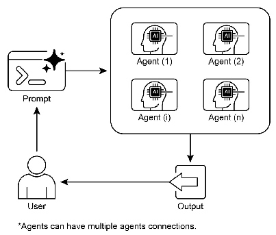

# 智能体实战之多智能体协同：重塑复杂问题解决之道


## 一.简介
在面对单一智能体难以驾驭的、跨越多个知识领域的复杂挑战时，多智能体协同范式展现出其独特的优势。传统单体智能体如同一位全才，虽能处理定义明确的任务，但在广度与深度上终究受限。而多智能体系统则更像一个高效协作的专业团队，它不依赖于单一的“超人”，而是通过构建一个由多个具备专长的智能体组成的协作网络来解决问题。

该范式的核心在于**任务的专业化分工**。一个宏大的目标被智能地拆解为一系列更精细、更聚焦的子任务。每个子任务随后被指派给最适合处理它的智能体——这个智能体可能拥有特定的数据访问权限、独特的推理模型或专门化的工具集。例如，在制定一项市场进入策略时，一个智能体可以负责宏观经济数据分析，另一个专注于竞争对手情报搜集，第三个则基于前两者的输出来构建具体的营销方案。

这种架构的威力远不止于简单的劳动分工，其**关键在于智能体间高效的通信与协调机制**。这需要一套标准化的交互语言和共享的知识框架，使得智能体能够无缝地交换信息、动态地委托任务，并协同行动以确保最终产出的逻辑一致性和整体性。

分布式智能体网络带来了显著的好处：**模块化**使得系统易于维护和升级；**可扩展性**允许通过增加新的智能体来应对更复杂的任务；而**稳健性**则体现在单个节点的故障不会引发整个系统的崩溃。更重要的是，协作能够催生**“集体智慧”**，使得整个系统的表现超越任何单个成员能力的总和，实现1+1>2的协同效应。

这种协作可以表现为多种形态，例如：
*   **流水线式协作**：任务在不同智能体间依次传递，每个智能体完成一个处理环节。
*   **并行式协作**：多个智能体同时处理同一问题的不同方面，最终汇总结果。
*   **审议式协作**：持有不同观点的智能体通过“辩论”和“协商”，共同评估并达成最佳决策。
*   **批判-优化循环**：一个或多个智能体（创作者）产出初稿，另一组智能体（批评者）则从质量、合规性、准确性等角度进行严格审查，创作者根据反馈进行迭代优化，这在代码生成、内容创作和质量控制领域尤为有效。

---
## 二.案例 多智能体协同：赋能个性化教育 

在传统的一对多教学模式中，老师很难兼顾每个学生独特的学习节奏和知识盲点。多智能体协同为破解这一难题提供了新的思路。我们可以构建一个虚拟的“个性化教学支持团队”，将复杂的“因材施教”任务分解，由不同的“专家智能体”协同完成。 

这个范式的核心在于将教学过程专业化。一个宏大的教学目标（如“帮助小明提升数学成绩”）被拆解为一系列精细的子任务： 

     学情分析：诊断学生的具体薄弱环节。
     资源检索：寻找适合该学生的趣味学习材料。
     方案设计：制定一个科学、有趣且可执行的学习计划。
     家校沟通：将专业方案转化为家长易于理解和执行的指导建议。

这种架构的威力在于智能体间的专业接力与协作。分析智能体的诊断结果是资源智能体的检索依据；资源智能体找到的材料是方案智能体的设计蓝图；最终，沟通智能体将这一切整合，形成一份充满关怀的家长指南。这种流水线式的协作，辅以批判性审查，确保了最终方案的专业性、趣味性和可行性。 

## 三.langChain实现
下面模拟一个为小学二年级学生“小明”生成数学个性化学习计划的流程。这个虚拟团队包含四个角色：学情分析师、教学资源研究员、学习计划设计师和家长沟通专员。 
```python
from langchain_core.prompts import ChatPromptTemplate
from langchain_core.output_parsers import StrOutputParser

# --- 初始化llm ---
from init_client import init_llm

llm = init_llm(0.5)

def main():
    """
    使用 DeepSeek 模型和 LangChain，模拟一个为小学生生成个性化学习计划的教学团队。
    """
    # 1. 学情分析师：定义其提示模板
    analyst_prompt = ChatPromptTemplate.from_template("""
    你是一位经验丰富的小学教育专家。请仔细分析以下学生档案，并找出该学生在数学学科上最需要关注的2-3个知识薄弱点。
    学生档案：
    {student_profile}

    请以清晰、简洁的要点形式列出这些薄弱点，并简要说明理由。
    """)

    # 2. 教学资源研究员：定义其提示模板
    # 它的输入将是上一个环节的输出
    researcher_prompt = ChatPromptTemplate.from_template("""
    你是一位精通儿童心理和教学资源的研究员。针对以下小学生数学的薄弱点，请为他推荐3-4种不同类型的、有趣且免费的学习资源。

    知识薄弱点：
    {analysis}

    资源类型可以包括：趣味教学视频、在线互动数学游戏、可打印的练习题等。请为每个资源提供简短的描述和为什么它适合这个孩子。
    """)

    # 3. 学习计划设计师：定义其提示模板
    designer_prompt = ChatPromptTemplate.from_template("""
    你是一位富有创造力的课程设计师。请根据以下教学资源，为该学生设计一个为期一周（周一至周五）的数学提升计划。

    可用教学资源：
    {resources}

    计划要求：
    1. 每天学习时间不超过20分钟。
    2. 每天的活动应富于变化，避免枯燥。
    3. 计划应以鼓励和引导为主，而非强制任务。
    4. 请以清晰的每日任务列表形式呈现。
    """)

    # 4. 家长沟通专员：定义其提示模板
    communicator_prompt = ChatPromptTemplate.from_template("""
    你是一位善于与家长沟通的学校顾问。请将以下专业的一周学习计划，转化为一封温暖、清晰且易于理解的信，发送给学生的家长。

    一周学习计划：
    {plan}

    在信中，请：
    1. 首先肯定孩子的努力，并说明制定此计划的初衷。
    2. 用通俗的语言解释计划内容。
    3. 给予家长一些如何陪伴和鼓励孩子的建议。
    4. 全文保持积极、鼓励的语气。
    """)

    # 输出解析器，将模型的输出转换为纯字符串，方便下一个环节使用
    output_parser = StrOutputParser()

    # 这条链清晰地展示了数据如何从一个智能体流向下一个智能体
    # prompt | model | parser 是一个经典的 LCEL 模式
    overall_chain = (
            analyst_prompt | llm | output_parser |
            {"analysis": lambda x: x} | researcher_prompt | llm | output_parser |
            {"resources": lambda x: x} | designer_prompt | llm | output_parser |
            {"plan": lambda x: x} | communicator_prompt | llm | output_parser
    )

    # 初始输入：模拟的学生档案
    student_profile = """
    学生姓名：小明
    年级：小学二年级
    近期数学表现：期中考试中，关于“1到9的乘除法应用题”的题目失分较多。课堂练习时，对复杂的应用题理解较慢，但基础计算能力尚可。性格活泼，喜欢玩游戏和看动画片。
    """

    # 执行整个教学团队协作流程
    print("## 启动 LCEL 驱动的个性化教学支持团队... ##")
    try:
        # 使用 .invoke() 方法来启动链，并传入初始输入
        final_letter = overall_chain.invoke({"student_profile": student_profile})
        print("\n------------------\n")
        print("## 给家长的最终信件 ##")
        print(final_letter)
    except Exception as e:
        print(f"\n发生意外错误：{e}")


if __name__ == "__main__":
    main()
```

### 代码解析

#### 整体架构概览

这段代码的核心目标是模拟一个由四个“专家”组成的虚拟教学团队，为一名小学生生成一份个性化的数学学习计划。它通过 **LangChain 表达式语言 (LCEL)** 和管道操作符 `|` 来实现，将整个流程构建成一个清晰、线性的数据处理流水线。

**数据流向图：**

```
[学生档案] -> (分析师) -> [分析结果] -> (研究员) -> [资源列表] -> (设计师) -> [学习计划] -> (沟通者) -> [给家长的信]
```
---

#### 代码分步详解

##### 1. 初始化llm
这里为了简化实现，只利用了deepseek这一个模型，实际工作中可以初始化不同的llm，利用不同的llm实现多个智能体，这样更能体现多智能体的作用。

```python
from init_client import init_llm

llm = init_llm(0.5)

```

##### 2. 定义“智能体”的“大脑”——提示模板

在 LCEL 中，我们不直接创建“智能体”对象，而是通过定义每个角色的**提示模板** 来赋予它们身份和能力。

```python
# 1. 学情分析师
analyst_prompt = ChatPromptTemplate.from_template("""
    你是一位经验丰富的小学教育专家...
    学生档案：
    {student_profile}
    ...
""")

# 2. 教学资源研究员
researcher_prompt = ChatPromptTemplate.from_template("""
    你是一位精通儿童心理和教学资源的研究员...
    知识薄弱点：
    {analysis}
    ...
""")

# ... 其他两个 prompt 类似
```

*   **`ChatPromptTemplate.from_template(...)`**: 这个方法将一个字符串模板转换为一个可执行的提示对象。
*   **占位符 `{...}`**: 这是最重要的部分。每个模板都包含一个占位符，例如 `{student_profile}` 和 `{analysis}`。这些占位符定义了该“智能体”需要什么样的输入。当流水线运行时，前一个步骤的输出会被自动填充到这些占位符中，实现了智能体间的信息传递。

##### 3. 构建协作流水线 (`|` 链)

这是整个代码的核心和精髓所在。

```python
# 输出解析器，将模型的输出转换为纯字符串
output_parser = StrOutputParser()

# 使用 LCEL 管道操作符 | 构建完整的协作链
overall_chain = (
    analyst_prompt | llm | output_parser | 
    {"analysis": lambda x: x} | researcher_prompt | llm | output_parser |
    {"resources": lambda x: x} | designer_prompt | llm | output_parser |
    {"plan": lambda x: x} | communicator_prompt | llm | output_parser
)
```

让我们一步步拆解这个 `overall_chain`：

*   **`prompt | model | parser` 模式**: 这是 LCEL 的基本构成单元。
    *   `analyst_prompt`: 接收一个字典（如 `{"student_profile": "..."}`），并将其格式化为一个完整的提示。
    *   `|`: 管道操作符，将左侧的输出作为右侧的输入。
    *   `llm`: 接收格式化后的提示，调用 DeepSeek API 并返回一个模型响应对象。
    *   `output_parser`: 接收模型响应对象，并从中提取纯文本内容，返回一个简单的字符串。

*   **关键的“适配器”模式**: `{"key": lambda x: x}`
    *   **问题**: 第一个单元 `analyst_prompt | llm | output_parser` 的输出是一个**字符串**（分析结果）。但是，下一个单元 `researcher_prompt` 需要一个**字典**作为输入，并且字典里必须有一个名为 `analysis` 的键来匹配它的占位符 `{analysis}`。
    *   **解决方案**: `{"analysis": lambda x: x}` 就像一个“转换接头”。
        *   `lambda x: x` 是一个匿名函数，意思是“接收输入 `x`，原封不动地返回 `x`”。
        *   `{"analysis": ...}` 将这个函数的输出（也就是前一个步骤的字符串）包装成一个字典。
        *   所以，如果前一步的输出是 `"学生弱点是A和B"`，这个适配器就会把它变成 `{"analysis": "学生弱点是A和B"}`，完美地满足了下一个提示模板的需求。
    *   这个模式在链中重复了三次，确保了数据格式在每个环节都能正确匹配。

*   **完整的流水线**: 整个 `overall_chain` 就是由这些基本单元和适配器串联而成的。数据从左到右，依次流经每个“智能体”，每个环节都处理并转换数据，最后得到我们想要的结果。

##### 4. 执行流水线并获取结果

```python
# 初始输入：模拟的学生档案
student_profile = "..." 

# 执行整个教学团队协作流程
print("## 启动 LCEL 驱动的个性化教学支持团队... ##")
try:
    # 使用 .invoke() 方法来启动链，并传入初始输入
    final_letter = overall_chain.invoke({"student_profile": student_profile})
    print("\n------------------\n")
    print("## 给家长的最终信件 ##")
    print(final_letter)
except Exception as e:
    print(f"\n发生意外错误：{e}")
```

*   **`student_profile`**: 这是整个流水线的“原材料”，一个包含学生信息的字符串。
*   **`overall_chain.invoke(...)`**: 这是启动流水线的方法。我们传入一个字典 `{"student_profile": student_profile}`，这个字典会被送入流水线的第一个环节 (`analyst_prompt`)。
*   **`final_letter`**: `.invoke()` 方法会等待整个流水线执行完毕，并返回最后一个环节的输出，也就是那封写给家长的信。

#### 总结：为什么 LCEL (`|` 链) 更优秀？

1.  **极高的可读性**: 代码的写法直观地反映了数据的流动过程，像是在阅读一张流程图。
2.  **强大的组合性**: 可以像搭积木一样轻松地添加、删除或重排流水线中的任何一个环节。
3.  **代码简洁**: 相比于 `LLMChain` 和 `SimpleSequentialChain`，LCEL 的写法更加精炼，减少了样板代码。
4.  **原生支持高级功能**: LCEL 原生支持异步、流式输出（streaming）和批处理，使得构建高性能应用变得更加容易。

通过这个案例，你可以看到 LCEL 如何以一种优雅而强大的方式，将多智能体协作的抽象概念，转化为具体、可执行的代码。

## 四.langgraph实现
```python
from typing_extensions import TypedDict
from langchain_core.prompts import ChatPromptTemplate
from langchain_core.output_parsers import StrOutputParser
from langgraph.graph import StateGraph, END, START


# --- 初始化llm ---
from init_client import init_llm

llm = init_llm(0.5)

# 1. 定义整个工作流共享的状态
class EducationState(TypedDict):
    """定义在整个图的工作流中传递的状态。"""
    student_profile: str
    analysis_report: str
    resource_list: str
    learning_plan: str
    final_letter: str

# --- 定义每个智能体（节点）的逻辑 ---

# 学情分析师节点
analyst_prompt = ChatPromptTemplate.from_template("""
你是一位经验丰富的小学教育专家。请仔细分析以下学生档案，并找出该学生在数学学科上最需要关注的2-3个知识薄弱点。
学生档案：
{student_profile}

请以清晰、简洁的要点形式列出这些薄弱点，并简要说明理由。
""")
analyst_chain = analyst_prompt | llm | StrOutputParser()

def analyst_node(state: EducationState):
    """分析师节点：分析学生情况并更新状态。"""
    print("--- 节点：学情分析师正在工作 ---")
    analysis = analyst_chain.invoke({"student_profile": state['student_profile']})
    return {"analysis_report": analysis}

# 教学资源研究员节点
researcher_prompt = ChatPromptTemplate.from_template("""
你是一位精通儿童心理和教学资源的研究员。针对以下小学生数学的薄弱点，请为他推荐3-4种不同类型的、有趣且免费的学习资源。

知识薄弱点：
{analysis_report}

资源类型可以包括：趣味教学视频、在线互动数学游戏、可打印的练习题等。请为每个资源提供简短的描述和为什么它适合这个孩子。
""")
researcher_chain = researcher_prompt | llm | StrOutputParser()

def researcher_node(state: EducationState):
    """研究员节点：查找资源并更新状态。"""
    print("--- 节点：教学资源研究员正在工作 ---")
    resources = researcher_chain.invoke({"analysis_report": state['analysis_report']})
    return {"resource_list": resources}

# 学习计划设计师节点
designer_prompt = ChatPromptTemplate.from_template("""
你是一位富有创造力的课程设计师。请根据以下教学资源，为该学生设计一个为期一周（周一至周五）的数学提升计划。

可用教学资源：
{resource_list}

计划要求：
1. 每天学习时间不超过20分钟。
2. 每天的活动应富于变化，避免枯燥。
3. 计划应以鼓励和引导为主，而非强制任务。
4. 请以清晰的每日任务列表形式呈现。
""")
designer_chain = designer_prompt | llm | StrOutputParser()

def designer_node(state: EducationState):
    """设计师节点：制定计划并更新状态。"""
    print("--- 节点：学习计划设计师正在工作 ---")
    plan = designer_chain.invoke({"resource_list": state['resource_list']})
    return {"learning_plan": plan}

# 家长沟通专员节点
communicator_prompt = ChatPromptTemplate.from_template("""
你是一位善于与家长沟通的学校顾问。请将以下专业的一周学习计划，转化为一封温暖、清晰且易于理解的信，发送给学生的家长。

一周学习计划：
{learning_plan}

在信中，请：
1. 首先肯定孩子的努力，并说明制定此计划的初衷。
2. 用通俗的语言解释计划内容。
3. 给予家长一些如何陪伴和鼓励孩子的建议。
4. 全文保持积极、鼓励的语气。
""")
communicator_chain = communicator_prompt | llm | StrOutputParser()

def communicator_node(state: EducationState):
    """沟通专员节点：撰写信件并更新状态。"""
    print("--- 节点：家长沟通专员正在工作 ---")
    letter = communicator_chain.invoke({"learning_plan": state['learning_plan']})
    return {"final_letter": letter}

if __name__ == "__main__":
    # --- 使用 LangGraph 构建工作流 ---

    # 创建一个基于我们定义状态的图
    workflow = StateGraph(EducationState)

    # 将节点（智能体）添加到图中
    workflow.add_node("analyst", analyst_node)
    workflow.add_node("researcher", researcher_node)
    workflow.add_node("designer", designer_node)
    workflow.add_node("communicator", communicator_node)

    # 定义边，即工作流的执行顺序
    workflow.add_edge(START, "analyst")
    workflow.add_edge("analyst", "researcher")
    workflow.add_edge("researcher", "designer")
    workflow.add_edge("designer", "communicator")
    workflow.add_edge("communicator", END)

    # 编译图
    app = workflow.compile()
    # 可选：可视化图的结构
    app.get_graph().print_ascii()

    # 初始输入：模拟的学生档案
    initial_state = {
        "student_profile": """
        学生姓名：小明
        年级：小学二年级
        近期数学表现：期末考试中，关于“1到9的乘除法应用题”的题目失分较多。课堂练习时，对复杂的应用题理解较慢，但基础计算能力尚可。性格活泼，喜欢玩游戏和看动画片。
        """
    }

    # 执行整个图
    print("## 启动 LangGraph 驱动的个性化教学支持团队... ##")
    try:
        final_state = app.invoke(initial_state)
        print("\n------------------\n")
        print("## 给家长的最终信件 ##")
        print(final_state['final_letter'])
    except Exception as e:
        print(f"\n发生意外错误：{e}")
        
```

### 代码解析

#### 1. 核心概念：状态、节点和边

*   **State (状态)**：`EducationState` 是整个工作流的“共享记忆”。它是一个 `TypedDict`，定义了在所有智能体之间传递的数据结构。每个智能体都可以从这个状态中读取信息，也可以向其中写入自己的工作成果。这比 LCEL 中通过适配器传递数据要更加清晰和结构化。

*   **Node (节点)**：每个 `xxx_node` 函数代表一个智能体或一个工作单元。
    *   它**必须**接受一个参数：`state: EducationState`。
    *   它**必须**返回一个字典，用于更新 `EducationState` 中的部分字段。例如，`analyst_node` 返回 `{"analysis_report": analysis}`，这相当于告诉图：“请用新的 `analysis_report` 更新我们的共享状态”。
    *   节点内部，我们依然使用熟悉的 `prompt | llm | parser` 模式来完成具体的 LLM 调用。

*   **Edge (边)**：边定义了节点之间的连接和执行流程。
    *   `workflow.add_edge("analyst", "researcher")` 意味着：当 `analyst` 节点执行完毕后，下一个执行 `researcher` 节点。
    *   `START` 和 `END` 是特殊的节点，分别代表图的入口和出口。

#### 2. 构建图的步骤

1.  **`workflow = StateGraph(EducationState)`**：我们创建了一个图实例，并告诉它这个图的状态管理将遵循 `EducationState` 的定义。

2.  **`workflow.add_node(...)`**：我们将定义好的四个节点函数注册到图中，并给它们起一个名字（如 `"analyst"`）。

3.  **`workflow.add_edge(...)`**：我们用边将这些节点串联起来，形成一个完整的、线性的工作流：`START -> analyst -> researcher -> designer -> communicator -> END`。

4.  **`app = workflow.compile()`**：这一步将我们定义的图结构“编译”成一个可执行的应用程序 `app`。

#### 3. 执行图

*   **`initial_state`**：我们创建一个字典，作为图的初始状态。它必须包含 `EducationState` 中定义的、启动流程所必需的字段（在这里是 `student_profile`）。

*   **`app.invoke(initial_state)`**：我们调用 `invoke` 方法启动图。LangGraph 会从 `START` 节点开始，沿着我们定义的边，依次执行每个节点。在每个节点执行后，它会自动将该节点返回的更新合并到全局状态中，并传递给下一个节点。

*   **`final_state`**：当流程到达 `END` 节点后，`invoke` 方法会返回最终的、完整的状态对象。我们从中取出我们关心的最终结果 `final_state['final_letter']`。

