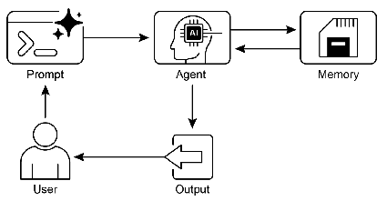

# 智能体实战之Agent的记忆架构：从瞬时工作到持久智慧


## 一.简介
想象一位经验丰富的顾问，他不仅能记住刚刚与你对话的细节（短期记忆），还能调取过往所有客户的资料、行业知识以及成功案例（长期记忆），从而为你提供精准且富有洞察力的建议。智能 Agent 的记忆系统正是这样一个双重架构，它连接着 Agent 的即时感知与累积智慧，是实现连续、个性化交互的基石。

### 1. 即时工作空间：Agent 的“临场记忆”

即时工作空间，相当于 Agent 的“临场记忆”或“工作台”。它聚焦于当前任务的上下文，确保 Agent 在处理单一请求或连续对话时能够保持连贯性。

*   **本质与载体**：对于基于大语言模型（LLM）的 Agent，这个工作空间就是模型的**上下文窗口**。所有近期的对话轮次、工具调用的结果、以及 Agent 对当前步骤的思考，都暂存于此，作为模型生成下一个响应的直接依据。
*   **核心挑战**：这个工作空间是**有限的且易逝的**。上下文窗口的大小直接限制了 Agent 能“记住”多少即时信息。一旦信息超出窗口，或对话会话结束，这些“临场记忆”便会消失。尽管“长上下文”技术扩展了工作台的面积，但它并未解决信息的持久化问题，且每次处理海量上下文会带来高昂的计算成本。
*   **管理策略**：高效的管理意味着在有限空间内保留最关键的“工作素材”。这包括对话摘要、关键信息提取等技术，确保 Agent 始终聚焦于核心任务，而非被无关紧要的细节淹没。

### 2. 持久知识库：Agent 的“成长档案”

持久知识库，是 Agent 跨越时间与会话的“成长档案”。它存储着 Agent 需要长期保留的知识、经验和用户个性化信息，是其实现真正智能和持续进化的关键。

*   **本质与载体**：信息被存储在 LLM 的外部，如**向量数据库**。通过将文本、图像等信息转换为高维数字向量，Agent 可以进行**语义搜索**，即根据含义而非精确关键词来检索相关信息。当需要时，Agent 会查询这个知识库，将检索到的相关信息“调取”到即时工作空间（上下文窗口），与当前任务结合。
*   **核心价值**：这个知识库赋予了 Agent 维护历史、持续学习、个性化交互以及处理复杂长期任务的能力。它让每一次交互都成为成长的积累，而非孤立的片段。

### 持久知识库的三大层次

我们可以将 Agent 的持久知识库进一步细分为三个相互关联的层次，这更贴近人类记忆的复杂性：

1.  **事实核心**：这是 Agent 存储客观事实的层面，相当于其“知识词典”。例如，用户的偏好（“我喜欢科幻电影”）、领域知识（“Python 是一种解释型语言”）等。这些信息构成了 Agent 提供个性化响应的基础。
2.  **经验日志**：这是 Agent 记录“如何做事”的层面，存储着过去成功解决问题的完整经历。当遇到类似任务时，Agent 可以回顾这些“经验日志”（通常通过少样本提示实现），模仿成功的路径来解决问题。
3.  **行为准则**：这是 Agent 的“内部宪法”，定义了其基本的行为模式、角色定位和核心指令。这部分通常固化在系统提示中，但高级 Agent 还能通过“反思”机制，根据交互反馈来不断优化和修订自己的行为准则，实现自我进化。

---

## 二.实战案例
**目标**：创建一个聊天机器人，它能：
1.  **短期记忆**：记住当前对话中的最近几轮内容。
2.  **长期记忆**：记住用户的名字、偏好等信息，即使重启程序也能回忆起来。

## 三.langchain实现
我们结合 **DeepSeek** 和 **LangChain**，来构建一个既能记住当前对话，又能跨会话记住用户关键信息的个人助理。
```python
import ast
import os
import json
from langchain_core.prompts import ChatPromptTemplate, MessagesPlaceholder
from langchain_core.output_parsers import StrOutputParser
from langchain_core.runnables import RunnablePassthrough, RunnableWithMessageHistory
from langchain_core.messages import trim_messages
from langchain_core.chat_history import BaseChatMessageHistory
from langchain_community.chat_message_histories import ChatMessageHistory

# --- 1. 初始化llm ---
from init_client import init_llm

llm = init_llm(0.7)

# --- 2. 模拟长期记忆（事实核心） ---
USER_PROFILE_FILE = "user_profile.json"


def load_user_profile(inputs: dict) -> str:
    """加载用户配置文件并格式化为字符串。"""
    if os.path.exists(USER_PROFILE_FILE):
        with open(USER_PROFILE_FILE, 'r') as f:
            profile = json.load(f)
            return json.dumps(profile, indent=2)
    return "暂无信息"


def save_user_fact(fact: dict):
    """保存一个新事实到用户配置文件"""
    profile = {}
    if os.path.exists(USER_PROFILE_FILE):
        with open(USER_PROFILE_FILE, 'r') as f:
            profile = json.load(f)
    profile.update(fact)
    with open(USER_PROFILE_FILE, 'w') as f:
        json.dump(profile, f, indent=4)
    print(f"[系统] 已记住新信息: {fact}")


# --- 3. 配置短期记忆（使用新范式） ---
# a. 创建一个存储会话历史的字典。在实际应用中，这可以是 Redis 或数据库。
store = {}
# b. 定义一个函数，根据 session_id 获取或创建会话历史
def get_session_history(session_id: str) -> BaseChatMessageHistory:
    if session_id not in store:
        store[session_id] = ChatMessageHistory()
    return store[session_id]

# --- 4. 创建提示词模板 ---
prompt = ChatPromptTemplate.from_messages([
    ("system", "你是一个友好且健谈的个人助理。你的名字是 花花 助理。"
               "请根据下方的【用户档案】和【对话历史】来回答用户的问题。"
               "如果用户提供了新的个人信息，请在回答的末尾用一句话总结，并以 '[记忆更新]' 开头，例如：[记忆更新] {{'key': 'value'}}。"
               "\n\n【用户档案】:\n{user_profile}"),
    MessagesPlaceholder(variable_name="chat_history"),
    ("human", "{question}")
])

# --- 5. 创建一个带窗口限制的内部链 ---
# 这个链负责处理核心逻辑，包括加载用户档案和修剪历史
trimmer = trim_messages(
    max_tokens=4,  # 保留最近4条消息 (2轮对话)
    strategy="last",
    token_counter=len,
)

# base_chain 定义了核心处理流程，但它不知道如何获取历史
base_chain = (
        RunnablePassthrough.assign(user_profile=load_user_profile)
        | RunnablePassthrough.assign(chat_history=trimmer)  # 在这里修剪历史
        | prompt
        | llm
        | StrOutputParser()
)

# --- 6. 使用 RunnableWithMessageHistory 包装核心链 ---
# 这是最终暴露给用户的链，它负责管理历史记录
final_chain = RunnableWithMessageHistory(
    base_chain,
    get_session_history,
    input_messages_key="question",
    history_messages_key="chat_history",
)


# --- 7. 主交互循环 ---
def chat_loop():
    print("花花 助理已启动！输入 'quit' 退出。")
    if os.path.exists(USER_PROFILE_FILE):
        os.remove(USER_PROFILE_FILE)

    # 为本次会话设定一个固定的 session_id
    session_id = "user_001_session"

    while True:
        user_input = input("你: ")

        if user_input.lower() == 'quit':
            break

        # 调用 final_chain，将 session_id 放在 config 中
        ai_response = final_chain.invoke(
            {"question": user_input},  # 输入只包含问题
            config={"configurable": {"session_id": session_id}}  # session_id 在这里传递
        )
        print(f"\n助理: {ai_response}\n")

        # --- 调用后处理：手动管理长期记忆 ---
        if "[记忆更新]" in ai_response:
            try:
                fact_str = ai_response.split("[记忆更新]")[1].strip()
                new_fact = json.loads(fact_str)
                save_user_fact(new_fact)
            except (json.JSONDecodeError, IndexError):
                try:
                    new_fact = ast.literal_eval(fact_str)
                    save_user_fact(new_fact)
                except Exception as e2:
                    print("[系统] 未能解析记忆更新。")


if __name__ == "__main__":
    chat_loop()
```
### 代码解析

这段代码实现了一个名为"花花助理"的聊天机器人，具有长期和短期记忆功能。我将逐步解释代码的主要部分：

#### 1. 初始化

```python
# 初始化LLM
from init_client import init_llm
llm = init_llm(0.7)
```

#### 2. 长期记忆实现

```python
USER_PROFILE_FILE = "user_profile.json"

def load_user_profile(inputs: dict) -> str:
    """加载用户配置文件并格式化为字符串。"""
    if os.path.exists(USER_PROFILE_FILE):
        with open(USER_PROFILE_FILE, 'r') as f:
            profile = json.load(f)
            return json.dumps(profile, indent=2)
    return "暂无信息"

def save_user_fact(fact: dict):
    """保存一个新事实到用户配置文件"""
    profile = {}
    if os.path.exists(USER_PROFILE_FILE):
        with open(USER_PROFILE_FILE, 'r') as f:
            profile = json.load(f)
    profile.update(fact)
    with open(USER_PROFILE_FILE, 'w') as f:
        json.dump(profile, f, indent=4)
    print(f"[系统] 已记住新信息: {fact}")
```

这部分实现了长期记忆功能：
- 使用JSON文件存储用户信息
- `load_user_profile`函数加载并返回用户配置文件内容
- `save_user_fact`函数用于保存新的用户信息到配置文件中

#### 3. 短期记忆实现

```python
# 创建一个存储会话历史的字典
store = {}

# 定义一个函数，根据 session_id 获取或创建会话历史
def get_session_history(session_id: str) -> BaseChatMessageHistory:
    if session_id not in store:
        store[session_id] = ChatMessageHistory()
    return store[session_id]
```

这部分实现了短期记忆功能：
- 使用字典`store`存储会话历史
- `get_session_history`函数根据session_id获取或创建会话历史对象

#### 4. 提示词模板

```python
prompt = ChatPromptTemplate.from_messages([
    ("system", "你是一个友好且健谈的个人助理。你的名字是 花花 助理。"
               "请根据下方的【用户档案】和【对话历史】来回答用户的问题。"
               "如果用户提供了新的个人信息，请在回答的末尾用一句话总结，并以 '[记忆更新]' 开头，例如：[记忆更新] {{'key': 'value'}}。"
               "\n\n【用户档案】:\n{user_profile}"),
    MessagesPlaceholder(variable_name="chat_history"),
    ("human", "{question}")
])
```

创建了一个聊天提示模板，包含：
- 系统指令：定义AI角色、名字，以及如何处理用户信息
- 用户档案占位符：插入长期记忆
- 聊天历史占位符：插入短期记忆
- 用户问题占位符

#### 5. 核心处理链

```python
# 创建消息修剪器
trimmer = trim_messages(
    max_tokens=4,  # 保留最近4条消息 (2轮对话)
    strategy="last",
    token_counter=len,
)

# 定义核心处理流程
base_chain = (
        RunnablePassthrough.assign(user_profile=load_user_profile)
        | RunnablePassthrough.assign(chat_history=trimmer)  # 在这里修剪历史
        | prompt
        | llm
        | StrOutputParser()
)

# 使用RunnableWithMessageHistory包装核心链
final_chain = RunnableWithMessageHistory(
    base_chain,
    get_session_history,
    input_messages_key="question",
    history_messages_key="chat_history",
)
```

这部分构建了处理链：
1. 创建消息修剪器，只保留最近的4条消息
2. `base_chain`定义核心处理流程：加载用户档案 → 修剪聊天历史 → 应用提示模板 → 调用LLM → 解析输出
3. 使用`RunnableWithMessageHistory`包装`base_chain`，使其能够管理会话历史

#### 6. 主交互循环

```python
def chat_loop():
    print("花花 助理已启动！输入 'quit' 退出。")
    if os.path.exists(USER_PROFILE_FILE):
        os.remove(USER_PROFILE_FILE)

    # 为本次会话设定一个固定的 session_id
    session_id = "user_001_session"

    while True:
        user_input = input("你: ")

        if user_input.lower() == 'quit':
            break

        # 调用 final_chain，将 session_id 放在 config 中
        ai_response = final_chain.invoke(
            {"question": user_input},  # 输入只包含问题
            config={"configurable": {"session_id": session_id}}  # session_id 在这里传递
        )
        print(f"\n助理: {ai_response}\n")

        # 调用后处理：手动管理长期记忆
        if "[记忆更新]" in ai_response:
            try:
                fact_str = ai_response.split("[记忆更新]")[1].strip()
                new_fact = json.loads(fact_str)
                save_user_fact(new_fact)
            except (json.JSONDecodeError, IndexError):
                try:
                    new_fact = ast.literal_eval(fact_str)
                    save_user_fact(new_fact)
                except Exception as e2:
                    print("[系统] 未能解析记忆更新。")
```

`chat_loop`函数实现了主交互循环：
1. 启动时删除旧的用户配置文件（如果存在）
2. 设置固定的session_id
3. 循环获取用户输入，调用final_chain获取AI响应
4. 如果响应中包含"[记忆更新]"标记，则解析并保存新信息到用户配置文件

#### 7. 程序入口

```python
if __name__ == "__main__":
    chat_loop()
```

当脚本作为主程序运行时，启动聊天循环。

#### 总结

这个代码实现了一个具有记忆功能的聊天机器人，主要特点包括：

1. **长期记忆**：通过JSON文件存储用户信息，在会话之间保持持久化
2. **短期记忆**：使用LangChain的会话历史管理功能，保留最近的对话上下文
3. **记忆更新机制**：AI在回答中可以标记新信息，程序会自动解析并保存到长期记忆中
4. **对话窗口限制**：只保留最近的4条消息，避免上下文过长
5. **会话管理**：使用session_id来区分不同的会话

这个实现展示了如何结合LangChain框架构建一个具有记忆能力的对话系统，能够在多次交互中记住用户信息并提供个性化的响应。

## 四.langgraph实现
```python
import os
import json
import ast
from typing import Dict, Any, List, TypedDict

from langgraph.graph import StateGraph, END

from langchain_core.messages import HumanMessage, AIMessage
from langchain_core.prompts import ChatPromptTemplate, MessagesPlaceholder
from langchain_core.output_parsers import StrOutputParser
from langchain_core.runnables import RunnablePassthrough


# 定义状态类型
class ConversationState(TypedDict):
    user_input: str
    chat_history: List[Any]
    user_profile: Dict[str, Any]
    response: str
    memory_updates: Dict[str, Any]


# 文件路径
USER_PROFILE_FILE = "user_profile.json"
CHAT_HISTORY_FILE = "chat_history.json"

# 初始化llm
from init_client import init_llm
llm = init_llm(0.7)


# 用户档案管理
def load_user_profile() -> Dict[str, Any]:
    """加载用户档案"""
    if os.path.exists(USER_PROFILE_FILE):
        with open(USER_PROFILE_FILE, 'r') as f:
            return json.load(f)
    return {}


def save_user_fact(fact: Dict[str, Any]):
    """保存新事实到用户档案"""
    profile = load_user_profile()
    profile.update(fact)
    with open(USER_PROFILE_FILE, 'w') as f:
        json.dump(profile, f, indent=4)
    print(f"[系统] 已记住新信息: {fact}")


# 对话历史管理
def load_chat_history(session_id: str) -> List[Any]:
    """加载对话历史"""
    histories = {}
    if os.path.exists(CHAT_HISTORY_FILE):
        with open(CHAT_HISTORY_FILE, 'r') as f:
            histories = json.load(f)

    # 获取特定会话的历史
    session_history = histories.get(session_id, [])

    # 将字典转换为消息对象
    chat_history = []
    for msg in session_history:
        if msg["type"] == "human":
            chat_history.append(HumanMessage(content=msg["content"]))
        elif msg["type"] == "ai":
            chat_history.append(AIMessage(content=msg["content"]))

    return chat_history


def save_chat_history(session_id: str, chat_history: List[Any]):
    """保存对话历史"""
    histories = {}
    if os.path.exists(CHAT_HISTORY_FILE):
        with open(CHAT_HISTORY_FILE, 'r') as f:
            histories = json.load(f)

    # 将消息对象转换为字典
    session_history = []
    for msg in chat_history:
        if isinstance(msg, HumanMessage):
            session_history.append({"type": "human", "content": msg.content})
        elif isinstance(msg, AIMessage):
            session_history.append({"type": "ai", "content": msg.content})

    histories[session_id] = session_history

    with open(CHAT_HISTORY_FILE, 'w') as f:
        json.dump(histories, f, indent=4)


# 提示词模板
def create_prompt_template():
    """创建提示词模板"""
    system_prompt = (
        "你是一个友好且健谈的个人助理。你的名字是 花花 助理。"
        "请根据下方的【用户档案】和【对话历史】来回答用户的问题。"
        "如果用户提供了新的个人信息，请在回答的末尾用一句话总结，并以 '[记忆更新]' 开头，例如：[记忆更新] {{'key': 'value'}}。"
    )

    prompt = ChatPromptTemplate.from_messages([
        ("system", system_prompt),
        MessagesPlaceholder(variable_name="chat_history"),
        ("human", "{user_input}"),
        ("system", "\n\n【用户档案】:\n{user_profile}")
    ])
    return prompt


# 定义LangGraph节点函数
def load_memory(state: ConversationState, session_id: str) -> ConversationState:
    """加载长期记忆到状态中"""
    state["user_profile"] = load_user_profile()
    state["chat_history"] = load_chat_history(session_id)
    return state


def generate_response(state: ConversationState, model, prompt) -> ConversationState:
    """生成AI响应"""
    chain = (
            RunnablePassthrough.assign(user_profile=lambda x: json.dumps(x["user_profile"], indent=2))
            | prompt
            | model
            | StrOutputParser()
    )

    response = chain.invoke({
        "user_input": state["user_input"],
        "chat_history": state["chat_history"],
        "user_profile": state["user_profile"]
    })

    state["response"] = response
    return state


def extract_memory_updates(state: ConversationState) -> ConversationState:
    """从响应中提取记忆更新"""
    response = state["response"]
    memory_updates = {}

    if "[记忆更新]" in response:
        try:
            fact_str = response.split("[记忆更新]")[1].strip()
            memory_updates = json.loads(fact_str)
        except (json.JSONDecodeError, IndexError):
            try:
                memory_updates = ast.literal_eval(fact_str)
            except Exception:
                print("[系统] 未能解析记忆更新。")

    state["memory_updates"] = memory_updates
    return state


def update_memory(state: ConversationState) -> ConversationState:
    """更新长期记忆"""
    if state["memory_updates"]:
        save_user_fact(state["memory_updates"])
    return state


def update_chat_history(state: ConversationState, session_id: str) -> ConversationState:
    """更新对话历史"""
    chat_history = state["chat_history"]
    chat_history.append(HumanMessage(content=state["user_input"]))
    chat_history.append(AIMessage(content=state["response"]))
    state["chat_history"] = chat_history

    # 保存到文件
    save_chat_history(session_id, chat_history)

    return state


# 创建LangGraph工作流
def create_conversation_graph():
    """创建对话工作流图"""
    prompt = create_prompt_template()

    # 创建工作流图
    workflow = StateGraph(ConversationState)

    # 添加节点
    workflow.add_node("load_memory", lambda state: load_memory(state, session_id="user_001_session"))
    workflow.add_node("generate_response", lambda state: generate_response(state, llm, prompt))
    workflow.add_node("extract_memory_updates", extract_memory_updates)
    workflow.add_node("update_memory", update_memory)
    workflow.add_node("update_chat_history", lambda state: update_chat_history(state, session_id="user_001_session"))

    # 设置入口点
    workflow.set_entry_point("load_memory")

    # 添加边
    workflow.add_edge("load_memory", "generate_response")
    workflow.add_edge("generate_response", "extract_memory_updates")
    workflow.add_edge("extract_memory_updates", "update_memory")
    workflow.add_edge("update_memory", "update_chat_history")
    workflow.add_edge("update_chat_history", END)

    # 编译工作流（不使用checkpointer）
    app = workflow.compile()

    return app


# 主交互循环
def chat_loop():
    """主交互循环"""
    print("花花 助理已启动！输入 'quit' 退出。")

    # 如果用户档案文件存在，删除它以开始新的会话
    if os.path.exists(USER_PROFILE_FILE):
        os.remove(USER_PROFILE_FILE)

    # 如果对话历史文件存在，删除它以开始新的会话
    if os.path.exists(CHAT_HISTORY_FILE):
        os.remove(CHAT_HISTORY_FILE)

    # 创建对话图
    app = create_conversation_graph()
    # 可选：可视化图的结构
    app.get_graph().print_ascii()

    # 为本次会话设定一个固定的 session_id
    session_id = "user_001_session"

    while True:
        user_input = input("你: ")

        if user_input.lower() == 'quit':
            break

        # 初始化状态
        initial_state = {
            "user_input": user_input,
            "chat_history": [],
            "user_profile": {},
            "response": "",
            "memory_updates": {}
        }

        # 运行工作流
        result = app.invoke(initial_state)

        # 打印AI响应
        print(f"\n助理: {result['response']}\n")


if __name__ == "__main__":
    chat_loop()
```
### 代码解析
#### 1. 状态定义

```python
class ConversationState(TypedDict):
    user_input: str
    chat_history: List[Any]
    user_profile: Dict[str, Any]
    response: str
    memory_updates: Dict[str, Any]
```

定义了对话系统的状态结构，包括用户输入、聊天历史、用户档案、AI响应和记忆更新。

#### 2. 文件路径与LLM初始化

```python
USER_PROFILE_FILE = "user_profile.json"
CHAT_HISTORY_FILE = "chat_history.json"

from init_client import init_llm
llm = init_llm(0.7)
```

设置了存储用户档案和聊天历史的文件路径，并初始化了LLM模型(温度参数为0.7)。

#### 3. 用户档案管理

```python
def load_user_profile() -> Dict[str, Any]:
    """加载用户档案"""
    if os.path.exists(USER_PROFILE_FILE):
        with open(USER_PROFILE_FILE, 'r') as f:
            return json.load(f)
    return {}

def save_user_fact(fact: Dict[str, Any]):
    """保存新事实到用户档案"""
    profile = load_user_profile()
    profile.update(fact)
    with open(USER_PROFILE_FILE, 'w') as f:
        json.dump(profile, f, indent=4)
    print(f"[系统] 已记住新信息: {fact}")
```

这两个函数负责从文件加载用户档案和将新信息保存到用户档案中。

#### 4. 对话历史管理

```python
def load_chat_history(session_id: str) -> List[Any]:
    """加载对话历史"""
    histories = {}
    if os.path.exists(CHAT_HISTORY_FILE):
        with open(CHAT_HISTORY_FILE, 'r') as f:
            histories = json.load(f)

    # 获取特定会话的历史
    session_history = histories.get(session_id, [])

    # 将字典转换为消息对象
    chat_history = []
    for msg in session_history:
        if msg["type"] == "human":
            chat_history.append(HumanMessage(content=msg["content"]))
        elif msg["type"] == "ai":
            chat_history.append(AIMessage(content=msg["content"]))

    return chat_history

def save_chat_history(session_id: str, chat_history: List[Any]):
    """保存对话历史"""
    histories = {}
    if os.path.exists(CHAT_HISTORY_FILE):
        with open(CHAT_HISTORY_FILE, 'r') as f:
            histories = json.load(f)

    # 将消息对象转换为字典
    session_history = []
    for msg in chat_history:
        if isinstance(msg, HumanMessage):
            session_history.append({"type": "human", "content": msg.content})
        elif isinstance(msg, AIMessage):
            session_history.append({"type": "ai", "content": msg.content})

    histories[session_id] = session_history

    with open(CHAT_HISTORY_FILE, 'w') as f:
        json.dump(histories, f, indent=4)
```

这两个函数负责加载和保存对话历史，支持多会话管理，并处理消息对象与字典之间的转换。

#### 5. 提示词模板

```python
def create_prompt_template():
    """创建提示词模板"""
    system_prompt = (
        "你是一个友好且健谈的个人助理。你的名字是 花花 助理。"
        "请根据下方的【用户档案】和【对话历史】来回答用户的问题。"
        "如果用户提供了新的个人信息，请在回答的末尾用一句话总结，并以 '[记忆更新]' 开头，例如：[记忆更新] {{'key': 'value'}}。"
    )

    prompt = ChatPromptTemplate.from_messages([
        ("system", system_prompt),
        MessagesPlaceholder(variable_name="chat_history"),
        ("human", "{user_input}"),
        ("system", "\n\n【用户档案】:\n{user_profile}")
    ])
    return prompt
```

创建了一个包含系统提示、对话历史占位符、用户输入和用户档案的提示词模板。系统提示要求AI在回答问题时参考用户档案和对话历史，并在检测到新信息时以特定格式标记。

#### 6. LangGraph节点函数

```python
def load_memory(state: ConversationState, session_id: str) -> ConversationState:
    """加载长期记忆到状态中"""
    state["user_profile"] = load_user_profile()
    state["chat_history"] = load_chat_history(session_id)
    return state

def generate_response(state: ConversationState, model, prompt) -> ConversationState:
    """生成AI响应"""
    chain = (
            RunnablePassthrough.assign(user_profile=lambda x: json.dumps(x["user_profile"], indent=2))
            | prompt
            | model
            | StrOutputParser()
    )

    response = chain.invoke({
        "user_input": state["user_input"],
        "chat_history": state["chat_history"],
        "user_profile": state["user_profile"]
    })

    state["response"] = response
    return state

def extract_memory_updates(state: ConversationState) -> ConversationState:
    """从响应中提取记忆更新"""
    response = state["response"]
    memory_updates = {}

    if "[记忆更新]" in response:
        try:
            fact_str = response.split("[记忆更新]")[1].strip()
            memory_updates = json.loads(fact_str)
        except (json.JSONDecodeError, IndexError):
            try:
                memory_updates = ast.literal_eval(fact_str)
            except Exception:
                print("[系统] 未能解析记忆更新。")

    state["memory_updates"] = memory_updates
    return state

def update_memory(state: ConversationState) -> ConversationState:
    """更新长期记忆"""
    if state["memory_updates"]:
        save_user_fact(state["memory_updates"])
    return state

def update_chat_history(state: ConversationState, session_id: str) -> ConversationState:
    """更新对话历史"""
    chat_history = state["chat_history"]
    chat_history.append(HumanMessage(content=state["user_input"]))
    chat_history.append(AIMessage(content=state["response"]))
    state["chat_history"] = chat_history

    # 保存到文件
    save_chat_history(session_id, chat_history)

    return state
```

这些函数定义了LangGraph工作流中的各个节点：
- `load_memory`: 加载用户档案和对话历史
- `generate_response`: 基于用户输入、对话历史和用户档案生成AI响应
- `extract_memory_updates`: 从AI响应中提取记忆更新信息
- `update_memory`: 将新信息保存到用户档案
- `update_chat_history`: 更新对话历史

#### 7. LangGraph工作流创建

```python
def create_conversation_graph():
    """创建对话工作流图"""
    prompt = create_prompt_template()

    # 创建工作流图
    workflow = StateGraph(ConversationState)

    # 添加节点
    workflow.add_node("load_memory", lambda state: load_memory(state, session_id="user_001_session"))
    workflow.add_node("generate_response", lambda state: generate_response(state, llm, prompt))
    workflow.add_node("extract_memory_updates", extract_memory_updates)
    workflow.add_node("update_memory", update_memory)
    workflow.add_node("update_chat_history", lambda state: update_chat_history(state, session_id="user_001_session"))

    # 设置入口点
    workflow.set_entry_point("load_memory")

    # 添加边
    workflow.add_edge("load_memory", "generate_response")
    workflow.add_edge("generate_response", "extract_memory_updates")
    workflow.add_edge("extract_memory_updates", "update_memory")
    workflow.add_edge("update_memory", "update_chat_history")
    workflow.add_edge("update_chat_history", END)

    # 编译工作流（不使用checkpointer）
    app = workflow.compile()

    return app
```

这个函数创建了一个完整的对话工作流图，定义了节点之间的转换关系。工作流程是：
1. 加载记忆 → 2. 生成响应 → 3. 提取记忆更新 → 4. 更新记忆 → 5. 更新对话历史 → 结束

#### 8. 主交互循环

```python
def chat_loop():
    """主交互循环"""
    print("花花 助理已启动！输入 'quit' 退出。")

    # 如果用户档案文件存在，删除它以开始新的会话
    if os.path.exists(USER_PROFILE_FILE):
        os.remove(USER_PROFILE_FILE)

    # 如果对话历史文件存在，删除它以开始新的会话
    if os.path.exists(CHAT_HISTORY_FILE):
        os.remove(CHAT_HISTORY_FILE)

    # 创建对话图
    app = create_conversation_graph()
    # 可选：可视化图的结构
    app.get_graph().print_ascii()

    # 为本次会话设定一个固定的 session_id
    session_id = "user_001_session"

    while True:
        user_input = input("你: ")

        if user_input.lower() == 'quit':
            break

        # 初始化状态
        initial_state = {
            "user_input": user_input,
            "chat_history": [],
            "user_profile": {},
            "response": "",
            "memory_updates": {}
        }

        # 运行工作流
        result = app.invoke(initial_state)

        # 打印AI响应
        print(f"\n助理: {result['response']}\n")
```

这个函数实现了用户与系统的交互循环。每次用户输入后，系统会初始化状态，运行工作流，并打印AI的响应。用户输入"quit"可以退出程序。

#### 9. 程序入口

```python
if __name__ == "__main__":
    chat_loop()
```

这是程序的入口点，当脚本被直接运行时，会启动聊天循环。

#### 总结

这个代码实现了一个具有长期记忆功能的对话系统，主要特点包括：

1. **持久化记忆**：系统能够记住用户的个人信息并在后续对话中使用
2. **对话历史管理**：维护完整的对话历史，提供上下文
3. **自动记忆更新**：从AI响应中自动提取并保存新信息
4. **结构化工作流**：使用LangGraph构建清晰的对话流程
5. **多会话支持**：虽然当前实现使用固定会话ID，但架构支持多会话管理

这种设计使得对话系统能够在多次交互中保持上下文，提供更加个性化和连贯的对话体验。