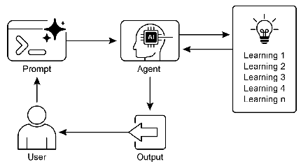

# 智能体实战之智能体的进化：从预设规则到自适应学习 


## 一.简介

---

### **智能体的进化：从预设规则到自适应学习**

人工智能的核心魅力在于其超越静态编程、实现动态演化的潜力。学习与适应机制正是赋予人工智能 Agent 这种生命力的关键。它们使 Agent 不再是被动执行指令的工具，而是能够通过与环境的持续交互，汲取经验、优化决策、实现自主成长的智能实体。本章将深入剖析 Agent 学习与适应的内在原理，并展示其在现实世界中的革新性应用。

#### **多元化的学习范式：智能体的成长路径**

Agent 通过整合新信息来调整其内部知识库、行为策略乃至目标，从而实现从简单执行者到智能决策者的蜕变。其学习路径多种多样，主要包括：

*   **试错学习（强化学习）**：Agent 在环境中探索，通过行动获得的奖励或惩罚信号来逐步校准行为策略。这种方法尤其适用于需要在复杂动态环境中做出连续决策的场景，如机器人控制或策略游戏。
*   **示范学习（监督学习）**：通过学习大量带有标签的“范例-答案”对，Agent 掌握从输入到输出的映射规律。这使其具备了分类、预测等能力，广泛应用于垃圾邮件过滤、市场趋势分析等任务。
*   **模式发现（无监督学习）**：在没有明确指导的情况下，Agent 自行从海量未标注数据中挖掘潜在的结构与关联。这有助于构建对环境的内在认知模型，适用于用户群体划分、异常行为初步识别等探索性任务。
*   **即时迁移学习（基于LLM的少/零样本学习）**：借助大语言模型的庞博知识，Agent 仅需少量示例甚至一条指令，就能迅速理解并执行全新任务，实现了对新情况的快速响应与能力迁移。
*   **持续知识更新（在线学习）**：面对实时变化的数据流，Agent 能够即时吸收新信息，动态调整模型，确保其决策始终与当前环境保持同步。这对于金融交易、实时推荐等场景至关重要。
*   **经验回溯（基于记忆的学习）**：Agent 具备回忆并利用过往经验来指导当前行动的能力。这种机制增强了其上下文理解力，使其在处理长期、复杂任务时能做出更周全的决策。

#### **核心优化策略：从PPO到DPO的演进**

适应是学习的目标，即根据学习成果调整自身策略。在强化学习和大语言模型对齐领域，两种关键的优化策略脱颖而出：

**近端策略优化（PPO）** 是一种稳健的强化学习算法，旨在安全、可靠地训练 Agent 的决策策略。其核心哲学是“小步快跑，避免冒进”。PPO 通过引入一个“裁剪”机制，在每次更新时为策略的变化划定一个“安全区”。这就像一个经验丰富的向导，确保 Agent 在探索新路径时不会偏离已验证有效的区域太远，从而避免了因策略突变而导致的性能崩溃，实现了学习过程的稳定性。

**直接偏好优化（DPO）** 则为大语言模型与人类价值观的对齐提供了更简洁、高效的途径。传统的 PPO 对齐方法需要先训练一个独立的“奖励模型”来模拟人类偏好，过程繁琐且模型可能被“钻空子”。DPO 则另辟蹊径，它完全绕过了奖励模型这一中间环节，直接利用人类偏好数据（如“回答A优于回答B”）来指导语言模型的参数更新。这相当于直接告诉模型“应该多生成什么，少生成什么”，极大地简化了对齐流程，提升了训练的稳定性和效率。

#### **适应能力的现实映照**

具备学习和适应能力的 Agent 正在重塑各行各业：

*   **个性化助理**：通过分析用户交互历史，不断优化对话风格和服务内容，提供“千人千面”的定制化体验。
*   **自主交易系统**：实时分析市场波动，动态调整交易模型，以寻求最佳的风险收益平衡。
*   **智能交互界面**：根据用户操作习惯，动态调整布局和功能，使应用更加直观易用。
*   **自动驾驶与机器人**：融合传感器数据与过往行驶经验，在复杂多变的物理世界中实现安全、高效的自主导航与操作。
*   **反欺诈系统**：持续学习新型欺诈手段，迭代升级检测模型，有效保护金融安全。
*   **游戏AI**：动态调整游戏难度和策略，为玩家提供更具挑战性和沉浸感的体验。
*   **知识库维护**：利用检索增强生成（RAG）技术，从成功案例和失败教训中学习，构建一个能够自我完善的知识系统。

## 二.实战案例--个性化商品推荐
通过用户画像的动态更新和反馈学习机制实现自适应商品推荐

## 三.langchain实现
```python
import json
from typing import List, Dict, Any

from langchain_core.output_parsers import JsonOutputParser
from langchain_core.prompts import ChatPromptTemplate
from pydantic import BaseModel, Field

from init_client import init_llm

# 定义用户画像的数据结构
class UserProfile(BaseModel):
    interests: List[str] = Field(description="用户主要兴趣领域列表")
    price_sensitivity: str = Field(description="价格敏感度(高/中/低)")
    preferred_categories: List[str] = Field(description="偏好商品类别列表")
    behavior_patterns: str = Field(description="行为模式描述")
    recent_focus: List[str] = Field(description="最近关注点")


# --- 修复点 1: 定义更具体的推荐项结构 ---
class RecommendedItem(BaseModel):
    """单个推荐商品的结构"""
    product_id: str = Field(description="商品的唯一标识符")
    name: str = Field(description="商品的名称")
    reason: str = Field(description="推荐该商品的理由")


# --- 修复点 2: 使用新的结构定义推荐结果 ---
class RecommendationResult(BaseModel):
    """推荐结果的顶层结构"""
    recommendations: List[RecommendedItem] = Field(description="推荐的商品列表")


class SimplifiedRecommendationSystem:
    def __init__(self):
        # 初始化llm
        self.llm = init_llm(temperature=0.7)

        # 初始化用户记忆和简单的商品列表
        self.user_memory = {}
        self.products = []  # 简单存储商品列表

        # 初始化输出解析器
        self.profile_parser = JsonOutputParser(pydantic_object=UserProfile)
        # --- 修复点 3: 使用新的、更具体的解析器 ---
        self.recommendation_parser = JsonOutputParser(pydantic_object=RecommendationResult)

    def load_products(self, products: List[Dict[str, Any]]):
        """加载商品数据到内存"""
        self.products = products
        print(f"已加载商品数据库，共{len(products)}件商品")

    def build_user_profile(self, user_id: str, user_history: List[Dict[str, Any]],
                           user_demographics: Dict[str, Any]) -> Dict[str, Any]:
        """使用LCEL链式调用构建用户画像"""
        history_text = "\n".join([
            f"浏览商品: {item['product_name']}, 类别: {item['category']}, "
            f"时长: {item['duration']}秒, 是否购买: {item['purchased']}"
            for item in user_history
        ])

        demographics_text = f"""
        年龄: {user_demographics.get('age', '未知')}
        性别: {user_demographics.get('gender', '未知')}
        地理位置: {user_demographics.get('location', '未知')}
        会员等级: {user_demographics.get('membership_level', '未知')}
        """

        profile_prompt = ChatPromptTemplate.from_messages([
            ("system", "你是一个专业的用户画像分析师。请根据用户的历史行为和人口统计信息，构建一个详细的用户画像。"),
            ("human", """
            基于以下用户历史行为和人口统计信息，构建一个详细的用户画像。
            请识别用户的兴趣偏好、消费习惯、价格敏感度等关键特征。

            用户历史行为:
            {user_history}

            用户人口统计信息:
            {user_demographics}

            {format_instructions}
            """)
        ])

        profile_chain = profile_prompt | self.llm | self.profile_parser

        try:
            user_profile = profile_chain.invoke({
                "user_history": history_text,
                "user_demographics": demographics_text,
                "format_instructions": self.profile_parser.get_format_instructions()
            })
        except Exception as e:
            print(f"解析用户画像时出错: {e}")
            user_profile = {
                "interests": [],
                "price_sensitivity": "中",
                "preferred_categories": [],
                "behavior_patterns": "无法解析用户画像",
                "recent_focus": []
            }

        self.user_memory[user_id] = {
            "profile": user_profile,
            "history": user_history,
            "demographics": user_demographics
        }

        return user_profile

    def generate_recommendations(self, user_id: str, context: str = "", num_recommendations: int = 5) -> List[
        Dict[str, Any]]:
        """让LLM直接从全量商品中生成推荐，无需向量搜索"""
        if user_id not in self.user_memory:
            raise ValueError(f"用户 {user_id} 的画像不存在，请先构建用户画像")

        user_profile = self.user_memory[user_id]["profile"]

        # 将所有商品信息转换为文本，提供给LLM
        all_products_text = "\n\n".join([
            f"商品ID: {p['id']}, 名称: {p['name']}, 类别: {p['category']}, 价格: {p['price']}, 品牌: {p['brand']}, 描述: {p['description']}, 特性: {', '.join(p['features'])}, 评分: {p['rating']}"
            for p in self.products
        ])

        recommendation_prompt = ChatPromptTemplate.from_messages([
            ("system", "你是一个顶级的商品推荐专家。你的任务是从给定的商品列表中，为用户挑选最合适的几款商品，并给出令人信服的理由。"),
            ("human", """
            以下是当前可供推荐的所有商品列表：
            ---
            {all_products_text}
            ---

            现在，请根据以下用户画像和当前场景，为用户推荐 {num_recommendations} 件最合适的商品。

            用户画像:
            {user_profile}

            当前场景/上下文:
            {context}

            请仔细分析用户画像中的兴趣、偏好类别和价格敏感度，结合商品信息，做出最佳推荐。
            确保推荐理由充分、个性化，并能打动用户。

            {format_instructions}
            """)
        ])

        recommendation_chain = recommendation_prompt | self.llm | self.recommendation_parser

        try:
            result = recommendation_chain.invoke({
                "all_products_text": all_products_text,
                "user_profile": json.dumps(user_profile, ensure_ascii=False),
                "context": context,
                "num_recommendations": num_recommendations,
                "format_instructions": self.recommendation_parser.get_format_instructions()
            })
            # --- 修复点 4: 从解析后的对象中正确提取列表 ---
            recommendations = result['recommendations']
        except Exception as e:
            print(f"生成推荐时出错: {e}")
            recommendations = []

        # 存储推荐历史
        if "recommendations" not in self.user_memory[user_id]:
            self.user_memory[user_id]["recommendations"] = []

        # --- 修复点 5: 存储时将Pydantic对象转换为字典，以保持一致性 ---
        self.user_memory[user_id]["recommendations"].append({
            "context": context,
            "recommendations": [rec for rec in recommendations],  # 转换为字典列表
            "timestamp": "当前时间"
        })

        return [rec for rec in recommendations]  # 返回字典列表

    def process_feedback(self, user_id: str, feedback: Dict[str, Any]) -> Dict[str, Any]:
        """处理用户反馈，更新用户画像"""
        if user_id not in self.user_memory:
            raise ValueError(f"用户 {user_id} 的画像不存在")

        user_profile = self.user_memory[user_id]["profile"]

        # --- 修复点 6: 增加健壮性检查，确保有推荐历史 ---
        if not self.user_memory[user_id].get("recommendations"):
            print("没有找到推荐历史，无法处理反馈。")
            return user_profile

        last_recommendations = self.user_memory[user_id]["recommendations"][-1]["recommendations"]

        feedback_text = "用户对推荐的反馈:\n"
        for item_id, feedback_item in feedback.items():
            # --- 这一行现在应该可以正常工作了，因为last_recommendations中的项是包含'product_id'的字典 ---
            item_name = next((rec["name"] for rec in last_recommendations if rec["product_id"] == item_id), "未知商品")
            feedback_text += f"\n商品 {item_name} (ID: {item_id}): {feedback_item['rating']}分, 评论: {feedback_item['comment']}"

        feedback_prompt = ChatPromptTemplate.from_messages([
            ("system", "你是一个专业的用户画像分析师，擅长根据用户反馈更新用户画像。"),
            ("human", """
            基于用户对推荐商品的反馈，更新用户画像。

            当前用户画像:
            {user_profile}

            推荐的商品:
            {recommended_items}

            用户反馈:
            {user_feedback}

            请分析用户反馈，更新用户画像，特别关注:
            1. 用户喜欢的商品特征
            2. 用户不喜欢的商品特征
            3. 新发现的兴趣点
            4. 偏好变化

            {format_instructions}
            """)
        ])

        feedback_chain = feedback_prompt | self.llm | self.profile_parser

        try:
            updated_profile = feedback_chain.invoke({
                "user_profile": json.dumps(user_profile, ensure_ascii=False),
                "recommended_items": json.dumps(last_recommendations, ensure_ascii=False),
                "user_feedback": feedback_text,
                "format_instructions": self.profile_parser.get_format_instructions()
            })
            self.user_memory[user_id]["profile"] = updated_profile
            return updated_profile
        except Exception as e:
            print(f"更新用户画像时出错: {e}")
            return user_profile


# 示例使用 (与之前相同)
if __name__ == "__main__":
    rec_system = SimplifiedRecommendationSystem()
    products = [
        {"id": "p001", "name": "智能手表 Pro", "category": "电子产品", "price": 2999, "brand": "TechBrand",
         "description": "高端智能手表，支持健康监测、运动追踪和智能通知", "features": ["心率监测", "GPS定位", "防水设计", "7天续航"], "rating": 4.7},
        {"id": "p002", "name": "有机绿茶礼盒", "category": "食品饮料", "price": 168, "brand": "NaturePure",
         "description": "精选高山有机绿茶，清香甘醇，富含抗氧化物质", "features": ["有机认证", "礼盒包装", "产地直供", "传统工艺"], "rating": 4.8},
        {"id": "p003", "name": "多功能背包", "category": "箱包", "price": 459, "brand": "TravelPro",
         "description": "大容量多功能背包，适合通勤和短途旅行", "features": ["防水面料", "USB充电口", "防盗设计", "人体工学"], "rating": 4.5},
        {"id": "p004", "name": "编程入门教程", "category": "图书", "price": 89, "brand": "TechBooks",
         "description": "零基础学编程，包含Python和JavaScript实例", "features": ["零基础友好", "实例丰富", "配套视频", "在线答疑"], "rating": 4.6},
        {"id": "p005", "name": "无线降噪耳机", "category": "电子产品", "price": 1299, "brand": "AudioTech",
         "description": "主动降噪无线耳机，高保真音质，长续航", "features": ["主动降噪", "40小时续航", "快充技术", "多设备连接"], "rating": 4.9},
        {"id": "p006", "name": "瑜伽垫套装", "category": "运动健身", "price": 299, "brand": "FitLife",
         "description": "高密度环保瑜伽垫，防滑耐用，含瑜伽砖和拉力带", "features": ["环保材质", "防滑设计", "便携收纳", "套装组合"], "rating": 4.4},
        {"id": "p007", "name": "智能家居套装", "category": "智能家居", "price": 1599, "brand": "SmartHome",
         "description": "包含智能音箱、智能灯泡和智能插座，一键控制家居", "features": ["语音控制", "远程操作", "场景联动", "定时任务"], "rating": 4.7},
        {"id": "p008", "name": "精酿啤酒组合", "category": "食品饮料", "price": 258, "brand": "CraftBrew",
         "description": "精选6款不同风格的精酿啤酒，口感丰富多样", "features": ["多种口味", "限量酿造", "礼盒包装", "品鉴指南"], "rating": 4.6}
    ]
    rec_system.load_products(products)

    user_id = "user123"
    user_history = [
        {"product_name": "智能手表 Pro", "category": "电子产品", "duration": 120, "purchased": True},
        {"product_name": "无线降噪耳机", "category": "电子产品", "duration": 95, "purchased": True},
        {"product_name": "智能家居套装", "category": "智能家居", "duration": 150, "purchased": False},
        {"product_name": "编程入门教程", "category": "图书", "duration": 60, "purchased": True},
        {"product_name": "多功能背包", "category": "箱包", "duration": 45, "purchased": False}
    ]
    user_demographics = {"age": 28, "gender": "男", "location": "北京", "membership_level": "黄金会员"}

    print("=== 构建用户画像 ===")
    user_profile = rec_system.build_user_profile(user_id, user_history, user_demographics)
    print(f"用户画像: {json.dumps(user_profile, ensure_ascii=False, indent=2)}")

    print("\n=== 生成推荐 ===")
    context = "用户即将出差，需要购买一些旅行用品"
    recommendations = rec_system.generate_recommendations(user_id, context)

    print("为用户推荐的商品:")
    for i, rec in enumerate(recommendations, 1):
        print(f"{i}. 商品ID: {rec.get('product_id', '未知')}, 名称: {rec.get('name', '未知')}")
        print(f"   推荐理由: {rec.get('reason', '无')}")

    print("\n=== 处理用户反馈 ===")
    feedback = {
        "p001": {"rating": 5, "comment": "非常符合我的需求，已经购买"},
        "p003": {"rating": 4, "comment": "背包质量不错，但希望有更多颜色选择"},
        "p005": {"rating": 2, "comment": "已经有了类似的耳机，不需要再买"}
    }

    updated_profile = rec_system.process_feedback(user_id, feedback)
    print(f"更新后的用户画像: {json.dumps(updated_profile, ensure_ascii=False, indent=2)}")

    print("\n=== 基于反馈生成新推荐 ===")
    new_recommendations = rec_system.generate_recommendations(user_id, "基于用户反馈的二次推荐")

    print("为用户推荐的新商品:")
    for i, rec in enumerate(new_recommendations, 1):
        print(f"{i}. 商品ID: {rec.get('product_id', '未知')}, 名称: {rec.get('name', '未知')}")
        print(f"   推荐理由: {rec.get('reason', '无')}")
```


## 代码解析

### 核心组件解析

#### 1. 数据模型定义

```python
class UserProfile(BaseModel):
    interests: List[str] = Field(description="用户主要兴趣领域列表")
    price_sensitivity: str = Field(description="价格敏感度(高/中/低)")
    preferred_categories: List[str] = Field(description="偏好商品类别列表")
    behavior_patterns: str = Field(description="行为模式描述")
    recent_focus: List[str] = Field(description="最近关注点")

class RecommendedItem(BaseModel):
    product_id: str = Field(description="商品的唯一标识符")
    name: str = Field(description="商品的名称")
    reason: str = Field(description="推荐该商品的理由")

class RecommendationResult(BaseModel):
    recommendations: List[RecommendedItem] = Field(description="推荐的商品列表")
```

这三个Pydantic模型定义了系统的核心数据结构：
- `UserProfile`：Agent对用户的认知模型，包含兴趣、价格敏感度等特征
- `RecommendedItem`：推荐项的结构化表示
- `RecommendationResult`：推荐结果的顶层结构

#### 2. SimplifiedRecommendationSystem类

这是系统的核心类，实现了自适应推荐的主要功能。

##### 初始化方法

```python
def __init__(self):
    self.llm = init_llm(temperature=0.7)
    self.user_memory = {}
    self.products = []
    self.profile_parser = JsonOutputParser(pydantic_object=UserProfile)
    self.recommendation_parser = JsonOutputParser(pydantic_object=RecommendationResult)
```

初始化过程中设置了：
- 大语言模型实例
- 用户记忆存储（用于保存每个用户的状态）
- 商品列表存储
- JSON输出解析器，用于结构化LLM的输出

##### 用户画像构建方法

```python
def build_user_profile(self, user_id: str, user_history: List[Dict[str, Any]],
                       user_demographics: Dict[str, Any]) -> Dict[str, Any]:
```

这个方法通过分析用户历史行为和人口统计信息，使用LLM构建用户画像。它将非结构化的用户数据转换为结构化的UserProfile对象，这是Agent对用户的初始认知。

##### 推荐生成方法

```python
def generate_recommendations(self, user_id: str, context: str = "", num_recommendations: int = 5) -> List[Dict[str, Any]]:
```

基于用户画像和当前上下文，从全量商品中生成推荐。这个方法展示了Agent如何利用其内部模型（用户画像）做出决策。

##### 反馈处理方法

```python
def process_feedback(self, user_id: str, feedback: Dict[str, Any]) -> Dict[str, Any]:
```

这是实现自适应的关键方法，它处理用户对推荐商品的反馈，并更新用户画像。

### Agent自适应特性详解

#### 1. 动态用户画像构建

Agent通过`build_user_profile`方法构建对用户的认知模型：

```python
profile_prompt = ChatPromptTemplate.from_messages([
    ("system", "你是一个专业的用户画像分析师。请根据用户的历史行为和人口统计信息，构建一个详细的用户画像。"),
    ("human", """
    基于以下用户历史行为和人口统计信息，构建一个详细的用户画像。
    请识别用户的兴趣偏好、消费习惯、价格敏感度等关键特征。
    ...
    """)
])
```

Agent不是使用预定义规则，而是通过LLM分析用户数据，动态构建用户画像。这种初始学习过程使Agent能够形成对用户的个性化理解。

#### 2. 基于画像的个性化推荐

Agent利用构建的用户画像进行个性化推荐：

```python
recommendation_prompt = ChatPromptTemplate.from_messages([
    ("system", "你是一个顶级的商品推荐专家。你的任务是从给定的商品列表中，为用户挑选最合适的几款商品，并给出令人信服的理由。"),
    ("human", """
    现在，请根据以下用户画像和当前场景，为用户推荐 {num_recommendations} 件最合适的商品。
    用户画像: {user_profile}
    当前场景/上下文: {context}
    ...
    """)
])
```

Agent不是简单地基于流行度或规则推荐，而是结合用户画像和当前上下文，生成个性化推荐。这展示了Agent如何利用其内部模型做出决策。

#### 3. 反馈学习与自适应更新

这是最关键的自适应机制，体现在`process_feedback`方法中：

```python
def process_feedback(self, user_id: str, feedback: Dict[str, Any]) -> Dict[str, Any]:
    # 获取用户当前画像
    user_profile = self.user_memory[user_id]["profile"]
    
    # 获取上次推荐
    last_recommendations = self.user_memory[user_id]["recommendations"][-1]["recommendations"]
    
    # 构建反馈文本
    feedback_text = "用户对推荐的反馈:\n"
    for item_id, feedback_item in feedback.items():
        item_name = next((rec["name"] for rec in last_recommendations if rec["product_id"] == item_id), "未知商品")
        feedback_text += f"\n商品 {item_name} (ID: {item_id}): {feedback_item['rating']}分, 评论: {feedback_item['comment']}"
    
    # 使用反馈更新用户画像
    feedback_prompt = ChatPromptTemplate.from_messages([
        ("system", "你是一个专业的用户画像分析师，擅长根据用户反馈更新用户画像。"),
        ("human", """
        基于用户对推荐商品的反馈，更新用户画像。
        当前用户画像: {user_profile}
        推荐的商品: {recommended_items}
        用户反馈: {user_feedback}
        ...
        """)
    ])
    
    feedback_chain = feedback_prompt | self.llm | self.profile_parser
    
    try:
        updated_profile = feedback_chain.invoke({
            "user_profile": json.dumps(user_profile, ensure_ascii=False),
            "recommended_items": json.dumps(last_recommendations, ensure_ascii=False),
            "user_feedback": feedback_text,
            "format_instructions": self.profile_parser.get_format_instructions()
        })
        self.user_memory[user_id]["profile"] = updated_profile
        return updated_profile
    except Exception as e:
        print(f"更新用户画像时出错: {e}")
        return user_profile
```

这个过程实现了完整的"学习-行动-反馈-适应"循环：
1. **学习**：Agent分析用户的历史行为，构建初始画像
2. **行动**：基于画像生成个性化推荐
3. **反馈**：收集用户对推荐的反馈
4. **适应**：根据反馈更新用户画像，调整未来推荐策略

#### 4. 持续记忆与状态演化

Agent通过`self.user_memory`维护每个用户的状态：

```python
self.user_memory[user_id] = {
    "profile": user_profile,
    "history": user_history,
    "demographics": user_demographics,
    "recommendations": [...]  # 推荐历史
}
```

这种记忆机制使Agent能够：
- 跟踪用户画像的演化
- 记录推荐历史
- 基于长期交互而非单次反馈进行学习

#### 5. 上下文感知推荐

Agent能够根据不同上下文调整推荐策略：

```python
def generate_recommendations(self, user_id: str, context: str = "", num_recommendations: int = 5):
    ...
    recommendation_prompt = ChatPromptTemplate.from_messages([
        ...
        ("human", """
        当前场景/上下文: {context}
        ...
        """)
    ])
```

在示例中，系统根据"用户即将出差，需要购买一些旅行用品"的上下文生成相应推荐，展示了Agent对环境的感知和适应能力。

### 自适应机制的完整流程

1. **初始学习阶段**：
   - Agent通过`build_user_profile`分析用户历史行为和人口统计信息
   - 构建初始用户画像，形成对用户的认知模型

2. **决策执行阶段**：
   - Agent基于用户画像和当前上下文，使用`generate_recommendations`生成个性化推荐
   - 推荐结果被存储在用户记忆中，用于后续反馈处理

3. **反馈学习阶段**：
   - 用户对推荐提供反馈（评分、评论）
   - Agent通过`process_feedback`分析反馈，识别用户偏好

4. **自适应调整阶段**：
   - Agent根据反馈更新用户画像
   - 更新后的画像将影响未来的推荐决策
   - 形成持续的学习-适应循环

### Agent自适应的核心价值

这个推荐系统展示了Agent自适应的几个关键价值：

1. **个性化能力**：通过动态用户画像，Agent能够提供高度个性化的推荐
2. **持续改进**：每次反馈都会更新用户画像，使推荐质量随时间提升
3. **上下文感知**：Agent能够根据不同场景调整推荐策略
4. **经验积累**：通过记忆机制，Agent能够从长期交互中学习

### 与传统推荐系统的对比

传统推荐系统通常依赖于：
- 静态用户画像
- 预定义推荐规则
- 离线批量更新

而这个自适应Agent推荐系统：
- 动态更新用户画像
- 基于LLM的推理而非硬编码规则
- 实时响应用户反馈

### 结论

这个推荐系统案例完美展示了Agent的自适应学习能力。通过"学习-行动-反馈-适应"的闭环，Agent能够从与用户的交互中持续学习，动态调整其内部模型（用户画像）和行为策略（推荐方法）。这种自适应能力使Agent能够提供越来越精准的个性化服务，体现了智能Agent的核心价值。

代码中的关键自适应机制包括：动态用户画像构建、基于反馈的学习、持续记忆维护和上下文感知推荐。这些机制共同构成了一个能够随时间演化和改进的智能推荐系统。

## 四.langgraph实现
```python
import json
from typing import List, Dict, Any, Optional, TypedDict, Annotated
from langchain_core.messages import AIMessage
from langchain_core.output_parsers import JsonOutputParser
from langchain_core.prompts import ChatPromptTemplate
from pydantic import BaseModel, Field
from langgraph.graph import StateGraph, END
from langgraph.checkpoint.memory import MemorySaver

from init_client import init_llm

# --- 数据模型和状态定义保持不变 ---
class UserProfile(BaseModel):
    interests: List[str] = Field(description="用户主要兴趣领域列表")
    price_sensitivity: str = Field(description="价格敏感度(高/中/低)")
    preferred_categories: List[str] = Field(description="偏好商品类别列表")
    behavior_patterns: str = Field(description="行为模式描述")
    recent_focus: List[str] = Field(description="最近关注点")

class RecommendedItem(BaseModel):
    product_id: str = Field(description="商品的唯一标识符")
    name: str = Field(description="商品的名称")
    reason: str = Field(description="推荐该商品的理由")

class RecommendationResult(BaseModel):
    recommendations: List[RecommendedItem] = Field(description="推荐的商品列表")

class RecommendationState(TypedDict):
    user_id: str
    user_history: List[Dict[str, Any]]
    user_demographics: Dict[str, Any]
    user_profile: Optional[Dict[str, Any]]
    products: List[Dict[str, Any]]
    context: str
    recommendations: List[Dict[str, Any]]
    feedback: Optional[Dict[str, Any]]
    messages: Annotated[List, "messages"]

class AdaptiveRecommendationAgent:
    def __init__(self):
        self.llm = init_llm(temperature=0.7)
        self.profile_parser = JsonOutputParser(pydantic_object=UserProfile)
        self.recommendation_parser = JsonOutputParser(pydantic_object=RecommendationResult)
        self.workflow = self._create_workflow()
        self.memory = MemorySaver()
        self.app = self.workflow.compile(checkpointer=self.memory)
        # 可选：可视化图的结构
        self.app.get_graph().print_ascii()

    def _create_workflow(self) -> StateGraph:
        workflow = StateGraph(RecommendationState)
        workflow.add_node("build_profile", self._build_user_profile)
        workflow.add_node("generate_recommendations", self._generate_recommendations)
        workflow.add_node("process_feedback", self._update_profile_based_on_feedback)
        workflow.set_entry_point("build_profile")
        workflow.add_edge("build_profile", "generate_recommendations")
        workflow.add_conditional_edges("generate_recommendations", self._should_process_feedback,
                                       {"process_feedback": "process_feedback", "end": END})
        workflow.add_edge("process_feedback", "generate_recommendations")
        return workflow

    def _should_process_feedback(self, state: RecommendationState) -> str:
        return "process_feedback" if state.get("feedback") is not None else "end"

    def _build_user_profile(self, state: RecommendationState) -> RecommendationState:
        if state.get("user_profile") is not None:
            state["messages"].append(AIMessage(content="用户画像已存在，跳过构建。"))
            return state

        history_text = "\n".join(
            [f"浏览商品: {item['product_name']}, 类别: {item['category']}, 时长: {item['duration']}秒, 是否购买: {item['purchased']}"
             for item in state["user_history"]])
        demographics_text = f"年龄: {state['user_demographics'].get('age', '未知')}, 性别: {state['user_demographics'].get('gender', '未知')}, 地理位置: {state['user_demographics'].get('location', '未知')}, 会员等级: {state['user_demographics'].get('membership_level', '未知')}"
        profile_prompt = ChatPromptTemplate.from_messages([("system", "你是一个专业的用户画像分析师。"), (
        "human", "基于以下信息构建用户画像:\n用户历史行为:\n{user_history}\n人口统计信息:\n{user_demographics}\n{format_instructions}")])
        profile_chain = profile_prompt | self.llm | self.profile_parser
        try:
            user_profile = profile_chain.invoke({"user_history": history_text, "user_demographics": demographics_text,
                                                 "format_instructions": self.profile_parser.get_format_instructions()})
            state["user_profile"] = user_profile
            state["messages"].append(AIMessage(content=f"已成功构建用户画像: {json.dumps(user_profile, ensure_ascii=False)}"))
        except Exception as e:
            print(f"解析用户画像时出错: {e}")
            state["user_profile"] = {"interests": [], "price_sensitivity": "中", "preferred_categories": [],
                                     "behavior_patterns": "无法解析用户画像", "recent_focus": []}
            state["messages"].append(AIMessage(content=f"构建用户画像时出错: {str(e)}，使用默认画像"))
        return state

    def _generate_recommendations(self, state: RecommendationState) -> RecommendationState:
        if not state.get("user_profile"):
            raise ValueError("FATAL: 用户画像不存在，无法生成推荐。这表明工作流存在严重问题。")

        all_products_text = "\n\n".join([
                                            f"商品ID: {p['id']}, 名称: {p['name']}, 类别: {p['category']}, 价格: {p['price']}, 品牌: {p['brand']}, 描述: {p['description']}, 特性: {', '.join(p['features'])}, 评分: {p['rating']}"
                                            for p in state["products"]])
        recommendation_prompt = ChatPromptTemplate.from_messages([("system", "你是一个顶级的商品推荐专家。"), ("human",
                                                                                                 "根据用户画像和场景推荐商品:\n商品列表:\n{all_products_text}\n用户画像:\n{user_profile}\n场景:\n{context}\n{format_instructions}")])
        recommendation_chain = recommendation_prompt | self.llm | self.recommendation_parser
        try:
            result = recommendation_chain.invoke({"all_products_text": all_products_text,
                                                  "user_profile": json.dumps(state["user_profile"], ensure_ascii=False),
                                                  "context": state.get("context", ""), "num_recommendations": 5,
                                                  "format_instructions": self.recommendation_parser.get_format_instructions()})
            recommendations = result['recommendations']
            state["recommendations"] = [rec for rec in recommendations]
            state["messages"].append(AIMessage(content=f"已生成推荐: {json.dumps(recommendations, ensure_ascii=False)}"))
        except Exception as e:
            print(f"生成推荐时出错: {e}")
            state["recommendations"] = []
            state["messages"].append(AIMessage(content=f"生成推荐时出错: {str(e)}"))
        return state

    def _update_profile_based_on_feedback(self, state: RecommendationState) -> RecommendationState:
        if not state.get("feedback"): return state

        last_recommendations = state.get("recommendations", [])
        feedback_text = "用户对推荐的反馈:\n"
        for item_id, feedback_item in state["feedback"].items():
            item_name = next((rec["name"] for rec in last_recommendations if rec["product_id"] == item_id), "未知商品")
            feedback_text += f"\n商品 {item_name} (ID: {item_id}): {feedback_item['rating']}分, 评论: {feedback_item['comment']}"

        feedback_prompt = ChatPromptTemplate.from_messages([("system", "你是一个专业的用户画像分析师，擅长根据用户反馈更新用户画像。"), ("human",
                                                                                                           "基于反馈更新用户画像:\n当前画像:\n{user_profile}\n推荐商品:\n{recommended_items}\n用户反馈:\n{user_feedback}\n{format_instructions}")])
        feedback_chain = feedback_prompt | self.llm | self.profile_parser

        try:
            updated_profile = feedback_chain.invoke(
                {"user_profile": json.dumps(state["user_profile"], ensure_ascii=False),
                 "recommended_items": json.dumps(last_recommendations, ensure_ascii=False),
                 "user_feedback": feedback_text, "format_instructions": self.profile_parser.get_format_instructions()})
            state["user_profile"] = updated_profile
            state["messages"].append(
                AIMessage(content=f"已根据反馈更新用户画像: {json.dumps(updated_profile, ensure_ascii=False)}"))
        except Exception as e:
            print(f"处理反馈时出错: {e}")
            state["messages"].append(AIMessage(content=f"处理反馈时出错: {str(e)}"))

        state["feedback"] = None
        return state

    # --- 关键修复：修正 run 方法的函数签名 ---
    def run(self,
            user_id: str,
            context: str,
            feedback: Optional[Dict[str, Any]] = None,
            thread_id: str = "default",
            # 将初始化参数设为可选 ---
            user_history: Optional[List[Dict[str, Any]]] = None,
            user_demographics: Optional[Dict[str, Any]] = None,
            products: Optional[List[Dict[str, Any]]] = None) -> Dict[str, Any]:
        """
        运行推荐系统。
        第一次调用时，必须提供 user_history, user_demographics, products。
        后续调用时，只需提供 context 和可选的 feedback。
        """

        input_state = {
            "context": context,
            "feedback": feedback
        }

        config = {"configurable": {"thread_id": thread_id}}
        current_checkpoint = self.memory.get(config)

        if not current_checkpoint:
            # --- 修复点：增加健壮性检查 ---
            if not all([user_history, user_demographics, products]):
                raise ValueError("为新线程进行初始化时，必须提供 user_history, user_demographics, 和 products。")

            # 如果是新线程，提供所有初始化数据
            input_state.update({
                "user_id": user_id,
                "user_history": user_history,
                "user_demographics": user_demographics,
                "products": products,
                "messages": []
            })

        result = self.app.invoke(input_state, config)
        return result

# --- 示例使用 ---
if __name__ == "__main__":
    agent = AdaptiveRecommendationAgent()

    products = [
        {"id": "p001", "name": "智能手表 Pro", "category": "电子产品", "price": 2999, "brand": "TechBrand",
         "description": "高端智能手表，支持健康监测、运动追踪和智能通知", "features": ["心率监测", "GPS定位", "防水设计", "7天续航"], "rating": 4.7},
        {"id": "p002", "name": "有机绿茶礼盒", "category": "食品饮料", "price": 168, "brand": "NaturePure",
         "description": "精选高山有机绿茶，清香甘醇，富含抗氧化物质", "features": ["有机认证", "礼盒包装", "产地直供", "传统工艺"], "rating": 4.8},
        {"id": "p003", "name": "多功能背包", "category": "箱包", "price": 459, "brand": "TravelPro",
         "description": "大容量多功能背包，适合通勤和短途旅行", "features": ["防水面料", "USB充电口", "防盗设计", "人体工学"], "rating": 4.5},
        {"id": "p004", "name": "编程入门教程", "category": "图书", "price": 89, "brand": "TechBooks",
         "description": "零基础学编程，包含Python和JavaScript实例", "features": ["零基础友好", "实例丰富", "配套视频", "在线答疑"], "rating": 4.6},
        {"id": "p005", "name": "无线降噪耳机", "category": "电子产品", "price": 1299, "brand": "AudioTech",
         "description": "主动降噪无线耳机，高保真音质，长续航", "features": ["主动降噪", "40小时续航", "快充技术", "多设备连接"], "rating": 4.9},
        {"id": "p006", "name": "瑜伽垫套装", "category": "运动健身", "price": 299, "brand": "FitLife",
         "description": "高密度环保瑜伽垫，防滑耐用，含瑜伽砖和拉力带", "features": ["环保材质", "防滑设计", "便携收纳", "套装组合"], "rating": 4.4},
        {"id": "p007", "name": "智能家居套装", "category": "智能家居", "price": 1599, "brand": "SmartHome",
         "description": "包含智能音箱、智能灯泡和智能插座，一键控制家居", "features": ["语音控制", "远程操作", "场景联动", "定时任务"], "rating": 4.7},
        {"id": "p008", "name": "精酿啤酒组合", "category": "食品饮料", "price": 258, "brand": "CraftBrew",
         "description": "精选6款不同风格的精酿啤酒，口感丰富多样", "features": ["多种口味", "限量酿造", "礼盒包装", "品鉴指南"], "rating": 4.6}
    ]

    user_id = "user123"
    user_history = [
        {"product_name": "智能手表 Pro", "category": "电子产品", "duration": 120, "purchased": True},
        {"product_name": "无线降噪耳机", "category": "电子产品", "duration": 95, "purchased": True},
        {"product_name": "智能家居套装", "category": "智能家居", "duration": 150, "purchased": False},
        {"product_name": "编程入门教程", "category": "图书", "duration": 60, "purchased": True},
        {"product_name": "多功能背包", "category": "箱包", "duration": 45, "purchased": False}
    ]
    user_demographics = {"age": 28, "gender": "男", "location": "北京", "membership_level": "黄金会员"}

    # --- 第一次运行：初始化 ---
    print("=== 第一次运行：初始化 ===")
    result1 = agent.run(
        user_id=user_id,
        user_history=user_history,  # 提供初始化数据
        user_demographics=user_demographics,  # 提供初始化数据
        products=products,  # 提供初始化数据
        context="新用户首次交互",
        thread_id=user_id
    )
    print("用户画像:", json.dumps(result1["user_profile"], ensure_ascii=False, indent=2))
    print("\n推荐商品:")
    for i, rec in enumerate(result1["recommendations"], 1):
        print(f"{i}. 商品ID: {rec.get('product_id')}, 名称: {rec.get('name')}")

    # --- 第二次运行：新上下文 ---
    print("\n=== 第二次运行：新上下文 ===")
    result2 = agent.run(
        user_id=user_id,  # 不再需要其他信息
        context="用户即将出差，需要购买一些旅行用品",
        thread_id=user_id
    )
    print("\n新推荐商品:")
    for i, rec in enumerate(result2["recommendations"], 1):
        print(f"{i}. 商品ID: {rec.get('product_id')}, 名称: {rec.get('name')}")

    # --- 第三次运行：处理反馈 ---
    print("\n=== 第三次运行：处理反馈 ===")
    feedback = {"p001": {"rating": 5, "comment": "非常符合我的需求，已经购买"}}
    result3 = agent.run(
        user_id=user_id,
        context="基于用户反馈的二次推荐",
        feedback=feedback,
        thread_id=user_id
    )
    print("\n更新后的用户画像:", json.dumps(result3["user_profile"], ensure_ascii=False, indent=2))
    print("\n新推荐商品:")
    for i, rec in enumerate(result3["recommendations"], 1):
        print(f"{i}. 商品ID: {rec.get('product_id')}, 名称: {rec.get('name')}")
```
## 代码解析

---

### **代码整体架构：一个会“记忆”和“进化”的推荐大脑**

这段代码构建的不仅仅是一个推荐程序，而是一个具备**自适应学习能力**的 AI Agent。它的核心思想是：**Agent 的智能不体现在固定的算法上，而是体现在其内部状态（对用户的认知）能够根据与环境的交互（用户反馈）而持续演化。**

整个系统架构可以分为三个层面：

1.  **数据模型层**：定义了 Agent 的“世界观”和“认知结构”。
2.  **工作流引擎层**：使用 LangGraph 构建了 Agent 的“思考流程”和“行为模式”。
3.  **交互接口层**：提供了与 Agent 交互的统一入口。

---

### **核心组件解析**

#### 1. 数据模型：Agent 的“记忆”与“认知”

```python
class RecommendationState(TypedDict):
    user_id: str
    user_history: List[Dict[str, Any]]
    user_demographics: Dict[str, Any]
    user_profile: Optional[Dict[str, Any]]  # 核心！Agent 对用户的认知模型
    products: List[Dict[str, Any]]
    context: str
    recommendations: List[Dict[str, Any]]
    feedback: Optional[Dict[str, Any]]
    messages: Annotated[List, "messages"] # 完整的“思考”历史
```

`RecommendationState` 是整个 Agent 的**状态总和**，是它的“短期记忆”和“工作空间”。其中最关键的字段是 `user_profile`，它不是静态数据，而是 Agent 动态构建和修正的**关于用户的内部模型**。`messages` 则记录了 Agent 每一步的思考过程，是其“意识流”的体现。

#### 2. `AdaptiveRecommendationAgent` 类：Agent 的“大脑”

这个类是 Agent 的核心，它封装了所有智能行为。

**初始化 (`__init__`)**：
-   `self.llm`：这是 Agent 的“推理核心”，负责理解、分析和生成。
-   `self.memory = MemorySaver()`：这是实现**跨会话记忆**的关键。没有它，Agent 每次交互都会“失忆”。`MemorySaver` 将每次交互后的 `RecommendationState` 持久化存储，使得 Agent 能够“记住”用户。
-   `self.workflow = self._create_workflow()`：这构建了 Agent 的“思考路径图”，定义了它如何一步步处理信息和做出决策。

---

### **自适应机制深度剖析：学习-行动-反馈-适应的闭环**

这个 Agent 的自适应能力完美地体现在一个由 LangGraph 驱动的、循环往复的闭环中。

#### **第一步：学习 - 构建初始认知**

```python
def _build_user_profile(self, state: RecommendationState) -> RecommendationState:
    # 关键：幂等性检查
    if state.get("user_profile") is not None:
        state["messages"].append(AIMessage(content="用户画像已存在，跳过构建。"))
        return state
    # ... LLM 分析历史数据，构建 user_profile ...
```

-   **何时触发**：工作流的入口点总是 `_build_profile`。
-   **学习行为**：Agent 接收原始、杂乱的用户历史行为和人口统计信息，利用 LLM 的强大理解能力，从中提炼出结构化的 `UserProfile`（兴趣、价格敏感度等）。
-   **自适应体现**：这个学习过程不是基于硬编码规则，而是**基于推理的归纳**。Agent 从数据中“悟”出了用户的特征。
-   **幂等性设计**：`if state.get("user_profile") is not None:` 这一行是**健壮性的基石**。它确保了 `_build_profile` 是一个安全的、可重复调用的操作。如果画像已存在，它就什么都不做，这防止了在后续交互中错误地覆盖已学到的知识。

#### **第二步：行动 - 基于认知做出决策**

```python
def _generate_recommendations(self, state: RecommendationState) -> RecommendationState:
    if not state.get("user_profile"):
        raise ValueError("FATAL: ...")
    # ... LLM 结合 user_profile 和 context，从 products 中挑选并生成推荐理由 ...
```

-   **何时触发**：在 `_build_profile` 之后。
-   **行动行为**：Agent 利用其当前的认知模型（`state["user_profile"]`）和当前情境（`context`），从所有商品中进行筛选和决策，生成个性化的推荐列表和理由。
-   **自适应体现**：推荐的质量**直接取决于** `user_profile` 的准确度。一个更精准的认知模型会带来更优质的行动。这体现了 Agent 的智能是其内部状态的函数。

#### **第三步：反馈 - 从环境接收信号**

```python
def run(self, ..., feedback: Optional[Dict[str, Any]] = None, ...):
    input_state = {
        "context": context,
        "feedback": feedback  # 反馈作为外部输入被注入
    }
    # ...
```

-   **何时触发**：在用户与 Agent 的交互中，通过 `run` 方法的 `feedback` 参数传入。
-   **反馈行为**：这不是 Agent 的内部节点，而是**外部环境（用户）对 Agent 上一次“行动”的评价**。这个信号是 Agent 进行自我修正的唯一依据。

#### **第四步：适应 - 修正内部认知模型**

```python
def _update_profile_based_on_feedback(self, state: RecommendationState) -> RecommendationState:
    # ... LLM 分析 feedback 和上次的推荐 ...
    # 关键：用新的认知覆盖旧的认知
    state["user_profile"] = updated_profile 
    # 清除反馈，避免无限循环
    state["feedback"] = None
    return state
```

-   **何时触发**：当 `run` 方法传入 `feedback` 时，工作流会从 `generate_recommendations` 流向此节点。
-   **适应行为**：这是整个自适应循环的**核心和高潮**。Agent 仔细分析用户的反馈（“我喜欢这个”、“我讨厌那个”），理解其背后的深层偏好，然后**直接更新其最核心的内部模型 `user_profile`**。
-   **自适应体现**：`state["user_profile"] = updated_profile` 这一行代码，是 Agent“进化”的字面体现。它不再是原来的那个 Agent 了，它的认知已经发生了改变。在下一次循环中，它将基于这个**新的、更优的认知**去行动，从而实现性能的螺旋式提升。

---

### **LangGraph 的关键作用：赋能自适应**

LangGraph 在这个系统中扮演了不可或缺的角色：

1.  **状态持久化**：`MemorySaver` 是实现长期记忆和跨会话自适应的**技术基石**。它使得 Agent 的“学习成果”（`user_profile`）不会因为一次对话的结束而丢失。
2.  **流程确定性**：`StateGraph` 将复杂的自适应逻辑固化为一个清晰、可预测的状态机。这消除了传统 `if-else` 逻辑中可能出现的混乱和 bug，确保了“学习-行动-反馈-适应”的循环能够稳定、可靠地运行。
3.  **关注点分离**：每个节点只做一件事，并且是幂等的。这种设计使得 Agent 的“思考过程”模块化，易于理解、调试和扩展。

---

### **运行流程演示：见证 Agent 的“成长”**

1.  **第一次运行 (`result1`)**：
    -   `run` 方法检测到是新用户（`current_checkpoint` 为空）。
    -   注入所有初始化数据（`user_history`, `products` 等）。
    -   工作流启动：`_build_profile` 执行，创建初始 `user_profile` -> `_generate_recommendations` 基于初始画像生成推荐。
    -   **结果**：Agent 完成了**初始学习**。

2.  **第二次运行 (`result2`)**：
    -   `run` 方法检测到是老用户（`current_checkpoint` 存在）。
    -   只注入新的 `context`。
    -   工作流启动：`_build_profile` 检查到画像已存在，**跳过** -> `_generate_recommendations` 基于已存在的画像和新的 `context` 生成推荐。
    -   **结果**：Agent 展现了**记忆能力**，它在已有认知的基础上对新情况做出反应。

3.  **第三次运行 (`result3`)**：
    -   `run` 方法注入 `context` 和 `feedback`。
    -   工作流启动：`_build_profile` 跳过 -> `_generate_recommendations` 生成推荐 -> 条件边检测到有 `feedback`，流向 `_update_profile_based_on_feedback`。
    -   **适应发生**：`user_profile` 被更新 -> 工作流流回 `_generate_recommendations`，基于**更新后的画像**再次生成新推荐。
    -   **结果**：Agent 完成了**一次完整的自适应循环**，它“学乖了”，并调整了未来的行为。

### **结论**
这个基于 LangGraph 的推荐系统，通过一个精心设计的、状态驱动的循环，生动地展示了 AI Agent 的自适应能力。它不再是一个静态的工具，而是一个能够**从经验中学习、根据反馈自我修正、并随时间推移不断优化其决策**的动态智能体。这正是 Agent 技术最迷人的地方。